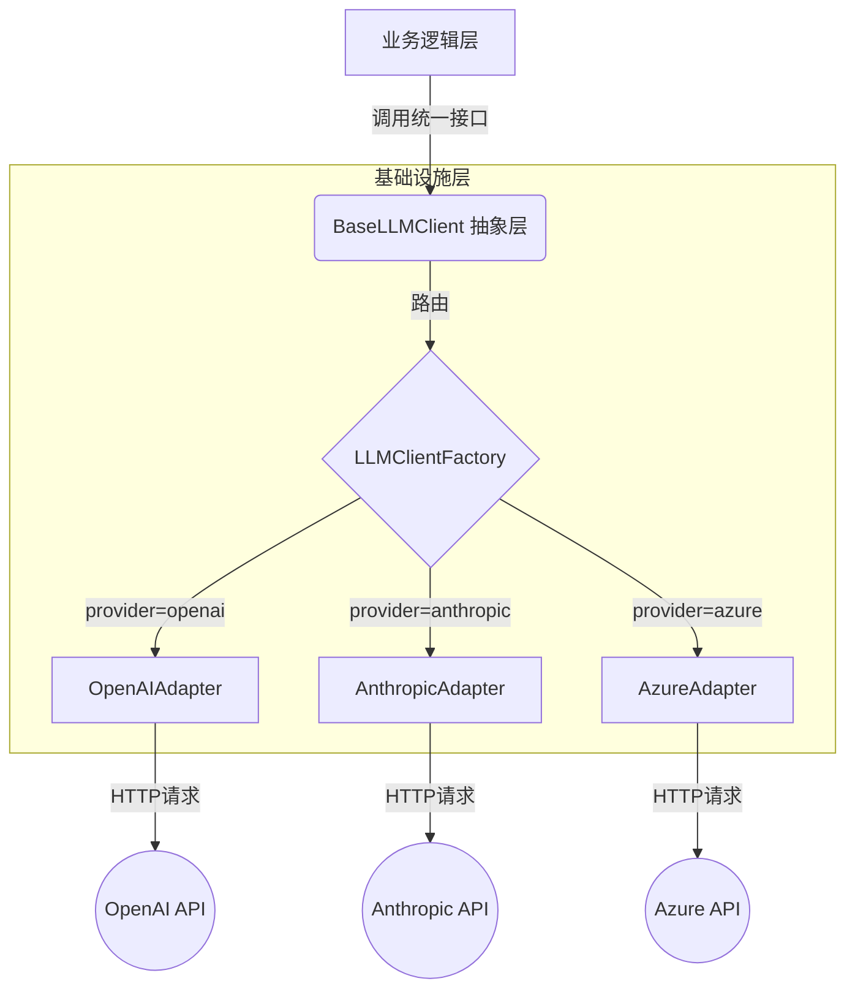
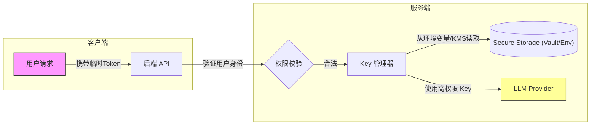
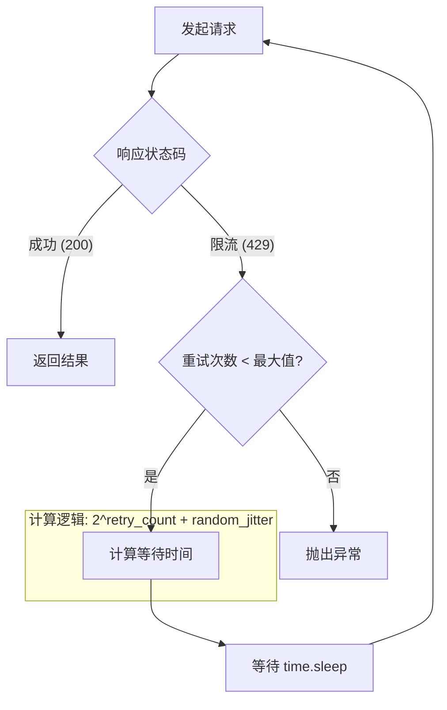
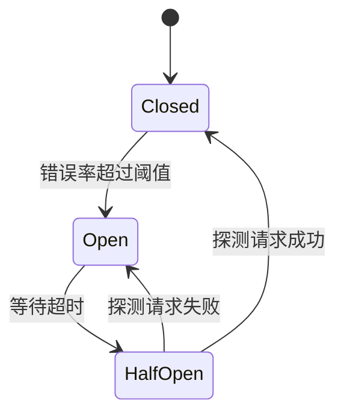

# 第一章：基础设施——API Vendor & Key 管理（重构版）

> **本章导读：如果你把AI Agent想象成一辆汽车，那么这一章讲的就是"如何给汽车加油"和"如何保养发动机"。没有稳定的能源，再好的车也跑不起来。**

---

## 🎯 乔布斯灵魂拷问

> **"When you're a carpenter making a beautiful chest of drawers, you're not going to use a piece of plywood on the back, even though it faces the wall. You'll know it's there, so you're going to use a beautiful piece of wood on the back."**

> **"当一个木匠做一个漂亮的抽屉柜时，你不会在背面用胶合板，即使它对着墙。你知道它在那里，所以你会用漂亮的木头做背面。"**

**一个真正的艺术家，即使没人看到的地方，也要做得完美。**

**一个真正的工程师，即使最底层的代码，也要做得优雅。**

这一章讲的是"底层中的底层"——如何管理AI的能源。

---

## 🚀 马斯克第一性原理

> **"If you don't make things, you don't know, and you probably don't know how to reason about the problem."**

> **"如果你不亲自做东西，你就不会真正理解，你可能也不知道如何推理这个问题。"**

很多人问："为什么不直接调用OpenAI API？"

让我问你：**如果你的车只能用一个加油站，而且那个加油站随时可能关门，你还怎么跑长途？**

这就是第一性原理：**任何单一依赖都是脆弱的。**

---

本章讲解如何构建生产级的LLM网关层，解决多供应商适配、安全存储、流量控制与容错等核心问题。通过适配器模式与工厂模式实现供应商解耦，采用环境变量与KMS保障API Key安全，运用指数退避、Key Pool和熔断机制确保高可用，并建立Token消耗的成本监控体系。

---

## 💡 本章核心问题

> **"我的Agent总不能一直依赖某一个API吧？如果那个API挂了怎么办？"**

这就是本章要解决的问题。就像你不会把所有鸡蛋放在一个篮子里，**成熟的系统也不会只有一个AI供应商**。

---

## 1.1 引言：构建稳健的模型调用底座

如果把 AI Agent 比作一辆高性能跑车，大语言模型（LLM）就是它的"发动机"。然而，直接在业务代码中通过 `import openai` 调用 API，就像是把发动机直接裸露在外，缺乏底盘支撑，既不安全也难以维护。

本章将构建一个标准化的 **LLM Gateway（网关层）**，解决以下核心问题：

*   **解耦**：业务代码与具体供应商解耦。

*   **安全**：密钥的全生命周期管理。

*   **稳定**：应对限流与故障的容错机制。

---

## 1.2 多供应商管理策略

### 1.2.1 设计思路：适配器模式与工厂模式
**为什么需要这一层？**

不同的供应商（OpenAI, Anthropic, 国产大模型）接口定义各异。例如 OpenAI 使用 `messages` 数组，而某些旧模型可能接受字符串 `prompt`。如果在业务代码里写满 `if provider == 'openai': ... elif provider == 'claude': ...`，系统将变得极其脆弱。

> **💡 程序⚪碎碎念：我司有个祖传代码，2万行if-else，产品经理说"加个新功能很简单"——我看了3天没看懂逻辑，测试了2周没测完。现在看到"供应商适配"四个字，我的PTSD就犯了。所以这一章我们用设计模式，把if-else炸掉重构：））**

**设计方案：**

1.  **适配器模式**：定义一个统一的 `BaseLLMClient` 接口，为每个供应商编写具体的"适配器"类，负责将统一请求转换为供应商特有请求。

2.  **工厂模式**：通过配置文件动态决定实例化哪个适配器。

**架构流程图：**



### 1.2.2 代码实现：统一的接口定义

首先，定义标准接口。我们使用 Python 的 `abc` 模块定义抽象基类，强制子类实现特定方法。

```python

# llm/base.py
from abc import ABC, abstractmethod
from typing import List, Dict, Optional
from dataclasses import dataclass

@dataclass
class LLMResponse:
    """统一的响应对象，屏蔽底层差异"""
    content: str
    model: str
    usage: Dict[str, int] # {"prompt_tokens": 10, "completion_tokens": 20}
    raw_response: Dict # 原始返回，用于调试

class BaseLLMClient(ABC):
    """大模型客户端抽象基类"""
    @abstractmethod
    def chat_completion(
        self,
        messages: List[Dict],
        model: str,
        temperature: float = 0.7,
        **kwargs
    ) -> LLMResponse:
        """
        核心对话接口
        :param messages: 标准消息列表 [{"role": "user", "content": "..."}]
        :param model: 模型标识符
        """
        pass
    # 可以扩展嵌入、微调等接口

```

### 1.2.3 代码实现：具体适配器与工厂

**OpenAI 适配器示例：**

```python

# llm/adapters/openai_adapter.py
import openai
from ..base import BaseLLMClient, LLMResponse

class OpenAIAdapter(BaseLLMClient):
    def __init__(self, api_key: str, base_url: Optional[str] = None):
        # 初始化 OpenAI 客户端
        self.client = openai.OpenAI(api_key=api_key, base_url=base_url)

    def chat_completion(self, messages, model, temperature=0.7, **kwargs) -> LLMResponse:
        # 1. 调用底层 API
        response = self.client.chat.completions.create(
            model=model,
            messages=messages,
            temperature=temperature,
            **kwargs
        )
        # 2. 转换为统一格式
        return LLMResponse(
            content=response.choices[0].message.content,
            model=response.model,
            usage={
                "prompt_tokens": response.usage.prompt_tokens,
                "completion_tokens": response.usage.completion_tokens
            },
            raw_response=response.model_dump()
        )

```

**简单工厂实现：**

```python

# llm/factory.py
from .base import BaseLLMClient
from .adapters.openai_adapter import OpenAIAdapter

# from .adapters.anthropic_adapter import AnthropicAdapter
class LLMClientFactory:
    @staticmethod
    def create_client(provider: str, api_key: str, **config) -> BaseLLMClient:
        if provider == "openai":
            return OpenAIAdapter(api_key=api_key, **config)
        # elif provider == "anthropic":
        #     return AnthropicAdapter(api_key=api_key, **config)
        else:
            raise ValueError(f"Unsupported provider: {provider}")

# 使用示例
client = LLMClientFactory.create_client("openai", api_key="sk-xxx")
response = client.chat_completion(messages=[{"role": "user", "content": "Hello"}])

```

---

## 1.3 API Key 的安全存储与访问

### 1.3.1 设计思路：纵深防御

API Key 是系统的"心脏"。安全策略应遵循**纵深防御**原则：

1.  **开发环境**：通过 `.env` 文件隔离，防止提交到 Git。

2.  **生产环境**：通过环境变量注入，或使用专业的 KMS（密钥管理系统）。

3.  **架构隔离**：**绝对禁止**在前端代码或客户端直接持有高权限 Key。
**架构设计图：**



### 1.3.2 实践步骤：环境变量管理
**步骤 1：创建 `.env` 文件**
在项目根目录创建 `.env` 文件，并将其加入 `.gitignore`。

```bash

# .env
OPENAI_API_KEY=sk-proj-xxxxxxxxxxxx
ANTHROPIC_API_KEY=sk-ant-xxxxxxxxxxxx

```
**步骤 2：使用 Pydantic 进行配置管理**
推荐使用 `pydantic-settings` 自动读取环境变量，并提供类型校验。

```python

# config/settings.py
from pydantic_settings import BaseSettings
class Settings(BaseSettings):
    openai_api_key: str
    anthropic_api_key: str
    class Config:
        env_file = ".env"
        env_file_encoding = 'utf-8'

# 全局单例
settings = Settings()

# 使用
print(settings.openai_api_key) # 自动从环境变量读取，若不存在会报错

```

---

## 1.4 高级流量控制与容错
这是生产环境最容易出问题的地方。

### 1.4.1 设计思路：指数退避
当 API 返回 `429 Too Many Requests` 时，不能立即重试（这样只会加剧拥堵），而应等待一段时间。指数退避策略是：每次重试等待时间翻倍，并添加随机抖动以防止多个客户端同时重试（惊群效应）。
**流程图：**



### 1.4.2 代码实现：重试装饰器
使用 Python 装饰器可以优雅地将重试逻辑与业务逻辑解耦。

```python
import time
import random
from functools import wraps
def retry_on_rate_limit(max_retries=3, base_delay=1):
    def decorator(func):
        @wraps(func)
        def wrapper(*args, **kwargs):
            for attempt in range(max_retries):
                try:
                    return func(*args, **kwargs)
                except Exception as e:
                    # 假设这里捕获的是 RateLimitError (需根据实际 SDK 调整)
                    if "429" in str(e) and attempt < max_retries - 1:
                        # 指数退避 + 抖动
                        wait_time = (base_delay * (2 ** attempt)) + random.uniform(0, 1)
                        print(f"Rate limit hit. Retrying in {wait_time:.2f}s...")
                        time.sleep(wait_time)
                    else:
                        raise
        return wrapper
    return decorator

# 使用示例
@retry_on_rate_limit(max_retries=3)
def call_llm(client, messages):
    return client.chat_completion(messages=messages)

```

### 1.4.3 设计思路：API Key 池
单个 Key 有 RPM（每分钟请求数）限制。为了高并发，我们可以配置多个 Key，构建一个简单的 **Key Pool**。
**轮转逻辑：**

1.  维护一个 Key 列表。

2.  请求时轮询取出 Key。

3.  如果某 Key 触发 429，将其放入"冷冻仓"，一段时间后再启用。
**实现代码：**

```python
import time
from collections import deque
class APIKeyPool:
    def __init__(self, keys: list, cooldown_seconds=60):
        self.keys = deque(keys) # 可用 Key 队列
        self.cooldown = cooldown_seconds
        self.cooling_keys = {} # {key: unfreeze_timestamp}
    def get_key(self):
        # 1. 检查冷冻仓是否有解冻的 Key
        now = time.time()
        for key, unfreeze_time in list(self.cooling_keys.items()):
            if now >= unfreeze_time:
                self.keys.append(key)
                del self.cooling_keys[key]
        # 2. 轮询获取 Key
        if not self.keys:
            raise Exception("No available API keys! All in cooldown.")
        
        # 简单的轮询：取出一个并放回队尾（如果不报错的话）
        # 实际上更推荐随机选择，这里简化为 pop 左侧
        return self.keys[0]
    def report_rate_limit(self, key):
        # 遇到限流，移入冷冻仓
        if key in self.keys:
            self.keys.remove(key)
            self.cooling_keys[key] = time.time() + self.cooldown
            print(f"Key {key[:8]}... cooling down.")

```

### 1.4.4 熔断机制
当供应商服务完全不可用（如宕机）时，重试不仅无效，还会阻塞线程。熔断器像家里的电闸，当错误率达到阈值，直接"跳闸"，后续请求直接失败或降级，不再发起网络请求。
**状态机流转：**



---

## 1.5 成本监控与追踪

### 设计思路：可观测性
LLM 是昂贵的资源。基础设施层必须对上层透明地记录成本。核心方法是为每个请求生成唯一的 `Trace ID`，并将其与用户 ID 绑定。
**实现步骤：**

1.  **拦截请求**：在 Adapter 调用前后埋点。

2.  **计算 Token 成本**：不同模型价格不同，需建立价格表。

3.  **日志记录**：结构化日志（JSON 格式），便于 ELK 分析。

```python
import structlog # 推荐使用 structlog 进行结构化日志
logger = structlog.get_logger()
def log_usage(provider, model, usage_tokens, user_id):
    # 简化的成本计算逻辑
    cost_per_1k = 0.01 # 示例价格
    cost = (usage_tokens / 1000) * cost_per_1k
    logger.info("llm_call", provider=provider, model=model, tokens=usage_tokens, cost=cost, user_id=user_id)

```

---

## 1.6 LLM 响应缓存机制

### 为什么需要缓存

在生产环境中，你会发现很多请求是**重复的**：

*   用户反复询问同一个常见问题

*   系统 Prompt + 用户输入的组合高度相似

*   RAG 检索到的上下文片段相同

这些重复调用消耗 Token 却产生相同结果。**缓存可以将响应时间从秒级降到毫秒级，同时显著降低成本。**

### 缓存策略设计

**1. 缓存键的生成**

缓存键需要稳定且唯一，通常包含：

*   模型名称

*   温度参数（temperature=0 的结果可缓存，>0 的通常不缓存）

*   消息内容的哈希值

```python
import hashlib
import json

def generate_cache_key(model: str, messages: list, temperature: float) -> str:
    """生成缓存键：相同输入应产生相同键"""
    if temperature > 0:
        # 非确定性输出不缓存
        return None
    
    # 将消息序列化为稳定字符串
    content = json.dumps({
        "model": model,
        "messages": messages,
        "temperature": temperature
    }, sort_keys=True, ensure_ascii=False)
    
    return hashlib.sha256(content.encode()).hexdigest()[:32]

```

**2. 缓存层实现**

使用内存缓存（如 `functools.lru_cache`）或分布式缓存（如 Redis）：

```python
from functools import lru_cache
import time
from typing import Optional

class LLMCache:
    """简单的 TTL 缓存实现"""
    
    def __init__(self, ttl_seconds: int = 3600):
        self._cache = {}
        self._ttl = ttl_seconds
    
    def get(self, key: str) -> Optional[dict]:
        if key not in self._cache:
            return None
        
        value, expiry = self._cache[key]
        if time.time() > expiry:
            del self._cache[key]
            return None
        
        return value
    
    def set(self, key: str, value: dict):
        self._cache[key] = (value, time.time() + self._ttl)
    
    def clear(self):
        self._cache.clear()

# 集成到 Adapter
class CachedOpenAIAdapter(OpenAIAdapter):
    def __init__(self, api_key: str, cache: Optional[LLMCache] = None):
        super().__init__(api_key)
        self.cache = cache or LLMCache()
    
    def chat_completion(self, messages, model, temperature=0.7, **kwargs) -> LLMResponse:
        # 只有 temperature=0 且非流式请求才缓存
        if temperature == 0 and not kwargs.get("stream"):
            cache_key = generate_cache_key(model, messages, temperature)
            if cache_key:
                cached = self.cache.get(cache_key)
                if cached:
                    print(f"[Cache Hit] 命中缓存，节省 Token")
                    return LLMResponse(**cached)
        
        # 未命中缓存，调用父类方法
        response = super().chat_completion(messages, model, temperature, **kwargs)
        
        # 写入缓存
        if temperature == 0 and cache_key:
            self.cache.set(cache_key, {
                "content": response.content,
                "model": response.model,
                "usage": response.usage,
                "raw_response": response.raw_response
            })
        
        return response

```

**3. 缓存命中率监控**

```python
class CacheMetrics:
    def __init__(self):
        self.hits = 0
        self.misses = 0
    
    @property
    def hit_rate(self) -> float:
        total = self.hits + self.misses
        return self.hits / total if total > 0 else 0.0
    
    def record(self, hit: bool):
        if hit:
            self.hits += 1
        else:
            self.misses += 1

```

### 缓存使用建议

| 场景 | 是否缓存 | 原因 |
|------|---------|------|
| temperature=0 | ✅ 是 | 输出确定性，可安全缓存 |
| temperature>0 | ❌ 否 | 输出随机，缓存无意义 |
| 流式输出 | ❌ 否 | 技术复杂度高，收益有限 |
| 敏感数据查询 | ❌ 否 | 隐私合规风险 |
| FAQ 类问题 | ✅ 是 | 高频重复，缓存价值高 |

---

## 1.7 负载均衡与模型路由

### 为什么需要路由层

当你接入了多个模型供应商（OpenAI + Azure + 国产模型），面临的挑战是：

*   **成本优化**：不同模型价格差异大，简单任务用便宜模型

*   **容灾切换**：主供应商故障时自动 fallback

*   **性能平衡**：高并发时分散到多个 endpoint

### 简单路由策略

**1. 基于任务类型的路由**

```python
class ModelRouter:
    """根据任务特征选择最优模型"""
    
    ROUTE_RULES = {
        # 任务类型 -> (首选模型, 备选模型, 成本等级)
        "code_generation": ("gpt-4o", "claude-3-opus", "high"),
        "simple_qa": ("gpt-4o-mini", "gpt-3.5-turbo", "low"),
        "creative_writing": ("claude-3-sonnet", "gpt-4o", "medium"),
        "data_extraction": ("gpt-4o", "gpt-4o-mini", "medium"),
    }
    
    def route(self, task_type: str, complexity: str = "medium") -> str:
        """根据任务类型和复杂度选择模型"""
        if task_type in self.ROUTE_RULES:
            primary, fallback, cost = self.ROUTE_RULES[task_type]
            # 简单任务降级到更便宜的模型
            if complexity == "low" and cost == "high":
                return fallback
            return primary
        return "gpt-4o-mini"  # 默认兜底

```

**2. 基于成本的路由**

```python
class CostAwareRouter:
    """根据预算使用情况动态选择模型"""
    
    def __init__(self, daily_budget_usd: float = 100.0):
        self.daily_budget = daily_budget_usd
        self.today_spent = 0.0
    
    def select_model(self, estimated_tokens: int) -> str:
        """
        预算充足时用 GPT-4o，紧张时降级到 Mini
        """
        # 估算成本（简化计算）
        gpt4o_cost = (estimated_tokens / 1000) * 0.005
        
        remaining = self.daily_budget - self.today_spent
        
        if remaining > gpt4o_cost * 2:
            # 预算充足，用最好的
            return "gpt-4o"
        elif remaining > gpt4o_cost:
            # 预算紧张，降级
            return "gpt-4o-mini"
        else:
            # 预算耗尽，拒绝服务或走免费模型
            raise RuntimeError("Daily budget exceeded")

```

**3. 故障转移（Failover）**

```python
class FailoverRouter:
    """主供应商故障时自动切换"""
    
    def __init__(self, providers: list):
        self.providers = providers  # [(provider_name, client_instance), ...]
        self.circuit_breakers = {
            name: CircuitBreaker() for name, _ in providers
        }
    
    def call_with_failover(self, messages, **kwargs) -> LLMResponse:
        """按优先级尝试多个供应商"""
        for provider_name, client in self.providers:
            cb = self.circuit_breakers[provider_name]
            
            if cb.state == CircuitState.OPEN:
                continue  # 熔断器打开，跳过
            
            try:
                response = client.chat_completion(messages, **kwargs)
                cb.record_success()
                return response
            except Exception as e:
                cb.record_failure()
                print(f"[{provider_name}] 调用失败: {e}")
                continue
        
        raise RuntimeError("All providers failed")

```

### 路由配置示例

```yaml

# config/routing.yaml
routing:
  default_provider: openai
  
  failover_order:

    - openai

    - azure

    - deepseek
  
  cost_optimization:
    enabled: true
    budget_limit_usd: 500
    
  model_selection:
    code_review:
      primary: gpt-4o
      fallback: claude-3-sonnet
    
    chat:
      primary: gpt-4o-mini
      fallback: gpt-3.5-turbo

```

---

## 1.8 本章小结
本章我们从零构建了一个生产级的 LLM 基础设施层。通过适配器模式解决了供应商异构问题，通过环境变量与隔离策略保障了密钥安全，并利用指数退避、Key Pool 和熔断机制实现了高可用架构。
**检查清单：**

*   [ ] 业务代码中是否不再包含 `if provider == 'xxx'` 逻辑？

*   [ ] `.env` 文件是否已加入 `.gitignore`？

*   [ ] 是否实现了针对 429 错误的重试机制？

*   [ ] 是否有 Token 消耗的日志记录？

在下一章，我们将探讨如何组织输入给模型的内容，即 **Context（上下文）** 和 **Prompt（提示词）** 的工程化管理。

---

## 1.7 补充内容：生产环境关键议题

### 1.7.1 测试与质量保证

**常见问题场景：**
当我们修改了Adapter的请求逻辑或更换了LLM Provider后，如何确保现有的业务调用不受影响？一个典型的困境是：上线了新版本的Adapter，结果线上大量请求失败，因为某个边缘情况的参数处理逻辑被意外修改。

**解决思路与方案：**

- **单元测试**：为每个Adapter编写独立的单元测试，使用Mock模拟API响应。重点测试异常情况，如超时、网络错误、JSON解析失败等。

- **集成测试**：使用真实的API Key（建议使用测试环境Key）对完整链路进行测试。可以设计一套"黄金测试集"，包含常见请求场景，每次变更后自动运行。

- **回归测试**：建立自动化回归测试流水线，当代码变更时自动触发。推荐使用GitHub Actions或Jenkins。

### 1.7.2 生产环境部署

**常见问题场景：**
开发环境中运行良好的代码，部署到生产环境后却问题频发。可能是环境差异、配置问题或资源限制导致的。

**解决思路与方案：**

- **Docker容器化**：将LLM Gateway封装为Docker镜像，确保开发、测试、生产环境一致性。

- **Kubernetes部署**：对于高可用需求，使用K8s进行编排，设置合理的副本数和资源限制。

- **配置分离**：使用环境变量或配置中心管理不同环境的配置，避免硬编码。

- **健康检查**：实现`/health`端点，定期检查API Key有效性、数据库连接等。

### 1.7.3 监控与告警

**常见问题场景：**
线上API调用突然大量超时或失败，但运维团队一无所知，直到用户投诉才被发现。缺乏有效的监控导致故障发现滞后。

**解决思路与方案：**

- **指标采集**：使用Prometheus采集关键指标，如请求成功率、平均延迟、Token消耗、P99延迟等。

- **告警规则**：设置合理的告警阈值，如错误率超过5%、延迟超过2秒等。

- **日志规范**：使用结构化日志（JSON格式），记录请求ID、耗时、错误信息等，便于故障定位。

- **Dashboard**：构建Grafana仪表盘，展示系统健康状态和业务指标。

### 1.7.4 代码组织建议

**常见问题场景：**
随着业务增长，Adapter代码越来越臃肿，所有逻辑堆在一起，难以维护和扩展。新增一个Provider需要修改大量代码。

**解决思路与方案：**

- **项目结构**：建议采用以下目录结构

```text
llm_gateway/
├── adapters/          # 各Provider适配器
│   ├── __init__.py
│   ├── base.py       # 抽象基类
│   ├── openai.py
│   ├── anthropic.py
│   └── azure.py
├── factory.py        # 工厂类
├── config.py         # 配置管理
├── middleware/       # 中间件（日志、监控、限流）
├── tests/            # 测试代码
└── main.py           # 入口文件

```

- **类型提示**：为所有Adapter方法添加类型提示，提高代码可读性和IDE支持。

- **统一异常**：定义统一的异常类，如`LLMProviderError`、`RateLimitError`等，便于调用方统一处理。

### 1.7.5 错误处理最佳实践

**常见问题场景：**
LLM API调用失败时，代码直接抛出原始异常，导致上层业务逻辑崩溃。用户看到的是晦涩的错误信息，体验很差。

**解决思路与方案：**

```python
class LLMGatewayError(Exception):
    """LLM网关统一异常基类"""
    def __init__(self, message: str, code: str = "UNKNOWN_ERROR"):
        self.message = message
        self.code = code
        super().__init__(self.message)

class RateLimitError(LLMGatewayError):
    def __init__(self, message: str = "Rate limit exceeded"):
        super().__init__(message, code="RATE_LIMIT_ERROR")

class ProviderError(LLMGatewayError):
    def __init__(self, message: str, provider: str):
        super().__init__(f"[{provider}] {message}", code="PROVIDER_ERROR")

```
调用方可以针对不同异常类型采取不同策略，如RateLimitError触发退避重试，ProviderError切换备选Provider等。

---

### 1.7.6 供应商风险管理

**常见问题场景：**
单一LLM供应商服务突然中断，导致线上业务完全不可用。没有任何备选方案，业务损失巨大。或者某供应商价格大幅上涨，成本失控。

**解决思路与方案：**

```python
class MultiProviderManager:
    """多供应商管理器"""
    
    def __init__(self, providers: list):
        self.providers = {p.name: p for p in providers}
        self.current_provider = None
        self.failover_config = {
            "max_retries": 3,
            "failover_threshold": 5,  # 连续失败5次触发切换
            "recovery_time": 300  # 5分钟后尝试恢复
        }
    
    def get_provider(self) -> BaseLLMClient:
        """获取当前可用的供应商"""
        # 检查当前供应商是否可用
        if self.current_provider and self._is_healthy(self.current_provider):
            return self.current_provider
        
        # 寻找备用供应商
        for name, provider in self.providers.items():
            if self._is_healthy(provider):
                self.current_provider = provider
                logger.info(f"切换到供应商: {name}")
                return provider
        
        raise NoAvailableProviderError("所有供应商均不可用")
    
    def _is_healthy(self, provider) -> bool:
        """检查供应商健康状态"""
        # 检查连续失败次数
        if provider.fail_count >= self.failover_config["failover_threshold"]:
            # 检查是否超过恢复时间
            if time.time() - provider.last_fail_time > self.failover_config["recovery_time"]:
                provider.fail_count = 0  # 重置，尝试恢复
                return True
            return False
        return True

```

**SLA管理策略：**

- 与供应商签订明确的服务等级协议

- 建立供应商绩效考核机制

- 定期评估供应商能力和价格竞争力

- 保持至少2个可用供应商的切换能力

### 1.7.7 供应商切换策略

**常见问题场景：**
需要更换LLM供应商，但切换过程风险很高。一旦出现问题影响大量用户。

**解决思路与方案：**

- **渐进式切换**：先切换5%流量，观察无异常后逐步提升

- **AB对比**：新旧供应商同时运行，对比输出质量

- **快速回滚**：一旦发现异常，秒级切换回原供应商

- **数据同步**：确保切换过程中用户无感知

---

## 💭 程序员感悟：不要把鸡蛋放在一个篮子里

> **这一章教会我们的，不仅是如何管理多个AI供应商，更是一种人生的智慧。**

> **💡 程序⚪碎碎念：我的Leader说"这个需求很简单，下班前做完"。我已经连续一周11点下班了。我的Leader说"这个Bug很简单，改一下就行"。我找了一天没找到问题在哪。我的Leader说"AI供应商挂了对我们没影响吧"。我：......（内心：您说得对，我现在就辞职）**

你有没有想过：

- 为什么优秀的公司都会同时使用多个云服务商？

- 为什么投资要分散在不同领域？

- 为什么软件开发要有"冗余"设计？

**因为没有任何一个系统是100%可靠的。**

作为一个程序员，你可能有过这样的经历：

- 依赖某个开源库，结果作者不再维护

- 使用某个云服务，结果有一天服务不可用

- 相信某个供应商，结果价格突然涨了三倍

**而这一章教会我们的是：永远保持plan B。**

不是悲观，不是退缩，而是**成熟的风险管理**。

在接下来的章节里，我们会学到更多这样的"防御性设计"。它们不仅仅是代码技巧，更是一种**工程师思维**——**预见到最坏的情况，设计出最稳健的方案**。

这，就是专业程序员的素养。

---

*下一章，我们将探讨如何让Agent"理解"人类——这就是Context和Prompt管理的艺术。*
