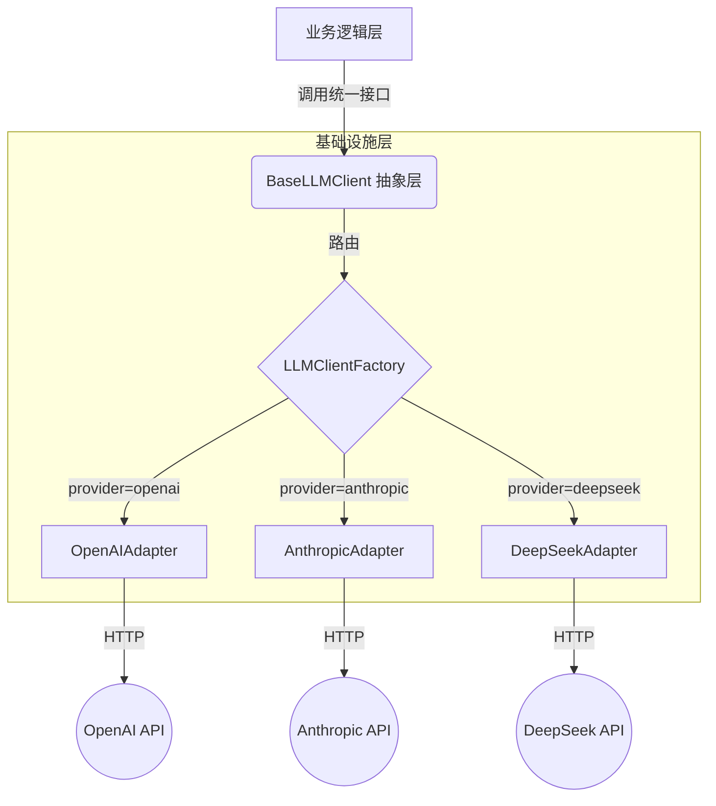
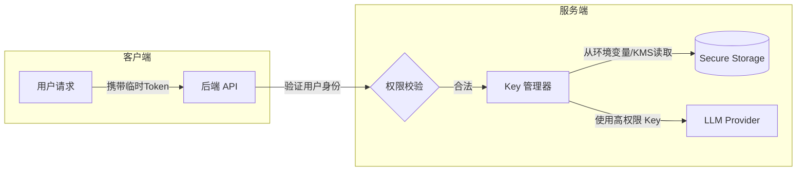
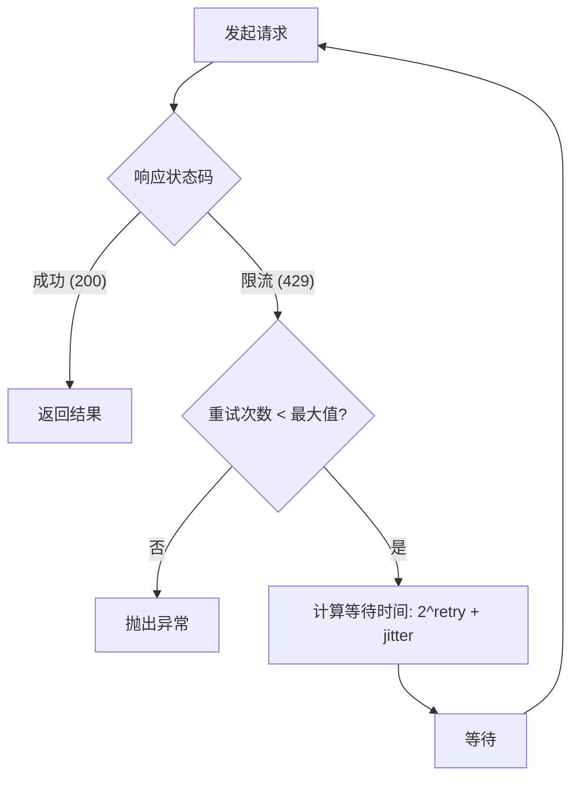
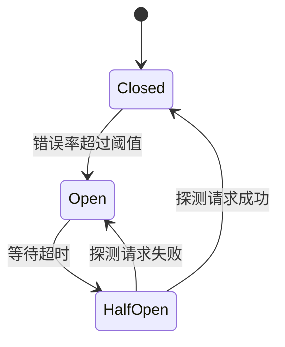

# 第一章：基础设施——API Vendor & Key 管理（2026.07 更新）

> **本章导读：如果把 AI Agent 想象成一辆汽车，这一章讲的就是"如何给汽车加油"和"如何保养发动机"。没有稳定的能源，再好的车也跑不起来。**

---

## 2026年7月：供应商生态全景

AI 大模型市场的迭代速度在 2026 年上半年再次超出预期。本章写作于 3 月，仅 4 个月后，主流供应商的旗舰模型已全面换代。动手写代码之前，先看清这张牌桌：

| 供应商 | 主力模型 | 输入 $/1M | 输出 $/1M | 上下文窗口 | 缓存折扣 |
|--------|---------|-----------|-----------|-----------|---------|
| **OpenAI** | GPT-5.4 / GPT-5.4 Mini | $2.50 / $0.75 | $15 / $4.50 | 1M | 缓存输入 1 折 |
| **Anthropic** | Claude Sonnet 4.6 / Opus 4.7 | $3 / $5 | $15 / $25 | 1M | 缓存读取 1 折 |
| **Google** | Gemini 3.1 Pro / Flash | $1.25 / $0.075 | $5 / $0.30 | 2M | 上下文缓存 |
| **DeepSeek** | V4 Pro / V4 Flash | $1.74 / $0.14 | $3.48 / $0.28 | 1M | 缓存命中 2 折 |

几个值得注意的变化：

- **Prompt Caching 已成标配**。五家供应商全部支持，缓存命中可将输入成本降低 50%-90%。这也是本章 1.6 节专门新增专题的原因。
- **长上下文不再溢价**。1M 上下文窗口已成 2026 年旗舰模型的默认配置，Google Gemini 3.1 Pro 甚至提供 2M。
- **OpenAI 兼容接口成为事实标准**。DeepSeek、通义千问、Kimi 等国产模型默认提供 OpenAI SDK 兼容的 API 端点，切换供应商只需改 `base_url` 和 `model` 名称。
- **MCP（Model Context Protocol）** 于 2025 年底移交 Linux Foundation 治理，已成为 Agent 工具调用的行业标准协议。本章代码示例中默认支持 MCP 式工具接入。

---

## 🎯 乔布斯灵魂拷问

> **"When you're a carpenter making a beautiful chest of drawers, you're not going to use a piece of plywood on the back, even though it faces the wall."**

一个真正的工程师，即使最底层的代码，也要做得优雅。这一章讲的就是"底层中的底层"——如何管理 AI 的能源。

---

## 🚀 马斯克第一性原理

> **"If you don't make things, you don't know, and you probably don't know how to reason about the problem."**

很多人问："为什么不直接调用 OpenAI API？"

让我问你：**如果你的车只能用一个加油站，而且那个加油站随时可能关门，你怎么跑长途？**

这就是第一性原理：**任何单一依赖都是脆弱的。**

---

## 1.1 引言：构建稳健的模型调用底座

如果把 AI Agent 比作一辆高性能跑车，大语言模型就是它的"发动机"。然而，直接在业务代码中 `import openai` 调用 API，就像是把发动机裸露在外——缺乏底盘支撑，不安全也不易维护。

本章将构建一个标准化的 **LLM 网关层**，解决三个核心问题：

*   **解耦**：业务代码与具体供应商解耦。
*   **安全**：密钥的全生命周期管理。
*   **稳定**：应对限流与故障的容错机制。

---

## 1.2 多供应商管理策略

### 1.2.1 设计思路：适配器模式与工厂模式

不同供应商接口定义各异。如果在业务代码里写满 `if provider == 'openai': ... elif provider == 'claude': ...`，系统将变得极其脆弱。

但也要提醒一点：2026 年多数国产模型（DeepSeek、通义千问、Kimi）已完全兼容 OpenAI SDK 格式，切换只需改 `base_url` 和 `model` 名。适配器模式的价值更多体现在**需要跨供应商容灾、成本路由、缓存策略差异化**的场景——千万不要为了"设计模式"而过度设计。

**设计方案：**

1.  **适配器模式**：定义统一的 `BaseLLMClient` 接口，每个供应商编写具体适配器类，将统一请求转换为供应商特有请求。
2.  **工厂模式**：通过配置动态决定实例化哪个适配器。

**架构流程图：**


```mermaid
graph TD
A[业务逻辑层] -->|调用统一接口| B(BaseLLMClient 抽象层)
B -->|路由| C{LLMClientFactory}
C -->|provider=openai| D[OpenAIAdapter]
C -->|provider=anthropic| E[AnthropicAdapter]
C -->|provider=deepseek| F[DeepSeekAdapter]
D -->|HTTP| G((OpenAI API))
E -->|HTTP| H((Anthropic API))
F -->|HTTP| I((DeepSeek API))
subgraph "基础设施层"
B
C
D
E
F
end
```

### 1.2.2 代码实现：统一的接口定义

```python
# llm/base.py
from abc import ABC, abstractmethod
from typing import List, Dict, Optional
from dataclasses import dataclass

@dataclass
class LLMResponse:
    """统一的响应对象，屏蔽底层差异"""
    content: str
    model: str
    usage: Dict[str, int]  # {"prompt_tokens": 10, "completion_tokens": 20}
    raw_response: Dict     # 原始返回，用于调试

class BaseLLMClient(ABC):
    """大模型客户端抽象基类"""
    @abstractmethod
    def chat_completion(
        self,
        messages: List[Dict],
        model: str,
        temperature: float = 0.7,
        **kwargs
    ) -> LLMResponse:
        pass
```

### 1.2.3 代码实现：具体适配器与工厂

**OpenAI 适配器示例（2026 SDK 最新写法）：**

```python
# llm/adapters/openai_adapter.py
from openai import OpenAI
from ..base import BaseLLMClient, LLMResponse

class OpenAIAdapter(BaseLLMClient):
    def __init__(self, api_key: str, base_url: Optional[str] = None):
        self.client = OpenAI(api_key=api_key, base_url=base_url)

    def chat_completion(self, messages, model, temperature=0.7, **kwargs) -> LLMResponse:
        response = self.client.chat.completions.create(
            model=model,       # 如 "gpt-5.4", "gpt-5.4-mini"
            messages=messages,
            temperature=temperature,
            **kwargs
        )
        return LLMResponse(
            content=response.choices[0].message.content,
            model=response.model,
            usage={
                "prompt_tokens": response.usage.prompt_tokens,
                "completion_tokens": response.usage.completion_tokens
            },
            raw_response=response.model_dump()
        )
```

> **💡 实战提示**：2026 年 GPT 系列使用 `client.chat.completions.create()` 仍然是推荐方式，但 OpenAI 已推出新的 Responses API（`client.responses.create()`），新项目可以优先考虑。不过 Chat Completions API 依然是兼容性最广的选择。

**简单工厂：**

```python
# llm/factory.py
class LLMClientFactory:
    _adapters = {
        "openai": OpenAIAdapter,
        # "anthropic": AnthropicAdapter,
        # "deepseek": lambda key: OpenAIAdapter(key, base_url="https://api.deepseek.com"),
    }

    @classmethod
    def create_client(cls, provider: str, api_key: str, **config) -> BaseLLMClient:
        adapter_cls = cls._adapters.get(provider)
        if adapter_cls is None:
            raise ValueError(f"Unsupported provider: {provider}")
        return adapter_cls(api_key=api_key, **config)

# 使用示例
client = LLMClientFactory.create_client("openai", api_key="sk-xxx")
response = client.chat_completion(
    messages=[{"role": "user", "content": "Hello"}],
    model="gpt-5.4-mini"
)
```

注意：DeepSeek、通义千问等 OpenAI 兼容的供应商，复用 `OpenAIAdapter` 并传入对应的 `base_url` 即可，无需额外编写适配器。

---

## 1.3 API Key 的安全存储与访问

### 1.3.1 设计思路：纵深防御

API Key 是系统的"心脏"。安全策略应遵循**纵深防御**原则：

1.  **开发环境**：通过 `.env` 文件隔离，`.gitignore` 中排除。
2.  **生产环境**：通过环境变量注入，或使用 KMS（密钥管理系统）。
3.  **架构隔离**：**绝对禁止**在前端代码或客户端直接持有高权限 Key。


```mermaid
graph LR
    subgraph "客户端"
        A[用户请求] -->|携带临时Token| B[后端 API]
    end
    subgraph "服务端"
        B -->|验证用户身份| C{权限校验}
        C -->|合法| D[Key 管理器]
        D -->|从环境变量/KMS读取| E[("Secure Storage")]
        D -->|使用高权限 Key| F[LLM Provider]
    end
```

### 1.3.2 实践步骤

**步骤 1：创建 `.env` 文件并加入 `.gitignore`**

```bash
# .env
OPENAI_API_KEY=sk-proj-xxxxxxxxxxxx
ANTHROPIC_API_KEY=sk-ant-xxxxxxxxxxxx
DEEPSEEK_API_KEY=sk-xxxxxxxxxxxx
```

**步骤 2：使用 Pydantic 进行配置管理**

```python
# config/settings.py
from pydantic_settings import BaseSettings

class Settings(BaseSettings):
    openai_api_key: str
    anthropic_api_key: str = ""
    deepseek_api_key: str = ""

    class Config:
        env_file = ".env"
        env_file_encoding = 'utf-8'

settings = Settings()
```

---

## 1.4 高级流量控制与容错

### 1.4.1 指数退避

当 API 返回 `429 Too Many Requests` 时，不能立即重试（只会加剧拥堵），应等待一段时间。指数退避策略：每次重试等待时间翻倍，并添加随机抖动防止多个客户端同时重试（惊群效应）。


```mermaid
flowchart TD
    A[发起请求] --> B{响应状态码}
    B -- 成功 (200) --> C[返回结果]
    B -- 限流 (429) --> D{重试次数 < 最大值?}
    D -- 否 --> E[抛出异常]
    D -- 是 --> F[计算等待时间: 2^retry + jitter]
    F --> G[等待]
    G --> A
```

### 1.4.2 重试装饰器

```python
import time, random
from functools import wraps

def retry_on_rate_limit(max_retries=3, base_delay=1):
    def decorator(func):
        @wraps(func)
        def wrapper(*args, **kwargs):
            for attempt in range(max_retries):
                try:
                    return func(*args, **kwargs)
                except Exception as e:
                    if "429" in str(e) and attempt < max_retries - 1:
                        wait = base_delay * (2 ** attempt) + random.uniform(0, 1)
                        print(f"Rate limit hit. Retrying in {wait:.2f}s...")
                        time.sleep(wait)
                    else:
                        raise
        return wrapper
    return decorator
```

### 1.4.3 API Key 池与熔断

单个 Key 有 RPM（每分钟请求数）限制。为支持高并发，维护一个 Key 池：轮询取出可用 Key，触发 429 的 Key 移入"冷冻仓"，一段时间后自动解冻。

熔断机制则像是电闸——当某供应商连续失败超过阈值，直接"跳闸"，后续请求不再发起网络调用，而是降级到备用供应商或直接返回错误。


```mermaid
stateDiagram-v2
    [*] --> Closed
    Closed --> Open : 错误率超过阈值
    Open --> HalfOpen : 等待超时
    HalfOpen --> Closed : 探测请求成功
    HalfOpen --> Open : 探测请求失败
```

---

## 1.5 成本监控与追踪

LLM 是昂贵的资源。2026 年 7 月各供应商的真实定价如下：

| 模型 | 输入 $/1M | 输出 $/1M | 缓存输入 $/1M |
|------|----------|----------|-------------|
| GPT-5.4 | $2.50 | $15.00 | $0.25 |
| GPT-5.4 Mini | $0.75 | $4.50 | $0.075 |
| GPT-5.4 Nano | $0.20 | $1.25 | $0.02 |
| Claude Sonnet 4.6 | $3.00 | $15.00 | $0.30 |
| Claude Haiku 4.5 | $1.00 | $5.00 | $0.10 |
| Gemini 3.1 Flash | $0.075 | $0.30 | — |
| DeepSeek V4 Flash | $0.14 | $0.28 | $0.028 |

核心方法：为每个请求生成唯一的 Trace ID，将其与用户 ID 绑定，拦截所有 Adapter 调用来记录 Token 消耗和成本。

```python
import structlog
logger = structlog.get_logger()

# 2026年7月真实定价（美元 / 1M tokens）
PRICING = {
    "gpt-5.4":          (2.50, 15.00),
    "gpt-5.4-mini":     (0.75, 4.50),
    "claude-sonnet-4-6": (3.00, 15.00),
    "deepseek-v4-flash": (0.14, 0.28),
    "gemini-3.1-flash":  (0.075, 0.30),
}

def log_usage(provider, model, prompt_tokens, completion_tokens, user_id):
    input_price, output_price = PRICING.get(model, (0, 0))
    cost = (prompt_tokens / 1_000_000) * input_price + \
           (completion_tokens / 1_000_000) * output_price
    logger.info("llm_call",
        provider=provider, model=model,
        prompt_tokens=prompt_tokens, completion_tokens=completion_tokens,
        cost=round(cost, 6), user_id=user_id)
```

> **💡 Batch API 省钱技巧**：2026 年 OpenAI 和 Anthropic 均提供 Batch API，非实时任务可获得 **50% 折扣**。如果你在跑夜间批处理、离线分析等任务，务必走 Batch 通道。

---

## 1.6 Prompt Caching：2026年最重要的成本优化手段

> **省钱的秘密藏在请求的重复前缀里。**

### 为什么重要？

在生产环境中，Agent 的请求存在大量重复前缀：系统 Prompt、工具定义、RAG 检索的上下文、多轮对话的历史——这些内容在每个请求中都会重复发送。2026 年，**五大主流供应商全部支持 Prompt Caching**，当你重复发送相同前缀时，缓存命中的 Token 价格可降低 50%-90%。

### 各家缓存机制对比

| 供应商 | 缓存方式 | 缓存写入价格 | 缓存读取折扣 | TTL |
|--------|---------|------------|------------|-----|
| **OpenAI** | 自动（前缀匹配） | 无额外费用 | 输入价 1 折 | 5-10 min |
| **Anthropic** | 显式标记 `cache_control` | 输入价 1.25x | 输入价 1 折 | 5 min |
| **DeepSeek** | 自动（前缀匹配） | 无额外费用 | 缓存命中 $0.028/M | 自动管理 |
| **Google Gemini** | 上下文缓存 API | 按 Token 计费 | 存储 Token 折扣 | 可配置 |
| **智谱 GLM** | 自动（前缀匹配） | 无额外费用 | 显著折扣 | 自动管理 |

OpenAI 和 DeepSeek 的"自动"意味着你不需要改代码——只要请求前缀相同，缓存自动生效。Anthropic 则需要显式在 Prompt 中插入 `cache_control` 标记来指定缓存边界。

### 如何最大化缓存命中率？

三个简单原则：

1. **静态内容放最前面**：系统提示词、工具定义、固定指令 → 放在 messages 数组的前面。
2. **保持前缀一致**：一个字符的差异都会导致缓存 miss。用常量管理系统 Prompt，不要动态拼接。
3. **相似的请求批量发送**：在高频时段连续发送，保持缓存活跃。

```python
# ❌ 错误：可变内容在前，破坏缓存
messages = [
    {"role": "user", "content": user_query},        # 每次不同
    {"role": "system", "content": SYSTEM_PROMPT},   # 固定但放在后面 → 缓存miss
]

# ✅ 正确：固定内容在前，缓存生效
messages = [
    {"role": "system", "content": SYSTEM_PROMPT},   # 固定前缀 → 缓存命中
    {"role": "user", "content": user_query},         # 可变内容 → 全价
]
```

对于 Anthropic 客户端，还需要显式标记：

```python
# Anthropic 的显式缓存标记
response = client.messages.create(
    model="claude-sonnet-4-6",
    system=[
        {
            "type": "text",
            "text": SYSTEM_PROMPT,
            "cache_control": {"type": "ephemeral"}  # 标记此处为缓存边界
        }
    ],
    messages=[{"role": "user", "content": user_query}]
)
```

### 客户端缓存 vs 服务端缓存

本章原 1.6 节介绍了客户端缓存（建立缓存键、TTL 管理等）。坦白说，**2026 年服务端 Prompt Caching 让大部分客户端缓存场景不再必要**。客户端缓存的逻辑复杂性（缓存键生成、失效管理、温度参数判断）远高于直接依赖服务端缓存。除非你的场景满足以下条件：

- temperature=0 的确定性查询
- FAQ 类高频重复问题
- 对延迟有极端要求（客户端缓存毫秒级 vs 服务端缓存仍需网络往返）

否则，优先利用服务端 Prompt Caching，把精力留给更重要的事。

---

## 1.7 负载均衡与模型路由

### 为什么需要路由层？

当你接入了多个供应商，面临的挑战是：

- **成本优化**：不同模型价格差异巨大，简单任务不应调用旗舰模型
- **容灾切换**：主供应商故障时自动 fallback
- **性能平衡**：高并发时分散到多个 endpoint

### 基于任务的分层路由（2026 推荐策略）

```python
class ModelRouter:
    """2026年7月推荐路由策略"""

    # 按任务复杂度分层，而非按"供应商品牌"
    ROUTES = {
        # 层1：高频简单任务 → 最便宜的模型
        "classification":  "gpt-5.4-nano",        # $0.20/$1.25
        "extraction":      "gemini-3.1-flash",     # $0.075/$0.30

        # 层2：日常生产任务 → 性价比最优
        "chat":            "gpt-5.4-mini",         # $0.75/$4.50
        "summarization":   "deepseek-v4-flash",    # $0.14/$0.28

        # 层3：复杂推理/代码 → 前沿模型
        "code_generation": "claude-sonnet-4-6",    # $3/$15
        "complex_reasoning": "gpt-5.4",             # $2.50/$15

        # 层4：最高质量（仅在结果质量决定业务 outcome 时使用）
        "critical_task":   "claude-opus-4-7",       # $5/$25
    }

    def route(self, task_type: str, fallback: bool = False) -> str:
        return self.ROUTES.get(task_type, "gpt-5.4-mini")

    def get_fallback(self, task_type: str) -> str:
        """同类能力的备选模型"""
        FALLBACK = {
            "gpt-5.4": "claude-sonnet-4-6",
            "claude-sonnet-4-6": "deepseek-v4-pro",
            "gpt-5.4-mini": "deepseek-v4-flash",
            "gpt-5.4-nano": "gemini-3.1-flash",
        }
        primary = self.route(task_type)
        return FALLBACK.get(primary, "gpt-5.4-mini")
```

**选型原则**：日常任务从 Mini/Flash 层开始评估，只在评测证明质量确实不够时再升级到 Pro/旗舰层。OpenAI 已将 Batch API（50% 折扣）作为标准选项——所有非实时任务都应该走 Batch。

---

## 1.8 LLM 网关：选型还是自建？

回到本章开头的问题："我的 Agent 总不能一直依赖某一个 API 吧？"

答案是——你可能不需要从头写一个网关。

2026 年，社区已有三家成熟的 LLM Gateway 方案，各自覆盖不同场景：

| 维度 | **LiteLLM** | **OpenRouter** | **Portkey** |
|------|-----------|--------------|-----------|
| **形态** | 开源自托管 | SaaS 平台 | SaaS / 自托管 |
| **模型覆盖** | 100+（手动接入） | 300+（自动聚合） | 100+（自动接入） |
| **定价** | 免费（仅服务器成本） | 供应商价格 + 5% | $99/月起 |
| **缓存** | 基础 | — | 语义缓存（命中率 30-50%） |
| **可观测性** | 基础日志 | 基础 Dashboard | 企业级（审计、PII 检测） |
| **运维** | 需要自己管 | 零运维 | 零运维 |
| **最佳场景** | 重度使用者、需要完全控制 | Indie 开发者、MVP 阶段 | 企业团队、合规要求 |

**选型决策框架：**

- **MVP 阶段 / 独立开发者（0-100 用户）**：OpenRouter。30 分钟接入，单一账单，模型自由切换。
- **成长阶段 / 成本敏感（100-1000 用户）**：LiteLLM 自托管 + DeepSeek V4 Flash 等低价通道。数据完全隔离，灵活路由。
- **企业团队（1000+ 用户、合规要求）**：Portkey 或自建。完整 Observability、团队审计、SOC2/HIPAA 合规。
- **国内场景、跨境外卡困难**：商业中转站或 DeepSeek 直连。价格更低，国内可访问。

> **一个真实案例**：2026 年 4 月，Indie 开发者李辰在博客中记录了从 Anthropic 直连迁移到 OpenRouter 的体验：改一行 `baseURL`，5 分钟完成切换。等用户量涨到 1000+ 后，他又迁移到 LiteLLM 自托管，配合 DeepSeek V4 Flash 做简单任务的成本路由，月账单从 $600 降到 $180。（来源：xiaoliblog.com）

如果你选择自建，本章 1.2-1.7 的架构设计就是你的地基。如果你选择 LiteLLM/OpenRouter/Portkey，这些方案内部已经实践了适配器模式、熔断、重试等机制，你只需要关注路由策略和成本监控。

---

## 1.9 本章小结

本章从零构建了一个生产级的 LLM 基础设施层。通过适配器模式解决了供应商异构问题，通过环境变量与隔离策略保障了密钥安全，利用指数退避、Key Pool 和熔断机制实现了高可用。2026 年新增的 Prompt Caching 专题和 LLM Gateway 选型框架，让你在动手写代码之前就能做出更优的架构决策。

**检查清单：**

*   [ ] 业务代码中是否不再包含 `if provider == 'xxx'` 逻辑？
*   [ ] `.env` 文件是否已加入 `.gitignore`？
*   [ ] 是否实现了针对 429 和 5xx 错误的重试/熔断机制？
*   [ ] 是否有 Token 消耗的日志记录和成本告警？
*   [ ] 系统 Prompt 等固定内容是否放在了 messages 最前面以利用 Prompt Caching？
*   [ ] 非实时任务是否走了 Batch API（节省 50%）？
*   [ ] 是否评估过 LiteLLM/OpenRouter/Portkey 等成熟网关方案，避免重复造轮子？

在下一章，我们将探讨如何组织输入给模型的内容，即 **Context（上下文）** 和 **Prompt（提示词）** 的工程化管理。
