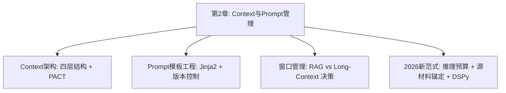
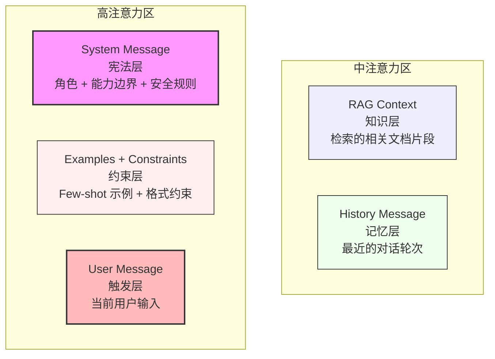

# 第二章：核心交互——Context 构建与提示管理（2026.07 更新）

> **本章导读：2026年，Prompt Engineering 正在被 Context Engineering 取代。不是"写一句更好的咒语"，而是"设计一个模型能真正理解的完整信息环境"。**

---

## 2026年7月：从 Prompt Engineering 到 Context Engineering

2025年年中，Andrej Karpathy 和 Shopify CEO Tobi Lütke 几乎同时提出一个观点：LLM 的上下文窗口就像 CPU 的 RAM，**不是写最好的指令让它执行，而是把正确的信息放进它的"工作记忆"里**。这个范式转移——从 Prompt Engineering 到 Context Engineering——定义了整个 2026 年。

具体意味着什么？

- 以前关心：这个 Prompt 怎么写才有效？
- 现在关心：系统指令、检索文档、对话历史、工具定义、状态信息——它们如何排列组合，模型才能最准确地在生产环境中工作？

LinkedIn 数据显示，"Prompt Engineer" 独立岗位从 2024 到 2025 年下降了 40%，但包含 Prompt Engineering 技能的岗位需求增长了 250%。不是因为不需要了，而是因为它已经融入了更广泛的 AI 工程角色。

投资于健全的 Context 架构的团队，相比 Prompt-only 方法，响应时间提升 50%，输出质量提升 40%。

---

## 🎯 乔布斯灵魂拷问

> **"You have to ask: what is the user interface metaphor? What is the mental model? You have to understand the users' mental model of what they think they're doing versus what the machine is actually doing."**

Context 和 Prompt，本质上就是你与 AI Agent 对话的"用户界面隐喻"。

---

## 🚀 马斯克第一性原理

> **"If things are not failing, you are not innovating enough."**

从基础出发：**模型本身只是一个概率预测器。它不会"思考"——它只会基于上下文预测下一个 token。** 你放进上下文的所有信息，直接决定了输出的质量。没有捷径。

---

## 💡 本章核心问题

> **"为什么我的 Agent 对话几轮之后就'失忆'了？为什么 1M 上下文的模型还被说'看不见'重点？"**

这就是 Context 管理要解决的问题——不是"给更多信息"，而是**结构化地组织信息**。


```mermaid
graph TD
A[第2章: Context与Prompt管理] --> B[Context架构: 四层结构 + PACT]
A --> C[Prompt模板工程: Jinja2 + 版本控制]
A --> D[窗口管理: RAG vs Long-Context 决策]
A --> E[2026新范式: 推理预算 + 源材料锚定 + DSPy]
```

---

## 2.1 Context 的构成：四大要素与位置效应

### 2.1.1 信息层级原则

Context 构建的核心是一个简单但反直觉的原则：**信息在上下文中的位置，比信息本身更重要。**

这是因为 Transformer 模型的注意力机制存在**位置偏向（Position Bias）**——模型对上下文开头和结尾的内容关注度最高，对中间部分则显著衰减。这被称为 **"Lost in the Middle"（中间迷失）** 现象，是 2025-2026 年学术研究的核心发现。


```mermaid
graph TB
    subgraph "高注意力区"
        S[System Message<br/>宪法层<br/>角色 + 能力边界 + 安全规则]
    end
    subgraph "中注意力区"
        R[RAG Context<br/>知识层<br/>检索的相关文档片段]
        H[History Message<br/>记忆层<br/>最近的对话轮次]
    end
    subgraph "高注意力区"
        E[Examples + Constraints<br/>约束层<br/>Few-shot 示例 + 格式约束]
        U[User Message<br/>触发层<br/>当前用户输入]
    end

    style S fill:#f9f,stroke:#333,stroke-width:2px
    style R fill:#eef,stroke:#333
    style H fill:#efe,stroke:#333
    style E fill:#fee,stroke:#333
    style U fill:#fbb,stroke:#333,stroke-width:2px
```

**PACT 框架（Position-Aware Context Tactics）**，由 2026 年的 Context Window Engineering 社区提出：

1. **开头放 System Message + Task Definition**（高注意力）
2. **中间放支持性上下文**（低注意力区，仅放必要内容）
3. **接近末尾放 Few-shot 示例 + 关键约束**（回升注意力）
4. **最后放当前查询**（最高注意力）

| 要素 | 放置位置 | 变化频率 | 2026 实践要点 |
|------|----------|----------|-------------|
| System Message | 最开头 | 极低 | 放最前面，利用 Prompt Caching |
| RAG Context | System 之后 | 高 | 用结构化标记（`##`、编号）增强可检索性 |
| History Message | RAG 之后 | 中 | 保留最近 6-8 轮，旧的压缩为摘要 |
| Examples | 接近末尾 | 低 | 1-3 个高质量示例 > 10 个平庸示例 |
| User Message | 最末尾 | 极高 | 最后一条消息，模型注意力最强 |

### 2.1.2 实战：构建 System Message

```python
# system_message.py
from dataclasses import dataclass
from typing import List

@dataclass
class SystemMessageConfig:
    role: str
    expertise: List[str]
    capabilities: List[str]
    constraints: List[str]
    output_format: str

def build_system_message(config: SystemMessageConfig) -> str:
    """遵循 PACT 原则：开头高注意力区，用结构化标记"""
    return f"""# 角色
你是一名{config.role}，专长于{'、'.join(config.expertise)}。

# 能力范围
{chr(10).join(f'- {c}' for c in config.capabilities)}

# 约束条件
{chr(10).join(f'{i}. {r}' for i, r in enumerate(config.constraints, 1))}

# 输出格式
{config.output_format}"""

# 使用示例
config = SystemMessageConfig(
    role="资深数据库专家",
    expertise=["MySQL", "PostgreSQL", "性能优化"],
    capabilities=["SQL 优化", "索引设计", "故障排查"],
    constraints=[
        "禁止执行数据删除操作",
        "不确定时明确说明",
        "敏感信息用 *** 代替"
    ],
    output_format="问题诊断 → 解决方案 → 验证步骤 → 预防措施"
)
```

---

## 2.2 Prompt 模板工程化

> **"2026 年的 Prompt 工程不是发现解锁模型隐藏能力的密语。那个时代已经过去了。好的 Prompt 工程是任务设计：告诉模型做什么、用什么、避免什么、如何格式化答案。"** ——《The Complete Guide to Prompt Engineering in 2026》

### 2.2.1 一个好用的 Prompt 模板就够了

Jinja2 仍然是最成熟的选择。关键不是模板引擎本身，而是**把 Prompt 从代码里抽出来，独立管理**。

```python
# prompt_manager.py
from jinja2 import Environment, FileSystemLoader, Template
from pathlib import Path
from typing import Dict, Any

class PromptManager:
    def __init__(self, template_dir: str = "templates"):
        self.env = Environment(
            loader=FileSystemLoader(Path(template_dir)),
            trim_blocks=True,
            lstrip_blocks=True
        )
        self._cache: Dict[str, Template] = {}

    def render(self, template_name: str, **context) -> str:
        if template_name not in self._cache:
            self._cache[template_name] = self.env.get_template(template_name)
        return self._cache[template_name].render(**context)
```

**项目结构**：
```text
prompts/
├── templates/
│   ├── system/
│   │   └── coding_assistant.j2
│   └── user/
│       └── task_prompts.j2
├── examples/           # few-shot 示例
│   └── code_review.json
└── prompt_manager.py
```

### 2.2.2 版本管理：A/B 测试的核心框架

```python
import hashlib, json
from dataclasses import dataclass, field
from datetime import datetime
from typing import Dict, List

@dataclass
class Experiment:
    name: str
    variants: Dict[str, str]          # variant_id → template_version
    traffic_allocation: Dict[str, float]
    results: List[Dict] = field(default_factory=list)

    def assign_variant(self, user_id: str) -> str:
        """确定性分流（同一用户始终看到同一变体）"""
        seed = f"{self.name}_{user_id}"
        ratio = int(hashlib.md5(seed.encode()).hexdigest(), 16) % 10000 / 10000
        cumulative = 0.0
        for vid, alloc in self.traffic_allocation.items():
            cumulative += alloc
            if ratio <= cumulative:
                return vid
        return list(self.variants.keys())[-1]

    def record(self, variant: str, user_id: str, metrics: Dict[str, float]):
        self.results.append({
            "variant": variant, "user_id": user_id,
            "metrics": metrics, "timestamp": datetime.now().isoformat()
        })

# 使用
exp = Experiment(
    name="coding_assistant_v2",
    variants={"control": "v1.0", "treatment": "v2.0"},
    traffic_allocation={"control": 0.8, "treatment": 0.2}
)
variant = exp.assign_variant("user_abc")
# 用 variant 选择对应版本的模板渲染
```

**A/B 测试的黄金法则**：在自动化评估成熟之前，手动评估 20-30 个测试用例来比较 Prompt 变体，比任何自动化指标都可靠。

---

## 2.3 上下文窗口管理：RAG vs Long-Context 的决策框架

### 2.3.1 2026 年的新现实

所有主流模型都支持 1M+ 上下文窗口。但**窗口大小不等于有效利用率**——"Lost in the Middle"效应意味着模型对中间的利用率显著下降。这是 2026 年 Context Window Engineering 的核心课题。

### 2.3.2 什么时候用 RAG，什么时候用原生长上下文？

| 选择 RAG | 选择原生长上下文 |
|----------|----------------|
| 知识库超过 1M token | 推理单个大文档（合同、代码库） |
| 需要实时最新信息 | 跨文档推理，不能有分块边界 |
| 需要分块级别的引用溯源 | 需要整体理解（代码重构、文档重组） |
| 延迟敏感，可以预过滤 | 需要维持超长会话历史 |

### 2.3.3 混合策略（推荐用于生产环境）

```python
from typing import List

class HybridContextManager:
    """低于阈值走原生长上下文，超过则降级到 RAG"""

    DIRECT_THRESHOLD = 50_000  # 50K tokens 以下直接用

    def __init__(self, vector_store, llm_client):
        self.vector_store = vector_store
        self.llm = llm_client

    def build_context(self, query: str, documents: List[str]) -> str:
        total_tokens = sum(self._estimate_tokens(d) for d in documents)

        if total_tokens < self.DIRECT_THRESHOLD:
            # 原生长上下文：全量输入
            return "\n\n---\n\n".join(documents)
        else:
            # RAG: 检索 Top-20 相关片段
            chunks = self.vector_store.search(query, top_k=20)
            return self._format_chunks(chunks)

    def _estimate_tokens(self, text: str) -> int:
        return len(text) // 4   # 近似估算

    def _format_chunks(self, chunks) -> str:
        return "\n\n".join(
            f"[{chunk['source']} | Score: {chunk['score']:.2f}]\n{chunk['content']}"
            for chunk in chunks
        )
```

### 2.3.4 三大窗口管理策略速览

| 策略 | 核心思路 | 复杂度 | 适用场景 |
|------|---------|--------|----------|
| **滑动窗口** | 保留最近 N 轮 + System Message | ★☆☆ | 简单对话 |
| **摘要压缩** | 旧对话压缩为摘要，配合最近轮次 | ★★★ | 长会话记忆 |
| **动态回溯** | 向量检索 + 相关性召回 | ★★★★★ | 复杂任务、代码助手 |

> **2026 实践建议**：使用 Gemini 3.1 Pro（2M 窗口 + 优秀的中部检索能力）处理超长上下文任务。对于大多数场景，滑动窗口 + 摘要压缩的组合已足够——动态回溯适用于需要从历史中找到"精确片段"的场景。

---

## 2.4 2026 年进阶技术

### 2.4.1 推理预算控制：被低估的成本杠杆

2026 年，OpenAI 和 Anthropic 都暴露了"推理深度"参数——这是**最被低估的成本控制手段**。

- OpenAI GPT-5.4：`reasoning_effort` 参数，接受 `low` / `medium` / `high`
- Anthropic Claude：`thinking: {type: "enabled", budget_tokens: N}`

**关键洞察**：大多数用户对所有任务使用默认 `medium`，白白浪费 Token。正确分类可减少 34% 的 Token 支出且不损失质量。

| 推理等级 | 适用场景 | 示例 |
|----------|---------|------|
| `low` | 简单提取、分类、翻译 | "给这段文本打标签" |
| `medium` | 标准写作、摘要、基础分析 | "总结这篇文章" |
| `high` | 数学推理、代码调试、复杂规划 | "找到这个 bug 的根因" |

```python
# OpenAI
response = client.chat.completions.create(
    model="gpt-5.4",
    messages=[...],
    reasoning_effort="low"  # 节省 ~40% 推理 Token
)

# Anthropic
response = client.messages.create(
    model="claude-sonnet-4-6",
    thinking={"type": "enabled", "budget_tokens": 1024},
    messages=[...]
)
```

### 2.4.2 源材料锚定：消灭幻觉的最可靠手段

```text
仅使用以下源材料回答。
如果答案无法被源材料支持，请说明"源材料未覆盖"并解释缺失内容。
每个事实性声明后引用源ID [如: (S1)]。
不要使用模型记忆中的价格、日期、法律条款或产品规格。

## 源材料
[S1] 产品规格 v2.3: ...
[S2] API 文档 2026-06: ...
```

配合审查步骤（让模型自检是否符合源材料），基本消除基于源材料任务的幻觉风险。这对法律文档、医疗内容、财务分析等场景至关重要。

### 2.4.3 DSPy 3.0：把 Prompt 优化交给算法

当你的任务满足以下条件：① 有稳定的评估标准 ② 有 50+ 标注样本 ③ 高频重复调用 —— 不再手工调 Prompt，而是用 DSPy 3.0 自动优化。

```python
import dspy

class RAGModule(dspy.Module):
    def __init__(self):
        super().__init__()
        self.retrieve = dspy.Retrieve(k=5)
        self.generate = dspy.ChainOfThought("context, question -> answer")

    def forward(self, question):
        context = self.retrieve(question)
        return self.generate(context=context, question=question)

# 提供 50+ 条训练样例，DSPy 自动优化 Prompt
optimizer = dspy.BootstrapFewShot(metric=answer_accuracy)
optimized = optimizer.compile(RAGModule(), trainset=examples)
```

DSPy 的真正价值在于：**模型升级时（如 Claude Sonnet 4.5 → 4.6），不需要重写任何 Prompt —— 用现有评估数据重新编译即可。** 对于每天运行上千次的生产流水线，这每周可以省出 40+ 小时的手动调整时间。

---

## 2.5 综合实战：构建 Context 组装管线

以下是整合了上述所有技术的最小化 Context 组装管线：

```python
# context_pipeline.py
from typing import List, Dict

class ContextPipeline:
    """最小化 Context 组装管线：System → RAG → History → Examples → User"""

    def __init__(self, prompt_manager, vector_store, max_history=6):
        self.prompt_mgr = prompt_manager
        self.vector_store = vector_store
        self.max_history = max_history

    def build(self, user_query: str, session_id: str,
              history: List[Dict] = None) -> List[Dict]:
        """按 PACT 原则组装完整的 Context"""

        # 1. System Message（最开头，利用缓存）
        system = self.prompt_mgr.render("system/assistant.j2")

        # 2. RAG Context（System 之后）
        chunks = self.vector_store.search(user_query, top_k=5)
        rag = self._format_rag(chunks)

        # 3. History（最近 6 轮，超出部分压缩为摘要）
        recent = (history or [])[-self.max_history * 2:]
        if len(history or []) > self.max_history * 2:
            summary = self._summarize(history[:-self.max_history * 2])
            recent.insert(0, {"role": "system", "content": f"[历史摘要]\n{summary}"})

        # 4. Few-shot Examples（接近末尾）
        examples = self.prompt_mgr.load_examples("code_review.json")

        # 按 PACT 顺序组装
        messages = [{"role": "system", "content": system}]
        if rag:
            messages.append({"role": "system", "content": rag})
        messages.extend(recent)
        if examples:
            messages.append({"role": "system",
                "content": "## 示例\n" + self._format_examples(examples)})
        messages.append({"role": "user", "content": user_query})

        return messages

    def _format_rag(self, chunks) -> str:
        if not chunks:
            return ""
        return "# 参考资料\n" + "\n\n".join(
            f"[{c['source']}]\n{c['content']}" for c in chunks
        )

    def _format_examples(self, examples) -> str:
        return "\n\n".join(
            f"用户: {e['user']}\n助手: {e['assistant']}" for e in examples[:3]
        )

    def _summarize(self, old_history) -> str:
        """实际实现需要调用 LLM 生成摘要，这里返回简要说明"""
        return f"已压缩 {len(old_history)} 条历史消息"
```

---

## 2.6 模型适配：不同模型有不同的"脾气"

在 2026 年，这句话比任何时候都真实：**在 GPT-5 上表现好的 Prompt，在 Claude 上可能效果平平。**

| 模型 | 偏好风格 | 擅长 | 注意事项 |
|------|---------|------|----------|
| **GPT-5.4 / 5.2** | 清晰的数字约束、Markdown 标记 | 代码、创意内容、JSON 结构化输出 | 推理深度可控，批处理 API 半价 |
| **Claude Opus 4.7 / Sonnet 4.6** | 自然语言 + XML 标签 | 长文（3000+ 词）、分析深度、负面约束 | 需要显式标记缓存边界 |
| **Gemini 3.1 Pro** | 层级结构、Markdown 格式 | 2M 上下文、多模态、大文档合成 | 上下文缓存 API 独立配置 |
| **DeepSeek V4 Pro** | OpenAI SDK 兼容语法 | 性价比、代码生成、数学推理 | 直接复用 OpenAI Adapter |

**为多模型部署的核心原则**：使用兼容接口（适配器模式，第 1 章已覆盖），针对每个模型微调 System Prompt 的开头 200 字（模型对开头最敏感），其余内容保持统一。

---

## 2.7 本章小结与检查清单

### 核心变化（2026 vs 2025）

| 旧范式 | 新范式 |
|--------|--------|
| Prompt Engineering（写指令） | Context Engineering（设计信息环境） |
| 4K 窗口 → 担心 Token 超限 | 1M+ 窗口 → 担心"Lost in the Middle" |
| 所有任务用默认推理深度 | 按任务分 `low/medium/high` 推理预算 |
| 手工调 Prompt | 高频任务用 DSPy 自动优化 |
| RAG 是唯一方案 | RAG vs Long-Context 按场景决策 |

### 检查清单

- [ ] System Message 是否放在 Context 最开头（利用 Prompt Caching）？
- [ ] 关键约束和 Few-shot 示例是否放在接近末尾的位置？
- [ ] 是否按任务类型设置了推理预算（`low/medium/high`）？
- [ ] 超长上下文场景是否做了 Needle-in-a-Haystack 测试？
- [ ] Prompt 模板是否从代码中解耦到 `.j2` 文件？
- [ ] 是否建立了 A/B 测试分流机制？
- [ ] 是否在至少两个模型上测试了关键 Prompt？
- [ ] 高频重复任务（>500 次/天）是否考虑 DSPy 自动优化？

在下一章，我们将探讨如何处理 LLM 的输出——结构化解析与格式化管理，包括 JSON Schema、Tool Calling 响应的标准化处理。

---

*附录：本章引用的外部资源*
- 《The Complete Guide to Prompt Engineering in 2026》(TechPulse, 2026-03)
- 《LLM Context Window Engineering》(devstarsj.github.io, 2026-04)
- 《Prompt Engineering Complete Guide 2026》(AIUnpacking, 2026-01)
- DSPy 3.0 Stanford NLP Group
- "Lost in the Middle" (Liu et al., 2023; 2025 后续验证)
