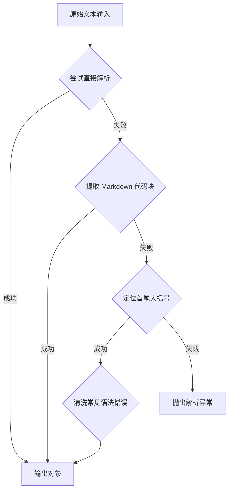
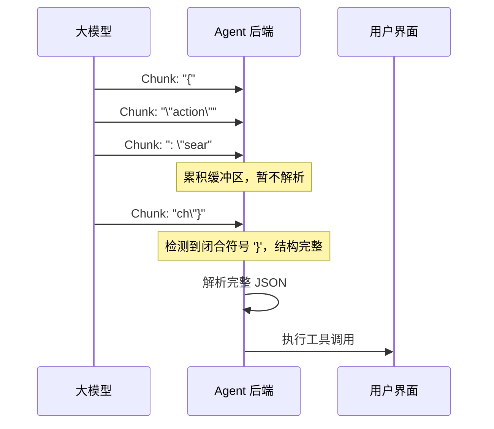
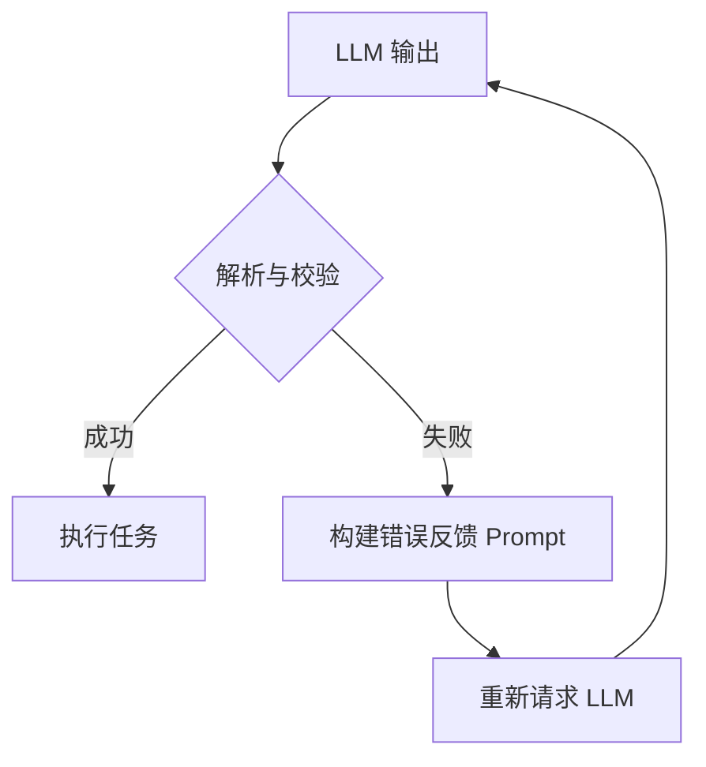

# 第三章：模型输出——跨越"文本"与"结构"的鸿沟

## 3.1 引言：为什么大模型的输出是个"黑盒"？

在 AI Agent 的开发中，我们希望大模型（LLM）像一个严谨的程序员一样输出数据，例如：

```json
{"action": "search", "query": "今天的天气"}

```
但现实是，LLM 本质上是一个"下一个词预测器"，它更喜欢自然语言。它可能输出：

> "好的，帮您查询天气。以下是调用的参数：`{"action": "search", "query": "今天的天气"}`，请注意查收。"
这种"喋喋不休"对人类友好，但对程序调用是灾难。**本章的核心任务，就是设计一套严密的流水线，将模糊的自然语言转化为程序可信赖的结构化对象（如 JSON）。**

## 3.2 核心挑战：输出不稳定的四大元凶
在生产环境中，直接使用 `json.loads(model_output)` 往往会失败，原因通常有以下四点：

1.  **格式包裹**：模型喜欢在代码块前后加解释性文字（如 "Sure! Here is..."）。

2.  **语法错误**：模型可能漏掉逗号、括号不匹配，尤其在 JSON 很长时。

3.  **Token 截断**：受到 `max_tokens` 限制，JSON 输出到一半被强行截断，导致残缺。

4.  **格式漂移**：你想要 JSON，它却给了你 Markdown 表格或 XML。

## 3.3 解决方案：从"预防"到"治疗"
要解决上述问题，我们需要构建三层防御体系：**约束层、解析层、修复层**。

### 3.3.1 第一道防线：约束层（预防）
在 Prompt 和模型层面强制输出格式。

*   **Prompt 强约束**：

    *   明确指令："仅输出 JSON，不要包含任何解释性文字。"

    *   使用 Few-shot（少样本提示）给出标准范例。

    *   **技巧**：使用特殊标记（如 `<JSON>` 和 `</JSON>`）包裹数据，便于正则提取。

*   **模型原生能力**：

    *   **JSON Mode**：调用 API 时设置 `response_format={"type": "json_object"}`，强制模型输出合法 JSON 字符串。

    *   **Structured Outputs (Strict Mode)**：更高级的功能（如 OpenAI 的 JSON Schema 约束），直接提供数据模型，模型保证字段齐全且类型正确。

### 3.3.2 第二道防线：解析层（治疗）
即便使用了约束，模型仍可能"犯错"。我们需要一个鲁棒的解析器来清洗数据。

#### 设计思路
解析器不应假设输入是纯净的，而应像做手术一样，从杂乱的文本中"切除"有效的 JSON 结构。

> **💡 程序⚪碎碎念：我让AI输出JSON，它给了我一首诗。我让它输出结构化数据，它给了我一首诗。我让它别说话直接给JSON，它给了我一首诗+JSON。我让它不要诗，它问我"那您想要什么样的诗风？"。我：......（已上天台）# 论如何气死一个程序员#**

#### 流程设计



#### 具体代码实现

```python
import re
import json
def robust_json_parse(text):
    """
    鲁棒的 JSON 解析器：能够处理包裹文本、Markdown 代码块及部分语法错误。

    """
    # 步骤 1: 尝试直接解析
    try:
        return json.loads(text)
    except json.JSONDecodeError:
        pass # 继续尝试更复杂的方法
    # 步骤 2: 尝试提取 Markdown 代码块 (```json ... ```)
    # 正则解释：匹配 ```json 或 ``` 包裹的内容
    pattern = r"```(?:json)?\s*([\s\S]*?)\s*```"
    match = re.search(pattern, text)
    if match:
        try:
            return json.loads(match.group(1))
        except json.JSONDecodeError:
            pass # 即使提取出代码块，内部仍可能语法错误，继续下一步
    # 步骤 3: "外科手术式"提取 —— 寻找第一个 '{' 和最后一个 '}'
    start = text.find('{')
    end = text.rfind('}')
    if start != -1 and end != -1 and end > start:
        json_str = text[start:end+1]
        
        # 步骤 4: 修复常见语法错误 (如尾随逗号 {"a": 1,} -> {"a": 1})
        # 注意：这是一个简单的修复，生产环境建议使用 json_repair 库
        cleaned_str = json_str.replace(",}", "}").replace(",]", "]")
        try:
            return json.loads(cleaned_str)
        except json.JSONDecodeError:
            pass
    raise ValueError("无法从输出中解析出有效的 JSON 对象")

# 测试用例
test_cases = [
    '{"name": "Alice", "age": 30}', # 标准情况
    '好的，这是结果：```json\n{"name": "Bob"}\n```', # Markdown 包裹
    'Start text {"name": "Charlie", } end text', # 带前后缀与尾随逗号
]
for text in test_cases:
    print(f"输入: {text}")
    print(f"解析结果: {robust_json_parse(text)}\n")

```

### 3.3.3 第三道防线：高级难题（流式与截断）
在 Agent 需要实时反馈的场景（如打字机效果），流式输出给解析带来了巨大挑战：JSON 是在未完成状态下传输的，如何解析半个 JSON？

#### 1. 流式 JSON 处理策略
**核心痛点**：`json.loads` 需要完整的字符串，而流式传输只有碎片。
**解决方案**：

*   **UI 层**：前端随流式输入实时渲染 Markdown。

*   **工具调用层**：必须等待结构完整。

*   **技术实现**：使用 `partial_json` 库或监控闭合符号。
**设计流程图**：



#### 2. 输出截断的急救
如果 LLM 输出触达 `max_tokens` 限制，JSON 会变成 `{"long_list": [1, 2, 3` 这样残缺不全。

*   **检测机制**：检查 API 返回的 `finish_reason`。如果是 `length`，则说明输出未完成。

*   **修复策略**：

    1.  **自动补全**：如果是简单的列表或对象，尝试通过正则补全缺失的括号 `]}`。

    2.  **自动续写**：将截断的 JSON 作为上下文，发送 Prompt："请补全以下未完成的 JSON："，让模型继续生成。

    3.  **降级处理**：如果关键字段缺失，直接抛出异常，触发 Agent 的重试机制。

### 3.3.4 完整实现：Server-Sent Events (SSE) 流式输出

**什么是 SSE？**

Server-Sent Events 是一种服务器向客户端推送实时数据的标准技术。相比 WebSocket，它更简单、基于 HTTP，天然支持自动重连，非常适合 LLM 的打字机效果。

**后端实现（FastAPI + SSE）**

```python
from fastapi import FastAPI
from fastapi.responses import StreamingResponse
import json
import asyncio

app = FastAPI()

async def stream_llm_response(messages: list):
    """
    流式生成 LLM 响应，通过 SSE 推送给前端
    """
    # 模拟 LLM 流式输出（实际应调用 OpenAI 等 API 的 stream 模式）
    chunks = [
        "正在",
        "为您",
        "查询",
        "天气",
        "...",
        "\n\n",
        "北京",
        "今天",
        "晴天",
        "，",
        "25°C",
        "。"
    ]
    
    for chunk in chunks:
        # SSE 格式：data: {json}\n\n
        data = json.dumps({
            "type": "content",
            "data": chunk
        }, ensure_ascii=False)
        
        yield f"data: {data}\n\n"
        await asyncio.sleep(0.1)  # 模拟延迟
    
    # 发送结束标记
    yield f"data: {json.dumps({'type': 'done'})}\n\n"

@app.post("/chat/stream")
async def chat_stream(request: dict):
    """流式聊天接口"""
    messages = request.get("messages", [])
    
    return StreamingResponse(
        stream_llm_response(messages),
        media_type="text/event-stream",
        headers={
            "Cache-Control": "no-cache",
            "Connection": "keep-alive",
        }
    )

```

**前端实现（JavaScript EventSource）**

```javascript
// 前端接收 SSE 流并实时渲染
class ChatStream {
    constructor(apiUrl) {
        this.apiUrl = apiUrl;
        this.eventSource = null;
    }
    
    async sendMessage(messages, onChunk, onDone, onError) {
        // 使用 fetch + ReadableStream 更灵活
        const response = await fetch(this.apiUrl, {
            method: 'POST',
            headers: { 'Content-Type': 'application/json' },
            body: JSON.stringify({ messages })
        });
        
        const reader = response.body.getReader();
        const decoder = new TextDecoder();
        
        let buffer = '';
        
        while (true) {
            const { done, value } = await reader.read();
            if (done) break;
            
            buffer += decoder.decode(value, { stream: true });
            
            // 处理 SSE 数据行
            const lines = buffer.split('\n');
            buffer = lines.pop(); // 保留不完整的最后一行
            
            for (const line of lines) {
                if (line.startsWith('data: ')) {
                    const data = JSON.parse(line.slice(6));
                    
                    if (data.type === 'content') {
                        onChunk(data.data);  // 实时更新 UI
                    } else if (data.type === 'done') {
                        onDone();
                        return;
                    }
                }
            }
        }
    }
}

// 使用示例
const chat = new ChatStream('/chat/stream');

chat.sendMessage(
    [{ role: 'user', content: '北京天气怎么样？' }],
    (chunk) => {
        // 每个字到达时更新界面
        document.getElementById('response').textContent += chunk;
    },
    () => {
        console.log('流式输出完成');
    },
    (error) => {
        console.error('出错:', error);
    }
);

```

**流式输出 + 工具调用的混合场景**

当 Agent 需要流式输出思考过程，但最终要执行工具时：

```python
async def stream_with_tool_call(messages: list):
    """
    流式输出思考过程，检测到工具调用时中断并执行
    """
    buffer = ""
    tool_call_detected = False
    
    async for chunk in llm_client.stream_chat(messages):
        content = chunk.choices[0].delta.content or ""
        buffer += content
        
        # 实时推送给用户（打字机效果）
        yield {"type": "thinking", "data": content}
        
        # 检测是否包含工具调用标记
        if "<tool_call>" in buffer:
            tool_call_detected = True
            break
    
    if tool_call_detected:
        # 提取工具调用参数
        tool_params = extract_tool_params(buffer)
        
        # 通知前端暂停等待
        yield {"type": "tool_start", "tool": tool_params["name"]}
        
        # 执行工具
        result = await execute_tool(tool_params)
        
        # 返回工具结果
        yield {"type": "tool_result", "data": result}
        
        # 继续生成最终回复
        async for chunk in llm_client.stream_chat(
            messages + [
                {"role": "assistant", "content": buffer},
                {"role": "tool", "content": result}
            ]
        ):
            yield {"type": "content", "data": chunk.choices[0].delta.content}
    
    yield {"type": "done"}

```

**SSE vs WebSocket 选型建议**

| 特性 | SSE | WebSocket |
|------|-----|-----------|
| 方向 | 服务器→客户端单向 | 双向通信 |
| 协议 | 基于 HTTP | 独立协议 |
| 复杂度 | 简单 | 较复杂 |
| 自动重连 | ✅ 原生支持 | ❌ 需手动实现 |
| 适用场景 | LLM 打字机效果 | 实时协作、双向交互 |

> 💡 **建议**：纯 LLM 输出场景优先用 SSE，需要用户实时输入干预（如打断生成）时考虑 WebSocket。

## 3.4 闭环系统：数据校验与自我修复
解析成功只是第一步，数据类型对不对？必填项有没有？我们需要引入 **Pydantic** 进行强校验，并构建"自我修复循环"。

### 3.4.1 Pydantic 强校验
使用 Pydantic 定义数据模型，确保字段类型和必填项符合预期。

```python
from pydantic import BaseModel, ValidationError
class AgentAction(BaseModel):
    tool_name: str
    parameters: dict

# 模拟解析出的数据（类型错误）
raw_data = {"tool_name": 12345, "parameters": "invalid_string"}
try:
    # Pydantic 会尝试自动转换类型，如果失败则抛出 ValidationError
    action = AgentAction(**raw_data)
except ValidationError as e:
    print(f"校验失败详情: {e}")
    # 这里触发自我修复逻辑

```

### 3.4.2 自我修复循环
当解析失败或校验不通过时，不要直接报错。利用 LLM 的上下文理解能力，让它自己修正错误。
**设计流程**：


**具体步骤示例**：

1.  **首次尝试**：LLM 输出 `{'tool': 'search', 'param': 'weather'}`，但 Prompt 要求的是 `parameters` 字段。

2.  **捕获错误**：Pydantic 报错 `Missing field 'parameters'`。

3.  **构建反馈 Prompt**：
    > "你之前的输出格式有误。错误信息：`Missing field 'parameters'`。

    > 请修正并重新输出。注意：不要输出任何解释，直接输出修正后的 JSON。"

4.  **重试**：LLM 看到错误信息，修正输出为 `{'tool': 'search', 'parameters': {'query': 'weather'}}`。

这种闭环机制能将解析成功率从 90% 提升至 99% 以上。

## 3.5 本章小结
解析和格式化是连接 LLM "思维"与系统"行动"的桥梁。本章我们从最简单的 `json.loads` 出发，构建了一套工业级的输出处理方案：

1.  **预防**：通过 JSON Mode 和 Prompt 约束减少错误。

2.  **解析**：编写鲁棒的代码清洗 Markdown 和多余文本。

3.  **急救**：处理流式输出与截断异常。

4.  **闭环**：结合 Pydantic 校验与自我修复循环，确保数据万无一失。

下一章，我们将利用本章解析出的结构化数据，赋予 Agent 真正的能力——**Function Calling（函数调用）**，让它去驱动真实世界的工具。

---

## 3.6 补充内容：工程化实践要点

### 3.6.1 类型安全与代码健壮性

**常见问题场景：**
生产环境中，LLM偶尔会返回格式错误的JSON，导致整个服务崩溃。排查问题时发现代码中大量使用`dict`类型，缺乏类型提示，无法快速定位问题。

**解决思路与方案：**

```python
from pydantic import BaseModel, Field, validator
from typing import Optional, List, Dict, Any

class ToolCallRequest(BaseModel):
    """工具调用的请求结构"""
    tool_name: str = Field(..., description="工具名称")
    parameters: Dict[str, Any] = Field(default_factory=dict, description="工具参数")
    
    @validator('tool_name')
    def validate_tool_name(cls, v):
        if not v or not v.replace('_', '').isalnum():
            raise ValueError("工具名称只能包含字母、数字和下划线")
        return v

class AgentAction(BaseModel):
    """Agent执行的动作"""
    action_type: str = Field(..., description="动作类型: tool_call/text")
    tool_call: Optional[ToolCallRequest] = None
    text_response: Optional[str] = None
    
    class Config:
        # 确保action_type和对应字段一致
        validate_assignment = True

```

- **Pydantic模型定义**：使用Pydantic定义强类型的数据模型。

- **类型注解**：为所有函数添加完整的类型注解。

- **运行校验**：`validate_assignment=True`确保赋值时也进行类型检查。

### 3.6.2 单元测试策略

**常见问题场景：**
每次修改解析逻辑都担心影响现有功能，但手动测试覆盖不了所有边界情况。上线后频繁出现因解析错误导致的Bug。

**解决思路与方案：**

```python
import pytest
from my_parser import robust_json_parse, OutputParser

class TestRobustJsonParser:
    """JSON解析器的单元测试"""
    
    def test_standard_json(self):
        """测试标准JSON解析"""
        result = robust_json_parse('{"name": "Alice", "age": 30}')
        assert result == {"name": "Alice", "age": 30}
    
    def test_markdown_code_block(self):
        """测试Markdown代码块包裹的JSON"""
        result = robust_json_parse("```json\n{\"name\": \"Bob\"}\n```")
        assert result == {"name": "Bob"}
    
    def test_trailing_comma(self):
        """测试带尾随逗号的不合法JSON"""
        result = robust_json_parse('{"name": "Charlie", }')
        assert result == {"name": "Charlie"}
    
    def test_invalid_json_raises_error(self):
        """测试无效JSON抛出正确异常"""
        with pytest.raises(ValueError, match="无法解析"):
            robust_json_parse("not json at all")
    
    @pytest.mark.parametrize("input_str,expected", [
        ('{"a": 1}', {"a": 1}),
        ('text {"b": 2} more', {"b": 2}),
        ('{"c": "hello"}', {"c": "hello"})
    ])
    def test_various_formats(self, input_str, expected):
        """参数化测试各种格式"""
        assert robust_json_parse(input_str) == expected

```

- **边界情况覆盖**：测试各种异常JSON格式、截断情况、特殊字符等。

- **Mock LLM响应**：创建Mock响应用于测试解析逻辑。

- **参数化测试**：使用`@pytest.mark.parametrize`减少重复代码。

### 3.6.3 解析性能优化

**常见问题场景：**
高并发场景下，JSON解析成为性能瓶颈。大量请求堆积导致响应延迟明显上升。

**解决思路与方案：**

```python
import json
from functools import lru_cache

@lru_cache(maxsize=1024)
def cached_json_loads(json_str: str) -> dict:
    """缓存常用的JSON解析结果"""
    return json.loads(json_str)

class OptimizedParser:
    """优化的解析器"""
    
    def __init__(self):
        self._regex_cache = {}
    
    def parse(self, text: str) -> Optional[dict]:
        # 简单缓存：检测重复文本
        cache_key = hash(text)
        if cache_key in self._regex_cache:
            return self._regex_cache[cache_key]
        
        result = robust_json_parse(text)
        
        # 限制缓存大小
        if len(self._regex_cache) > 10000:
            self._regex_cache.clear()
        
        self._regex_cache[cache_key] = result
        return result

```

- **结果缓存**：对相同输入的解析结果进行缓存。

- **正则表达式预编译**：预编译正则表达式，避免重复编译开销。

- **流式解析优化**：对于大JSON，考虑使用ijson进行流式解析。

### 3.6.4 生产环境监控与告警

**常见问题场景：**
解析失败率突然上升，但运维团队没有及时发现。用户开始投诉"Agent完全不动了"，问题已经影响大量用户。

**解决思路与方案：**

```python
import structlog

logger = structlog.get_logger()

class MonitoredParser:
    """带监控的解析器"""
    
    def __init__(self):
        self.success_count = 0
        self.fail_count = 0
    
    def parse(self, text: str) -> dict:
        try:
            result = robust_json_parse(text)
            self.success_count += 1
            return result
        except Exception as e:
            self.fail_count += 1
            # 记录失败日志
            logger.error(
                "parse_failed",
                error_type=type(e).__name__,
                error_message=str(e),
                text_preview=text[:100]
            )
            raise
    
    def get_metrics(self) -> dict:
        """暴露指标供监控系统采集"""
        total = self.success_count + self.fail_count
        success_rate = self.success_count / total if total > 0 else 0
        return {
            "parse_total": total,
            "parse_success": self.success_count,
            "parse_fail": self.fail_count,
            "parse_success_rate": success_rate
        }

```

- **解析成功率指标**：记录解析成功/失败次数。

- **错误分类统计**：分析不同类型的解析错误占比。

- **告警阈值**：当解析失败率超过阈值（如5%）时触发告警。

### 3.6.5 降级策略设计

**常见问题场景：**
LLM输出格式完全失控，返回了大量无法解析的内容。服务进入完全不可用状态，没有任何兜底方案。

**解决思路与方案：**

```python
class FallbackParser:
    """带降级策略的解析器"""
    
    def __init__(self, primary_parser, fallback_response: str = "抱歉，我无法理解您的请求"):
        self.primary_parser = primary_parser
        self.fallback_response = fallback_response
    
    def parse_with_fallback(self, text: str) -> dict:
        try:
            return self.primary_parser.parse(text)
        except Exception as e:
            logger.warning(f"主解析器失败，使用降级方案: {e}")
            
            # 降级方案1：尝试提取关键词
            keywords = self._extract_keywords(text)
            if keywords:
                return {
                    "action": "fallback_search",
                    "query": keywords
                }
            
            # 降级方案2：返回错误标记，触发重试流程
            return {
                "action": "error",
                "message": self.fallback_response,
                "needs_retry": True
            }
    
    def _extract_keywords(self, text: str) -> str:
        """从无法解析的文本中提取关键词"""
        import re
        # 简单实现：提取引号中的内容或英文单词
        matches = re.findall(r'"([^"]+)"', text)
        return matches[0] if matches else ""

```

- **多级降级**：设计多级降级策略，逐步放宽解析要求。

- **关键词提取**：当完全无法解析时，尝试提取关键词进行模糊搜索。

- **日志记录**：详细记录降级触发情况，便于后续分析改进。
