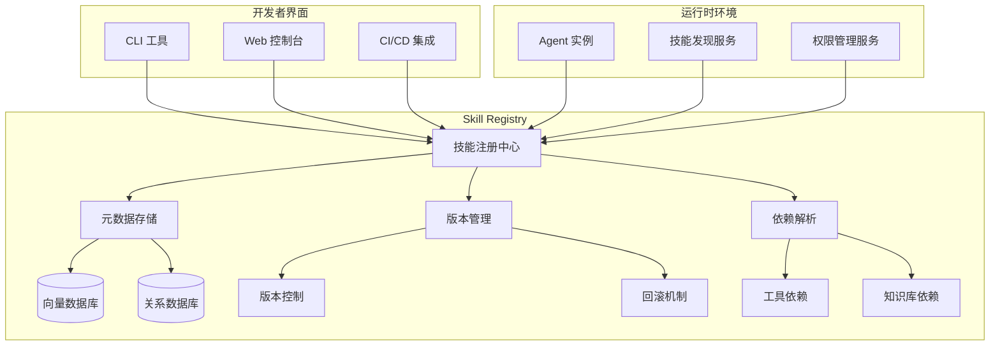
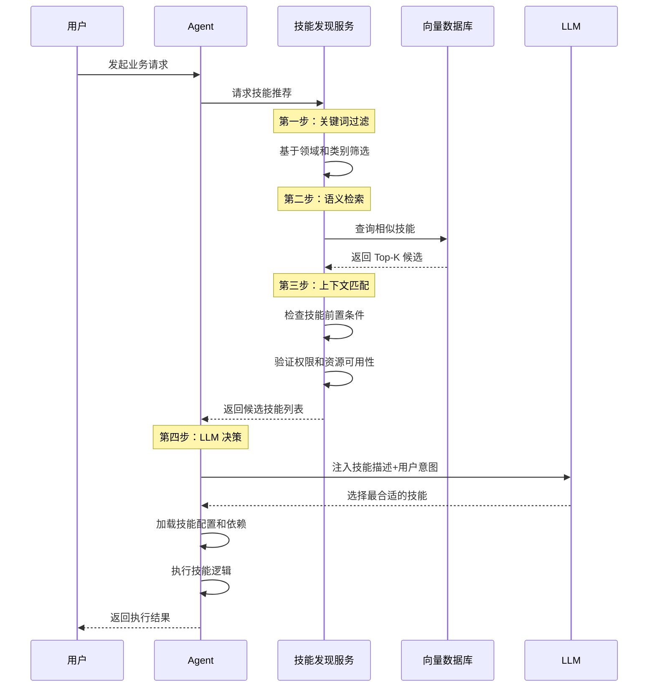
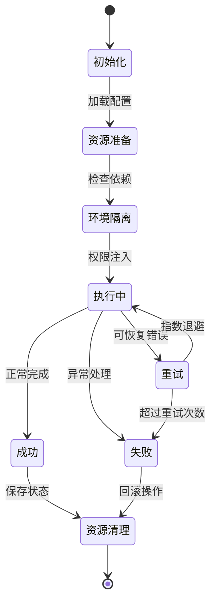
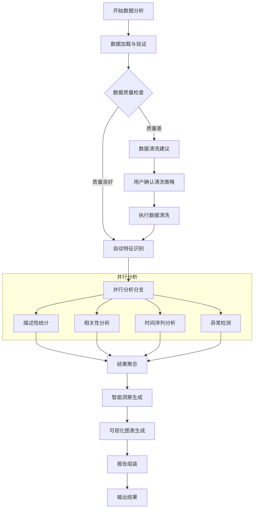
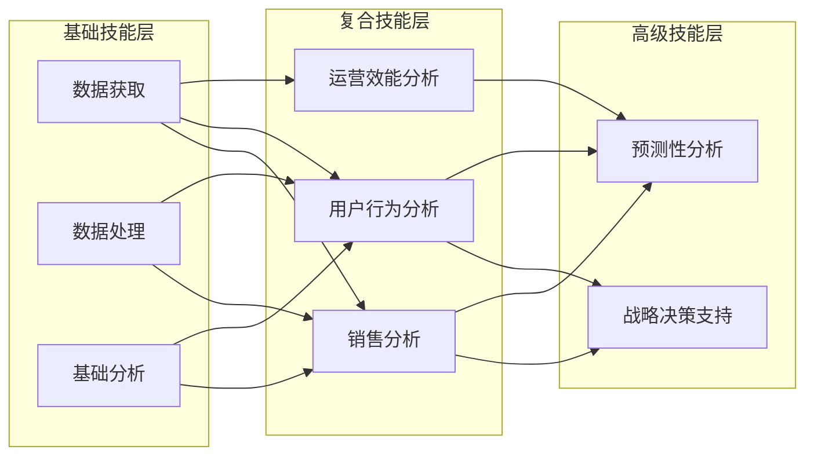

# 第五章：技能体系——Agent Skills 定义和组织

本章讲解如何将原子性的Function封装为高层次的Skill，包括Skill的结构化定义（元数据、输入输出契约、核心组件配置）、技能注册与发现机制（集中式注册表、动态技能发现、语义匹配），以及技能执行与编排的生命周期管理，并提供智能数据分析Skill的实战案例。

## 5.1 引言：从工具人到专家
在上一章中，我们探讨了 Function Calling，它赋予了 Agent 操作外部世界的能力。然而，仅仅拥有“锤子”和“锯子”（Functions）并不能让人成为“木匠”。在实际应用中，我们需要 Agent 扮演具体的角色，完成复杂的业务流程，这就是“技能”的概念。
**Skill 是比 Function 更高维度的抽象**。如果说 Function 是 Agent 的“原子能力”，那么 Skill 就是 Agent 的“业务解决方案”。一个 Skill 可能包含特定的 Prompt 策略、一系列有序或动态的工具调用，以及专用的知识库资源。

### 为什么需要技能层？

在真实业务场景中，我们发现单纯使用 Function Calling 会遇到以下问题：

1. **认知负荷过重**：LLM 需要在成百上千个工具中选择，容易产生“选择困难症”

2. **业务逻辑分散**：相同的业务流程（如生成报表）需要在多个地方重复实现

3. **缺乏上下文**：工具调用之间缺乏统一的业务上下文和状态管理

4. **难以维护**：当业务逻辑变化时，需要修改多个调用点
技能层通过**封装**、**抽象**和**复用**解决了这些问题。

## 5.2 Skill 与 Function 的核心区别
理解两者的差异有助于我们构建清晰的架构：
| 维度 | Function (工具) | Skill (技能) |
|:---|:---|:---|
| **层级** | 底层原子操作 | 上层业务封装 |
| **示例** | `read_file`, `http_get`, `sql_query` | `analyze_sales_report`, `write_unit_test` |
| **复用性** | 通用性强，跨业务复用 | 领域性强，垂直场景复用 |
| **调用方式** | LLM 直接决策调用 | LLM 决策调用 Skill，Skill 内部调度 Function |
| **逻辑** | 无状态，单纯执行 | 包含推理逻辑、流程控制和状态管理 |
| **Prompt** | 通用 System Prompt | 包含技能专用的 System Prompt 模板 |
| **生命周期** | 瞬时执行 | 可能包含多轮交互和持久化状态 |

### 类比理解
把 Agent 想象成一个公司：

- **Function**：是公司的“基础工具”，如电话、打印机、计算器

- **Skill**：是公司的“专业部门”，如财务部、研发部、市场部
财务部（Skill）会使用计算器、打印机（Functions），但它还包含了一套完整的财务处理流程、专业知识和业务规则。

## 5.3 Skill 的结构化定义
为了实现大规模技能管理，我们需要定义一套标准的 Skill Schema。一个成熟的 Skill 定义应包含以下部分：

### 5.3.1 元数据设计
元数据是 Agent 决定“何时使用该技能”的依据。

```json
{
  "name": "financial_report_generator",
  "display_name": "财务报表生成器",
  "version": "1.0.0",
  "description": "根据财务数据自动生成结构化的财务分析报告，包含资产负债表、利润表和现金流量表",
  "tags": ["finance", "report", "analysis", "business-intelligence"],
  "category": "financial-analysis",
  "author": "Finance Team",
  "created_at": "2024-01-15",
  "last_updated": "2024-03-20",
  "rating": 4.5,
  "usage_count": 1250
}

```
**设计要点**：

- `name`：用于系统内部调用的唯一标识符

- `display_name`：面向用户展示的友好名称

- `description`：详细的功能描述，用于语义检索和 LLM 决策

- `tags`：多维度标签，便于分类和筛选

### 5.3.2 输入输出契约
明确技能的接口规范，确保调用方传入正确的参数。

```json
{
  "input_schema": {
    "type": "object",
    "properties": {
      "company_id": {
        "type": "string",
        "description": "公司唯一标识符"
      },
      "fiscal_period": {
        "type": "object",
        "properties": {
          "start_date": {"type": "string", "format": "date"},
          "end_date": {"type": "string", "format": "date"}
        },
        "required": ["start_date", "end_date"]
      },
      "report_type": {
        "type": "string",
        "enum": ["quarterly", "annual", "custom"],
        "default": "quarterly"
      },
      "include_analysis": {
        "type": "boolean",
        "default": true,
        "description": "是否包含财务分析内容"
      }
    },
    "required": ["company_id", "fiscal_period"]
  },
  "output_schema": {
    "type": "object",
    "properties": {
      "report_url": {"type": "string", "format": "uri"},
      "summary": {"type": "string"},
      "key_metrics": {
        "type": "object",
        "properties": {
          "revenue": {"type": "number"},
          "net_profit": {"type": "number"},
          "profit_margin": {"type": "number"}
        }
      },
      "generated_at": {"type": "string", "format": "date-time"}
    }
  }
}

```

### 5.3.3 核心组件配置

```json
{
  "system_prompt_template": "你是一名专业的财务分析师，专注于为{{company_name}}生成{{report_type}}财务报告。\n\n当前会计期间：{{fiscal_period.start_date}} 至 {{fiscal_period.end_date}}\n\n请按照以下流程工作：\n1. 从财务数据库获取原始数据\n2. 进行数据清洗和验证\n3. 计算关键财务指标\n4. 生成结构化报告\n5. 提供财务分析建议\n\n注意事项：\n- 确保数据准确性\n- 所有金额单位统一为万元\n- 比较去年同期数据",
  
  "tools_required": [
    {
      "name": "sql_query",
      "config": {
        "database": "financial_db",
        "read_only": true
      }
    },
    {
      "name": "excel_generator",
      "config": {
        "template": "financial_report_template.xlsx"
      }
    },
    {
      "name": "email_sender",
      "config": {
        "smtp_server": "smtp.company.com"
      }
    }
  ],
  
  "knowledge_bases": [
    {
      "id": "kb_financial_regulations",
      "description": "财务法规和政策知识库"
    },
    {
      "id": "kb_industry_benchmarks",
      "description": "行业基准数据知识库"
    }
  ],
  
  "resources": [
    {
      "type": "file",
      "path": "/templates/report_template.md"
    },
    {
      "type": "api",
      "endpoint": "https://api.market-data.com/stocks",
      "auth_required": true
    }
  ]
}

```

## 5.4 技能注册与发现机制
随着技能数量的增长，Agent 不可能在每次请求时都加载所有技能的描述。我们需要构建类似“App Store”的机制。

### 5.4.1 集中式技能注册表架构


**核心功能**：

1. **技能注册**：验证技能定义的完整性和合规性

2. **版本管理**：支持多版本共存和灰度发布

3. **依赖解析**：自动检查工具和知识库的可用性

4. **热插拔**：新增技能无需重启 Agent 服务

### 5.4.2 动态技能发现流程


**技术实现细节**：

```python
class SkillDiscovery:
    def __init__(self, vector_store, skill_registry):
        self.vector_store = vector_store
        self.skill_registry = skill_registry
        
    async def discover_skills(self, user_intent: str, context: dict) -> List[Skill]:
        """多阶段技能发现"""
        
        # 阶段1：基于元数据的快速过滤
        candidate_skills = await self._metadata_filter(context)
        
        # 阶段2：语义相似度检索
        semantic_results = await self.vector_store.similarity_search(
            query=user_intent,
            k=10,
            filter={"category": context.get("allowed_categories")}
        )
        
        # 阶段3：上下文适配性检查
        valid_skills = []
        for skill in candidate_skills + semantic_results:
            if await self._check_dependencies(skill, context):
                if await self._check_permissions(skill, context):
                    valid_skills.append(skill)
        
        # 阶段4：排序和去重
        return self._rank_and_deduplicate(valid_skills, user_intent)
    
    async def _metadata_filter(self, context: dict) -> List[Skill]:
        """基于元数据的初步过滤"""
        filters = []
        
        if "user_department" in context:
            filters.append({"tags": {"$in": [context["user_department"]]}})
        
        if "required_capabilities" in context:
            filters.append({"capabilities": {"$all": context["required_capabilities"]}})
        
        return await self.skill_registry.query(filters)

```

### 5.4.3 基于语义的技能匹配
我们将技能的描述和标签向量化，构建语义索引：

```python
class SkillIndexer:
    def __init__(self, embedding_model):
        self.embedding_model = embedding_model
        
    def create_skill_embedding(self, skill: Skill) -> List[float]:
        """创建技能的语义向量"""
        # 组合多个文本字段
        text_for_embedding = f"""
        名称：{skill.display_name}
        描述：{skill.description}
        标签：{', '.join(skill.tags)}
        适用场景：{skill.use_cases}
        输入参数：{self._schema_to_text(skill.input_schema)}
        """
        
        return self.embedding_model.embed(text_for_embedding)
    
    def _schema_to_text(self, schema: dict) -> str:
        """将 Schema 转换为自然语言描述"""
        properties = schema.get("properties", {})
        descriptions = []
        for name, prop in properties.items():
            desc = f"{name}({prop.get('type', 'any')}): {prop.get('description', '')}"
            descriptions.append(desc)
        return "; ".join(descriptions)

```

## 5.5 技能执行与编排
当 LLM 决定调用某个 Skill 时，执行框架需要进行一系列编排工作。

### 5.5.1 技能执行生命周期



### 5.5.2 执行引擎设计

```python
class SkillExecutor:
    def __init__(self, tool_registry, knowledge_base_manager, permission_manager):
        self.tool_registry = tool_registry
        self.knowledge_base_manager = knowledge_base_manager
        self.permission_manager = permission_manager
        
    async def execute_skill(self, skill: Skill, params: dict, context: dict):
        """技能执行主流程"""
        
        # 1. 环境准备
        execution_context = await self._prepare_environment(skill, context)
        
        # 2. 权限注入
        permission_context = await self.permission_manager.get_permission_context(
            user_id=context["user_id"],
            skill_id=skill.name
        )
        execution_context["permissions"] = permission_context
        
        # 3. 创建隔离的执行环境
        sandbox = await self._create_sandbox(skill, execution_context)
        
        try:
            # 4. 执行技能逻辑
            result = await self._execute_in_sandbox(sandbox, skill, params)
            
            # 5. 后处理
            return await self._post_process(result, skill)
            
        except Exception as e:
            # 6. 错误处理和回滚
            await self._handle_error(e, sandbox, skill)
            raise
        finally:
            # 7. 资源清理
            await self._cleanup(sandbox)
    
    async def _prepare_environment(self, skill: Skill, context: dict) -> dict:
        """准备执行环境"""
        env = {
            "system_prompt": self._render_prompt(skill.system_prompt_template, context),
            "tools": {},
            "knowledge_bases": {}
        }
        
        # 加载所需工具
        for tool_config in skill.tools_required:
            tool = await self.tool_registry.get_tool(tool_config["name"])
            configured_tool = tool.configure(**tool_config.get("config", {}))
            env["tools"][tool_config["name"]] = configured_tool
        
        # 加载知识库
        for kb_config in skill.knowledge_bases:
            kb = await self.knowledge_base_manager.get_knowledge_base(kb_config["id"])
            env["knowledge_bases"][kb_config["id"]] = kb
        
        return env

```

### 5.5.3 并发与隔离策略
在多技能并发执行场景下，我们需要确保资源隔离和状态一致性：

```python
class SkillSandbox:
    """技能执行沙箱环境"""
    
    def __init__(self, skill_id: str, isolation_level: str = "process"):
        self.skill_id = skill_id
        self.isolation_level = isolation_level
        self.state_store = None
        self.resource_limits = {}
        
    async def __aenter__(self):
        """进入沙箱环境"""
        # 创建状态存储
        self.state_store = await self._create_state_store()
        
        # 设置资源限制
        self.resource_limits = {
            "max_memory": "512MB",
            "max_cpu": "50%",
            "max_execution_time": "300s",
            "max_tools_calls": 100
        }
        
        return self
    
    async def __aexit__(self, exc_type, exc_val, exc_tb):
        """退出沙箱环境"""
        # 清理临时资源
        await self._cleanup_temp_resources()
        
        # 保存持久化状态
        if exc_type is None:
            await self._persist_state()
        else:
            await self._rollback_state()
    
    async def _create_state_store(self) -> dict:
        """创建沙箱的状态存储，用于在技能执行过程中保存中间状态"""
        # 为每个技能实例创建独立的状态字典
        # 生产环境中可替换为 Redis 或 SQLite 等持久化存储
        state = {
            "skill_id": self.skill_id,
            "status": "initialized",
            "created_at": time.time(),
            "intermediate_results": {},
            "step_index": 0,
        }
        return state
    
    async def _cleanup_temp_resources(self):
        """清理沙箱执行过程中产生的临时资源"""
        if self.state_store is None:
            return
        
        # 清理中间结果中的临时文件和缓存
        for key, value in self.state_store.get("intermediate_results", {}).items():
            # 如果中间结果是文件路径，删除临时文件
            if isinstance(value, str) and value.startswith("/tmp/"):
                try:
                    import os
                    if os.path.exists(value):
                        os.remove(value)
                except OSError as e:
                    logger.warning(f"清理临时文件失败: {value}, 错误: {e}")
        
        # 重置状态
        self.state_store.clear()
        self.state_store = None
    
    async def _persist_state(self):
        """将沙箱状态持久化到外部存储（执行成功时调用）"""
        if self.state_store is None:
            return
        
        self.state_store["status"] = "completed"
        # 生产环境中，这里会将状态写入 Redis 或数据库
        # 示例：await self.storage_backend.save(self.skill_id, self.state_store)
        logger.info(f"技能 {self.skill_id} 执行成功，状态已持久化")
    
    async def _rollback_state(self):
        """回滚沙箱状态（执行失败时调用）"""
        if self.state_store is None:
            return
        
        self.state_store["status"] = "failed"
        # 生产环境中，这里会清除未完成的中间状态
        # 确保不会残留不完整的数据影响后续执行
        logger.warning(f"技能 {self.skill_id} 执行失败，状态已回滚")

```

## 5.6 实战案例：构建“智能数据分析 Skill”

### 设计目标
构建一个能够自动分析 CSV 数据文件，生成可视化图表和洞察报告的技能。
**预期功能**：

1. 自动识别数据类型和结构

2. 进行数据清洗和质量检查

3. 生成多种统计图表

4. 提供自然语言的数据洞察

5. 导出分析报告

### 步骤一：定义技能元数据

```json
{
  "name": "smart_data_analysis",
  "display_name": "智能数据分析助手",
  "version": "2.1.0",
  "description": "自动分析 CSV/Excel 数据文件，识别数据模式，生成可视化图表并提供业务洞察。支持时间序列分析、相关性分析和异常检测。",
  "tags": ["data-analysis", "visualization", "statistics", "business-intelligence"],
  "category": "data-science",
  "difficulty": "intermediate",
  "estimated_time": "5-15 minutes"
}

```

### 步骤二：定义输入输出契约

```json
{
  "input_schema": {
    "type": "object",
    "properties": {
      "data_source": {
        "type": "object",
        "properties": {
          "type": {"type": "string", "enum": ["file", "url", "database"]},
          "path": {"type": "string"},
          "options": {"type": "object"}
        },
        "required": ["type", "path"]
      },
      "analysis_config": {
        "type": "object",
        "properties": {
          "target_columns": {"type": "array", "items": {"type": "string"}},
          "analysis_types": {
            "type": "array",
            "items": {"type": "string", "enum": ["descriptive", "correlation", "time_series", "anomaly"]}
          },
          "output_format": {"type": "string", "enum": ["html", "pdf", "markdown"], "default": "html"}
        }
      },
      "visualization_preferences": {
        "type": "object",
        "properties": {
          "chart_types": {"type": "array", "items": {"type": "string"}},
          "color_scheme": {"type": "string", "default": "default"},
          "interactive": {"type": "boolean", "default": true}
        }
      }
    },
    "required": ["data_source"]
  }
}

```

### 步骤三：设计技能执行流程



### 步骤四：实现技能逻辑

```python
class SmartDataAnalysisSkill:
    def __init__(self):
        self.name = "smart_data_analysis"
        self.llm_client = None  # 注入 LLM 客户端
        self.tools = {
            "python_repl": PythonREPLTool(),
            "matplotlib": MatplotlibTool(),
            "pandas": PandasTool(),
            "file_manager": FileManagerTool()
        }
        
    async def execute(self, params: dict, context: dict):
        """主执行逻辑"""
        
        # 阶段1：数据加载
        data = await self._load_data(params["data_source"])
        
        # 阶段2：数据质量评估
        quality_report = await self._assess_data_quality(data)
        
        if quality_report["score"] < 0.7:
            # 数据质量不佳，提供清洗建议
            cleaning_plan = await self._generate_cleaning_plan(data, quality_report)
            return {
                "status": "需要数据清洗",
                "quality_report": quality_report,
                "cleaning_plan": cleaning_plan
            }
        
        # 阶段3：执行分析
        analysis_results = await self._run_analysis(data, params.get("analysis_config", {}))
        
        # 阶段4：生成洞察
        insights = await self._generate_insights(data, analysis_results)
        
        # 阶段5：创建可视化
        visualizations = await self._create_visualizations(
            data, analysis_results, params.get("visualization_preferences", {})
        )
        
        # 阶段6：组装报告
        report = await self._assemble_report(
            data, analysis_results, insights, visualizations
        )
        
        return {
            "status": "完成",
            "report": report,
            "visualizations": visualizations,
            "insights": insights
        }
    
    async def _run_analysis(self, data, config):
        """运行多种分析"""
        results = {}
        
        analysis_types = config.get("analysis_types", ["descriptive"])
        
        # 使用 LLM 编排分析流程
        analysis_prompt = f"""
        你是一名数据分析专家。当前数据集包含 {len(data)} 行数据。

        需要执行的分析类型：{analysis_types}
        
        请规划分析步骤，并使用提供的工具执行。

        """
        
        # 这里会启动一个内部 Agent 循环
        agent = Agent(
            system_prompt=analysis_prompt,
            tools=[self.tools["python_repl"], self.tools["pandas"]]
        )
        
        results = await agent.run(data=data)
        
        return results

```

### 步骤五：定义 System Prompt 模板

```

markdown

# 系统角色
你是一名资深数据分析师，专注于从数据中挖掘商业价值。你擅长使用 Python 进行数据分析，并能够将复杂数据转化为易懂的洞察。

# 工作流程

1. **数据理解阶段**

   - 检查数据维度和结构

   - 识别数据类型（数值、分类、时间序列等）

   - 检测缺失值和异常值

2. **分析执行阶段**

   - 根据数据特征选择合适的分析方法

   - 使用 Python 工具执行计算

   - 验证分析结果的合理性

3. **洞察提炼阶段**

   - 从统计结果中发现模式和趋势

   - 将技术性发现转化为业务语言

   - 提供可操作的建议

4. **可视化阶段**

   - 选择最合适的图表类型

   - 设计清晰美观的可视化

   - 添加必要的注释和标题

# 约束条件

- 始终先验证数据质量

- 避免过度解读数据

- 可视化必须清晰易懂

- 所有结论需要数据支撑

# 输出要求

- 提供结构化的分析报告

- 包含关键图表和指标

- 给出明确的业务建议

```

### 步骤六：测试与验证

```python

# 测试案例
test_case = {
    "data_source": {
        "type": "file",
        "path": "/data/sales_2023.csv"
    },
    "analysis_config": {
        "analysis_types": ["descriptive", "time_series", "correlation"],
        "target_columns": ["revenue", "customer_count", "conversion_rate"]
    },
    "visualization_preferences": {
        "chart_types": ["line", "bar", "scatter"],
        "color_scheme": "business",
        "interactive": True
    }
}

# 执行技能
skill = SmartDataAnalysisSkill()

async def run_test():
    result = await skill.execute(test_case, {"user_id": "analyst_001"})
    # 验证结果
    assert result["status"] == "完成"
    assert "report" in result
    assert len(result["visualizations"]) > 0
    return result

```

## 5.7 技能体系的最佳实践

### 5.7.1 技能设计原则

1. **单一职责原则**：每个技能应专注于一个明确的业务目标

2. **高内聚低耦合**：技能内部的逻辑紧密相关，技能之间的依赖最小化

3. **渐进式复杂度**：从简单技能开始，逐步构建复杂技能组合

4. **可观测性**：技能执行过程应有完整的日志和监控

### 5.7.2 技能组合模式



### 5.7.3 错误处理策略

```python
class SkillErrorHandler:
    """技能错误处理策略"""
    
    def __init__(self):
        self.retry_policies = {
            "transient_error": {
                "max_retries": 3,
                "backoff": "exponential",
                "initial_delay": 1
            },
            "resource_error": {
                "max_retries": 2,
                "backoff": "linear",
                "initial_delay": 5
            },
            "validation_error": {
                "max_retries": 0,
                "user_feedback": True
            }
        }
    
    async def handle_error(self, error: Exception, skill: Skill, context: dict):
        """智能错误处理"""
        error_type = self._classify_error(error)
        policy = self.retry_policies.get(error_type, {})
        
        if policy.get("max_retries", 0) > 0:
            return await self._retry_execution(skill, context, policy)
        elif policy.get("user_feedback"):
            return await self._request_user_input(error, context)
        else:
            return await self._fallback_execution(skill, context)

```

## 5.8 本章小结
技能层是 Agent 架构中承上启下的关键环节，它将底层的原子能力封装为可复用的业务解决方案。通过本章的学习，我们掌握了：

1. **技能与工具的本质区别**：技能是更高维度的抽象，包含业务逻辑和上下文

2. **技能的结构化定义**：元数据、契约、核心组件三位一体的设计方法

3. **动态发现机制**：从海量技能中智能匹配最合适的能力

4. **执行编排模式**：安全、高效地执行技能并管理其生命周期

5. **实战构建流程**：从需求分析到测试验证的完整开发过程
下一章，我们将深入 Agent 的记忆机制，首先探讨如何处理短期交互记忆——Session Memory，这是实现连贯多轮对话的基础。

---

## 5.9 补充内容：工程化实践要点

### 5.9.1 技能注册中心的数据库设计

**常见问题场景：**
技能数量增加后，内存中的技能列表难以维护和查询。重启服务后所有技能配置丢失，无法支持动态新增技能。

**解决思路与方案：**

```python

# 技能持久化存储设计
class SkillRepository:
    """技能仓储层"""
    
    def __init__(self, db_connection):
        self.db = db_connection
    
    def save_skill(self, skill: Skill) -> str:
        """保存或更新技能"""
        sql = """
        INSERT INTO skills (name, display_name, version, description, config)
        VALUES (?, ?, ?, ?, ?)
        ON CONFLICT(name) DO UPDATE SET
            version = excluded.version,
            config = excluded.config,
            updated_at = CURRENT_TIMESTAMP
        """
        self.db.execute(sql, (
            skill.name, skill.display_name, 
            skill.version, skill.description,
            json.dumps(skill.config)
        ))
    
    def find_skill(self, name: str) -> Skill:
        """根据名称查找技能"""
        sql = "SELECT * FROM skills WHERE name = ?"
        row = self.db.fetchone(sql, (name,))
        return self._row_to_skill(row) if row else None
    
    def list_skills(self, category: str = None, tags: list = None) -> List[Skill]:
        """技能列表查询，支持分类和标签过滤"""
        sql = "SELECT * FROM skills WHERE 1=1"
        params = []
        if category:
            sql += " AND category = ?"
            params.append(category)
        if tags:
            sql += " AND tags LIKE ?"
            params.append(f"%{','.join(tags)}%")
        
        return [self._row_to_skill(row) for row in self.db.fetchall(sql, params)]

```

- **关系型数据库**：使用MySQL/PostgreSQL存储技能元数据。

- **JSON字段**：技能配置使用JSON字段存储，灵活适应不同技能的配置差异。

- **版本控制**：支持技能版本管理，支持灰度回滚。

### 5.9.2 技能的热加载与动态更新

**常见问题场景：**
修改了某个Skill的配置后，需要重启整个服务才能生效。生产环境无法接受频繁重启。

**解决思路与方案：**

```python
class HotReloadSkillRegistry:
    """支持热加载的技能注册表"""
    
    def __init__(self, repo: SkillRepository):
        self.repo = repo
        self._cache = {}
        self._lock = threading.RLock()
        self._watch_thread = None
    
    def start_watching(self):
        """启动文件监听，实现热加载"""
        self._watch_thread = threading.Thread(target=self._watch_changes, daemon=True)
        self._watch_thread.start()
    
    def _watch_changes(self):
        """监听配置文件变化"""
        # 使用watchdog库监听配置目录变化
        from watchdog.observers import Observer
        from watchdog.events import FileSystemEventHandler
        
        class ConfigHandler(FileSystemEventHandler):
            def on_modified(self, event):
                if event.src_path.endswith('.json'):
                    self.reload_skill_from_file(event.src_path)
        
        observer = Observer()
        observer.schedule(ConfigHandler(), path='./skills/config', recursive=False)
        observer.start()
    
    def reload_skill_from_file(self, file_path: str):
        """从文件重新加载技能"""
        with open(file_path) as f:
            skill_config = json.load(f)
        
        with self._lock:
            skill = Skill(**skill_config)
            self._cache[skill.name] = skill
            logger.info(f"技能热加载成功: {skill.name}")

```

- **文件监听**：监听技能配置文件变化，自动重新加载。

- **缓存机制**：使用内存缓存提高查询性能。

- **线程安全**：使用锁保证并发安全。

### 5.9.3 技能执行的资源隔离

**常见问题场景：**
某个Skill执行时占用了大量CPU或内存，影响其他Skill的正常运行。缺乏资源隔离机制。

**解决思路与方案：**

```python
import resource
import subprocess
import psutil

class IsolatedSkillExecutor(SkillExecutor):
    """带资源隔离的技能执行器"""
    
    def __init__(self, skill: Skill, max_memory_mb: int = 512, max_cpu_percent: int = 50):
        super().__init__(skill)
        self.max_memory_mb = max_memory_mb
        self.max_cpu_percent = max_cpu_percent
    
    async def execute_in_sandbox(self, skill: Skill, params: dict):
        """在沙箱环境中执行技能"""
        # 方法1：使用子进程隔离
        process = await asyncio.create_subprocess_exec(
            'python', 'skill_runner.py',
            stdin=asyncio.subprocess.PIPE,
            stdout=asyncio.subprocess.PIPE,
            stderr=asyncio.subprocess.PIPE,
            # 资源限制
            preexec_fn=lambda: (
                resource.setrlimit(resource.RLIMIT_AS, (self.max_memory_mb*1024*1024, -1)),
                resource.setrlimit(resource.RLIMIT_CPU, (self.max_cpu_percent, -1))
            )
        )
        
        # 方法2：使用容器（Docker SDK）
        # 创建临时容器运行技能代码，限制资源
        
        return await process.communicate()
    
    def monitor_resources(self, pid: int) -> dict:
        """监控进程资源使用"""
        try:
            p = psutil.Process(pid)
            return {
                "memory_mb": p.memory_info().rss / 1024 / 1024,
                "cpu_percent": p.cpu_percent(),
                "status": p.status()
            }
        except psutil.NoSuchProcess:
            return {"status": "terminated"}

```

- **进程隔离**：使用子进程或容器隔离执行环境。

- **资源限制**：设置内存和CPU使用上限。

- **实时监控**：监控资源使用，超限时终止执行。

### 5.9.4 技能的版本管理与灰度发布

**常见问题场景：**
新版本Skill上线后出现Bug，影响了所有用户。缺乏版本控制手段，无法快速回滚到稳定版本。

**解决思路与方案：**

```python
class SkillVersionManager:
    """技能版本管理器"""
    
    def __init__(self, repo: SkillRepository):
        self.repo = repo
    
    def deploy_version(self, skill_name: str, version: str, config: dict) -> bool:
        """部署新版本"""
        # 创建新版本记录
        new_version = SkillVersion(
            skill_name=skill_name,
            version=version,
            config=config,
            status="staging",  # 先部署到预发布环境
            deployed_at=datetime.now()
        )
        self.repo.save_version(new_version)
        
        # 记录变更日志
        logger.info(f"技能 {skill_name} 新版本 {version} 已部署到预发布环境")
        return True
    
    def promote_to_production(self, skill_name: str, version: str):
        """灰度发布到生产环境"""
        # 更新版本状态
        self.repo.update_version_status(skill_name, version, "production")
        
        # 记录发布日志
        logger.info(f"技能 {skill_name} 版本 {version} 已发布到生产环境")
    
    def rollback(self, skill_name: str, target_version: str = None):
        """回滚到指定版本"""
        if target_version is None:
            # 回滚到上一个稳定版本
            target_version = self.repo.get_previous_version(skill_name)
        
        self.repo.update_version_status(skill_name, target_version, "production")
        logger.warning(f"技能 {skill_name} 已回滚到版本 {target_version}")

```

- **多版本并存**：支持同时维护多个版本的Skill。

- **灰度发布**：先部署到小部分用户，验证后再全量发布。

- **一键回滚**：支持快速回滚到任意稳定版本。

---

## 5.10 OpenClaw 技能自创建模式

第 14 章会深入讲 OpenClaw 的自我进化机制，但这里我想先讲一个和技能直接相关的创新：**Agent 自己创建新技能**。

### 5.10.1 从"人类定义技能"到"Agent发明技能"

传统的 Skill 体系是：人类开发者定义 Skill → Agent 调用。OpenClaw 的思路是：Agent 遇到重复任务 → 自己创建 Skill → 下次自动使用。

**具体流程**：

```
Agent 遇到重复任务（比如"每天早上抓取新闻并总结"）
  → Agent 创建 workspace/skills/news-daily/
  → 编写 SKILL.md（元数据 + 使用说明）
  → 编写 scripts/（可执行代码）
  → 下次启动：技能自动发现并可用
  → Agent 使用自己创建的技能
```

**技能文件夹结构**：

```
news-daily/
├── SKILL.md          # 元数据 + LLM 指令（必需）
├── scripts/          # 可执行代码
├── references/       # 按需加载的深度文档
└── assets/          # 模板、样板文件
```

**三层加载机制**：

- **Level 1**：SKILL.md 元数据（始终加载，约 100 词/技能）
- **Level 2**：SKILL.md 完整内容（技能触发时加载，< 5k 词）
- **Level 3**：references/ 文件（Agent 主动拉取深度信息时）

### 5.10.2 这对 Skill 体系意味着什么？

这意味着 Skill 不再是"静态配置"，而是"动态生长"的。Agent 随着使用时间增长，会积累越来越多自己创建的技能——就像一个工程师在工作中不断积累自己的工具库。

**但有个边界问题值得思考**：Agent 创建的技能，需不需要人类审核？

我们的建议是：

- **只读类技能**（查询、分析、总结）→ 可以自动创建和使用
- **写入类技能**（发邮件、改代码、删文件）→ 首次使用需要人类确认

---

## 5.11 2026年 Skill Registry 实践

随着技能数量增长，管理成了一个工程问题。

### 5.11.1 动态技能市场

2026 年出现了一些社区驱动的技能市场（类似 npm 之于 JavaScript），Agent 可以按需安装和卸载技能包。

**一个典型的技能包发布流程**：

```
开发者编写技能 → 发布到技能市场 → Agent 通过语义搜索发现 → 安装 → 立即可用
```

### 5.11.2 语义技能匹配

当技能数量达到几百个时，不可能把所有技能描述都塞进 Prompt。解决方案是**语义匹配**：

1. 将所有技能的 description 和 tags 向量化
2. 用户问题向量化
3. 计算相似度，取 Top-5
4. 只把 Top-5 的技能描述注入 Prompt

这和我们第 8 章讲的 Agentic RAG 是同一个思路——**按需召回，而不是全量加载**。

---

*下一章，我们将探讨 Agent 的"金鱼记忆"问题——Session Memory。一个连上一轮对话都记不住的 Agent，再聪明也没用。*
