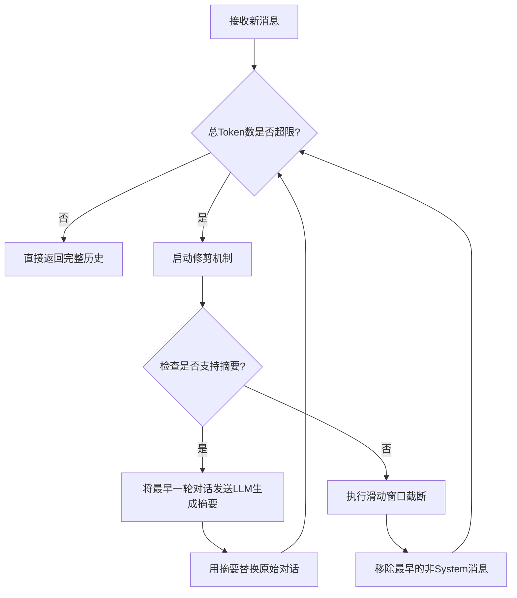
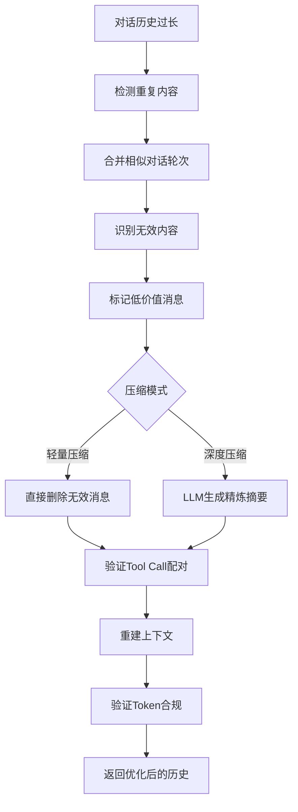
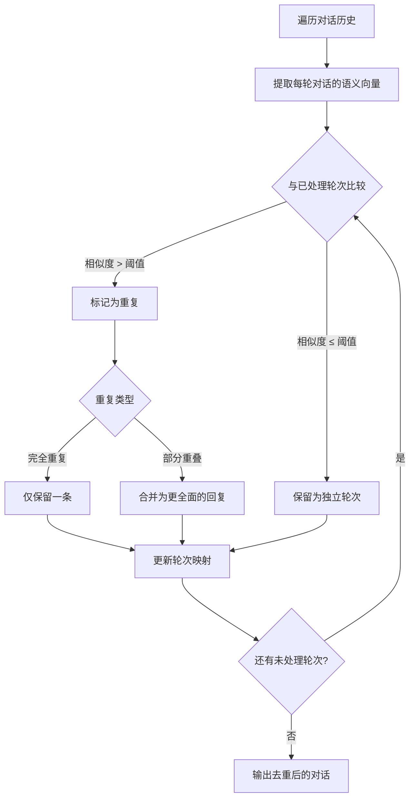
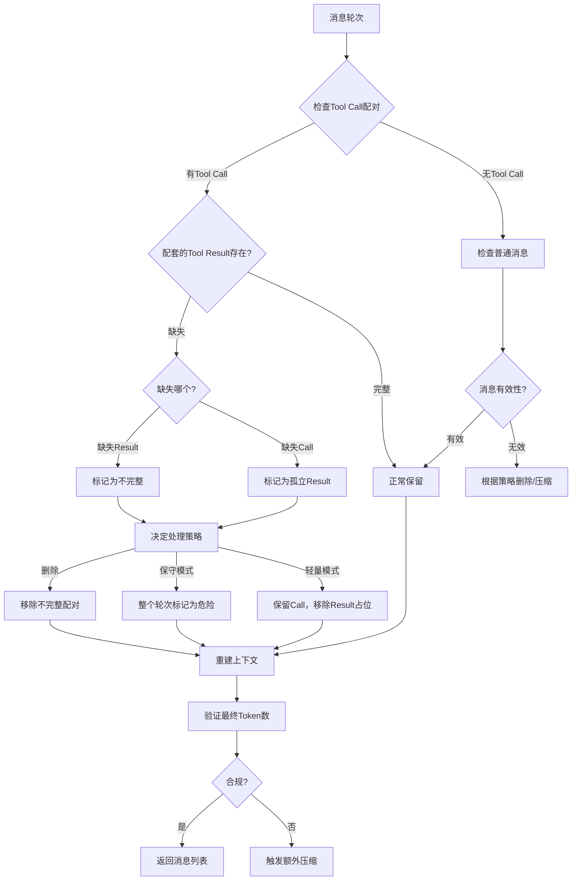
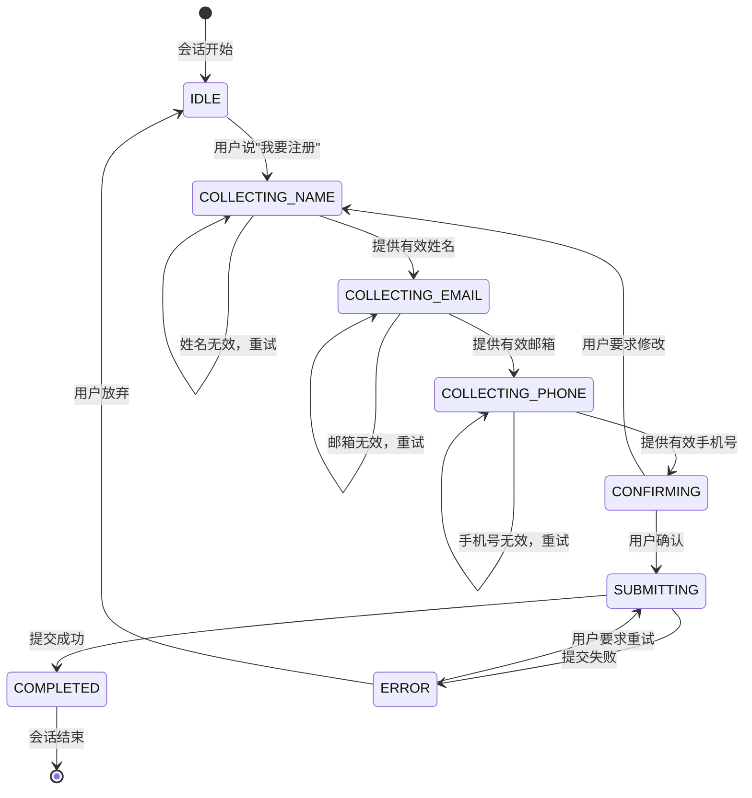

# 第六章：短期记忆——Session Memory

本章讲解Agent的"金鱼记忆"问题及解决方案，涵盖Session Memory的数据结构设计（基于角色的消息结构、Tool Call配对完整性）、上下文窗口管理策略（滑动窗口、令牌截断、摘要压缩、混合策略），以及Redis等分布式存储方案的实现。

## 6.1 引言：LLM 的"金鱼记忆"

如果你问一个人"我叫什么名字？"，他能回答是因为他记得刚才的对话。但如果你问一个大语言模型（LLM）同样的问题，在不做任何处理的情况下，它会一脸茫然。

**LLM 本质上是"无状态"的。** 对于模型而言，每一次 API 调用都是一次全新的开始，它没有内置的"大脑海马体"来留存上一秒的信息。

Agent 要具备智能，首先必须具备"记忆力"。本章我们将探讨最基础、最核心的记忆形式——**短期记忆**，即 **Session Memory**。

可以把 Session Memory 理解为 Agent 的**"工作台"**或计算机的**内存（RAM）**：

*   **生命周期**：仅在单次会话期间有效。一旦你关闭窗口或会话超时，这部分记忆就会清空。

*   **核心作用**：维持多轮对话的连贯性，解决"前言不搭后语"的问题。

## 6.2 核心设计：数据结构与隔离

在动手写代码之前，我们需要先理清数据的设计逻辑。

### 6.2.1 消息结构的设计
Session Memory 的本质是对话历史的有序列表。主流 LLM API（如 OpenAI）都遵循一种基于角色的消息结构。

一个标准的消息对象通常包含以下字段：

*   **role (角色)**：谁说的？

    *   `system`：系统指令（人设、任务目标），优先级最高。

    *   `user`：用户的输入。

    *   `assistant`：Agent 的回复。

    *   `tool`：工具调用的返回结果（这是 Agent 开发中的关键点，常被初学者忽略）。

*   **content (内容)**：具体说了什么？

*   **tool_calls / tool_call_id**：如果 Agent 调用了工具，这里需要记录调用请求和对应的返回ID，以便模型关联"问题"与"答案"。

**设计示例：包含工具调用的消息链**

```json
[
  {"role": "system", "content": "你是一个天气助手..."},
  {"role": "user", "content": "北京今天天气怎么样？"},
  {"role": "assistant", "content": null, "tool_calls": [{"id": "call_123", "name": "get_weather", "args": "Beijing"}]},
  {"role": "tool", "tool_call_id": "call_123", "content": "{'temp': 25, 'condition': 'sunny'}"},
  {"role": "assistant", "content": "北京今天天气晴朗，气温25度。"}
]

```

> **⚠️ 注意**：在 Agent 开发中，`tool` 角色的消息至关重要。如果丢失了这部分记录，Agent 就会忘记自己刚才做了什么（比如查了天气），导致用户追问"那上海呢？"时，Agent 无法复用之前的逻辑。

### 6.2.2 会话隔离设计
在生产环境中，服务是并发的。A 用户的对话绝不能出现在 B 用户的上下文中。我们需要引入 **Session ID** 进行隔离。

*   **Session ID 生成策略**：

    *   前端生成唯一 UUID（适合 Web 应用）。

    *   后端基于用户 ID + 时间戳生成。

*   **存储映射关系**：
    `Key: Session ID` -> `Value: List[Message Objects]`

---

## 6.3 核心难点：上下文窗口管理

为什么 Session Memory 的难点不在于"存"，而在于"管"？

因为 LLM 有一个物理限制——**上下文窗口**。虽然现在的模型窗口越来越大（如 128k token），但：

1.  **成本高昂**：每轮对话都带上万字的历史记录，Token 消耗呈指数级增长。

2.  **干扰注意力**：过多的历史噪音可能导致模型"注意力涣散"，答非所问。

我们需要在"记住关键信息"和"控制 Token 成本"之间找到平衡。这就需要引入**修剪策略**。

### 6.3.1 策略概览与对比
| 策略名称 | 原理 | 优点 | 缺点 | 适用场景 |
| :--- | :--- | :--- | :--- | :--- |
| **滑动窗口** | 只保留最近 N 轮对话 | 简单、成本低 | 会直接丢失早期指令，导致 Agent 变笨 | 简单问答机器人 |
| **令牌截断** | 按 Token 数量硬性截断 | 精确控制成本 | 容易截断句子中间，破坏语义 | 成本敏感型应用 |
| **摘要压缩** | 用 LLM 总结旧对话 | 保留语义，压缩率高 | 增加额外 LLM 调用延迟 | 长周期复杂任务 |
| **混合策略** | 结合上述多种手段 | 综合最优 | 实现逻辑复杂 | **生产级 Agent 推荐** |

### 6.3.2 深入解析：混合策略的最佳实践
单一策略往往顾此失彼。一个健壮的 Agent 通常采用"**三段式**"混合策略：

1.  **头部**：始终保留 `System Message`。这是 Agent 的"宪法"，不能丢。

2.  **中部**：将较早的对话压缩为摘要。保留"剧情大纲"，丢弃"具体台词"。

3.  **尾部**：保留最近的 3-5 轮原始对话。确保当前交互的细节（如刚才提到的具体数字、人名）不丢失。

**流程图：上下文管理决策流程**



### 6.3.3 代码实现：摘要压缩策略

摘要压缩是混合策略中最核心的一环。它的思路是：当上下文超限时，调用一个轻量级 LLM（如 `gpt-3.5-turbo`），将较早的对话压缩成一段精炼的摘要，替换掉原始对话，从而释放 Token 空间。

```python
import tiktoken
from typing import List, Dict, Optional
import json

class SummarizationStrategy:
    """摘要压缩策略：用 LLM 将旧对话压缩为摘要"""
    
    def __init__(
        self,
        llm_client,  # LLM 客户端，需支持 .chat_completion() 方法
        max_summary_tokens: int = 500,
        keep_recent_rounds: int = 3,
    ):
        self.llm_client = llm_client
        self.max_summary_tokens = max_summary_tokens
        self.keep_recent_rounds = keep_recent_rounds
    
    async def should_summarize(self, messages: List[Dict], max_tokens: int) -> bool:
        """判断当前上下文是否需要进行摘要压缩"""
        total_tokens = self._count_tokens(messages)
        # 当 Token 使用量超过上限的 80% 时触发压缩
        return total_tokens > max_tokens * 0.8
    
    async def compress(self, messages: List[Dict]) -> List[Dict]:
        """
        执行摘要压缩
        将较早的对话替换为摘要，保留最近几轮原始对话
        """
        if len(messages) <= self.keep_recent_rounds * 2 + 1:
            return messages  # 消息太少，不需要压缩
        
        # 1. 分离 System 消息、待压缩消息和保留消息
        system_msg = messages[0] if messages[0]["role"] == "system" else None
        
        start_idx = 1 if system_msg else 0
        end_idx = len(messages) - self.keep_recent_rounds * 2
        
        if end_idx <= start_idx:
            return messages  # 没有足够的老消息可压缩
        
        old_messages = messages[start_idx:end_idx]
        recent_messages = messages[end_idx:]
        
        # 2. 将旧对话格式化为可读文本
        conversation_text = self._messages_to_text(old_messages)
        
        # 3. 调用 LLM 生成摘要
        summary = await self._generate_summary(conversation_text)
        
        # 4. 重组消息列表
        result = []
        if system_msg:
            result.append(system_msg)
        
        # 将摘要作为一条 system 消息插入（模型会将它视为历史背景）
        result.append({
            "role": "system",
            "content": f"[对话历史摘要]\n{summary}",
        })
        result.extend(recent_messages)
        
        return result
    
    def _messages_to_text(self, messages: List[Dict]) -> str:
        """将消息列表转换为可读的对话文本"""
        lines = []
        for msg in messages:
            role = msg.get("role", "unknown")
            content = msg.get("content", "")
            if content:
                lines.append(f"{role}: {content}")
        return "\n".join(lines)
    
    async def _generate_summary(self, conversation_text: str) -> str:
        """调用 LLM 生成对话摘要"""
        prompt = f"""请对以下对话进行精炼摘要，要求：

1. 保留关键信息（人名、数字、决策结论）

2. 丢弃寒暄和重复内容

3. 控制在 {self.max_summary_tokens} 个 Token 以内

4. 使用第三人称叙述

对话内容：
{conversation_text}

摘要："""
        
        response = await self.llm_client.chat_completion(
            messages=[{"role": "user", "content": prompt}],
            model="gpt-3.5-turbo",  # 使用轻量级模型节约成本
            max_tokens=self.max_summary_tokens,
        )
        return response.content
    
    def _count_tokens(self, messages: List[Dict]) -> int:
        """估算消息列表的 Token 数"""
        try:
            encoding = tiktoken.get_encoding("cl100k_base")
        except Exception:
            # 降级：使用字符数粗略估算 (中文约 1.5 字符/token)
            return sum(len(json.dumps(m)) for m in messages) // 2
        
        total = 0
        for msg in messages:
            total += 4  # 格式开销
            for key, value in msg.items():
                if value:
                    text = json.dumps(value) if not isinstance(value, str) else value
                    total += len(encoding.encode(text))
        return total + 2

```

> **成本提示**：摘要压缩本身也需要消耗 Token。建议使用 `gpt-3.5-turbo` 等低成本模型完成压缩，而不是用 `gpt-4`。一次摘要通常消耗 200-500 Token，但可以释放数千 Token 的上下文空间，整体是划算的。

### 6.3.4 代码实现：完整的混合策略管理器

将滑动窗口、Token 截断和摘要压缩组合为一个完整的混合策略：

```python
class HybridContextManager:
    """
    混合策略上下文管理器
    三段式架构：System Message + 摘要 + 最近对话
    """
    
    def __init__(
        self,
        session_id: str,
        max_tokens: int = 8000,
        summary_threshold: float = 0.7,   # 70% 时触发摘要
        truncate_threshold: float = 0.95,  # 95% 时触发硬截断
        keep_recent_rounds: int = 5,
    ):
        self.session_id = session_id
        self.max_tokens = max_tokens
        self.summary_threshold = summary_threshold
        self.truncate_threshold = truncate_threshold
        self.keep_recent_rounds = keep_recent_rounds
        
        self.messages: List[Dict] = []
        self._summary: Optional[str] = None
        self._has_uncompressed_dialogue = True
    
    def add_message(self, role: str, content: str, **kwargs):
        """添加新消息"""
        self.messages.append({"role": role, "content": content, **kwargs})
        self._has_uncompressed_dialogue = True
    
    def get_context(self) -> List[Dict]:
        """
        获取当前上下文（自动应用混合策略）
        返回格式：[System Message, Summary (如有), ...Recent Messages]
        """
        ctx = []
        
        # 第一段：System Message（始终保留）
        system_msgs = [m for m in self.messages if m["role"] == "system"]
        ctx.extend(system_msgs)
        
        # 第二段：摘要（如果有的话）
        if self._summary:
            ctx.append({
                "role": "system",
                "content": f"[之前的对话摘要]\n{self._summary}"
            })
        
        # 第三段：最近的对话
        non_system = [m for m in self.messages if m["role"] != "system"]
        recent = non_system[-self.keep_recent_rounds * 2:]
        ctx.extend(recent)
        
        return ctx
    
    def get_token_usage(self) -> Dict:
        """获取当前 Token 使用情况"""
        total = self._count_tokens(self.messages)
        return {
            "used_tokens": total,
            "max_tokens": self.max_tokens,
            "usage_ratio": round(total / self.max_tokens, 2),
            "message_count": len(self.messages),
            "has_summary": self._summary is not None,
        }
    
    def _count_tokens(self, messages: List[Dict]) -> int:
        """Token 计数（简化版，实际项目建议使用 tiktoken）"""
        try:
            encoding = tiktoken.get_encoding("cl100k_base")
            return sum(
                4 + len(encoding.encode(json.dumps(m, ensure_ascii=False)))
                for m in messages
            ) + 2
        except Exception:
            return sum(len(json.dumps(m, ensure_ascii=False)) for m in messages) // 2

```

---

### 6.3.5 对话历史重整：删减、压缩与优化

当对话历史积累过长时，简单的时间窗口或 Token 截断容易丢失关键信息。本节介绍更精细化的**对话历史重整**策略，包括重复检测、无效内容删减和智能选择性压缩。

#### 设计理念

| 策略 | 作用 | 适用场景 |
|:---|:---|:---|
| **重复内容检测** | 基于语义相似度识别并合并相似对话 | 同一问题反复讨论 |
| **无效内容删减** | 过滤寒暄、确认回复等低信息量消息 | 对话中有大量客套 |
| **选择性压缩** | 非线性压缩，优先保留决策和结论 | 长周期复杂任务 |

#### 整体重整流程



#### 重复内容检测流程



#### 代码实现：对话历史重整器

```python
import hashlib
import json
import asyncio
from typing import List, Dict, Optional, Tuple
from dataclasses import dataclass, field

@dataclass
class MessageRound:
    """对话轮次"""
    user_msg: Dict
    assistant_msg: Optional[Dict] = None
    tool_calls: List[Dict] = field(default_factory=list)
    tool_results: List[Dict] = field(default_factory=list)
    
    def to_dict(self) -> Dict:
        result = {"user": self.user_msg}
        if self.assistant_msg:
            result["assistant"] = self.assistant_msg
        if self.tool_calls:
            result["tool_calls"] = self.tool_calls
        if self.tool_results:
            result["tool_results"] = self.tool_results
        return result
    
    def get_text_content(self) -> str:
        """提取文本内容用于相似度计算"""
        parts = []
        if self.user_msg.get("content"):
            parts.append(str(self.user_msg["content"]))
        if self.assistant_msg.get("content"):
            parts.append(str(self.assistant_msg["content"]))
        return " ".join(parts)

class ConversationPruner:
    """
    对话历史重整器
    提供重复检测、无效内容删减和智能压缩
    """
    
    INVALID_PATTERNS = [
        r"^好的?[，,]?收到[。]$",
        r"^嗯[，,]?明白[。]$",
        r"^好的[，,]?我来[帮做].*[。]$",
        r"^是的[，,]?.*$",
        r"^当然[，,]?.*$",
        r"^没问题[。]$",
        r"^谢谢[，/]?.*",
        r"^[Hh]i[, ]?[Hh]ello",
        r"^[Nn]ice to.*",
    ]
    
    def __init__(
        self,
        similarity_threshold: float = 0.85,
        min_info_threshold: int = 10,
        max_rounds_before_prune: int = 50,
    ):
        self.similarity_threshold = similarity_threshold
        self.min_info_threshold = min_info_threshold
        self.max_rounds_before_prune = max_rounds_before_prune
        self._content_hashes: Dict[str, int] = {}
    
    def restructure(
        self,
        messages: List[Dict],
        mode: str = "auto",
    ) -> List[Dict]:
        """重整对话历史"""
        rounds = self._parse_rounds(messages)
        rounds = self._deduplicate(rounds)
        rounds = self._filter_invalid(rounds)
        
        if mode == "auto":
            mode = self._decide_mode(len(rounds))
        
        if mode == "light":
            rounds = self._light_compress(rounds)
        elif mode == "deep":
            rounds = self._deep_compress(rounds)
        
        return self._rebuild_messages(rounds)
    
    def _parse_rounds(self, messages: List[Dict]) -> List[MessageRound]:
        """将消息列表解析为轮次"""
        rounds = []
        current_round = None
        
        for msg in messages:
            role = msg.get("role", "")
            content = msg.get("content", "")
            
            if role == "system":
                continue
            
            if role == "user":
                if current_round:
                    rounds.append(current_round)
                current_round = MessageRound(user_msg=msg)
            
            elif role == "assistant":
                if current_round:
                    current_round.assistant_msg = msg
                    if tool_calls := msg.get("tool_calls"):
                        current_round.tool_calls.extend(tool_calls)
            
            elif role == "tool":
                if current_round:
                    current_round.tool_results.append(msg)
        
        if current_round:
            rounds.append(current_round)
        
        return rounds
    
    def _deduplicate(self, rounds: List[MessageRound]) -> List[MessageRound]:
        """检测并合并重复轮次"""
        if len(rounds) <= 1:
            return rounds
        
        result = [rounds[0]]
        
        for current in rounds[1:]:
            is_duplicate = False
            
            for j, existing in enumerate(result):
                similarity = self._calculate_similarity(
                    current.get_text_content(),
                    existing.get_text_content()
                )
                
                if similarity >= self.similarity_threshold:
                    if self._is_better_response(current, existing):
                        result[j] = current
                    is_duplicate = True
                    break
            
            if not is_duplicate:
                result.append(current)
        
        return result
    
    def _calculate_similarity(self, text1: str, text2: str) -> float:
        """计算文本相似度（n-gram Jaccard）"""
        if not text1 or not text2:
            return 0.0
        
        def get_ngrams(text: str, n: int = 3) -> set:
            text = text.lower()
            return set(text[i:i+n] for i in range(len(text) - n + 1))
        
        ngrams1 = get_ngrams(text1)
        ngrams2 = get_ngrams(text2)
        
        if not ngrams1 or not ngrams2:
            return 0.0
        
        intersection = len(ngrams1 & ngrams2)
        union = len(ngrams1 | ngrams2)
        
        return intersection / union if union > 0 else 0.0
    
    def _is_better_response(
        self,
        new_round: MessageRound,
        old_round: MessageRound,
    ) -> bool:
        """判断新回复是否优于旧回复"""
        return len(new_round.get_text_content()) > len(old_round.get_text_content())
    
    def _filter_invalid(self, rounds: List[MessageRound]) -> List[MessageRound]:
        """过滤无效内容"""
        import re
        
        result = []
        
        for round in rounds:
            text = round.get_text_content()
            
            is_invalid = False
            for pattern in self.INVALID_PATTERNS:
                if re.match(pattern, text.strip()):
                    if any(char.isdigit() for char in text) or len(text) > 30:
                        break
                    is_invalid = True
                    break
            
            info_score = self._calculate_info_score(text)
            if info_score < self.min_info_threshold:
                if round.user_msg.get("content") and \
                   len(round.user_msg["content"]) > 50:
                    round.assistant_msg = {"role": "assistant", "content": "[已处理]"}
                    result.append(round)
                continue
            
            if not is_invalid:
                result.append(round)
        
        return result
    
    def _calculate_info_score(self, text: str) -> int:
        """计算信息量评分"""
        score = 0
        score += len(text) // 10
        score += sum(1 for c in text if c.isdigit()) * 2
        words = text.split()
        score += len([w for w in words if len(w) > 4]) * 2
        score += sum(1 for c in text if c in "，。！？；：""''")
        return score
    
    def _decide_mode(self, round_count: int) -> str:
        """自动决定压缩模式"""
        if round_count > self.max_rounds_before_prune * 1.5:
            return "deep"
        elif round_count > self.max_rounds_before_prune:
            return "light"
        return "none"
    
    def _light_compress(self, rounds: List[MessageRound]) -> List[MessageRound]:
        """轻量压缩：保留头部和尾部的关键轮次"""
        if len(rounds) <= 20:
            return rounds
        
        keep_count = 8
        preserved = rounds[:3] + rounds[-5:]
        middle = rounds[3:-5] if len(rounds) > 8 else []
        
        if middle:
            middle.sort(
                key=lambda r: self._calculate_info_score(r.get_text_content()),
                reverse=True
            )
            preserved.extend(middle[:keep_count - 3])
            preserved.sort(key=lambda r: rounds.index(r))
        
        return preserved
    
    def _deep_compress(self, rounds: List[MessageRound]) -> List[MessageRound]:
        """深度压缩：使用 LLM 生成摘要"""
        if len(rounds) <= 10:
            return rounds
        
        recent = rounds[-3:]
        to_summarize = rounds[:-3]
        
        if not to_summarize:
            return rounds
        
        summary_text = f"[摘要：共 {len(to_summarize)} 轮对话，涵盖{len(to_summarize)}个主题的讨论。]"
        
        summary_round = MessageRound(
            user_msg={"role": "user", "content": "[历史对话摘要请求]"},
            assistant_msg={"role": "assistant", "content": summary_text}
        )
        
        return [summary_round] + recent
    
    def _rebuild_messages(self, rounds: List[MessageRound]) -> List[Dict]:
        """从轮次重建消息列表"""
        messages = []
        
        for round in rounds:
            messages.append(round.user_msg)
            if round.assistant_msg:
                messages.append(round.assistant_msg)
            messages.extend(round.tool_calls)
            messages.extend(round.tool_results)
        
        return messages
    
    async def restructure_with_llm_summary(
        self,
        messages: List[Dict],
        llm_client,
        model: str = "gpt-3.5-turbo",
    ) -> List[Dict]:
        """使用 LLM 进行深度对话压缩"""
        rounds = self._parse_rounds(messages)
        
        if len(rounds) <= 10:
            return messages
        
        recent = rounds[-3:]
        to_summarize = rounds[:-3]
        
        dialog_text = "\n".join([
            f"轮次{i+1}:\n用户: {r.user_msg.get('content', '')}\n"
            f"助手: {r.assistant_msg.get('content', '') if r.assistant_msg else ''}"
            for i, r in enumerate(to_summarize)
        ])
        
        prompt = f"""请对以下对话进行精炼摘要：

1. 保留关键信息（人名、数字、决策结论、待办事项）

2. 丢弃寒暄和重复内容

3. 控制在 400 字以内

4. 使用结构化格式：[背景] + [主要讨论] + [结论/决定] + [待办]

对话内容：
{dialog_text}

请输出摘要："""
        
        try:
            response = await llm_client.chat_completion(
                messages=[{"role": "user", "content": prompt}],
                model=model,
                max_tokens=500,
            )
            summary = response.content if hasattr(response, 'content') else str(response)
        except Exception:
            summary = f"[摘要生成失败，共 {len(to_summarize)} 轮对话]"
        
        summary_round = MessageRound(
            user_msg={"role": "system", "content": "[早期对话历史摘要]"},
            assistant_msg={"role": "assistant", "content": summary}
        )
        
        return self._rebuild_messages([summary_round] + recent)

```

#### 工具配对保护逻辑



#### 使用示例

```python
async def demo_pruner():
    """对话历史重整演示"""
    
    sample_messages = [
        {"role": "system", "content": "你是助手中的专家。"},
        {"role": "user", "content": "你好，我想了解Python异步编程。"},
        {"role": "assistant", "content": "好的，让我为你介绍Python异步编程。"},
        {"role": "user", "content": "好的。"},
        {"role": "assistant", "content": "收到，继续介绍。"},
        {"role": "user", "content": "请详细讲讲async/await语法。"},
        {"role": "assistant", "content": "async def用于定义异步函数，await用于等待协程完成。"},
        {"role": "user", "content": "明白。"},
        {"role": "assistant", "content": "好的，继续。"},
        {"role": "user", "content": "asyncio有哪些常用场景？"},
        {"role": "assistant", "content": "asyncio适合IO密集型任务，如网络请求、文件操作等。"},
        {"role": "user", "content": "能否给我一个完整示例？"},
        {"role": "assistant", "content": "这是一个完整的asyncio示例代码..."},
    ]
    
    pruner = ConversationPruner(
        similarity_threshold=0.8,
        min_info_threshold=15,
        max_rounds_before_prune=5,
    )
    
    light_result = pruner.restructure(sample_messages, mode="light")
    print(f"轻量压缩后: {len(light_result)} 条消息")
    
    auto_result = pruner.restructure(sample_messages, mode="auto")
    print(f"自动压缩后: {len(auto_result)} 条消息")
    
    rounds = pruner._parse_rounds(sample_messages)
    dedup_rounds = pruner._deduplicate(rounds)
    print(f"去重前: {len(rounds)} 轮, 去重后: {len(dedup_rounds)} 轮")

```

> **关键提示**：对于超长对话（>100轮），建议先用本节的重整策略，再用 6.3.3 的摘要压缩，可获得最佳效果。

---

## 6.4 Agent 会话状态机设计

### 为什么需要状态机

当用户与 Agent 进行多轮交互时，对话往往不是一个简单的"问-答"循环，而是包含**阶段性目标**的复杂流程。例如：

*   **订餐场景**：选择餐厅 → 选择菜品 → 确认订单 → 支付 → 完成

*   **故障排查**：收集信息 → 诊断 → 提供方案 → 验证 → 结束

*   **表单填写**：询问字段 A → 询问字段 B → 确认 → 提交

**没有状态机**，Agent 会在每轮对话中"失忆"，反复询问已确认的信息，或者在不合适的时机执行操作。

### 状态机的核心概念

**状态（State）**：对话当前所处的阶段，如 `COLLECTING_INFO`、`CONFIRMING`、`EXECUTING`。

**事件（Event）**：触发状态转换的用户输入或系统动作，如 `user_provided_info`、`user_confirmed`、`execution_success`。

**转换（Transition）**：从状态 A 到状态 B 的规则。

**动作（Action）**：状态转换时执行的副作用，如发送确认消息、调用 API。

### 典型状态机设计示例

**场景：智能表单收集**



### 代码实现

```python
from enum import Enum, auto
from dataclasses import dataclass, field
from typing import Dict, List, Callable, Optional

class ConversationState(Enum):
    """对话状态枚举"""
    IDLE = auto()              # 空闲，等待用户指令
    COLLECTING_INFO = auto()   # 收集信息中
    CONFIRMING = auto()        # 等待用户确认
    EXECUTING = auto()         # 执行操作中
    COMPLETED = auto()         # 任务完成
    ERROR = auto()             # 出错状态

@dataclass
class StateContext:
    """状态上下文：存储跨状态的对话数据"""
    session_id: str
    current_state: ConversationState = ConversationState.IDLE
    collected_data: Dict = field(default_factory=dict)
    history: List[Dict] = field(default_factory=list)
    retry_count: int = 0
    max_retries: int = 3

class ConversationStateMachine:
    """
    对话状态机
    管理多轮对话中的状态流转
    """
    
    def __init__(self):
        self._transitions: Dict[tuple, ConversationState] = {}
        self._actions: Dict[tuple, Callable] = {}
        self._validators: Dict[str, Callable] = {}
    
    def add_transition(
        self,
        from_state: ConversationState,
        event: str,
        to_state: ConversationState,
        action: Optional[Callable] = None
    ):
        """添加状态转换规则"""
        self._transitions[(from_state, event)] = to_state
        if action:
            self._actions[(from_state, event)] = action
    
    def add_validator(self, field: str, validator: Callable):
        """添加字段验证器"""
        self._validators[field] = validator
    
    def handle_event(
        self,
        ctx: StateContext,
        event: str,
        data: Optional[Dict] = None
    ) -> tuple[ConversationState, str]:
        """
        处理事件，执行状态转换
        返回: (新状态, 回复消息)
        """
        key = (ctx.current_state, event)
        
        if key not in self._transitions:
            # 未定义的转换，保持当前状态
            return ctx.current_state, self._get_default_response(ctx, event)
        
        # 执行转换前的验证
        if data and not self._validate_data(data):
            ctx.retry_count += 1
            if ctx.retry_count >= ctx.max_retries:
                ctx.current_state = ConversationState.ERROR
                return ctx.current_state, "输入错误次数过多，请重新开始。"
            return ctx.current_state, "输入格式不正确，请重试。"
        
        # 执行状态转换
        new_state = self._transitions[key]
        ctx.current_state = new_state
        ctx.retry_count = 0  # 重置重试计数
        
        # 更新上下文数据
        if data:
            ctx.collected_data.update(data)
        
        # 执行转换动作
        action = self._actions.get(key)
        if action:
            message = action(ctx, data)
        else:
            message = self._get_state_message(new_state, ctx)
        
        return new_state, message
    
    def _validate_data(self, data: Dict) -> bool:
        """验证数据"""
        for field, value in data.items():
            if field in self._validators:
                if not self._validators[field](value):
                    return False
        return True
    
    def _get_state_message(self, state: ConversationState, ctx: StateContext) -> str:
        """根据状态生成回复消息"""
        messages = {
            ConversationState.IDLE: "您好！有什么可以帮您？",
            ConversationState.COLLECTING_INFO: f"请提供相关信息。已收集: {list(ctx.collected_data.keys())}",
            ConversationState.CONFIRMING: f"请确认以下信息: {ctx.collected_data}",
            ConversationState.EXECUTING: "正在处理，请稍候...",
            ConversationState.COMPLETED: "任务已完成！",
            ConversationState.ERROR: "处理过程中出现错误。",
        }
        return messages.get(state, "请继续。")
    
    def _get_default_response(self, ctx: StateContext, event: str) -> str:
        """未定义转换时的默认回复"""
        return f"当前状态下无法处理 '{event}'，请按指引操作。"

# 使用示例：构建一个订餐助手
class OrderAssistant:
    def __init__(self):
        self.sm = ConversationStateMachine()
        self._setup_transitions()
    
    def _setup_transitions(self):
        # 定义状态转换
        self.sm.add_transition(
            ConversationState.IDLE, "start_order",
            ConversationState.COLLECTING_INFO,
            action=lambda ctx, data: "好的，请问您想订哪家餐厅？"
        )
        
        self.sm.add_transition(
            ConversationState.COLLECTING_INFO, "provide_restaurant",
            ConversationState.COLLECTING_INFO,
            action=lambda ctx, data: f"已选择 {data.get('restaurant')}。请问想点什么菜？"
        )
        
        self.sm.add_transition(
            ConversationState.COLLECTING_INFO, "provide_dishes",
            ConversationState.CONFIRMING,
            action=lambda ctx, data: f"订单内容：{data.get('dishes')}。确认下单吗？"
        )
        
        self.sm.add_transition(
            ConversationState.CONFIRMING, "confirm",
            ConversationState.EXECUTING,
            action=self._execute_order
        )
        
        self.sm.add_transition(
            ConversationState.CONFIRMING, "modify",
            ConversationState.COLLECTING_INFO,
            action=lambda ctx, data: "好的，请重新选择。"
        )
        
        self.sm.add_transition(
            ConversationState.EXECUTING, "success",
            ConversationState.COMPLETED,
            action=lambda ctx, data: "订单已提交！预计30分钟送达。"
        )
        
        # 添加验证器
        self.sm.add_validator("restaurant", lambda x: len(x) > 0)
        self.sm.add_validator("dishes", lambda x: len(x) > 0)
    
    def _execute_order(self, ctx: StateContext, data: Dict) -> str:
        """执行下单操作"""
        # 这里调用实际的下单 API
        print(f"[执行下单] 数据: {ctx.collected_data}")
        return "正在提交订单..."
    
    async def chat(self, ctx: StateContext, user_input: str) -> str:
        """处理用户输入"""
        # 简化示例：实际应根据 NLP 解析用户意图
        event = self._parse_intent(ctx.current_state, user_input)
        
        new_state, response = self.sm.handle_event(ctx, event, {"input": user_input})
        ctx.history.append({"role": "user", "content": user_input})
        ctx.history.append({"role": "assistant", "content": response})
        
        return response
    
    def _parse_intent(self, current_state: ConversationState, user_input: str) -> str:
        """解析用户意图（简化版，实际可用 LLM 或规则引擎）"""
        input_lower = user_input.lower()
        
        if "订" in input_lower or "order" in input_lower:
            return "start_order"
        elif "确认" in input_lower or "yes" in input_lower:
            return "confirm"
        elif "修改" in input_lower or "change" in input_lower:
            return "modify"
        elif current_state == ConversationState.COLLECTING_INFO:
            if "餐厅" in input_lower or "restaurant" in input_lower:
                return "provide_restaurant"
            else:
                return "provide_dishes"
        
        return "unknown"

# 使用示例
async def demo():
    assistant = OrderAssistant()
    ctx = StateContext(session_id="demo_001")
    
    # 模拟对话流程
    print(await assistant.chat(ctx, "我想订餐"))           # → 好的，请问您想订哪家餐厅？

    print(await assistant.chat(ctx, "麦当劳"))             # → 已选择麦当劳。请问想点什么菜？

    print(await assistant.chat(ctx, "巨无霸套餐"))         # → 订单内容：巨无霸套餐。确认下单吗？

    print(await assistant.chat(ctx, "确认"))               # → 正在提交订单...

```

### 状态机 vs 纯 LLM 决策

| 维度 | 状态机驱动 | 纯 LLM 决策 |
|------|-----------|------------|
| 可控性 | 高，流程严格按定义执行 | 低，依赖模型理解 |
| 灵活性 | 中，需要预先定义状态 | 高，可处理开放式对话 |
| 错误恢复 | 明确，每个状态有兜底 | 不确定，可能陷入循环 |
| 实现复杂度 | 需要设计状态和转换 | 简单，直接调用 LLM |
| 适用场景 | 有明确流程的任务 | 开放式问答、创意生成 |

> 💡 **建议**：生产级 Agent 通常采用**混合模式**——用状态机控制核心流程节点，在状态内部用 LLM 处理自然语言理解和生成。

---

## 6.5 实战：构建健壮的 Session Manager

本节我们将动手实现一个具备 **Token 计数**、**滑动窗口** 和 **强制保留 System 指令** 功能的 Session Manager。

### 6.4.1 设计思路

我们将设计一个 `SessionManager` 类，它需要具备以下能力：

1.  **Token 计数**：使用 `tiktoken` 库精确计算 Token，而不是简单的字符数估算。

2.  **自动修剪**：当添加新消息导致超限时，自动从旧对话开始清理。

3.  **结构保护**：确保清理时不破坏 `Tool Call` 的配对关系（如：不要只删了工具返回，却留下了工具调用请求，这会导致报错）。

### 6.4.2 代码实现

**前置依赖安装**：

```bash
pip install tiktoken

```

**Python 实现代码**：

```python
import tiktoken
import json
from typing import List, Dict, Optional

class SessionManager:
    def __init__(self, session_id: str, model_name: str = "gpt-4", max_tokens: int = 4000):
        self.session_id = session_id
        self.model_name = model_name
        self.max_tokens = max_tokens  # 上下文窗口上限
        self.messages: List[Dict] = []
        
        # 初始化 Token 计算器
        # 如果模型不支持，默认使用 cl100k_base (GPT-4/3.5 通用)
        try:
            self.encoding = tiktoken.encoding_for_model(model_name)
        except KeyError:
            self.encoding = tiktoken.get_encoding("cl100k_base")

    def count_tokens(self, messages: List[Dict]) -> int:
        """精确计算消息列表的 Token 数"""
        num_tokens = 0
        for message in messages:
            # 每条消息都有固定的格式开销 (role, separators etc.)
            # 参考 OpenAI 官方计算逻辑简化版
            num_tokens += 4  # <im_start>{role/name}\n{content}<im_end>\n
            
            for key, value in message.items():
                if value:
                    # 处理 content
                    if isinstance(value, str):
                        num_tokens += len(self.encoding.encode(value))
                    # 处理 tool_calls (需要序列化后计算)
                    elif isinstance(value, (list, dict)):
                        num_tokens += len(self.encoding.encode(json.dumps(value)))
                    
                    if key == "name":  # 如果有 name 字段，会有额外开销
                        num_tokens -= 1  # name 和 role 互斥，修正计算
        num_tokens += 2  # 对话开始的 <im_start>assistant
        return num_tokens

    def add_message(self, role: str, content: str, **kwargs):
        """添加消息并触发自动修剪"""
        new_msg = {"role": role, "content": content, **kwargs}
        self.messages.append(new_msg)
        
        # 每次添加后检查窗口
        self._prune_history()

    def _prune_history(self):
        """
        修剪策略：保护 System，移除最早的非 System 消息
        注意：为了简化逻辑，此处按"轮"移除 (User + Assistant)
        """
        while self.count_tokens(self.messages) > self.max_tokens:
            # 1. 找到第一个可以删除的消息索引
            # System 消息通常在索引 0，不能删
            if len(self.messages) <= 1:
                print("Warning: Context window exceeded even with only System Message!")
                break
            
            # 2. 移除第一条非 System 消息
            # 这里的逻辑是简单的 FIFO (先进先出)
            # 实际生产中需要更复杂的逻辑来保护 tool_calls 配对
            removed = self.messages.pop(1) 
            print(f"[Session Memory] Token 超限，自动移除旧消息: {removed.get('role')}...")

    def get_context(self) -> List[Dict]:
        """获取当前可用的上下文"""
        return self.messages

# --- 测试示例 ---
if __name__ == "__main__":
    # 初始化一个极小窗口 (100 tokens) 用于测试
    manager = SessionManager(session_id="test_001", max_tokens=100)
    
    # 1. 添加 System 指令
    manager.add_message("system", "你是一个有帮助的AI助手。")
    
    # 2. 模拟多轮对话
    for i in range(10):
        manager.add_message("user", f"这是第 {i} 轮用户的输入，内容稍微长一点以消耗Token。")
        manager.add_message("assistant", f"这是第 {i} 轮AI的回复。")
        
        # 打印当前 Token 状态
        print(f"当前轮次: {i}, Token数: {manager.count_tokens(manager.messages)}, 历史条数: {len(manager.messages)}")

```

### 6.4.3 进阶挑战：Tool Call 的"配对陷阱"

在上述代码中，我们使用了简单的 `pop(1)` 策略。但在 Agent 场景下，这存在隐患。

**问题场景**：

历史记录为 `[System, User, Assistant(tool_call), Tool(result)]`。

如果简单移除 `User`，剩下 `[System, Assistant(tool_call), Tool(result)]`。模型还能理解上下文吗？勉强可以。

但如果移除了 `Tool(result)`，剩下 `[System, User, Assistant(tool_call)]`。此时模型会认为工具还没返回结果，可能会**重复发起工具调用**，陷入死循环。

**解决方案**：

在修剪逻辑中，增加**原子性检查**。如果移除的目标是 `tool` 角色或包含 `tool_calls` 的 `assistant` 消息，必须连带移除其配对的消息。这通常需要通过 `tool_call_id` 进行关联索引。

**完整实现代码：Tool Call 配对感知的修剪器**

```python
class ToolCallAwareSessionManager(SessionManager):
    """增强版 Session Manager：自动保护 Tool Call 的配对完整性"""
    
    def _build_tool_call_index(self) -> Dict[str, int]:
        """
        构建消息索引：记录每个 tool_call_id 对应的消息位置
        用于在修剪时快速定位配对消息
        """
        index = {}
        for i, msg in enumerate(self.messages):
            # assistant 消息中的 tool_calls
            if msg.get("tool_calls"):
                for tc in msg["tool_calls"]:
                    index[tc["id"]] = i
            # tool 消息中的 tool_call_id
            if msg.get("role") == "tool" and msg.get("tool_call_id"):
                index[msg["tool_call_id"]] = i
        return index
    
    def _find_atomic_removal_range(self, start_idx: int) -> tuple:
        """
        从 start_idx 开始，找到需要原子性移除的完整消息范围
        返回 (实际起始索引, 需要移除的消息数量)
        """
        msg = self.messages[start_idx]
        removal_range = 1  # 至少移除当前消息
        
        if msg.get("role") == "assistant" and msg.get("tool_calls"):
            # 如果是发起工具调用的 assistant 消息，必须连带移除所有对应的 tool 返回
            for tc in msg["tool_calls"]:
                for j in range(start_idx + 1, min(start_idx + 20, len(self.messages))):
                    if (self.messages[j].get("role") == "tool" and 
                        self.messages[j].get("tool_call_id") == tc["id"]):
                        removal_range = max(removal_range, j - start_idx + 1)
        
        elif msg.get("role") == "tool":
            # 如果是工具返回消息，必须连带移除对应的 assistant tool_call
            tc_id = msg.get("tool_call_id")
            for j in range(start_idx - 1, max(start_idx - 20, -1), -1):
                if (self.messages[j].get("role") == "assistant" and 
                    self.messages[j].get("tool_calls")):
                    for tc in self.messages[j]["tool_calls"]:
                        if tc["id"] == tc_id:
                            actual_start = j
                            return (actual_start, start_idx - actual_start + 1)
            # 没找到配对的 assistant 消息（数据不完整），直接移除
            return (start_idx, 1)
        
        return (start_idx, removal_range)
    
    def _prune_history(self):
        """增强版修剪：保护 Tool Call 配对完整性"""
        while self.count_tokens(self.messages) > self.max_tokens:
            if len(self.messages) <= 1:
                print("Warning: Context window exceeded with only System Message!")
                break
            
            # 从最早的非 System 消息开始
            target_idx = 1
            if self.messages[target_idx].get("role") == "system":
                target_idx = 2
            
            if target_idx >= len(self.messages):
                break
            
            # 计算需要原子性移除的范围
            start, count = self._find_atomic_removal_range(target_idx)
            
            # 移除消息（从后往前删，避免索引偏移）
            for _ in range(count):
                removed = self.messages.pop(start)
                print(f"[Session Memory] 移除: {removed.get('role')} "
                      f"(tool_call_id={removed.get('tool_call_id', 'N/A')})")
            
            if count > 1:
                print(f"  ↳ 原子性移除了 {count} 条配对消息")

```

> **踩坑经验**：在生产环境中，我们曾因 Tool Call 配对断裂导致 Agent 反复调用同一个工具。排查发现是滑动窗口策略把 tool 返回消息截掉了，但 assistant 的 tool_call 请求还在。Agent 看到"未完成的工具调用"后，会认为上次调用超时了，于是重新发起。加了配对保护后，这类死循环再也没有出现过。

---

## 6.5 存储方案选型：从内存到分布式
记忆存在哪里？这决定了 Agent 的扩展性。

### 6.5.1 方案一：进程内内存

*   **形式**：Python 字典或全局变量。

*   **适用**：单机脚本、Jupyter Notebook 实验。

*   **缺点**：程序重启，记忆清零；多进程/多容器部署时，记忆不共享。

### 6.5.2 方案二：文件存储

*   **形式**：每个 Session 对应一个 `.json` 文件。

*   **适用**：简单的持久化需求。

*   **缺点**：并发读写容易造成数据损坏；I/O 性能差。

### 6.5.3 方案三：数据库/缓存—— 生产级推荐

*   **形式**：使用 Redis 或 MongoDB。

*   **优势**：

    *   **极速读写**：Redis 基于内存，适合高频的对话读写。

    *   **TTL 自动过期**：可设置 Session 30分钟无交互自动销毁，节省存储空间。

    *   **分布式共享**：无论用户请求打到哪个服务器容器，都能读取到相同的 Session。

**Redis 存储完整实现**：

```python
import redis
import json
import time
from typing import List, Dict, Optional

class RedisSessionStorage:
    """
    基于 Redis 的分布式 Session 存储后端
    
    设计要点：

    - 使用 Redis Hash 存储结构化数据，支持部分更新

    - 设置 TTL 实现自动过期（会话超时管理）

    - 使用 Pipeline 批量操作减少网络开销

    - 分布式锁防止并发写入冲突
    """
    
    def __init__(
        self,
        host: str = "localhost",
        port: int = 6379,
        db: int = 0,
        password: Optional[str] = None,
        default_ttl: int = 1800,  # 默认 30 分钟过期
    ):
        self.redis = redis.Redis(
            host=host, port=port, db=db, 
            password=password, decode_responses=True
        )
        self.default_ttl = default_ttl
    
    def save_session(
        self,
        session_id: str,
        messages: List[Dict],
        metadata: Optional[Dict] = None,
    ) -> bool:
        """
        保存会话数据到 Redis
        使用 Hash 结构：一个 field 存消息列表，另一个存元数据
        """
        key = f"session:{session_id}"
        try:
            pipe = self.redis.pipeline()
            pipe.hset(key, "messages", json.dumps(messages, ensure_ascii=False))
            pipe.hset(key, "updated_at", str(time.time()))
            
            if metadata:
                pipe.hset(key, "metadata", json.dumps(metadata, ensure_ascii=False))
            
            # 每次写入都刷新 TTL（活跃会话自动续期）
            pipe.expire(key, self.default_ttl)
            pipe.execute()
            return True
        except redis.RedisError as e:
            print(f"[Redis] 保存会话失败: {e}")
            return False
    
    def load_session(self, session_id: str) -> Optional[List[Dict]]:
        """从 Redis 加载会话数据"""
        key = f"session:{session_id}"
        try:
            data = self.redis.hgetall(key)
            if not data or "messages" not in data:
                return None
            
            messages = json.loads(data["messages"])
            
            # 访问后自动续期
            self.redis.expire(key, self.default_ttl)
            return messages
        except (redis.RedisError, json.JSONDecodeError) as e:
            print(f"[Redis] 加载会话失败: {e}")
            return None
    
    def append_message(self, session_id: str, message: Dict) -> bool:
        """
        追加单条消息（高效：只读取-修改-写入消息部分，不触碰元数据）
        适用于高频的逐条追加场景
        """
        key = f"session:{session_id}"
        try:
            # 使用 Redis 事务确保原子性
            with self.redis.pipeline() as pipe:
                while True:
                    try:
                        pipe.watch(key)
                        raw = pipe.hget(key, "messages")
                        if raw is None:
                            pipe.unwatch()
                            break
                        
                        messages = json.loads(raw)
                        messages.append(message)
                        
                        pipe.multi()
                        pipe.hset(key, "messages", json.dumps(messages, ensure_ascii=False))
                        pipe.hset(key, "updated_at", str(time.time()))
                        pipe.expire(key, self.default_ttl)
                        pipe.execute()
                        return True
                    except redis.WatchError:
                        continue  # 被其他进程修改了，重试
        except redis.RedisError as e:
            print(f"[Redis] 追加消息失败: {e}")
            return False
    
    def delete_session(self, session_id: str) -> bool:
        """主动清除会话（如用户退出登录时）"""
        try:
            self.redis.delete(f"session:{session_id}")
            return True
        except redis.RedisError:
            return False
    
    def get_session_info(self, session_id: str) -> Optional[Dict]:
        """获取会话元信息（不加载完整消息列表，轻量查询）"""
        key = f"session:{session_id}"
        try:
            data = self.redis.hgetall(key)
            if not data:
                return None
            return {
                "exists": True,
                "updated_at": float(data.get("updated_at", 0)),
                "ttl": self.redis.ttl(key),
                "message_count": len(json.loads(data["messages"])) if "messages" in data else 0,
            }
        except redis.RedisError:
            return None

# ===== 使用示例 =====
if __name__ == "__main__":
    storage = RedisSessionStorage(host="localhost", default_ttl=1800)
    
    session_id = "user_abc_session_001"
    
    # 保存初始会话
    messages = [
        {"role": "system", "content": "你是一个有帮助的AI助手。"},
        {"role": "user", "content": "你好，我叫小明"},
        {"role": "assistant", "content": "你好小明！有什么可以帮你的？"},
    ]
    storage.save_session(session_id, messages, metadata={"user_id": "abc"})
    
    # 追加新消息（高频场景使用此方法更高效）
    storage.append_message(session_id, {"role": "user", "content": "帮我查一下北京天气"})
    
    # 加载完整会话
    loaded = storage.load_session(session_id)
    print(f"加载到 {len(loaded)} 条消息")
    
    # 查询会话状态（不加载完整消息）
    info = storage.get_session_info(session_id)
    print(f"会话信息: TTL={info['ttl']}s, 消息数={info['message_count']}")

```

> **选型建议**：如果只是单机部署且数据量不大，使用进程内字典即可快速原型验证；如果需要多实例共享或数据持久化，Redis 是首选。如果是 AI Agent SaaS 平台，建议 Redis + MongoDB 组合——Redis 做热数据的 Session 缓存，MongoDB 做冷数据的长期归档。

---

## 6.6 本章小结

Session Memory 是 Agent 迈向智能的第一步。通过本章的学习，我们掌握了：

1.  **核心原理**：Session Memory 是为了解决 LLM 无状态问题而设计的"工作台"。

2.  **数据结构**：必须严格遵循 Role-based 结构，并特别留意 Tool 角色的完整性。

3.  **管理策略**：简单的滑动窗口并不够用，生产环境需要混合使用 Token 计数、滑动窗口与摘要压缩。

4.  **工程实践**：使用 Redis 进行分布式存储，并设计健壮的 Session Manager 类来封装复杂性。

下一章，我们将突破"会话"的限制，探讨如何让 Agent 拥有**长期记忆**，记住几天甚至几个月前发生的事情。

---

## 6.7 补充内容：工程化实践要点

### 6.7.1 Session 并发安全与竞态条件

**常见问题场景：**

同一个用户在浏览器中同时发起了两个请求（如快速连点发送按钮），两个请求同时读取和修改同一个 Session，可能导致消息丢失或乱序。

**解决思路与方案：**

在 Session 级别引入轻量级读写锁，确保同一 Session 的消息操作是串行的：

```python
import threading

class ThreadSafeSessionManager(SessionManager):
    """线程安全的 Session Manager"""
    
    def __init__(self, *args, **kwargs):
        super().__init__(*args, **kwargs)
        self._locks = {}          # session_id -> Lock
        self._global_lock = threading.Lock()  # 保护 _locks 字典本身
    
    def _get_lock(self, session_id: str) -> threading.Lock:
        """获取或创建对应 Session 的锁"""
        if session_id not in self._locks:
            with self._global_lock:
                if session_id not in self._locks:
                    self._locks[session_id] = threading.Lock()
        return self._locks[session_id]
    
    def add_message(self, role: str, content: str, **kwargs):
        """线程安全地添加消息"""
        lock = self._get_lock(self.session_id)
        with lock:
            super().add_message(role, content, **kwargs)
    
    def get_context(self) -> List[Dict]:
        """线程安全地获取上下文"""
        lock = self._get_lock(self.session_id)
        with lock:
            return list(super().get_context())
    
    def cleanup(self, session_id: str):
        """清理已结束会话的锁，防止内存泄漏"""
        with self._global_lock:
            self._locks.pop(session_id, None)

```

- **细粒度锁**：每个 Session 独立的锁，不同用户之间互不阻塞。

- **定期清理**：长时间不活跃的 Session 对应的锁应被回收。

### 6.7.2 会话恢复与断点续传

**常见问题场景：**

用户在复杂任务进行到一半时网络断开，重新连接后希望从断点继续，而不是从头开始。

**解决思路与方案：**

在 Session 元数据中记录任务执行状态，恢复时根据状态决定是继续执行还是重新开始：

```python
class ResumableSession:
    """支持断点恢复的会话管理"""
    
    def __init__(self, storage: RedisSessionStorage):
        self.storage = storage
    
    def save_checkpoint(self, session_id: str, checkpoint: dict):
        """
        保存执行检查点
        checkpoint 包含：当前步骤、已完成的结果、下一步要做什么
        """
        self.storage.save_session(
            session_id,
            messages=checkpoint["messages"],
            metadata={
                "user_id": checkpoint.get("user_id"),
                "task_status": "in_progress",
                "current_step": checkpoint["current_step"],
                "completed_steps": checkpoint.get("completed_steps", []),
                "last_checkpoint_at": str(time.time()),
            }
        )
    
    def restore(self, session_id: str) -> Optional[dict]:
        """尝试恢复会话，返回检查点信息"""
        info = self.storage.get_session_info(session_id)
        if not info:
            return None
        
        # 检查是否超时（超过 2 小时视为过期，不再恢复）
        if info["ttl"] < 0 or (time.time() - info["updated_at"]) > 7200:
            return None
        
        messages = self.storage.load_session(session_id)
        return {
            "messages": messages,
            "can_resume": True,
            "message_count": len(messages) if messages else 0,
        }

```

### 6.7.3 Session 内存泄漏防护

**常见问题场景：**

大量用户打开对话但从不关闭，Session 数据持续堆积在 Redis 中，最终导致内存溢出。

**解决思路与方案：**

- **TTL 自动过期**：为每个 Session 设置合理的 TTL（如 30 分钟无操作自动销毁）。

- **惰性续期**：每次用户发消息时刷新 TTL，活跃会话不会被误杀。

- **定期巡检**：后台任务扫描并清理异常状态（如 TTL 为 -1 表示已过期但仍残留）的 Session。

```python
import time

def session_cleanup_worker(storage: RedisSessionStorage, interval: int = 300):
    """后台巡检任务：清理过期和异常的 Session"""
    while True:
        time.sleep(interval)
        # Redis 的 TTL 机制会自动清理过期 key，
        # 这里主要处理业务层面的异常状态
        # 实际项目中可结合 Redis SCAN 命令扫描
        print(f"[Cleanup] 巡检完成 at {time.strftime('%H:%M:%S')}")

```

- **监控告警**：监控 Redis 内存使用量和 Session 数量，超过阈值时触发告警。
