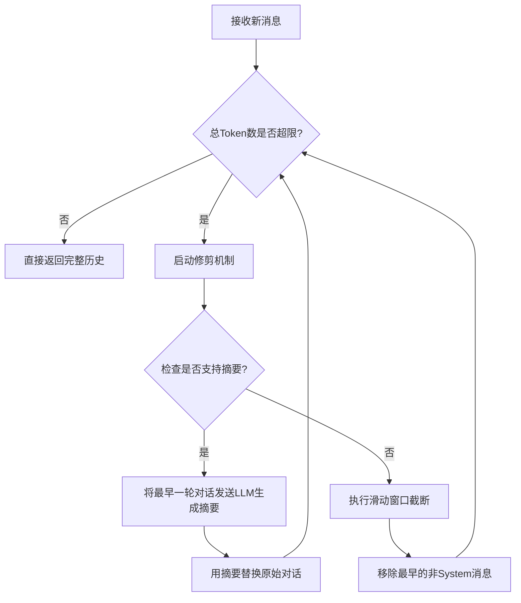

# 第六章：短期记忆——Session Memory

本章讲解Agent的"金鱼记忆"问题及解决方案，涵盖Session Memory的数据结构设计（基于角色的消息结构、Tool Call配对完整性）、上下文窗口管理策略（滑动窗口、令牌截断、摘要压缩、混合策略），以及Redis等分布式存储方案的实现。
## 6.1 引言：LLM 的“金鱼记忆”
如果你问一个人“我叫什么名字？”，他能回答是因为他记得刚才的对话。但如果你问一个大语言模型（LLM）同样的问题，在不做任何处理的情况下，它会一脸茫然。
**LLM 本质上是“无状态”的。** 对于模型而言，每一次 API 调用都是一次全新的开始，它没有内置的“大脑海马体”来留存上一秒的信息。
Agent 要具备智能，首先必须具备“记忆力”。本章我们将探讨最基础、最核心的记忆形式——**短期记忆**，即 **Session Memory**。
可以把 Session Memory 理解为 Agent 的**“工作台”**或计算机的**内存（RAM）**：
*   **生命周期**：仅在单次会话期间有效。一旦你关闭窗口或会话超时，这部分记忆就会清空。
*   **核心作用**：维持多轮对话的连贯性，解决“前言不搭后语”的问题。
## 6.2 核心设计：数据结构与隔离
在动手写代码之前，我们需要先理清数据的设计逻辑。
### 6.2.1 消息结构的设计
Session Memory 的本质是对话历史的有序列表。主流 LLM API（如 OpenAI）都遵循一种基于角色的消息结构。
一个标准的消息对象通常包含以下字段：
*   **role (角色)**：谁说的？
    *   `system`：系统指令（人设、任务目标），优先级最高。
    *   `user`：用户的输入。
    *   `assistant`：Agent 的回复。
    *   `tool`：工具调用的返回结果（这是 Agent 开发中的关键点，常被初学者忽略）。
*   **content (内容)**：具体说了什么？
*   **tool_calls / tool_call_id**：如果 Agent 调用了工具，这里需要记录调用请求和对应的返回ID，以便模型关联“问题”与“答案”。
**设计示例：包含工具调用的消息链**
```json
[
  {"role": "system", "content": "你是一个天气助手..."},
  {"role": "user", "content": "北京今天天气怎么样？"},
  {"role": "assistant", "content": null, "tool_calls": [{"id": "call_123", "name": "get_weather", "args": "Beijing"}]},
  {"role": "tool", "tool_call_id": "call_123", "content": "{'temp': 25, 'condition': 'sunny'}"},
  {"role": "assistant", "content": "北京今天天气晴朗，气温25度。"}
]
```
> **⚠️ 注意**：在 Agent 开发中，`tool` 角色的消息至关重要。如果丢失了这部分记录，Agent 就会忘记自己刚才做了什么（比如查了天气），导致用户追问“那上海呢？”时，Agent 无法复用之前的逻辑。
### 6.2.2 会话隔离设计
在生产环境中，服务是并发的。A 用户的对话绝不能出现在 B 用户的上下文中。我们需要引入 **Session ID** 进行隔离。
*   **Session ID 生成策略**：
    *   前端生成唯一 UUID（适合 Web 应用）。
    *   后端基于用户 ID + 时间戳生成。
*   **存储映射关系**：
    `Key: Session ID` -> `Value: List[Message Objects]`
---
## 6.3 核心难点：上下文窗口管理
为什么 Session Memory 的难点不在于“存”，而在于“管”？
因为 LLM 有一个物理限制——**上下文窗口**。虽然现在的模型窗口越来越大（如 128k token），但：
1.  **成本高昂**：每轮对话都带上万字的历史记录，Token 消耗呈指数级增长。
2.  **干扰注意力**：过多的历史噪音可能导致模型“注意力涣散”，答非所问。
我们需要在“记住关键信息”和“控制 Token 成本”之间找到平衡。这就需要引入**修剪策略**。
### 6.3.1 策略概览与对比
| 策略名称 | 原理 | 优点 | 缺点 | 适用场景 |
| :--- | :--- | :--- | :--- | :--- |
| **滑动窗口** | 只保留最近 N 轮对话 | 简单、成本低 | 会直接丢失早期指令，导致 Agent 变笨 | 简单问答机器人 |
| **令牌截断** | 按 Token 数量硬性截断 | 精确控制成本 | 容易截断句子中间，破坏语义 | 成本敏感型应用 |
| **摘要压缩** | 用 LLM 总结旧对话 | 保留语义，压缩率高 | 增加额外 LLM 调用延迟 | 长周期复杂任务 |
| **混合策略** | 结合上述多种手段 | 综合最优 | 实现逻辑复杂 | **生产级 Agent 推荐** |
### 6.3.2 深入解析：混合策略的最佳实践
单一策略往往顾此失彼。一个健壮的 Agent 通常采用“**三段式**”混合策略：
1.  **头部**：始终保留 `System Message`。这是 Agent 的“宪法”，不能丢。
2.  **中部**：将较早的对话压缩为摘要。保留“剧情大纲”，丢弃“具体台词”。
3.  **尾部**：保留最近的 3-5 轮原始对话。确保当前交互的细节（如刚才提到的具体数字、人名）不丢失。
**流程图：上下文管理决策流程**

```mermaid
graph TD
    A[接收新消息] --> B{总Token数是否超限?}
    B -- 否 --> C[直接返回完整历史]
    B -- 是 --> D[启动修剪机制]
    D --> E{检查是否支持摘要?}
    E -- 是 --> F[将最早一轮对话发送LLM生成摘要]
    F --> G[用摘要替换原始对话]
    G --> B
    E -- 否 --> H[执行滑动窗口截断]
    H --> I[移除最早的非System消息]
    I --> B
```
---
## 6.4 实战：构建健壮的 Session Manager
本节我们将动手实现一个具备 **Token 计数**、**滑动窗口** 和 **强制保留 System 指令** 功能的 Session Manager。
### 6.4.1 设计思路
我们将设计一个 `SessionManager` 类，它需要具备以下能力：
1.  **Token 计数**：使用 `tiktoken` 库精确计算 Token，而不是简单的字符数估算。
2.  **自动修剪**：当添加新消息导致超限时，自动从旧对话开始清理。
3.  **结构保护**：确保清理时不破坏 `Tool Call` 的配对关系（如：不要只删了工具返回，却留下了工具调用请求，这会导致报错）。
### 6.4.2 代码实现
**前置依赖安装**：
```bash
pip install tiktoken
```
**Python 实现代码**：
```python
import tiktoken
import json
from typing import List, Dict, Optional
class SessionManager:
    def __init__(self, session_id: str, model_name: str = "gpt-4", max_tokens: int = 4000):
        self.session_id = session_id
        self.model_name = model_name
        self.max_tokens = max_tokens  # 上下文窗口上限
        self.messages: List[Dict] = []
        
        # 初始化 Token 计算器
        # 如果模型不支持，默认使用 cl100k_base (GPT-4/3.5 通用)
        try:
            self.encoding = tiktoken.encoding_for_model(model_name)
        except KeyError:
            self.encoding = tiktoken.get_encoding("cl100k_base")
    def count_tokens(self, messages: List[Dict]) -> int:
        """精确计算消息列表的 Token 数"""
        num_tokens = 0
        for message in messages:
            # 每条消息都有固定的格式开销 (role, separators etc.)
            # 参考 OpenAI 官方计算逻辑简化版
            num_tokens += 4  # <im_start>{role/name}\n{content}<im_end>\n
            
            for key, value in message.items():
                if value:
                    # 处理 content
                    if isinstance(value, str):
                        num_tokens += len(self.encoding.encode(value))
                    # 处理 tool_calls (需要序列化后计算)
                    elif isinstance(value, (list, dict)):
                        num_tokens += len(self.encoding.encode(json.dumps(value)))
                    
                    if key == "name":  # 如果有 name 字段，会有额外开销
                        num_tokens -= 1  # name 和 role 互斥，修正计算
        num_tokens += 2  # 对话开始的 <im_start>assistant
        return num_tokens
    def add_message(self, role: str, content: str, **kwargs):
        """添加消息并触发自动修剪"""
        new_msg = {"role": role, "content": content, **kwargs}
        self.messages.append(new_msg)
        
        # 每次添加后检查窗口
        self._prune_history()
    def _prune_history(self):
        """
        修剪策略：保护 System，移除最早的非 System 消息
        注意：为了简化逻辑，此处按“轮”移除 (User + Assistant)
        """
        while self.count_tokens(self.messages) > self.max_tokens:
            # 1. 找到第一个可以删除的消息索引
            # System 消息通常在索引 0，不能删
            if len(self.messages) <= 1:
                print("Warning: Context window exceeded even with only System Message!")
                break
            
            # 2. 移除第一条非 System 消息
            # 这里的逻辑是简单的 FIFO (先进先出)
            # 实际生产中需要更复杂的逻辑来保护 tool_calls 配对
            removed = self.messages.pop(1) 
            print(f"[Session Memory] Token 超限，自动移除旧消息: {removed.get('role')}...")
    def get_context(self) -> List[Dict]:
        """获取当前可用的上下文"""
        return self.messages
# --- 测试示例 ---
if __name__ == "__main__":
    # 初始化一个极小窗口 (100 tokens) 用于测试
    manager = SessionManager(session_id="test_001", max_tokens=100)
    
    # 1. 添加 System 指令
    manager.add_message("system", "你是一个有帮助的AI助手。")
    
    # 2. 模拟多轮对话
    for i in range(10):
        manager.add_message("user", f"这是第 {i} 轮用户的输入，内容稍微长一点以消耗Token。")
        manager.add_message("assistant", f"这是第 {i} 轮AI的回复。")
        
        # 打印当前 Token 状态
        print(f"当前轮次: {i}, Token数: {manager.count_tokens(manager.messages)}, 历史条数: {len(manager.messages)}")
```
### 6.4.3 进阶挑战：Tool Call 的“配对陷阱”
在上述代码中，我们使用了简单的 `pop(1)` 策略。但在 Agent 场景下，这存在隐患。
**问题场景**：
历史记录为 `[System, User, Assistant(tool_call), Tool(result)]`。
如果简单移除 `User`，剩下 `[System, Assistant(tool_call), Tool(result)]`。模型还能理解上下文吗？勉强可以。
但如果移除了 `Tool(result)`，剩下 `[System, User, Assistant(tool_call)]`。此时模型会认为工具还没返回结果，可能会**重复发起工具调用**，陷入死循环。
**解决方案**：
在修剪逻辑中，增加**原子性检查**。如果移除的目标是 `tool` 角色或包含 `tool_calls` 的 `assistant` 消息，必须连带移除其配对的消息。这通常需要通过 `tool_call_id` 进行关联索引。
---
## 6.5 存储方案选型：从内存到分布式
记忆存在哪里？这决定了 Agent 的扩展性。
### 6.5.1 方案一：进程内内存
*   **形式**：Python 字典或全局变量。
*   **适用**：单机脚本、Jupyter Notebook 实验。
*   **缺点**：程序重启，记忆清零；多进程/多容器部署时，记忆不共享。
### 6.5.2 方案二：文件存储
*   **形式**：每个 Session 对应一个 `.json` 文件。
*   **适用**：简单的持久化需求。
*   **缺点**：并发读写容易造成数据损坏；I/O 性能差。
### 6.5.3 方案三：数据库/缓存—— 生产级推荐
*   **形式**：使用 Redis 或 MongoDB。
*   **优势**：
    *   **极速读写**：Redis 基于内存，适合高频的对话读写。
    *   **TTL 自动过期**：可设置 Session 30分钟无交互自动销毁，节省存储空间。
    *   **分布式共享**：无论用户请求打到哪个服务器容器，都能读取到相同的 Session。
**Redis 存储伪代码**：
```python
import redis
import json
r = redis.Redis(host='localhost', port=6379, db=0)
def save_session(session_id, messages):
    # 序列化存储，设置 30 分钟过期
    r.setex(f"session:{session_id}", 1800, json.dumps(messages))
def load_session(session_id):
    data = r.get(f"session:{session_id}")
    return json.loads(data) if data else []
```
---
## 6.6 本章小结
Session Memory 是 Agent 迈向智能的第一步。通过本章的学习，我们掌握了：
1.  **核心原理**：Session Memory 是为了解决 LLM 无状态问题而设计的“工作台”。
2.  **数据结构**：必须严格遵循 Role-based 结构，并特别留意 Tool 角色的完整性。
3.  **管理策略**：简单的滑动窗口并不够用，生产环境需要混合使用 Token 计数、滑动窗口与摘要压缩。
4.  **工程实践**：使用 Redis 进行分布式存储，并设计健壮的 Session Manager 类来封装复杂性。
下一章，我们将突破“会话”的限制，探讨如何让 Agent 拥有**长期记忆**，记住几天甚至几个月前发生的事情。
