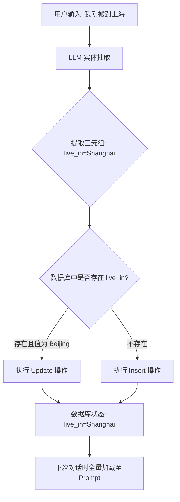
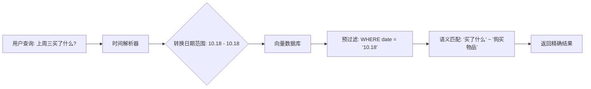
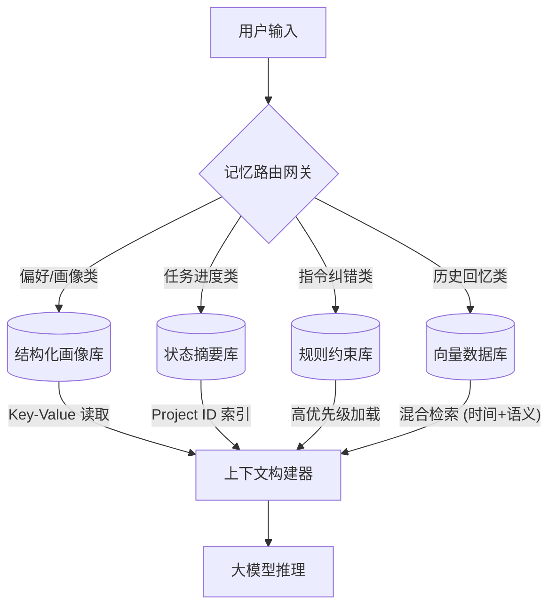

# 第七章：长期记忆的场景分类与工程化落地

本章突破"向量检索万能"的误区，将长期记忆场景分为四类：静态用户画像（知识图谱方案）、动态项目状态（快照+摘要方案）、行为纠偏（高权重规则库）、时间线索（时序索引+元数据过滤）。提供混合存储架构设计，实现精准高效的记忆检索。

## 7.1 引言：为什么"向量检索"不是万能药？

在 Agent 开发的初级阶段，许多开发者会陷入一个误区：试图用"向量数据库 + 语义检索"解决所有记忆问题。然而，在实际的工程落地中，长期记忆（LTM）并非只有一种形态。

如果仅仅笼统地使用向量检索，往往会遭遇以下"幽灵问题"：

1.  **精准度缺失**：用户问"上周三我买了什么？"，向量检索可能召回了"上个月买书"的记录，因为它们语义相似，却忽略了时间维度的硬性约束。

2.  **状态错乱**：用户昨天说"我不用 MySQL 了，改用 PostgreSQL"，系统却因为两条记忆向量距离相近，同时召回了新旧两条决策，导致 Agent 困惑。

3.  **权重倒置**：用户强调"千万不要给我推荐书籍"，这条指令在向量空间中可能和"我喜欢看书"混在一起，导致关键指令被淹没。

**核心观点**：不同的业务场景对记忆的**时效性、精度、关联性**要求截然不同。我们需要构建一个**多级记忆管理系统**，对症下药。

---

## 7.2 场景分类矩阵：长期记忆的四种"面孔"

我们将长期记忆的应用场景划分为四个主要象限，这是设计记忆系统的第一步。

| 场景类型 | 典型案例 | 核心痛点 | 推荐解决方案 |
| :--- | :--- | :--- | :--- |
| **静态用户画像** | "我是素食主义者"、"我是Java后端" | 数据分散，需去重与冲突解决 | **知识图谱 / 结构化标签库** |
| **动态项目状态** | "上次会议决定使用AWS"、"重构进行中" | 状态具有时效性，旧数据即噪音 | **状态机 + 摘要更新** |
| **行为纠偏** | "不要在代码里加注释"、"回答要简洁" | 负向反馈需永久记住，优先级最高 | **高权重规则库** |
| **时间线索** | "上周三买了什么？"、"过去一年的变化" | 向量检索难以处理精确时间范围 | **时序索引 + 元数据过滤** |

---

## 7.3 场景一：静态用户画像——"我是谁"

### 7.3.1 场景与痛点分析

用户的基本属性（如职业、住址、过敏源）属于**低频变动、高复用**的数据。

*   **痛点**：用户可能在不同对话中多次提及偏好，甚至前后矛盾（如："我刚从北京搬到上海"）。单纯依赖向量检索，可能只召回"我喜欢吃苹果"，漏掉"我不喜欢吃梨"，导致推荐错误。

### 7.3.2 架构设计思路

**设计核心**：将非结构化对话转化为结构化数据，利用数据库的"主键唯一性"解决冲突。

### 7.3.3 详细实施步骤

**步骤 1：实体抽取（ETL）**

利用 LLM 从对话流中提取结构化三元组 `(Subject, Predicate, Object)`。

**步骤 2：冲突检测与融合**

检测新提取的事实是否与已有事实冲突。若冲突，新值覆盖旧值。

**步骤 3：全量注入**

会话开始时，将结构化画像直接拼接到 System Prompt。

### 7.3.4 代码与流程图示例

**设计示例：LLM 提取 Prompt 模板**

```text
你是一个信息提取助手。请从用户的输入中提取用户画像三元组。

输入："我现在住在上海，但我以前住北京。"
输出：
[
  {"attr": "location", "value": "Shanghai", "confidence": 1.0},
  {"attr": "previous_location", "value": "Beijing", "confidence": 1.0}
]

```

**流程图：用户画像更新流程**



---

## 7.4 场景二：动态项目状态——"我在做什么"

### 7.4.1 场景与痛点分析

Agent 协助用户处理长周期任务（如写代码、写小说）。记忆的核心是**"当前状态"**，而非"历史日志"。

*   **痛点**：如果记忆库里存着"决定使用 MySQL"，但昨天已改用 PostgreSQL，旧记忆就是干扰噪音。

### 7.4.2 架构设计思路

**设计核心**：采用"快照 + 增量"模式。不保存每一句对话，只维护一个最新的 `Project State` JSON 对象。

### 7.4.3 详细实施步骤

**步骤 1：状态初始化**

创建项目时，生成初始状态 JSON。

**步骤 2：增量更新监测**

每次对话结束时，LLM 判断对话内容是否触发了状态变更。

**步骤 3：状态重写**

若有变更，生成新的状态 JSON 覆盖旧文件。

### 7.4.4 代码示例

**设计示例：项目状态对象结构**

```json
{
  "project_id": "proj_001",
  "name": "Login Module Refactor",
  "status": "In Progress",
  "tech_stack": ["Python", "FastAPI", "PostgreSQL"],
  "current_step": "Writing API tests",
  "last_updated": "2023-10-27T10:00:00Z"
}

```

**实现逻辑**：

```python

# 伪代码示例
def update_project_state(chat_history, current_state):
    prompt = f"""
    当前项目状态: {current_state}
    最近对话历史: {chat_history}
    
    请判断对话是否有新信息更新了项目状态？如果有，请输出完整的新状态 JSON；如果没有，输出 None。

    """
    new_state = llm.call(prompt)
    if new_state:
        db.save("proj_001", new_state)

```

---

## 7.5 场景三：行为纠偏——"我不要什么"

### 7.5.1 场景与痛点分析

这是权重最高的记忆。用户对 Agent 的纠正（如"不要解释代码，直接给我结果"），属于**强制性指令**。

*   **痛点**：普通的记忆检索可能认为"天气"和"纠错"相似度一样，导致纠错指令被淹没。用户纠正后，Agent 应立即在后续所有对话中遵守。

### 7.5.2 架构设计思路

**设计核心**：建立独立的"规则/约束库"，并在 Prompt 构建时给予最高优先级，标记为 `[CRITICAL]`。

### 7.5.3 详细实施步骤

**步骤 1：意图识别**

识别用户输入是"闲聊"还是"纠偏指令"。

**步骤 2：规则固化**

将自然语言纠正转化为一条明确的指令规则，写入规则库。

**步骤 3：强制注入**

构建 System Prompt 时，规则库内容置于最顶端。

### 7.5.4 Prompt 构建示例

**设计内容**：最终生成的 System Prompt 结构

```text
[CRITICAL CONSTRAINTS - HIGHEST PRIORITY]

1. Output format: Paragraphs only, no bullet points.

2. Action: Do not recommend books under any circumstances.
---------------------------------------------------------
[User Profile]

- Location: Shanghai

- Role: Senior Developer
---------------------------------------------------------
[Current Context]
...

```

---

## 7.6 场景四：时间线索——"什么时候"

### 7.6.1 场景与痛点分析

用户查询具体时间点发生的事件（如"上周三我说要去哪出差？"）。

*   **痛点**：向量擅长语义匹配，不擅长数值/时间范围过滤。查询"上周"，向量可能召回"上个月"的相关内容，因为语义都是"过去"。

### 7.6.2 架构设计思路

**设计核心**：向量数据库必须结合**元数据过滤**。先过滤时间范围，再做向量匹配。

### 7.6.3 详细实施步骤

**步骤 1：数据写入**

写入记忆时，必须附带精确的 `created_at` 时间戳元数据。

**步骤 2：时间解析**

查询时，先用 LLM 或 NLP 工具将"上周三"解析为具体的日期范围（如 `2023-10-18` 至 `2023-10-18`）。

**步骤 3：混合检索**

执行 `Pre-filtering`：先在数据库层面筛选出符合时间范围的文档，再在这些文档中进行向量相似度计算。

### 7.6.4 流程图



---

## 7.7 总结：统一架构视图

为了支撑上述所有场景，我们不能依赖单一存储，而需要构建一个**混合存储架构**。

### 7.7.1 系统架构图



### 7.7.2 关键要点总结

1.  **不要试图用一种存储解决所有问题**：

    *   结构化数据（画像）用 MongoDB/图数据库。

    *   非结构化回忆（历史）用向量数据库。

    *   强约束（规则）用内存或高性能 KV 缓存。

2.  **写入比检索更重要**：

    *   如果不对记忆进行清洗、提炼和分类存储，检索出来的只能是噪音。

    *   数据进入数据库前，必须经过 ETL（抽取、转换、加载）。

3.  **时效性处理原则**：

    *   静态数据（画像）：长期存储，覆盖更新。

    *   动态数据（状态）：最新覆盖，历史归档。

    *   历史数据（日志）：时间索引，定期过期。

---

**本章完毕。通过本章的学习，您应该掌握了如何根据业务场景选择合适的记忆存储策略，并能够设计出一个能够处理复杂真实业务需求的 Agent 记忆系统。**

---

## 7.8 补充内容：工程化实践要点

### 7.8.1 向量数据库选型与集成

**常见问题场景：**

选择向量数据库时，面对 Chroma、Milvus、Pinecone、Weaviate 等多个选项，不知道哪个适合当前业务场景。

**解决思路与方案：**

| 数据库 | 适用场景 | 部署方式 | 特点 |
| :--- | :--- | :--- | :--- |
| **Chroma** | 本地 Demo、快速验证 | 嵌入式，无需独立服务 | 零门槛，`pip install chromadb` 即用 |
| **Milvus** | 中大型生产环境 | Docker / K8s | 功能完善，支持混合检索，性能强 |
| **Pinecone** | 初创公司 / SaaS | 云服务，全托管 | 无运维成本，按用量计费 |
| **Weaviate** | 需要知识图谱特性 | 云服务或自建 | 内置对象存储，GraphQL 查询 |
| **pgvector** | 已有 PostgreSQL | 插件形式 | 无新增基础设施，适合数据量 <100 万 |

**实战代码：Chroma 快速接入**

```python
import chromadb
from chromadb.utils import embedding_functions

# 使用 OpenAI Embedding（也可以替换为 BGE 等本地模型）
openai_ef = embedding_functions.OpenAIEmbeddingFunction(
    api_key="YOUR_API_KEY",
    model_name="text-embedding-3-small"
)

client = chromadb.PersistentClient(path="./memory_db")
collection = client.get_or_create_collection(
    name="user_memory",
    embedding_function=openai_ef
)

# 写入用户记忆
def save_memory(user_id: str, content: str, metadata: dict):
    collection.add(
        documents=[content],
        metadatas=[{"user_id": user_id, "timestamp": metadata.get("timestamp"), **metadata}],
        ids=[f"{user_id}_{metadata.get('timestamp', '')}"]
    )

# 检索相关记忆（先过滤用户，再做语义匹配）
def retrieve_memory(user_id: str, query: str, top_k: int = 5):
    results = collection.query(
        query_texts=[query],
        n_results=top_k,
        where={"user_id": user_id}  # 关键：用户隔离
    )
    return results["documents"][0]

```

> **踩坑记录**：Chroma 默认使用内存模式，重启后数据消失。生产环境务必用 `PersistentClient` 并指定持久化路径。另外，Embedding 函数一旦选定就别换，否则旧数据的向量和新查询向量会出现"维度不兼容"的报错。

### 7.8.2 记忆数据的备份与恢复

**常见问题场景：**

向量数据库损坏或误删除，导致长期记忆数据丢失。用户反馈"Agent 怎么什么都不记得了"。

**解决思路与方案：**

长期记忆数据一旦丢失，等于用户画像和对话历史全部归零，是灾难性的。备份策略需要**双轨制**：

```python
import json
import os
from datetime import datetime

class MemoryBackupManager:
    """记忆数据的双轨备份：每日全量 + 实时增量"""
    
    def __init__(self, backup_dir: str = "./memory_backups"):
        self.backup_dir = backup_dir
        os.makedirs(backup_dir, exist_ok=True)
    
    def daily_full_backup(self, collection):
        """每日全量备份：将所有向量数据导出为 JSON"""
        today = datetime.now().strftime("%Y%m%d")
        backup_path = os.path.join(self.backup_dir, f"full_backup_{today}.json")
        
        # 分批导出，避免一次性加载 OOM
        all_data = []
        offset = 0
        batch_size = 1000
        
        while True:
            result = collection.get(limit=batch_size, offset=offset)
            if not result["ids"]:
                break
            all_data.extend(zip(
                result["ids"],
                result["documents"],
                result["metadatas"]
            ))
            offset += batch_size
        
        with open(backup_path, "w", encoding="utf-8") as f:
            json.dump(all_data, f, ensure_ascii=False)
        
        print(f"[备份] 全量备份完成，共 {len(all_data)} 条记录 -> {backup_path}")
    
    def restore_from_backup(self, backup_path: str, collection):
        """从备份恢复数据"""
        with open(backup_path, "r", encoding="utf-8") as f:
            data = json.load(f)
        
        # 批量写入，每次 500 条
        batch_size = 500
        for i in range(0, len(data), batch_size):
            batch = data[i:i+batch_size]
            ids, docs, metas = zip(*batch)
            collection.add(
                ids=list(ids),
                documents=list(docs),
                metadatas=list(metas)
            )
        print(f"[恢复] 从备份恢复 {len(data)} 条记录完成")

```

建议在 Crontab 或定时任务中每天凌晨执行一次 `daily_full_backup`，备份文件保留 30 天。

### 7.8.3 记忆数据的生命周期管理

**常见问题场景：**

长期记忆数据持续增长，存储成本不断上升。大量低价值记忆（比如"你好""好的""嗯"）占用检索资源，还会干扰真正有价值的记忆召回。

**解决思路与方案：**

```python
from datetime import datetime, timedelta
from typing import List

class MemoryLifecycleManager:
    """记忆生命周期管理：价值评分 + 自动淘汰"""
    
    # 不同类型记忆的保留策略（天数，-1 表示永久）
    RETENTION_POLICY = {
        "user_preference": -1,   # 用户偏好：永久保留
        "constraint_rule": -1,   # 行为约束：永久保留
        "project_state": 180,    # 项目状态：180 天
        "conversation_log": 30,  # 对话日志：30 天
        "temp_context": 7,       # 临时上下文：7 天
    }
    
    def __init__(self, collection):
        self.collection = collection
    
    def score_memory_value(self, content: str, metadata: dict) -> float:
        """
        给记忆打"价值分"，低于阈值的候选淘汰
        评估维度：长度、类型、最近访问频率
        """
        score = 0.0
        
        # 内容长度（太短的往往是无意义的）
        if len(content) > 20:
            score += 0.3
        if len(content) > 100:
            score += 0.2
        
        # 记忆类型权重
        memory_type = metadata.get("type", "conversation_log")
        type_weights = {
            "user_preference": 1.0,
            "constraint_rule": 1.0,
            "project_state": 0.7,
            "conversation_log": 0.3,
            "temp_context": 0.1,
        }
        score += type_weights.get(memory_type, 0.3)
        
        # 访问频率加成
        access_count = metadata.get("access_count", 0)
        score += min(access_count * 0.05, 0.5)
        
        return min(score, 1.0)
    
    def cleanup_expired_memories(self):
        """清理过期记忆"""
        now = datetime.now()
        deleted_count = 0
        
        for memory_type, days in self.RETENTION_POLICY.items():
            if days == -1:
                continue  # 永久保留，跳过
            
            cutoff_date = (now - timedelta(days=days)).isoformat()
            
            # 查找过期记录
            expired = self.collection.get(
                where={
                    "$and": [
                        {"type": {"$eq": memory_type}},
                        {"created_at": {"$lt": cutoff_date}}
                    ]
                }
            )
            
            if expired["ids"]:
                self.collection.delete(ids=expired["ids"])
                deleted_count += len(expired["ids"])
                print(f"[生命周期] 清理 {memory_type} 类型过期记忆 {len(expired['ids'])} 条")
        
        return deleted_count

```

> **实战建议**：不要直接删除"低价值"记忆，先移到"归档集合"观察一周，确认没问题再永久删除。我们第一次上线这个功能时，差点把用户的重要设置项（它们的 content 很短）一起清掉了。
