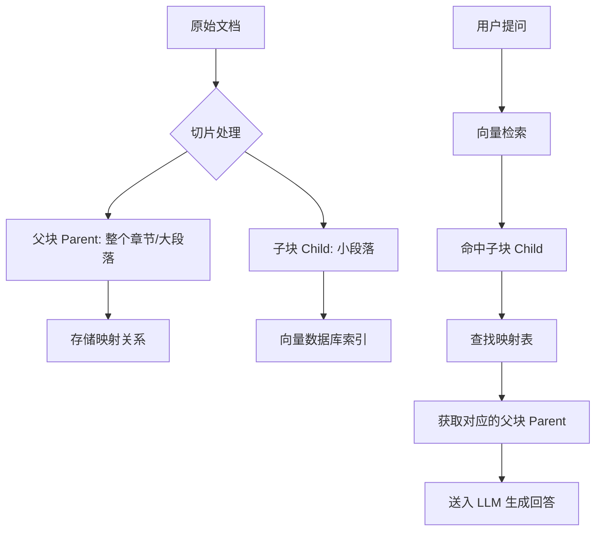
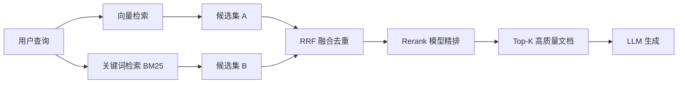

# 第八章：Agent 的知识大脑——RAG 场景深度分析与实战进阶

本章深入讲解 RAG 的四大场景（智能客服、企业知识库、法律合同审查、代码仓库分析），提供进阶解决方案：Parent-Child 切片策略解决上下文断裂、混合检索+Rerank 提升精度、AST 切片处理代码分析。附带企业 IT 运维知识库助手的完整实战案例，并引入前沿的 RLM（递归/奖励语言模型）闭环机制。

## 8.1 核心概念：为什么 Agent 需要 RAG？

在深入场景之前，我们需要理解 RAG（Retrieval-Augmented Generation，检索增强生成）对于 Agent 的意义。

### 8.1.1 大模型的"失忆"困境

想象一下，你让一个聪明的学生（LLM）去参加一场闭卷考试。虽然他才华横溢，但他不知道你们公司的内部规章，也不知道昨天刚发布的新闻。这就是大模型的痛点：

*   **知识滞后**：训练数据截止后发生的事情一无所知。
*   **私有数据缺失**：无法访问企业内部文档、代码库等非公开数据。
*   **幻觉问题**：为了回答问题，可能会一本正经地胡说八道。

### 8.1.2 RAG 的本质：开卷考试

RAG 的核心逻辑就是给这个学生发一本"参考书"，并允许他"翻书"答题。

1.  **检索**：当问题来临时，先去参考书（知识库）里找到相关的章节。
2.  **增强**：把找到的章节内容贴在问题的后面，作为提示词的一部分。
3.  **生成**：让大模型基于这些"参考资料"回答问题。

对于 Agent 而言，RAG 就是它的**长期记忆外挂**。没有 RAG，Agent 只能是一个聊天机器人；有了 RAG，Agent 才能成为处理具体业务的专家。

---

> **扩展思考：RAG vs Fine-tuning 怎么选？**
>
> 初学者最常问的问题。简单来说：**RAG 解决"知道什么"，Fine-tuning 解决"怎么说"**。
>
> *   需要频繁更新知识、需要严格溯源 → 选 RAG。
> *   需要特定语气风格（如法律文书）、领域术语对齐 → 选 Fine-tuning。
> *   **生产最佳实践**：Fine-tuning + RAG 结合使用。

### 8.1.3 五分钟跑通最小可用 RAG

理论看完，我们需要建立直觉。以下是用 LlamaIndex 跑通完整链路的最少代码：

```python
# pip install llama-index sentence-transformers
from llama_index.core import VectorStoreIndex, SimpleDirectoryReader, Settings
from llama_index.embeddings.huggingface import HuggingFaceEmbedding

# 1. 指定本地开源 Embedding 模型
Settings.embed_model = HuggingFaceEmbedding(
    model_name="BAAI/bge-small-zh-v1.5"
)

# 2. 加载文档（在 ./data 目录放几篇 txt）
documents = SimpleDirectoryReader("./data").load_data()

# 3. 构建索引（自动完成：切分 → Embedding → 存储）
index = VectorStoreIndex.from_documents(documents)

# 4. 查询与溯源
query_engine = index.as_query_engine(similarity_top_k=3)
response = query_engine.query("退货流程是什么？")
print(f"回答: {response.response}")
for node in response.source_nodes:
    print(f"来源: {node.metadata.get('file_name')} | "
          f"内容: {node.text[:80]}...")
```

---

## 8.2 场景分类与痛点深度剖析

RAG 并非万能药，不同场景下的难度天差地别。我们将应用场景分为四个层级，难度依次递增。

### 场景一：智能客服与 FAQ 问答（入门级）

*   **特征**：问题标准，答案短小。例如："退货流程是什么？""WiFi 密码多少？"
*   **痛点**：
    *   **口语化鸿沟**：用户问"卡得要死怎么办"，知识库里写的是"网络延迟高的排查步骤"。
    *   **变体繁多**："无法开机"、"开不了机"、"黑屏"其实是同一个问题。
*   **关键点**：主要考验语义匹配能力，不需要复杂的文档解析。

### 场景二：企业内部知识库（进阶级）

*   **特征**：文档格式复杂（PDF、Word、Wiki）、包含大量表格、流程图。
*   **痛点**：
    *   **切片难题**：如果按固定字符数切分，表格会被切碎，导致语义丢失（如表格第一列在上一段，第二列在下一段）。
    *   **权限隔离**：普通员工不能看到高管专属文档，检索时需过滤权限。
    *   **数据更新**：文档修改后，知识库需要实时同步，否则会产生"过期知识"。

### 场景三：法律/金融合同审查（专家级）

*   **特征**：容错率极低，必须"有据可查"。
*   **痛点**：
    *   **大海捞针**：在 200 页的合同中找到"违约责任"条款。
    *   **逻辑推理**：不仅要找，还要对比（如"这份合同与标准模板的差异在哪里？"）。
    *   **幻觉零容忍**：严禁模型编造条款，必须引用原文。

### 场景四：代码仓库分析（特异级）

*   **特征**：非自然语言，具有严格的语法结构和依赖关系。
*   **痛点**：
    *   **跨文件依赖**：理解一个函数，往往需要同时看它引用的头文件和父类。
    *   **语法敏感**：传统的自然语言 Embedding 模型很难理解 `func_a` 调用 `func_b` 的逻辑关系。

---

## 8.3 核心解决方案与技术原理

针对上述痛点，通用的 RAG 架构往往失效。以下是经过验证的进阶解决方案。

### 方案一：Parent-Child 切片策略（解决上下文断裂）

**设计原理**：

传统的切片方式是"切片-索引-检索-返回切片"。这会导致检索到的内容可能只是只言片语，缺乏上下文。

**Parent-Child 策略**采用"小索引，大返回"的思路：

*   **Child（子块）**：将文档切分成小块（如 128 tokens），便于精准匹配用户提问。
*   **Parent（父块）**：保留子块所属的大块文档（如 1024 tokens 或整个章节）。
*   **流程**：检索时命中了"子块"，但返回给 LLM 的是"父块"。

**流程图示**：



**可运行实现**（推荐使用 LlamaIndex 封装的 `AutoMergingRetriever`，而非手动映射）。跨文档级别的引用（比如"先检索文档摘要，再跳转到具体文档"），RecursiveRetriever 是正确的选择。两者是互补关系，不是替代关系。：

```python
from llama_index.core import VectorStoreIndex, SimpleDirectoryReader, StorageContext
from llama_index.core.node_parser import HierarchicalNodeParser
from llama_index.core.retrievers import AutoMergingRetriever
from llama_index.core.indices.vector_store.base import VectorIndexRetriever

documents = SimpleDirectoryReader("./data").load_data()

# 定义三层切片结构：父块 1024 → 中间块 256 → 叶子块 128
hierarchical_parser = HierarchicalNodeParser.from_defaults(
    chunk_sizes=[1024, 256, 128]
)
nodes = hierarchical_parser.get_nodes_from_documents(documents)

# 仅将最细粒度的叶子节点存入向量库（非根节点）
leaf_nodes = [
    node for node in nodes
    if not node.metadata.get("is_root", False)
]

storage_context = StorageContext.from_defaults()
storage_context.docstore.add_documents(nodes)  # 所有层级节点都存入文档库

index = VectorStoreIndex(leaf_nodes, storage_context=storage_context)

# 配置自动合并检索器：如果父块下超过 50% 的子块被命中，
# 则自动提升返回整个父块
vector_retriever = VectorIndexRetriever(
    index=index, similarity_top_k=6
)
auto_merging_retriever = AutoMergingRetriever(
    vector_retriever,
    storage_context,
    simple_ratio_thresh=0.5
)
```

### 方案二：混合检索 + Rerank（解决精度不足）

**设计原理**：

单一检索方式有缺陷：

*   **向量检索**：擅长语义匹配，但对专有名词（如型号"X-2000"、合同编号）匹配较差。
*   **关键词检索（BM25）**：擅长精确匹配，但不懂语义。

**混合检索**结合两者之长，再引入 **Rerank（重排序）** 模型进行精排。

**流程图示**：



**RRF 融合实现**：向量检索擅语义，BM25 擅精确词。通过 **RRF（Reciprocal Rank Fusion）** 算法融合两路结果，再经过 Rerank 模型精排。

```python
from collections import Counter
from typing import List, Dict


class HybridRetriever:
    """混合检索器：向量检索 + BM25 关键词检索，通过 RRF 融合排序"""

    def __init__(self, vector_retriever, bm25_retriever, w_vec=0.6, w_bm25=0.4):
        self.vector_retriever = vector_retriever
        self.bm25_retriever = bm25_retriever
        self.w_vec, self.w_bm25 = w_vec, w_bm25

    def retrieve(self, query: str, top_k: int = 10, k: int = 60) -> List[Dict]:
        """
        RRF (Reciprocal Rank Fusion) 融合两路检索结果。
        RRF 公式：score(d) = Σ w_i / (k + rank_i + 1)
        其中 rank_i 是文档 d 在第 i 路检索中的排名（从 0 开始）。
        """
        vec_res = self.vector_retriever.search(query, top_k=top_k * 2)
        bm25_res = self.bm25_retriever.search(query, top_k=top_k * 2)

        rrf_scores = Counter()
        for rank, r in enumerate(vec_res):
            rrf_scores[r["id"]] += self.w_vec / (k + rank + 1)
        for rank, r in enumerate(bm25_res):
            rrf_scores[r["id"]] += self.w_bm25 / (k + rank + 1)

        # 合并去重并按 RRF 分数排序
        all_docs = {r["id"]: r for r in vec_res + bm25_res}
        return [all_docs[did] for did, _ in rrf_scores.most_common(top_k)]

# 之后接入 Rerank（如 BGE-Reranker）对 top_k 结果进行最终的 Cross-Encoder 精排
```

### 方案三：代码 AST 切片（解决代码分析）

**设计原理**：

代码不能按行切。利用 Python 内置 `ast` 模块解析抽象语法树，按函数/类切片，并用 `networkx` 构建调用图谱，检索时自动展开依赖。

**策略**：

1.  **切片**：识别 `Class` 和 `Function` 节点作为独立切片。
2.  **图谱**：解析 Import 关系和调用关系。
3.  **检索**：当检索到函数 A 时，自动通过图谱召回函数 A 调用的函数 B，一起提供给 LLM。

```python
import ast
import os
from typing import List

import networkx as nx


class CodeSliceExtractor:
    """基于 AST 的代码切片器：按函数/类切分，并构建调用图谱"""

    def __init__(self, repo_path: str):
        self.repo_path = repo_path
        self.graph = nx.DiGraph()

    def _parse_file(self, filepath: str):
        """解析单个文件，提取函数定义和调用关系"""
        with open(filepath, "r", encoding="utf-8") as f:
            source = f.read()
        tree = ast.parse(source)
        for node in ast.iter_child_nodes(tree):
            if isinstance(node, (ast.FunctionDef, ast.AsyncFunctionDef)):
                slice_id = f"{filepath}::{node.name}"
                code = ast.get_source_segment(source, node)
                if code:
                    self.graph.add_node(slice_id, code=code)
                # 提取调用关系作为边
                for child in ast.walk(node):
                    if isinstance(child, ast.Call) and isinstance(child.func, ast.Name):
                        self.graph.add_edge(slice_id, f"{filepath}::{child.func.id}")

    def get_dependencies(self, slice_id: str, depth=1):
        """获取某函数调用的上下游代码（双向 BFS）"""
        if slice_id not in self.graph:
            return []
        visited, queue = set(), [(slice_id, 0)]
        while queue:
            curr, d = queue.pop(0)
            if curr in visited or d > depth:
                continue
            visited.add(curr)
            # 后继：当前函数调用了哪些函数
            for neighbor in self.graph.successors(curr):
                queue.append((neighbor, d + 1))
            # 前驱：哪些函数调用了当前函数
            for neighbor in self.graph.predecessors(curr):
                queue.append((neighbor, d + 1))
        visited.discard(slice_id)
        return [self.graph.nodes[nid]["code"]
                for nid in visited if nid in self.graph.nodes]
```

### 方案四：索引引导的渐进式检索（轻量级替代方案）

**设计原理**：

传统 RAG 依赖向量数据库做语义检索，但对于中小规模知识库（几十到几百份文档），存在更轻量的替代思路：**让 LLM 自己决定"看什么"**。

**核心流程**：

1.  **建立轻量索引**：只索引文档的元信息（文件名、章节标题、摘要），不向量化全文。
2.  **LLM 驱动检索**：第一轮把索引给 LLM，让它判断"应该读取哪些文件"。
3.  **渐进式深入**：根据 LLM 的反馈，按需读取指定文件或章节，直到信息足够。

**适用场景**：

*   知识库规模不大，但文档结构清晰（有良好命名的章节）。
*   需要精确定位特定术语（如合同编号、API 名称），向量检索容易漏掉。
*   不想引入向量数据库的运维成本。

**实践案例**：

*   **Cursor / Claude Code**：编码 Agent 通过工具调用（`read_file`、`search`）逐步读取代码，而非一次性向量检索。
*   **OpenAI Assistants File Search**：LLM 可以多次调用搜索工具，迭代缩小范围。
*   **Anthropic MCP**：标准的 `search` → `read_resource` 工具链，文件系统 + 关键词即可工作。

> 💡 **与 RAG 的关系**：这不是"二选一"，而是演进方向。现代 Agent 往往采用"向量检索做粗召回 + LLM 迭代做精定位"的混合策略，即 **Agentic RAG**。

---

### 方案五：RLM（递归/奖励语言模型）——从单次问答到自我进化

传统 RAG 是线性流程（检索→生成），RLM 打破了这种限制，赋予了 RAG 推理与纠错能力。

#### 1. RLM 作为递归推理引擎

与方案四的区别在于：方案四是固定轮次翻目录，RLM 递归引擎是 LLM 基于推理动态决定"下一步查什么"。

*例如：问"苹果CEO出生那年诺贝尔奖得主是谁？" → 查CEO名字 → 查出生年份 → 查诺贝尔奖得主。*

```python
import json
from typing import Optional, Dict, Any


class RLMRecursiveEngine:
    """RLM 递归推理引擎：LLM 动态决定检索步骤"""

    def __init__(self, llm_client, retriever, max_steps: int = 5):
        """
        Args:
            llm_client: LLM 客户端，需实现 generate(prompt) -> str
            retriever: 检索器，需实现 search(query) -> str
            max_steps: 最大推理步数，防止无限循环
        """
        self.llm = llm_client
        self.retriever = retriever
        self.max_steps = max_steps

    def _parse_action(self, llm_output: str) -> Optional[Dict[str, Any]]:
        """解析 LLM 输出的动作 JSON"""
        try:
            text = llm_output.strip()
            # 处理 markdown 代码块包裹的情况
            if text.startswith("```"):
                text = text.split("\n", 1)[1]
                text = text.rsplit("```", 1)[0]
            return json.loads(text)
        except (json.JSONDecodeError, IndexError):
            return None

    def query(self, question: str) -> str:
        """
        执行递归推理查询。
        LLM 在每一步可以选择：
        - {"type": "search", "query": "子问题"} → 调用检索器获取信息
        - {"type": "answer", "content": "最终回答"} → 输出最终答案
        """
        context = []
        for step in range(self.max_steps):
            prompt = (
                f"已知信息:\n" + "\n".join(f"- {c}" for c in context)
                + f"\n\n问题: {question}\n\n"
                f"请输出下一步动作的 JSON（不要输出其他内容）：\n"
                f'{{"type": "search", "query": "要检索的子问题"}}\n'
                f'或\n'
                f'{{"type": "answer", "content": "最终回答"}}'
            )
            action = self._parse_action(self.llm.generate(prompt))

            if action is None:
                break  # 解析失败，用最后一轮信息做兜底

            if action.get("type") == "answer":
                return action.get("content", "无法生成回答")

            if action.get("type") == "search":
                result = self.retriever.search(action.get("query", question))
                if result:
                    context.append(result)

        # 达到最大步数，基于已有信息生成兜底回答
        fallback_prompt = (
            f"已知信息:\n" + "\n".join(f"- {c}" for c in context)
            + f"\n\n问题: {question}\n请基于以上已知信息回答，如果信息不足请说明。"
        )
        return self.llm.generate(fallback_prompt)
```

#### 2. RLM 作为奖励裁判

区别于 8.7.1 节的**离线评估**，RLM 裁判是**在线纠错闭环**。生成回答后，立即调用 RLM 判定是否幻觉，分数低则强制重写。

```python
import json


def rag_with_rlm_guard(
    query: str,
    rag_pipeline,
    rlm_judge,
    llm_client,
    retrieved_docs: str,
    threshold: float = 8.0,
    max_retries: int = 2,
) -> str:
    """
    带 RLM 裁判守护的 RAG 查询。

    Args:
        query: 用户问题
        rag_pipeline: RAG 管道，需实现 query(str) -> str
        rlm_judge: RLM 裁判模型，需实现 generate(str) -> str
        llm_client: 用于重写的 LLM 客户端
        retrieved_docs: 检索到的参考文档
        threshold: 质量分数阈值，低于此值触发重写
        max_retries: 最大重写次数
    """
    initial_answer = rag_pipeline.query(query)

    for attempt in range(max_retries + 1):
        # 在线 RLM 裁判打分
        judge_prompt = (
            f"参考资料:\n{retrieved_docs}\n\n"
            f"回答:\n{initial_answer}\n\n"
            f"请评估回答是否基于参考资料，是否存在幻觉。"
            f'输出 JSON: {{"score": 0-10的整数, '
            f'"feedback": "如果分数低，说明问题在哪"}}'
        )
        judge_output = rlm_judge.generate(judge_prompt)
        try:
            rlm_result = json.loads(judge_output)
        except json.JSONDecodeError:
            break  # 解析失败，保守返回当前回答

        score = rlm_result.get("score", 10)
        feedback = rlm_result.get("feedback", "")

        if score >= threshold:
            return initial_answer

        if attempt < max_retries:
            # 触发重写
            rewrite_prompt = (
                f"参考资料:\n{retrieved_docs}\n\n"
                f"之前的回答有误（评分: {score}/10）：{feedback}\n"
                f"请严格基于参考资料重新回答问题: {query}"
            )
            initial_answer = llm_client.generate(rewrite_prompt)

    return initial_answer
```

> **性能基准参考**：传统 RAG 延迟 ~1s，幻觉率 8%；加入 RLM 纠错后延迟增至 ~3s，但幻觉率可降至 1-3%。**Rerank 是必选项，RLM 是高级场景的奢侈品。**

---

## 8.4 实战演练：构建企业级知识库助手

为了将理论落地，我们设计一个具体的实战案例：**企业 IT 运维知识库助手**。

### 8.4.1 场景设计

*   **输入**：企业内部的运维手册（含大量 PDF 表格，如端口配置表）、故障排查 Wiki。
*   **用户**："服务器红灯闪烁怎么办？"、"查一下 10.0.0.1 对应的服务配置。"
*   **目标**：准确回答，并标注出处。

### 8.4.2 技术选型

| 组件类型 | 选型方案 | 理由 |
| :--- | :--- | :--- |
| **编排框架** | LlamaIndex | 相比 LangChain，LlamaIndex 在 RAG 索引策略上更强大，支持 Parent-Child 更方便。 |
| **Embedding** | BGE-M3 (BAAI) | 开源最强，支持中英文长文本，且对表格语义理解较好。 |
| **向量库** | Milvus | 支持混合检索，性能强悍，适合生产环境。 |
| **解析工具** | Unstructured.io | 能够自动识别 PDF 中的表格并转为 Markdown 格式，保留结构。 |
| **重排序** | BGE-Reranker | 开源可用，提升 Top-1 准确率的关键。 |

### 8.4.3 详细实施步骤

#### 步骤 1：环境准备与文档解析

首先，我们需要解析 PDF，避免破坏表格结构。

```python
# 伪代码示例：使用 Unstructured 解析 PDF
from unstructured.partition.pdf import partition_pdf

def parse_pdf(file_path):
    # 解析 PDF，策略为 'hi_res' 以识别表格
    elements = partition_pdf(
        filename=file_path,
        strategy="hi_res",
        infer_table_structure=True  # 关键：推断表格结构
    )

    # 将表格转换为 Markdown 格式存储
    content_list = []
    for el in elements:
        if el.category == "Table":
            content_list.append(el.metadata.text_as_html)  # 或转 Markdown
        else:
            content_list.append(el.text)
    return content_list
```

#### 步骤 2：构建 Parent-Child 索引

利用 LlamaIndex 的 `AutoMergingRetriever` 实现层级检索（完整代码见方案一）。

```python

# 伪代码示例：构建层级索引
from llama_index.core import VectorStoreIndex, SimpleDirectoryReader
from llama_index.core.node_parser import SimpleNodeParser
from llama_index.core.schema import IndexNode

# 1. 加载文档
documents = SimpleDirectoryReader("./data").load_data()

# 2. 定义切分器

# Parent: 大块 (例如 1024)
parent_parser = SimpleNodeParser.from_defaults(chunk_size=1024)

# Child: 小块 (例如 256)
child_parser = SimpleNodeParser.from_defaults(chunk_size=256)

# 3. 生成节点
parent_nodes = parent_parser.get_nodes_from_documents(documents)
child_nodes = child_parser.get_nodes_from_documents(documents)

# 4. 建立映射关系：子节点需要知道自己属于哪个父节点

# (此处逻辑较为复杂，LlamaIndex 通常通过 doc_id 关联，实际开发建议直接使用其封装好的 RecursiveRetriever)

# 简化逻辑：将所有子节点存入向量库，但元数据中记录 parent_id
for node in child_nodes:
    node.metadata["parent_id"] = node.ref_doc_id 
    # 实际存储时，需要根据具体的 VectorStore 实现存储逻辑

```


#### 步骤 3：配置混合检索与 Rerank

这是提升准确率的核心步骤。

```python
# 伪代码示例：配置 Rerank
from llama_index.core.postprocessor import SentenceTransformerRerank

# 定义 Rerank 后处理器
reranker = SentenceTransformerRerank(
    model="BAAI/bge-reranker-large",  # 使用 BGE Reranker
    top_n=3  # 只保留重排序后的前 3 个文档
)

# 构建查询引擎
index = VectorStoreIndex.from_documents(documents)
query_engine = index.as_query_engine(
    similarity_top_k=10,  # 初始召回 10 个，防止漏掉
    node_postprocessors=[reranker]  # 加入 Rerank 流程
)
```

#### 步骤 4：执行查询与溯源

最后，让 Agent 执行查询，并要求其引用原文。

```python
response = query_engine.query("服务器红灯闪烁怎么办？")
print(response.response)

# 打印引用来源
for node in response.source_nodes:
    print(f"来源文档: {node.node.metadata['file_name']}")
    print(f"相关内容片段: {node.node.text[:100]}...")
```

### 8.4.4 关键配置说明

*   **Chunk Size 调优**：对于运维手册，建议 Child 切片设为 200-300 tokens，Parent 设为 1000-1500 tokens。过小会导致信息碎片化，过大会引入噪音。
*   **表格处理**：如果不使用 `Unstructured` 这种高级工具，简单的 PDF 解析器会将表格读成乱码。**务必验证解析后的文本是否包含完整的表格内容**。

---

### 8.4.5 端到端入库管道

生产环境中，四个步骤必须串联为一个自动化管道：

```python
import re
import os
from typing import List, Dict, Any
from pathlib import Path


class DocumentIngestionPipeline:
    """
    端到端文档入库管道。
    流程：扫描 → 解析 → 质检 → 切片 → 建索引
    """

    def __init__(self, embedding_model=None, vector_store=None):
        self.embedding_model = embedding_model
        self.vector_store = vector_store

    def scan_directory(self, input_dir: str) -> List[str]:
        """扫描目录，返回支持的文件路径列表"""
        supported_exts = {".pdf", ".docx", ".txt", ".md"}
        files = []
        for root, _, filenames in os.walk(input_dir):
            for fname in filenames:
                if Path(fname).suffix.lower() in supported_exts:
                    files.append(os.path.join(root, fname))
        return sorted(files)

    def parse_pdf(self, file_path: str) -> str:
        """
        解析 PDF 文件，提取文本内容。
        生产环境建议使用 Unstructured.io 的 hi_res 策略来保留表格结构。
        """
        try:
            from unstructured.partition.pdf import partition_pdf

            elements = partition_pdf(
                filename=file_path,
                strategy="hi_res",
                infer_table_structure=True,
            )
            content_parts = []
            for el in elements:
                if el.category == "Table":
                    content_parts.append(str(el.metadata.text_as_html))
                else:
                    content_parts.append(str(el.text))
            return "\n".join(content_parts)
        except ImportError:
            # 降级：如果未安装 unstructured，返回纯文本
            with open(file_path, "r", encoding="utf-8") as f:
                return f.read()

    def quality_check(self, file_path: str, text: str) -> Dict[str, Any]:
        """
        文档解析质量检查（基于 8.7.3 质检逻辑）。
        """
        issues = []
        score = 1.0

        # 检查 1：文本长度是否合理
        if len(text) < 100:
            issues.append("文本过短（<100 字符），可能为扫描件或解析失败")
            score -= 0.4

        # 检查 2：乱码检测
        garbled_count = len(re.findall(r"[□■▪▫●○◆◇]{3,}", text))
        if garbled_count > 5:
            issues.append(f"发现 {garbled_count} 处可能的乱码区域")
            score -= 0.2

        # 检查 3：表格完整性
        table_refs = re.findall(r"表\s*\d+", text)
        table_contents = re.findall(r"\|.+\|", text)
        if len(table_refs) > 0 and len(table_contents) == 0:
            issues.append(
                f"文档引用了 {len(table_refs)} 处表格，"
                f"但未检测到解析后的表格内容"
            )
            score -= 0.3

        return {
            "passed": score >= 0.6,
            "score": max(0, round(score, 2)),
            "issues": issues,
        }

    def hierarchical_chunk(self, text: str) -> List[Dict]:
        """
        Parent-Child 分层切片。
        生产环境建议使用 LlamaIndex 的 HierarchicalNodeParser。
        """
        paragraphs = [p.strip() for p in text.split("\n\n") if p.strip()]
        chunks = []
        for para in paragraphs:
            sentences = [s.strip() for s in re.split(r"[。！？]", para) if s.strip()]
            if sentences:
                chunks.append({"parent": para, "children": sentences})
        return chunks

    def build_index(self, chunks: List[Dict]):
        """构建向量索引：将 Child 块作为检索单元，关联 Parent 块"""
        for chunk in chunks:
            parent_text = chunk["parent"]
            for child_text in chunk["children"]:
                if self.embedding_model and self.vector_store:
                    vector = self.embedding_model.encode(child_text)
                    self.vector_store.insert(
                        text=child_text,
                        vector=vector.tolist(),
                        metadata={"parent_text": parent_text},
                    )

    def run(self, input_dir: str) -> Dict[str, Any]:
        """
        执行完整的入库管道。

        Returns:
            处理统计信息
        """
        files = self.scan_directory(input_dir)
        stats = {
            "total_files": len(files),
            "success": 0,
            "skipped": 0,
            "errors": [],
        }

        for filepath in files:
            try:
                # Stage 1: 解析（处理 PDF 表格）
                parsed_text = self.parse_pdf(filepath)

                # Stage 2: 质检（防止扫描件乱码入库）
                check = self.quality_check(filepath, parsed_text)
                if not check["passed"]:
                    print(f"质检不通过，跳过: {filepath}")
                    print(f"  原因: {'; '.join(check['issues'])}")
                    stats["skipped"] += 1
                    continue

                # Stage 3: Parent-Child 切片
                chunks = self.hierarchical_chunk(parsed_text)

                # Stage 4: 向量索引 + 父块 KV 存储
                self.build_index(chunks)
                stats["success"] += 1

            except Exception as e:
                stats["errors"].append(f"{filepath}: {str(e)}")
                print(f"处理失败: {filepath} - {e}")

        print(f"\n入库完成: 成功 {stats['success']}，"
              f"跳过 {stats['skipped']}，"
              f"失败 {len(stats['errors'])}")
        return stats
```

---

## 8.5 组件选型速查表

为了方便大家在实际工作中快速选型，整理了以下对比表：

| 你的场景 | 推荐方案组合 | 核心组件推荐 | 理由 |
| :--- | :--- | :--- | :--- |
| **个人学习 / Demo** | 简单向量检索 | OpenAI Embedding + Chroma + LangChain | 开发最快，无需运维。 |
| **企业知识库 (文档杂乱)** | 混合检索 + 重排序 | Unstructured + Milvus + LlamaIndex + BGE | **生产级标配**。 |
| **不想写代码 / 快速落地** | 开源成品部署 | **Dify** 或 **FastGPT** | 可视化拖拽，半小时上线。 |
| **代码分析 / 研发助手** | AST 切片 + 图谱 | LlamaIndex + Neo4j | 解决跨文件跳转问题。 |

---

## 8.6 总结与避坑指南

本章我们完成了从 RAG 基础理论到复杂场景实战的跨越。

**自学者常见误区：**

1.  **迷信向量检索**：认为向量检索能解决一切匹配问题。实际上，对于精确词汇（如型号、ID），必须结合关键词检索（BM25）。
2.  **忽视文档解析**：把 PDF 当纯文本读，导致表格信息丢失。**数据质量决定上限**，解析环节投入 50% 的精力是值得的。
3.  **忽略 Rerank**：检索 Top-10 后直接扔给 LLM。加上一个轻量级的 Rerank 模型，往往能带来 20% 以上的准确率提升，是性价比最高的优化手段。

下一章预告：我们将进入 **Agent 的规划与推理** 章节，探讨如何让 LLM 像人类一样思考，拆解复杂任务。

---

## 8.7 补充内容：工程化实践要点

### 8.7.1 RAG 效果评估体系（离线）

分两层：**检索层**（找对了没有，用 Recall@K）和**生成层**（说准了没有，用 LLM-as-Judge 判定忠实度）。

**常见问题场景：**

RAG 系统上线后效果难以量化评估。不知道检索是否真的找到了相关内容，生成的回答是否基于检索结果。老板问"准确率是多少"，只能说"感觉还行"——这是最尴尬的处境。

**解决思路与方案：**

RAG 评估分两层：**检索层**评估"找对了没有"，**生成层**评估"说准了没有"。

```python
from typing import List, Dict
import json


class RAGEvaluator:
    """RAG 效果评估器：覆盖检索和生成两个维度"""

    def __init__(self, llm_client):
        self.llm = llm_client

    # ===== 检索层评估 =====

    def evaluate_retrieval_recall(
        self,
        query: str,
        retrieved_docs: List[str],
        ground_truth_docs: List[str],
    ) -> Dict:
        """
        Recall@K：检索结果中包含"正确答案来源"的比例
        ground_truth_docs 是人工标注的"正确文档"
        """
        retrieved_set = set(retrieved_docs)
        truth_set = set(ground_truth_docs)

        hits = len(retrieved_set & truth_set)
        recall = hits / len(truth_set) if truth_set else 0
        precision = hits / len(retrieved_set) if retrieved_set else 0

        return {
            "recall": round(recall, 3),
            "precision": round(precision, 3),
            "f1": round(2 * recall * precision / (recall + precision + 1e-9), 3),
            "hits": hits,
        }

    # ===== 生成层评估（LLM-as-Judge）=====

    def evaluate_answer_faithfulness(
        self,
        question: str,
        answer: str,
        retrieved_context: str,
    ) -> Dict:
        """
        忠实度评估：回答是否有检索结果支撑（而不是模型自己编的）
        使用 LLM 作为裁判，更贴近人类判断
        """
        prompt = f"""你是一个严格的评估裁判。请判断"回答"是否完全基于"参考资料"生成，没有编造信息。

参考资料：
{retrieved_context}

问题：{question}

回答：
{answer}

评分标准：

- 1分：回答完全基于参考资料，没有任何编造

- 0.5分：大部分基于参考资料，有轻微推断

- 0分：回答包含参考资料中没有的信息（幻觉）

请输出 JSON：{{"score": 数字, "reason": "简短理由"}}"""

        result = self.llm.generate(prompt)
        try:
            return json.loads(result)
        except (json.JSONDecodeError, TypeError):
            return {"score": -1, "reason": "解析失败"}

    def batch_evaluate(self, test_cases: List[Dict]) -> Dict:
        """
        批量评估一组测试用例
        test_cases 格式：[{"query": ..., "answer": ..., "context": ..., "ground_truth": ...}]
        """
        faithfulness_scores = []

        for case in test_cases:
            faith = self.evaluate_answer_faithfulness(
                case["query"], case["answer"], case["context"]
            )
            faithfulness_scores.append(faith["score"])

        # 过滤掉解析失败的用例（score == -1），避免拉低平均值
        valid_scores = [s for s in faithfulness_scores if s >= 0]
        avg_faithfulness = sum(valid_scores) / len(valid_scores) if valid_scores else 0.0

        return {
            "avg_faithfulness": round(avg_faithfulness, 3),
            "total_cases": len(test_cases),
            "valid_cases": len(valid_scores),
            "parse_failures": sum(1 for s in faithfulness_scores if s < 0),
            "hallucination_count": sum(1 for s in faithfulness_scores if s == 0),
        }
```

> **实战经验**：刚上线 RAG 系统时，我们只看"用户满意度"。后来发现一个坑：用户不满意但说不出哪里不对，其实是幻觉率高——模型在检索失败时会"自发挥"，说出听起来有道理但完全错误的答案。加入 `evaluate_answer_faithfulness` 后，才真正发现了问题所在。

### 8.7.2 RAG 性能优化

瓶颈在 Embedding 计算和向量检索。采用**三级缓存**：完整结果缓存 → Embedding 向量缓存 → 检索结果缓存。搭配 Milvus 的 HNSW 索引，可将 P95 延迟从 2800ms 降至 180ms。

**常见问题场景：**

检索速度慢，单次查询要 2-3 秒，拖累整体响应时间。用户等待时间过长，体验极差。

**解决思路与方案：**

性能瓶颈通常在两个地方：**Embedding 计算**和**向量检索**。对症下药：

```python
import hashlib
import json
import time
from typing import Optional
import redis


class RAGPerformanceOptimizer:
    """RAG 性能优化：三级缓存策略"""

    def __init__(self, redis_client: redis.Redis, embedding_model):
        self.redis = redis_client
        self.embedding_model = embedding_model
        self.cache_ttl = 3600  # 1小时 TTL

    def _query_hash(self, query: str) -> str:
        """生成查询的唯一哈希，作为缓存 Key"""
        return hashlib.md5(query.strip().lower().encode()).hexdigest()

    # === 第一层：完整结果缓存（命中率最高）===

    def get_cached_rag_result(self, query: str) -> Optional[dict]:
        """直接缓存完整的 RAG 结果（包括检索文档 + 生成回答）"""
        key = f"rag:full:{self._query_hash(query)}"
        cached = self.redis.get(key)
        if cached:
            return json.loads(cached)
        return None

    def cache_rag_result(self, query: str, result: dict):
        key = f"rag:full:{self._query_hash(query)}"
        self.redis.setex(key, self.cache_ttl, json.dumps(result, ensure_ascii=False))

    # === 第二层：Embedding 缓存（减少模型调用）===

    def get_or_create_embedding(self, text: str) -> list:
        """缓存 Embedding 向量，相同文本不重复计算"""
        key = f"embedding:{self._query_hash(text)}"
        cached = self.redis.get(key)
        if cached:
            return json.loads(cached)

        # 计算 Embedding
        start = time.time()
        embedding = self.embedding_model.encode(text).tolist()
        cost_ms = int((time.time() - start) * 1000)

        # 缓存 24 小时（Embedding 不会频繁变化）
        self.redis.setex(key, 86400, json.dumps(embedding))
        print(f"[Embedding] 计算耗时 {cost_ms}ms，已缓存")

        return embedding

    # === 第三层：检索结果缓存（中间层）===

    def get_cached_retrieval(self, query: str, top_k: int) -> Optional[list]:
        """缓存检索结果，同一 query 不重复检索"""
        key = f"retrieval:{self._query_hash(query)}:top{top_k}"
        cached = self.redis.get(key)
        return json.loads(cached) if cached else None
```

**ANN 索引优化**（向量检索本身的提速）：

```python
# Milvus 中使用 HNSW 索引（精度和速度的最佳平衡）
index_params = {
    "metric_type": "COSINE",
    "index_type": "HNSW",
    "params": {
        "M": 16,               # 每个节点的最大连接数，越大越准但越慢
        "efConstruction": 200  # 构建时搜索范围，建议 100-400
    }
}

# 查询时参数
search_params = {
    "metric_type": "COSINE",
    "params": {"ef": 50}  # ef 越大，召回越准，但越慢
}
```

> **性能对比参考**：我们将一个 50 万条记录的知识库从"每次实时 Embedding + 精确检索"优化到"三级缓存 + HNSW 索引"之后，P95 响应时间从 2800ms 降到 180ms，成本降了 70%（Embedding API 调用大幅减少）。

### 8.7.3 文档解析质量保障

烂入口必出烂出口。入库前必须通过四项检查：文本长度合理性、乱码检测、表格完整性、页码连续性。

**常见问题场景：**

上传的 PDF 解析后内容混乱，表格被截断、图片说明丢失。明明上传了一份完整的运维手册，但 Agent 回答问题时像是只读了其中一小段。

**解决思路与方案：**

文档解析是 RAG 的"入口质检"，烂入口必然烂出口：

```python
import re
from pathlib import Path
from typing import Dict


class DocumentQualityChecker:
    """文档解析质量检查器"""

    def check_parsing_quality(self, original_file: str, parsed_text: str) -> Dict:
        """
        对比原始文件信息和解析结果，给出质量评分
        """
        issues = []
        score = 1.0

        # 检查 1：文本长度是否合理
        file_size_kb = Path(original_file).stat().st_size / 1024
        expected_min_chars = file_size_kb * 50  # 粗略估算：1KB PDF ≈ 50字符文本

        if len(parsed_text) < expected_min_chars * 0.3:
            issues.append(
                f"⚠️ 文本过短（{len(parsed_text)} 字符），"
                f"可能解析失败或文档为扫描件"
            )
            score -= 0.4

        # 检查 2：乱码检测
        garbled_pattern = r'[□■▪▫●○◆◇]{3,}'  # 连续特殊符号往往是乱码
        garbled_count = len(re.findall(garbled_pattern, parsed_text))
        if garbled_count > 5:
            issues.append(f"⚠️ 发现 {garbled_count} 处可能的乱码区域")
            score -= 0.2

        # 检查 3：表格完整性（检查是否有"表1"但找不到对应表格内容）
        table_refs = re.findall(r'表\s*\d+', parsed_text)
        table_contents = re.findall(r'\|.+\|', parsed_text)  # Markdown 表格
        if len(table_refs) > 0 and len(table_contents) == 0:
            issues.append(
                f"⚠️ 文档引用了 {len(table_refs)} 处表格，"
                f"但未检测到解析后的表格内容"
            )
            score -= 0.3

        # 检查 4：页码连续性（如果文本包含"第X页"，检查是否跳页）
        page_numbers = [int(m) for m in re.findall(r'第\s*(\d+)\s*页', parsed_text)]
        if len(page_numbers) > 2:
            gaps = [page_numbers[i+1] - page_numbers[i] for i in range(len(page_numbers)-1)]
            if max(gaps) > 3:
                issues.append(
                    f"⚠️ 检测到页码跳跃，最大间隔 {max(gaps)} 页，"
                    f"可能有页面未成功解析"
                )
                score -= 0.2

        return {
            "quality_score": max(0, round(score, 2)),
            "char_count": len(parsed_text),
            "issues": issues,
            "recommendation": "建议人工复查" if score < 0.6 else "质量良好",
        }
```

> **工程经验**：我们在某个项目里踩过一个坑——客户上传了 200 页的 PDF，其中 30 页是扫描图片（不是文字 PDF），用普通解析器根本读不出来。但系统没有任何提示，用户一直不明白为什么 Agent 对某些章节"不知情"。加入质量检查器后，类似问题能在入库环节就暴露出来。
