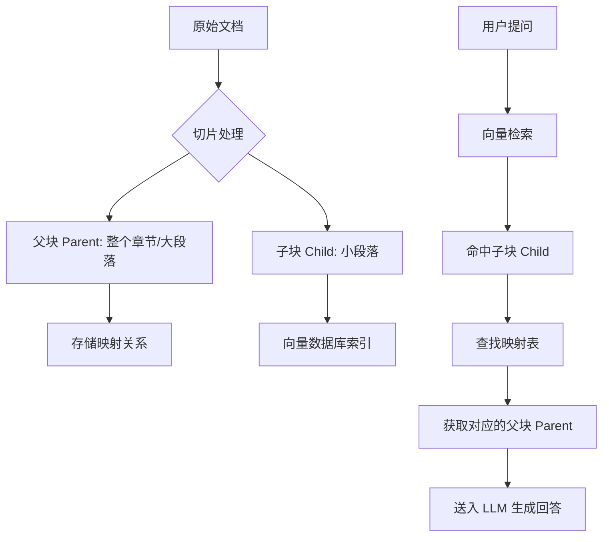
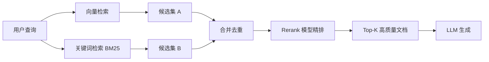

# 第八章：Agent 的知识大脑——RAG 场景深度分析与实战进阶

本章深入讲解RAG的四大场景（智能客服、企业知识库、法律合同审查、代码仓库分析），提供进阶解决方案：Parent-Child切片策略解决上下文断裂、混合检索+Rerank提升精度、AST切片处理代码分析。附带企业IT运维知识库助手的完整实战案例。
## 8.1 核心概念：为什么 Agent 需要 RAG？
在深入场景之前，我们需要理解 RAG（Retrieval-Augmented Generation，检索增强生成）对于 Agent 的意义。
### 8.1.1 大模型的“失忆”困境
想象一下，你让一个聪明的学生（LLM）去参加一场闭卷考试。虽然他才华横溢，但他不知道你们公司的内部规章，也不知道昨天刚发布的新闻。这就是大模型的痛点：
*   **知识滞后**：训练数据截止后发生的事情一无所知。
*   **私有数据缺失**：无法访问企业内部文档、代码库等非公开数据。
*   **幻觉问题**：为了回答问题，可能会一本正经地胡说八道。
### 8.1.2 RAG 的本质：开卷考试
RAG 的核心逻辑就是给这个学生发一本“参考书”，并允许他“翻书”答题。
1.  **检索**：当问题来临时，先去参考书（知识库）里找到相关的章节。
2.  **增强**：把找到的章节内容贴在问题的后面，作为提示词的一部分。
3.  **生成**：让大模型基于这些“参考资料”回答问题。
对于 Agent 而言，RAG 就是它的**长期记忆外挂**。没有 RAG，Agent 只能是一个聊天机器人；有了 RAG，Agent 才能成为处理具体业务的专家。
---
## 8.2 场景分类与痛点深度剖析
RAG 并非万能药，不同场景下的难度天差地别。我们将应用场景分为四个层级，难度依次递增。
### 场景一：智能客服与 FAQ 问答（入门级）
*   **特征**：问题标准，答案短小。例如：“退货流程是什么？”“WiFi 密码多少？”
*   **痛点**：
    *   **口语化鸿沟**：用户问“卡得要死怎么办”，知识库里写的是“网络延迟高的排查步骤”。
    *   **变体繁多**：“无法开机”、“开不了机”、“黑屏”其实是同一个问题。
*   **关键点**：主要考验语义匹配能力，不需要复杂的文档解析。
### 场景二：企业内部知识库（进阶级）
*   **特征**：文档格式复杂（PDF、Word、Wiki）、包含大量表格、流程图。
*   **痛点**：
    *   **切片难题**：如果按固定字符数切分，表格会被切碎，导致语义丢失（如表格第一列在上一段，第二列在下一段）。
    *   **权限隔离**：普通员工不能看到高管专属文档，检索时需过滤权限。
    *   **数据更新**：文档修改后，知识库需要实时同步，否则会产生“过期知识”。
### 场景三：法律/金融合同审查（专家级）
*   **特征**：容错率极低，必须“有据可查”。
*   **痛点**：
    *   **大海捞针**：在 200 页的合同中找到“违约责任”条款。
    *   **逻辑推理**：不仅要找，还要对比（如“这份合同与标准模板的差异在哪里？”）。
    *   **幻觉零容忍**：严禁模型编造条款，必须引用原文。
### 场景四：代码仓库分析（特异级）
*   **特征**：非自然语言，具有严格的语法结构和依赖关系。
*   **痛点**：
    *   **跨文件依赖**：理解一个函数，往往需要同时看它引用的头文件和父类。
    *   **语法敏感**：传统的自然语言 Embedding 模型很难理解 `func_a` 调用 `func_b` 的逻辑关系。
---
## 8.3 核心解决方案与技术原理
针对上述痛点，通用的 RAG 架构往往失效。以下是经过验证的进阶解决方案。
### 方案一：Parent-Child 切片策略（解决上下文断裂）
**设计原理**：
传统的切片方式是“切片-索引-检索-返回切片”。这会导致检索到的内容可能只是只言片语，缺乏上下文。
**Parent-Child 策略**采用“小索引，大返回”的思路：
*   **Child（子块）**：将文档切分成小块（如 128 tokens），便于精准匹配用户提问。
*   **Parent（父块）**：保留子块所属的大块文档（如 1024 tokens 或整个章节）。
*   **流程**：检索时命中了“子块”，但返回给 LLM 的是“父块”。
**流程图示**：

```mermaid
graph TD
    A[原始文档] --> B{切片处理}
    B --> C[父块 Parent: 整个章节/大段落]
    B --> D[子块 Child: 小段落]
    
    C --> E[存储映射关系]
    D --> F[向量数据库索引]
    
    G[用户提问] --> H[向量检索]
    H --> I[命中子块 Child]
    I --> J[查找映射表]
    J --> K[获取对应的父块 Parent]
    K --> L[送入 LLM 生成回答]
```
### 方案二：混合检索 + Rerank（解决精度不足）
**设计原理**：
单一检索方式有缺陷：
*   **向量检索**：擅长语义匹配，但对专有名词（如型号“X-2000”、合同编号）匹配较差。
*   **关键词检索（BM25）**：擅长精确匹配，但不懂语义。
**混合检索**结合两者之长，再引入 **Rerank（重排序）** 模型进行精排。
**流程图示**：

```mermaid
graph LR
    A[用户查询] --> B[向量检索]
    A --> C[关键词检索 BM25]
    
    B --> D[候选集 A]
    C --> E[候选集 B]
    
    D --> F[合并去重]
    E --> F
    
    F --> G[Rerank 模型精排]
    G --> H[Top-K 高质量文档]
    H --> I[LLM 生成]
```
### 方案三：代码 AST 切片（解决代码分析）
**设计原理**：
代码不能按行数切。要利用 **AST（抽象语法树）** 识别代码结构，按函数或类进行切片。同时，利用 **知识图谱** 补充上下文。
**策略**：
1.  **切片**：识别 `Class` 和 `Function` 节点作为独立切片。
2.  **图谱**：解析 Import 关系和调用关系。
3.  **检索**：当检索到函数 A 时，自动通过图谱召回函数 A 调用的函数 B，一起提供给 LLM。
---
## 8.4 实战演练：构建企业级知识库助手
为了将理论落地，我们设计一个具体的实战案例：**企业 IT 运维知识库助手**。
### 8.4.1 场景设计
*   **输入**：企业内部的运维手册（含大量 PDF 表格，如端口配置表）、故障排查 Wiki。
*   **用户**：“服务器红灯闪烁怎么办？”、“查一下 10.0.0.1 对应的服务配置。”
*   **目标**：准确回答，并标注出处。
### 8.4.2 技术选型
| 组件类型 | 选型方案 | 理由 |
| :--- | :--- | :--- |
| **编排框架** | LlamaIndex | 相比 LangChain，LlamaIndex 在 RAG 索引策略上更强大，支持 Parent-Child 更方便。 |
| **Embedding** | BGE-M3 (BAAI) | 开源最强，支持中英文长文本，且对表格语义理解较好。 |
| **向量库** | Milvus | 支持混合检索，性能强悍，适合生产环境。 |
| **解析工具** | Unstructured.io | 能够自动识别 PDF 中的表格并转为 Markdown 格式，保留结构。 |
| **重排序** | BGE-Reranker | 开源可用，提升 Top-1 准确率的关键。 |
### 8.4.3 详细实施步骤
#### 步骤 1：环境准备与文档解析
首先，我们需要解析 PDF，避免破坏表格结构。
```python
# 伪代码示例：使用 Unstructured 解析 PDF
from unstructured.partition.pdf import partition_pdf
def parse_pdf(file_path):
    # 解析 PDF，策略为 'hi_res' 以识别表格
    elements = partition_pdf(
        filename=file_path,
        strategy="hi_res",
        infer_table_structure=True  # 关键：推断表格结构
    )
    
    # 将表格转换为 Markdown 格式存储
    content_list = []
    for el in elements:
        if el.category == "Table":
            content_list.append(el.metadata.text_as_html) # 或转 Markdown
        else:
            content_list.append(el.text)
    return content_list
```
#### 步骤 2：构建 Parent-Child 索引
利用 LlamaIndex 的 `RecursiveRetriever` 实现层级检索。
```python
# 伪代码示例：构建层级索引
from llama_index.core import VectorStoreIndex, SimpleDirectoryReader
from llama_index.core.node_parser import SimpleNodeParser
from llama_index.core.schema import IndexNode
# 1. 加载文档
documents = SimpleDirectoryReader("./data").load_data()
# 2. 定义切分器
# Parent: 大块 (例如 1024)
parent_parser = SimpleNodeParser.from_defaults(chunk_size=1024)
# Child: 小块 (例如 256)
child_parser = SimpleNodeParser.from_defaults(chunk_size=256)
# 3. 生成节点
parent_nodes = parent_parser.get_nodes_from_documents(documents)
child_nodes = child_parser.get_nodes_from_documents(documents)
# 4. 建立映射关系：子节点需要知道自己属于哪个父节点
# (此处逻辑较为复杂，LlamaIndex 通常通过 doc_id 关联，实际开发建议直接使用其封装好的 RecursiveRetriever)
# 简化逻辑：将所有子节点存入向量库，但元数据中记录 parent_id
for node in child_nodes:
    node.metadata["parent_id"] = node.ref_doc_id 
    # 实际存储时，需要根据具体的 VectorStore 实现存储逻辑
```
#### 步骤 3：配置混合检索与 Rerank
这是提升准确率的核心步骤。
```python
# 伪代码示例：配置 Rerank
from llama_index.core.postprocessor import SentenceTransformerRerank
# 定义 Rerank 后处理器
reranker = SentenceTransformerRerank(
    model="BAAI/bge-reranker-large", # 使用 BGE Reranker
    top_n=3 # 只保留重排序后的前 3 个文档
)
# 构建查询引擎
index = VectorStoreIndex.from_documents(documents)
query_engine = index.as_query_engine(
    similarity_top_k=10, # 初始召回 10 个，防止漏掉
    node_postprocessors=[reranker] # 加入 Rerank 流程
)
```
#### 步骤 4：执行查询与溯源
最后，让 Agent 执行查询，并要求其引用原文。
```python
response = query_engine.query("服务器红灯闪烁怎么办？")
print(response.response)
# 打印引用来源
for node in response.source_nodes:
    print(f"来源文档: {node.node.metadata['file_name']}")
    print(f"相关内容片段: {node.node.text[:100]}...")
```
### 8.4.4 关键配置说明
*   **Chunk Size 调优**：对于运维手册，建议 Child 切片设为 200-300 tokens，Parent 设为 1000-1500 tokens。过小会导致信息碎片化，过大会引入噪音。
*   **表格处理**：如果不使用 `Unstructured` 这种高级工具，简单的 PDF 解析器会将表格读成乱码。**务必验证解析后的文本是否包含完整的表格内容**。
---
## 8.5 组件选型速查表
为了方便大家在实际工作中快速选型，整理了以下对比表：
| 你的场景 | 推荐方案组合 | 核心组件推荐 | 理由 |
| :--- | :--- | :--- | :--- |
| **个人学习 / Demo** | 简单向量检索 | OpenAI Embedding + Chroma + LangChain | 开发最快，无需运维，代码量最少。 |
| **企业知识库 (文档杂乱)** | 混合检索 + 重排序 | Unstructured + Milvus + LlamaIndex + BGE-Reranker | **生产级标配**。解决表格解析难、召回不准的问题。 |
| **不想写代码 / 快速落地** | 开源成品部署 | **Dify** 或 **FastGPT** | 国产开源之光。可视化拖拽，内置 RAG 管道，半小时上线。 |
| **代码分析 / 研发助手** | AST 切片 + 图谱 | LlamaIndex (Code Splitter) + Neo4j | 代码不仅是文本，更是结构。图谱能解决跨文件跳转问题。 |
---
## 8.6 总结与避坑指南
本章我们完成了从 RAG 基础理论到复杂场景实战的跨越。
**自学者常见误区：**
1.  **迷信向量检索**：认为向量检索能解决一切匹配问题。实际上，对于精确词汇（如型号、ID），必须结合关键词检索（BM25）。
2.  **忽视文档解析**：把 PDF 当纯文本读，导致表格信息丢失。**数据质量决定上限**，解析环节投入 50% 的精力是值得的。
3.  **忽略 Rerank**：检索 Top-10 后直接扔给 LLM。加上一个轻量级的 Rerank 模型，往往能带来 20% 以上的准确率提升，是性价比最高的优化手段。
下一章预告：我们将进入 **Agent 的规划与推理** 章节，探讨如何让 LLM 像人类一样思考，拆解复杂任务。

---

## 8.7 补充内容：工程化实践要点

### 8.7.1 RAG效果评估体系

**常见问题场景：**
RAG系统上线后效果难以量化评估。不知道检索是否真的找到了相关内容，生成的回答是否基于检索结果。

**解决思路与方案：**
- 检索评估指标：Recall@K、Precision@K、MRR、NDCG
- 生成评估指标：Answer Relevance、Factual Accuracy
- 建立人工评估流程，定期抽检
- 使用LLM-as-Judge进行自动化评估

### 8.7.2 RAG性能优化

**常见问题场景：**
检索速度慢，拖累了整体响应时间。用户等待时间过长，体验很差。

**解决思路与方案：**
- 优化向量索引结构
- 使用近似最近邻算法（ANN）
- 结果缓存：相同query直接返回缓存
- 预热：系统启动时预先加载热点数据

### 8.7.3 文档解析质量保障

**常见问题场景：**
上传的PDF解析后内容混乱，表格被截断、图片说明丢失。检索质量受到严重影响。

**解决思路与方案：**
- 使用专业的文档解析工具（Unstructured、Pymupdf）
- 建立解析质量检测机制
- 人工抽检解析结果
- 针对特殊格式（表格、图表）专项优化
