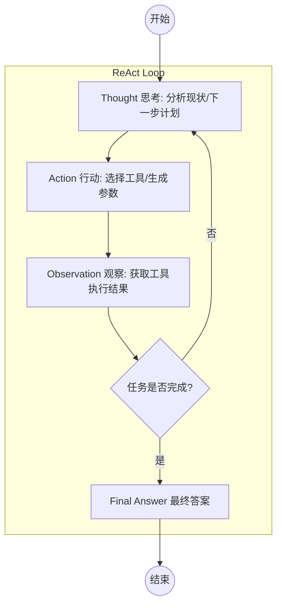
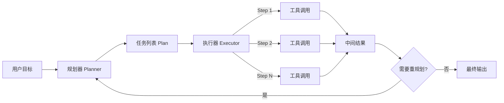

# 第九章：规划与推理——Planning & Reasoning

本章探讨Agent从"执行者"到"规划师"的进化，讲解思维链(CoT)、思维树(ToT)等推理范式，以及ReAct、Plan-and-Execute、Self-Reflection等经典规划架构。提供避免死循环、粒度控制、幻觉规划等挑战的优化策略。

## 9.1 引言：从"执行者"到"规划师"
在前面的章节中，我们赋予了 Agent 感知环境、记忆上下文和调用工具的能力。此时，Agent 像是一个听话的"执行者"——你让它查天气，它就查天气；你让它写代码，它就写代码。

然而，面对一个宏大的目标（例如："帮我分析竞品并生成一份投资建议报告"），如果 Agent 只是被动地响应每一条指令，往往会显得支离破碎、缺乏逻辑，甚至陷入"为了行动而行动"的盲目状态。
**规划与推理能力，是 Agent 从"对话机器人"进化为"智能体"的分水岭。** 它使得 Agent 能够像人类项目经理一样，将复杂目标拆解为可执行的子任务，并在执行过程中进行逻辑推演、动态调整和自我修正。这对应着人类认知中的 **System 2（慢思考）** 系统——负责逻辑、推理和决策，而非仅仅依赖直觉的 System 1。

## 9.2 基础推理范式：思维的脚手架
推理是规划的基石。在大模型（LLM）语境下，推理能力主要通过 Prompt Engineering（提示工程）激发。

### 9.2.1 思维链：逐步推理
CoT 的核心思想是 **"Let's think step by step"**。它打破了"输入-输出"的直达模式，强制模型输出中间推理步骤。

*   **原理类比**：就像学生在做数学题时，必须写出"解：设x为...，因为...，所以..."，而不是直接写答案。这激活了模型内部的逻辑通路。

*   **适用场景**：数学计算、逻辑谜题、符号操作。

*   **局限性**：CoT 是线性的、单向的。它不具备回溯能力。一旦中间某一步推理错误（幻觉），后续步骤会基于错误继续推导，最终结果必然错误，且很难定位问题源头。

### 9.2.2 思维树：多路径探索
ToT 是对 CoT 的升级，它将推理过程建模为一棵树，而非一条线。模型在每一步都可以生成多个可能的后续步骤，并进行评估和搜索。

*   **核心机制**：

    1.  **分解**：将问题拆解为多个思维步骤。

    2.  **生成**：每一步生成多个候选方案。

    3.  **评估**：模型自我评估每个方案的可行性（如：1-10分）。

    4.  **搜索**：使用广度优先搜索（BFS）或深度优先搜索（DFS）选择最优路径。如果路径不通，可以回溯。

*   **适用场景**：复杂的决策问题（如游戏策略）、创意写作（构思大纲）、需要全局最优解的任务。

---

## 9.3 经典规划架构：ReAct (Reason + Act)
ReAct 是目前 Agent 开发中最主流的架构模式。它将"推理"和"行动"交织在一起，形成了一个感知-决策-行动的闭环。

### 9.3.1 ReAct 循环流程图
ReAct 的核心在于"三步走"循环，直到任务完成。



### 9.3.2 实战案例设计与步骤
**案例背景**：用户询问"苹果公司最新的股价是多少？如果买入100股需要多少钱？"
**设计思路**：

1.  Agent 需要具备搜索工具。

2.  Agent 需要具备计算工具（乘法）。

3.  Agent 必须先获取股价，才能计算总价，存在依赖关系。
**详细步骤示例**：
**第 1 轮迭代：**

*   **User Input**: 苹果公司最新的股价是多少？如果买入100股需要多少钱？

*   **Thought**: 用户想知道苹果股价和总成本。我首先需要查询苹果公司（AAPL）的当前实时股价。我还没有这个信息。

*   **Action**: `use_tool: search_stock_ticker`

*   **Action Input**: `{"symbol": "AAPL"}`
**第 2 轮迭代（系统返回结果）：**

*   **Observation**: 当前股价为 178.50 美元。

*   **Thought**: 我已经获取了股价 178.50 美元。现在我需要计算买入 100 股的总成本。计算公式是 178.50 * 100。

*   **Action**: `use_tool: calculator`

*   **Action Input**: `{"expression": "178.50 * 100"}`
**第 3 轮迭代（系统返回结果）：**

*   **Observation**: 17850.0

*   **Thought**: 我已经计算出了总成本。我现在掌握了用户需要的所有信息，可以回答了。

*   **Final Answer**: 苹果公司最新的股价是 178.50 美元。如果您买入 100 股，总共需要 17,850 美元。

### 9.3.3 ReAct 的局限
虽然 ReAct 灵活性强，但它也存在明显短板：

1.  **缺乏全局观**：它是"走一步看一步"，对于需要长程规划的任务（如"制定一份为期一个月的减肥计划"），容易在中途偏离目标。

2.  **Token 消耗大**：每次循环都需要把历史 Thought、Action、Observation 重新喂给模型，上下文容易溢出。

3.  **容易死循环**：如果工具返回报错，模型可能会不断重试相同的 Action，陷入死胡同。

---

## 9.4 进阶规划模式
为了解决 ReAct 在复杂任务中的不足，我们需要引入更高级的架构。

### 9.4.1 Plan-and-Execute（规划-执行分离）
这种模式借鉴了软件工程中的"架构设计"与"编码实现"分离的思想。
**架构设计图**：


**设计思路**：
将 Agent 拆分为两个角色：

1.  **Planner（规划者）**：只负责拆解任务，不执行。输出一个清晰的任务列表。

2.  **Executor（执行者）**：按部就班执行任务列表中的每一项。

3.  **Replanner（重规划者）**：如果执行器报错或环境变化，动态调整计划。
**详细步骤示例**：
**目标**：撰写一份关于"生成式AI在医疗领域应用"的调研报告。
**Phase 1: Planning (规划阶段)**

*   **Planner Output**:

    1.  搜索生成式AI在医疗影像诊断中的应用案例。

    2.  搜索生成式AI在药物研发中的应用案例。

    3.  整理上述案例的核心技术路线。

    4.  撰写报告摘要。
**Phase 2: Execution (执行阶段)**

*   **Executor (Step 1)**: 调用搜索工具 -> 返回影像诊断案例文本。

*   **Executor (Step 2)**: 调用搜索工具 -> 返回药物研发案例文本。

*   **Executor (Step 3)**: 调用总结工具 -> 输入前两步文本 -> 输出技术路线总结。

*   **Executor (Step 4)**: 调用写作工具 -> 输入总结 -> 输出报告摘要。
**优势与劣势**：

*   **优势**：结构清晰，不易跑偏，执行过程可中断、可并行（如果有依赖关系）。

*   **劣势**：不如 ReAct 灵活。如果第一步规划就是错的（例如搜索关键词选错），后续执行都是无用功。

### 9.4.2 Self-Reflection（自我反思）
这是赋予 Agent "自我进化"能力的关键。在 Agent 执行动作后，增加一个"批评家"角色进行审查。
**流程设计**：

1.  **Draft**：生成草稿或执行代码。

2.  **Critic**：模型以第三视角评估。Prompt示例："请检查上述 Python 代码是否存在潜在的 Bug 或未处理的异常。"

3.  **Refine**：根据批评意见修改并重新执行。
**应用场景**：代码生成、复杂 SQL 查询。例如，生成 SQL 后，先让 LLM 检查语法是否正确、是否会引起全表扫描，确认无误后再提交数据库执行。

---

## 9.5 规划的挑战与优化策略
在实际开发中，规划能力往往受限于模型能力和环境噪声，以下是常见问题及解决方案。

### 9.5.1 避免"死循环"与"原地打转"

**问题**：Agent 尝试调用工具 A 失败 -> 重试 -> 再失败 -> 再重试... 消耗大量 Token 且无进展。

**解决方案**：引入"失败阈值"和"降级策略"。

*   **阈值控制**：如果同一个 Action 连续失败 3 次，强制停止循环。

*   **错误归因**：Prompt 引导模型分析失败原因。如果是参数错误，修正参数；如果是工具不可用，更换工具。

### 9.5.2 规划的粒度控制

**问题**：规划太粗（如"赚钱"）无法执行；规划太细（如"打开浏览器"、"点击按钮"）容易受环境影响且脆弱。

**解决方案**：**动态粒度（分层规划）**。

*   **高层 Planner**：只规划宏观步骤（如"收集数据"、"分析数据"）。

*   **底层 Worker Agent**：针对"收集数据"这一步，再启动一个 ReAct 循环去具体执行细节。

### 9.5.3 幻觉规划

**问题**：模型可能会规划出它根本不具备的工具，例如 Action: `send_email`，但实际上系统没有接入邮件工具。

**解决方案**：

*   **Tool Constraints**：在 System Prompt 中明确列出可用工具的清单和描述。

*   **校验层**：在执行 Action 前，代码层先校验 Action Name 是否在白名单内，若不存在，直接返回 Observation: "Error: Tool not found"。

## 9.6 本章小结

规划与推理是 Agent 的"大脑皮层"，决定了智能体解决问题的上限。

**核心规划范式**：

*   **ReAct** 提供了灵活的"边想边做"范式，适合处理动态性强、步骤较少的任务。

*   **Plan-and-Execute** 提供了结构化的"谋定后动"范式，适合处理复杂、长链条的任务。

*   **Self-Reflection** 提供了纠错机制，提高了任务完成的成功率。

**分形递归任务规划（9.5节）**：

*   **任务存储**：SQLite持久化，支持任务树查询和状态追踪

*   **状态更新**：状态机转换规则，父子任务联动

*   **任务恢复**：检查点保存，从断点恢复执行

*   **取消任务**：递归取消子任务，记录取消原因

*   **分形分解**：LLM驱动递归分解为原子化任务

*   **Sub-Agent池**：并行执行原子任务，提高效率

在实际开发中，建议根据任务复杂度选择架构：简单任务用 ReAct，复杂任务用 Plan-and-Execute + Reflection，巨型任务用分形递归规划。

下一章，我们将进入多智能体领域，探讨如何通过协作让 Agent 突破单体能力的极限。

---

## 9.7 补充内容：工程化实践要点

### 9.7.1 规划成功率监控

**常见问题场景：**

Agent 规划失败或陷入循环，消耗大量 Token 但没有任何有效产出。缺乏监控手段，问题往往要等到账单来了才发现。

**解决思路与方案：**

规划过程的关键监控指标：**循环次数**、**Token 消耗速率**、**工具调用重复率**。

```python
import time
from typing import List, Dict, Optional
from dataclasses import dataclass, field
from collections import Counter

@dataclass
class PlanningMetrics:
    """规划执行指标收集器"""
    task_id: str
    start_time: float = field(default_factory=time.time)
    iterations: int = 0
    total_tokens: int = 0
    tool_calls: List[str] = field(default_factory=list)
    errors: List[str] = field(default_factory=list)
    status: str = "running"  # running | success | failed | timeout | loop_detected
    
    def record_iteration(self, thought: str, action: str, tokens_used: int):
        self.iterations += 1
        self.total_tokens += tokens_used
        if action:
            self.tool_calls.append(action)
    
    def detect_loop(self, window: int = 5) -> bool:
        """
        检测死循环：如果最近 N 次调用的工具完全相同，视为死循环
        """
        if len(self.tool_calls) < window:
            return False
        recent = self.tool_calls[-window:]
        # 如果最近 5 次全是同一个工具，大概率卡住了
        return len(set(recent)) == 1
    
    def get_summary(self) -> Dict:
        elapsed = time.time() - self.start_time
        tool_counter = Counter(self.tool_calls)
        return {
            "task_id": self.task_id,
            "status": self.status,
            "iterations": self.iterations,
            "total_tokens": self.total_tokens,
            "elapsed_seconds": round(elapsed, 2),
            "tokens_per_second": round(self.total_tokens / max(elapsed, 0.1), 1),
            "most_called_tool": tool_counter.most_common(1)[0] if self.tool_calls else None,
            "errors": self.errors
        }

class PlanningGuard:
    """
    规划保护器：防止死循环和 Token 爆炸
    包在任何 ReAct/Plan-Execute 的主循环外面
    """
    
    def __init__(
        self,
        max_iterations: int = 20,
        max_tokens: int = 50000,
        max_seconds: int = 120,
        loop_window: int = 5
    ):
        self.max_iterations = max_iterations
        self.max_tokens = max_tokens
        self.max_seconds = max_seconds
        self.loop_window = loop_window
    
    def check(self, metrics: PlanningMetrics) -> Optional[str]:
        """
        检查是否需要终止规划，返回终止原因（None 表示正常继续）
        """
        # 循环次数超限
        if metrics.iterations >= self.max_iterations:
            return f"超过最大迭代次数 {self.max_iterations}"
        
        # Token 消耗超限
        if metrics.total_tokens >= self.max_tokens:
            return f"Token 消耗超过上限 {self.max_tokens}"
        
        # 执行时间超限
        elapsed = time.time() - metrics.start_time
        if elapsed >= self.max_seconds:
            return f"执行时间超过 {self.max_seconds} 秒"
        
        # 死循环检测
        if metrics.detect_loop(self.loop_window):
            return f"检测到死循环：工具 '{metrics.tool_calls[-1]}' 连续调用 {self.loop_window} 次"
        
        return None  # 正常，继续

# 使用示例
def run_agent_with_guard(task: str, agent, guard: PlanningGuard):
    metrics = PlanningMetrics(task_id=task[:20])
    
    while True:
        # 执行一轮推理
        result = agent.step(task)
        metrics.record_iteration(
            thought=result.get("thought", ""),
            action=result.get("action", ""),
            tokens_used=result.get("tokens_used", 0)
        )
        
        # 检查是否完成
        if result.get("is_final"):
            metrics.status = "success"
            break
        
        # 检查保护条件
        stop_reason = guard.check(metrics)
        if stop_reason:
            metrics.status = "failed"
            metrics.errors.append(stop_reason)
            print(f"[PlanningGuard] 规划终止: {stop_reason}")
            # 这里可以返回降级结果，而不是直接抛异常
            return {"status": "degraded", "reason": stop_reason, "metrics": metrics.get_summary()}
    
    return {"status": "success", "metrics": metrics.get_summary()}

```

### 9.7.2 规划结果缓存

**常见问题场景：**

相同或高度相似的任务重复进行复杂规划。例如每天早上查询"今日天气 + 新闻摘要"，规划步骤完全一样，没必要每次都让 LLM 重新规划一遍。

**解决思路与方案：**

不是所有任务都适合缓存——只缓存"规划结构"，不缓存具体数据：

```python
import hashlib
import json
import redis
from typing import Optional, List

class PlanCache:
    """
    规划结果缓存：缓存"任务的执行计划"而非执行结果
    适用于 Plan-and-Execute 模式
    """
    
    def __init__(self, redis_client: redis.Redis):
        self.redis = redis_client
    
    def _task_signature(self, task: str, available_tools: List[str]) -> str:
        """
        生成任务签名：基于任务描述 + 可用工具列表
        注意：具体参数（如"查北京天气"的"北京"）不应影响计划签名
        """
        # 先用 LLM 提取任务模板（去掉具体参数），这里简化为关键词提取
        normalized_task = task.strip().lower()
        tools_str = ",".join(sorted(available_tools))
        raw = f"{normalized_task}|{tools_str}"
        return hashlib.md5(raw.encode()).hexdigest()
    
    def get_cached_plan(self, task: str, available_tools: List[str]) -> Optional[List[dict]]:
        """获取缓存的规划结果"""
        sig = self._task_signature(task, available_tools)
        cached = self.redis.get(f"plan:{sig}")
        if cached:
            print(f"[PlanCache] 命中缓存，跳过规划阶段")
            return json.loads(cached)
        return None
    
    def cache_plan(
        self, 
        task: str, 
        available_tools: List[str], 
        plan: List[dict],
        ttl: int = 3600
    ):
        """缓存规划结果"""
        sig = self._task_signature(task, available_tools)
        self.redis.setex(f"plan:{sig}", ttl, json.dumps(plan, ensure_ascii=False))
        print(f"[PlanCache] 规划结果已缓存，TTL={ttl}s")
    
    def invalidate_plan(self, task: str, available_tools: List[str]):
        """手动失效某个规划缓存（工具发生变化时调用）"""
        sig = self._task_signature(task, available_tools)
        self.redis.delete(f"plan:{sig}")

```

> **重要提醒**：规划缓存适用于"固定模式"任务，不适用于动态性强的任务。如果任务包含时间敏感信息（"今天""最新"），TTL 要设短一点，否则缓存的计划可能已经过期。

### 9.7.3 规划与执行的解耦

**常见问题场景：**

规划逻辑和执行逻辑混在一个 1000 行的大函数里，调试时无从下手。一个执行步骤崩了，整个规划过程都要从头来过，浪费已经消耗的 Token。

**解决思路与方案：**

借鉴 CI/CD 的思路：规划产出一份"执行清单"（Plan），执行器消费这份清单，支持断点续执：

```python
import json
import os
from dataclasses import dataclass, field
from typing import List, Optional
from enum import Enum

class StepStatus(Enum):
    PENDING = "pending"
    RUNNING = "running"
    SUCCESS = "success"
    FAILED = "failed"
    SKIPPED = "skipped"

@dataclass
class PlanStep:
    step_id: str
    description: str
    tool_name: str
    tool_params: dict
    status: StepStatus = StepStatus.PENDING
    result: Optional[dict] = None
    error: Optional[str] = None
    dependencies: List[str] = field(default_factory=list)  # 依赖的其他 step_id

@dataclass 
class ExecutionPlan:
    plan_id: str
    task: str
    steps: List[PlanStep]
    checkpoint_path: str  # 检查点文件路径
    
    def save_checkpoint(self):
        """保存当前进度到磁盘，支持断点恢复"""
        checkpoint = {
            "plan_id": self.plan_id,
            "task": self.task,
            "steps": [
                {
                    "step_id": s.step_id,
                    "description": s.description,
                    "tool_name": s.tool_name,
                    "tool_params": s.tool_params,
                    "status": s.status.value,
                    "result": s.result,
                    "error": s.error
                }
                for s in self.steps
            ]
        }
        with open(self.checkpoint_path, "w", encoding="utf-8") as f:
            json.dump(checkpoint, f, ensure_ascii=False, indent=2)
    
    @classmethod
    def load_checkpoint(cls, checkpoint_path: str) -> "ExecutionPlan":
        """从检查点文件恢复执行计划"""
        with open(checkpoint_path, "r", encoding="utf-8") as f:
            data = json.load(f)
        
        steps = [
            PlanStep(
                step_id=s["step_id"],
                description=s["description"],
                tool_name=s["tool_name"],
                tool_params=s["tool_params"],
                status=StepStatus(s["status"]),
                result=s.get("result"),
                error=s.get("error")
            )
            for s in data["steps"]
        ]
        return cls(
            plan_id=data["plan_id"],
            task=data["task"],
            steps=steps,
            checkpoint_path=checkpoint_path
        )
    
    def get_next_step(self) -> Optional[PlanStep]:
        """获取下一个待执行的步骤（已满足依赖条件的）"""
        completed_ids = {s.step_id for s in self.steps if s.status == StepStatus.SUCCESS}
        
        for step in self.steps:
            if step.status != StepStatus.PENDING:
                continue
            # 检查依赖是否已完成
            if all(dep in completed_ids for dep in step.dependencies):
                return step
        return None

class PlanExecutor:
    """执行器：消费 ExecutionPlan，支持断点续执"""
    
    def __init__(self, tool_registry: dict):
        self.tools = tool_registry
    
    def execute(self, plan: ExecutionPlan) -> dict:
        """执行规划，遇到错误保存检查点，下次可从断点继续"""
        while True:
            step = plan.get_next_step()
            if step is None:
                break  # 所有步骤完成或无法继续
            
            step.status = StepStatus.RUNNING
            plan.save_checkpoint()
            
            try:
                tool_func = self.tools.get(step.tool_name)
                if not tool_func:
                    raise ValueError(f"工具 '{step.tool_name}' 未注册")
                
                result = tool_func(**step.tool_params)
                step.result = result
                step.status = StepStatus.SUCCESS
                print(f"[Executor] ✓ {step.description}")
                
            except Exception as e:
                step.error = str(e)
                step.status = StepStatus.FAILED
                plan.save_checkpoint()
                print(f"[Executor] ✗ {step.description}: {e}")
                # 保存检查点后可以选择终止或继续
                break
            
            plan.save_checkpoint()
        
        completed = sum(1 for s in plan.steps if s.status == StepStatus.SUCCESS)
        return {
            "completed_steps": completed,
            "total_steps": len(plan.steps),
            "success_rate": completed / len(plan.steps)
        }

```

用好这套解耦方案，单步执行失败后不需要重新规划，直接从检查点恢复，节省了一大笔 LLM 调用成本。

---

## 9.8 分形递归任务规划与执行

当面对极其复杂的任务时，传统的线性规划往往显得力不从心。分形递归任务规划（Fractal Recursive Planning）将任务视为自相似的分形结构，通过递归分解将复杂任务拆解为原子化子任务，由专门的Sub-Agent负责执行最小化任务单元。

### 9.8.1 分形递归规划原理

```text
┌─────────────────────────────────────────────────────────────────┐
│                    分形递归任务规划架构                            │
├─────────────────────────────────────────────────────────────────┤
│                                                                  │
│                    ┌─────────────────┐                         │
│                    │   根任务 Root    │                         │
│                    │ "完成项目报告"    │                         │
│                    └────────┬────────┘                         │
│                             │ 递归分解                           │
│            ┌────────────────┼────────────────┐                  │
│            ▼                ▼                ▼                  │
│     ┌───────────┐    ┌───────────┐    ┌───────────┐           │
│     │ 子任务1   │    │ 子任务2   │    │ 子任务3   │           │
│     │ 收集资料  │    │ 分析数据  │    │ 撰写报告  │           │
│     └─────┬─────┘    └─────┬─────┘    └─────┬─────┘           │
│           │ 递归分解        │ 递归分解        │ 递归分解          │
│           ▼                ▼                ▼                  │
│     ┌───────────┐    ┌───────────┐    ┌───────────┐           │
│     │ 原子任务  │    │ 原子任务  │    │ 原子任务  │           │
│     │ 搜索网页  │    │ 统计分析  │    │ 写摘要    │           │
│     └───────────┘    └───────────┘    └───────────┘           │
│                                                                  │
│     ┌─────────────────────────────────────────────────┐         │
│     │              Sub-Agent 执行层                    │         │
│     │  ┌─────────┐ ┌─────────┐ ┌─────────┐           │         │
│     │  │Agent-A  │ │Agent-B  │ │Agent-N  │           │         │
│     │  │执行原子  │ │执行原子  │ │执行原子  │           │         │
│     │  │任务-1   │ │任务-2   │ │任务-N   │           │         │
│     │  └─────────┘ └─────────┘ └─────────┘           │         │
│     └─────────────────────────────────────────────────┘         │
│                                                                  │
└─────────────────────────────────────────────────────────────────┘

```

### 9.8.2 核心数据结构

```python
import uuid
import json
from datetime import datetime
from dataclasses import dataclass, field
from typing import Dict, List, Any, Optional, Callable
from enum import Enum
from abc import ABC, abstractmethod

class TaskStatus(Enum):
    """任务状态"""
    PENDING = "pending"           # 待执行
    RUNNING = "running"           # 执行中
    SUCCESS = "success"           # 成功完成
    FAILED = "failed"             # 执行失败
    CANCELLED = "cancelled"      # 已取消
    BLOCKED = "blocked"           # 被阻塞（等待依赖）

class TaskPriority(Enum):
    """任务优先级"""
    CRITICAL = 1   # 关键
    HIGH = 2       # 高
    MEDIUM = 3     # 中
    LOW = 4        # 低

@dataclass
class TaskContext:
    """任务上下文"""
    session_id: str
    user_id: str
    original_goal: str
    constraints: Dict[str, Any] = field(default_factory=dict)
    shared_data: Dict[str, Any] = field(default_factory=dict)  # 子任务间共享数据

@dataclass
class Task:
    """
    任务单元
    支持递归嵌套和状态跟踪
    """
    task_id: str = field(default_factory=lambda: str(uuid.uuid4()))
    parent_id: Optional[str] = None           # 父任务ID
    children_ids: List[str] = field(default_factory=list)  # 子任务IDs
    
    # 任务描述
    title: str = ""
    description: str = ""
    expected_output: str = ""
    
    # 执行信息
    assigned_agent: Optional[str] = None      # 分配的Sub-Agent ID
    status: TaskStatus = TaskStatus.PENDING
    priority: TaskPriority = TaskPriority.MEDIUM
    
    # 依赖关系
    dependencies: List[str] = field(default_factory=list)  # 依赖的任务IDs
    
    # 执行结果
    result: Any = None
    error: Optional[str] = None
    retry_count: int = 0
    max_retries: int = 3
    
    # 时间追踪
    created_at: datetime = field(default_factory=datetime.now)
    started_at: Optional[datetime] = None
    completed_at: Optional[datetime] = None
    estimated_duration: int = 0  # 秒
    
    # 原子化标记
    is_atomic: bool = False  # 是否为原子任务
    atomic_depth: int = 0    # 原子化深度
    
    # 元数据
    metadata: Dict[str, Any] = field(default_factory=dict)
    
    def to_dict(self) -> Dict:
        """序列化为字典"""
        return {
            "task_id": self.task_id,
            "parent_id": self.parent_id,
            "children_ids": self.children_ids,
            "title": self.title,
            "description": self.description,
            "expected_output": self.expected_output,
            "assigned_agent": self.assigned_agent,
            "status": self.status.value,
            "priority": self.priority.value,
            "dependencies": self.dependencies,
            "result": self.result,
            "error": self.error,
            "retry_count": self.retry_count,
            "max_retries": self.max_retries,
            "created_at": self.created_at.isoformat(),
            "started_at": self.started_at.isoformat() if self.started_at else None,
            "completed_at": self.completed_at.isoformat() if self.completed_at else None,
            "estimated_duration": self.estimated_duration,
            "is_atomic": self.is_atomic,
            "atomic_depth": self.atomic_depth,
            "metadata": self.metadata
        }
    
    @classmethod
    def from_dict(cls, data: Dict) -> "Task":
        """从字典反序列化"""
        return cls(
            task_id=data["task_id"],
            parent_id=data.get("parent_id"),
            children_ids=data.get("children_ids", []),
            title=data.get("title", ""),
            description=data.get("description", ""),
            expected_output=data.get("expected_output", ""),
            assigned_agent=data.get("assigned_agent"),
            status=TaskStatus(data.get("status", "pending")),
            priority=TaskPriority(data.get("priority", 3)),
            dependencies=data.get("dependencies", []),
            result=data.get("result"),
            error=data.get("error"),
            retry_count=data.get("retry_count", 0),
            max_retries=data.get("max_retries", 3),
            created_at=datetime.fromisoformat(data["created_at"]) if "created_at" in data else datetime.now(),
            started_at=datetime.fromisoformat(data["started_at"]) if data.get("started_at") else None,
            completed_at=datetime.fromisoformat(data["completed_at"]) if data.get("completed_at") else None,
            estimated_duration=data.get("estimated_duration", 0),
            is_atomic=data.get("is_atomic", False),
            atomic_depth=data.get("atomic_depth", 0),
            metadata=data.get("metadata", {})
        )

```

### 9.8.3 任务存储与管理

```python
import sqlite3
from pathlib import Path
from typing import Generator

class TaskStorage:
    """
    任务持久化存储
    支持SQLite数据库存储任务状态
    """
    
    def __init__(self, db_path: str = "./tasks.db"):
        self.db_path = db_path
        self._init_db()
    
    def _init_db(self):
        """初始化数据库"""
        conn = sqlite3.connect(self.db_path)
        cursor = conn.cursor()
        
        cursor.execute("""
            CREATE TABLE IF NOT EXISTS tasks (
                task_id TEXT PRIMARY KEY,
                parent_id TEXT,
                children_ids TEXT,  -- JSON数组
                title TEXT,
                description TEXT,
                expected_output TEXT,
                assigned_agent TEXT,
                status TEXT,
                priority INTEGER,
                dependencies TEXT,  -- JSON数组
                result TEXT,
                error TEXT,
                retry_count INTEGER,
                max_retries INTEGER,
                created_at TEXT,
                started_at TEXT,
                completed_at TEXT,
                estimated_duration INTEGER,
                is_atomic INTEGER,
                atomic_depth INTEGER,
                metadata TEXT,  -- JSON
                FOREIGN KEY (parent_id) REFERENCES tasks(task_id)
            )
        """)
        
        cursor.execute("""
            CREATE INDEX IF NOT EXISTS idx_status ON tasks(status)
        """)
        
        cursor.execute("""
            CREATE INDEX IF NOT EXISTS idx_parent ON tasks(parent_id)
        """)
        
        conn.commit()
        conn.close()
    
    def save_task(self, task: Task):
        """保存任务"""
        conn = sqlite3.connect(self.db_path)
        cursor = conn.cursor()
        
        cursor.execute("""
            INSERT OR REPLACE INTO tasks (
                task_id, parent_id, children_ids, title, description,
                expected_output, assigned_agent, status, priority,
                dependencies, result, error, retry_count, max_retries,
                created_at, started_at, completed_at, estimated_duration,
                is_atomic, atomic_depth, metadata
            ) VALUES (?, ?, ?, ?, ?, ?, ?, ?, ?, ?, ?, ?, ?, ?, ?, ?, ?, ?, ?, ?, ?)
        """, (
            task.task_id,
            task.parent_id,
            json.dumps(task.children_ids),
            task.title,
            task.description,
            task.expected_output,
            task.assigned_agent,
            task.status.value,
            task.priority.value,
            json.dumps(task.dependencies),
            json.dumps(task.result) if task.result else None,
            task.error,
            task.retry_count,
            task.max_retries,
            task.created_at.isoformat(),
            task.started_at.isoformat() if task.started_at else None,
            task.completed_at.isoformat() if task.completed_at else None,
            task.estimated_duration,
            int(task.is_atomic),
            task.atomic_depth,
            json.dumps(task.metadata)
        ))
        
        conn.commit()
        conn.close()
    
    def get_task(self, task_id: str) -> Optional[Task]:
        """获取任务"""
        conn = sqlite3.connect(self.db_path)
        cursor = conn.cursor()
        
        cursor.execute("SELECT * FROM tasks WHERE task_id = ?", (task_id,))
        row = cursor.fetchone()
        conn.close()
        
        if not row:
            return None
        
        return self._row_to_task(row)
    
    def _row_to_task(self, row: tuple) -> Task:
        """行数据转换为Task对象"""
        columns = [
            "task_id", "parent_id", "children_ids", "title", "description",
            "expected_output", "assigned_agent", "status", "priority",
            "dependencies", "result", "error", "retry_count", "max_retries",
            "created_at", "started_at", "completed_at", "estimated_duration",
            "is_atomic", "atomic_depth", "metadata"
        ]
        
        data = dict(zip(columns, row))
        data["children_ids"] = json.loads(data["children_ids"] or "[]")
        data["dependencies"] = json.loads(data["dependencies"] or "[]")
        data["result"] = json.loads(data["result"]) if data["result"] else None
        data["metadata"] = json.loads(data["metadata"] or "{}")
        data["is_atomic"] = bool(data["is_atomic"])
        
        return Task.from_dict(data)
    
    def get_tasks_by_status(self, status: TaskStatus) -> List[Task]:
        """按状态获取任务"""
        conn = sqlite3.connect(self.db_path)
        cursor = conn.cursor()
        
        cursor.execute("SELECT * FROM tasks WHERE status = ?", (status.value,))
        rows = cursor.fetchall()
        conn.close()
        
        return [self._row_to_task(row) for row in rows]
    
    def get_children(self, parent_id: str) -> List[Task]:
        """获取子任务"""
        conn = sqlite3.connect(self.db_path)
        cursor = conn.cursor()
        
        cursor.execute("SELECT * FROM tasks WHERE parent_id = ?", (parent_id,))
        rows = cursor.fetchall()
        conn.close()
        
        return [self._row_to_task(row) for row in rows]
    
    def delete_task(self, task_id: str):
        """删除任务"""
        conn = sqlite3.connect(self.db_path)
        cursor = conn.cursor()
        cursor.execute("DELETE FROM tasks WHERE task_id = ?", (task_id,))
        conn.commit()
        conn.close()
    
    def get_subtree(self, root_id: str) -> List[Task]:
        """获取任务树（递归）"""
        result = []
        
        def traverse(task_id: str):
            task = self.get_task(task_id)
            if task:
                result.append(task)
                for child_id in task.children_ids:
                    traverse(child_id)
        
        traverse(root_id)
        return result

```

### 9.8.4 分形递归任务分解器

```python
class FractalTaskDecomposer:
    """
    分形递归任务分解器
    将复杂任务递归分解为原子化子任务
    """
    
    # 原子化阈值：任务描述长度或复杂度低于此值时停止分解
    ATOMIC_THRESHOLD = {
        "min_description_length": 50,    # 最少描述字数
        "max_depth": 5,                   # 最大递归深度
        "min_tools_required": 1,         # 最少工具数
        "max_children": 10                # 每个节点最大子任务数
    }
    
    def __init__(self, llm_service, max_depth: int = 5):
        self.llm = llm_service
        self.max_depth = max_depth
    
    def decompose(
        self, 
        task: Task, 
        context: TaskContext,
        depth: int = 0
    ) -> Task:
        """
        递归分解任务
        
        Args:
            task: 待分解任务
            context: 任务上下文
            depth: 当前递归深度
        """
        # 检查是否应该停止分解
        if self._should_stop_decomposition(task, depth):
            task.is_atomic = True
            task.atomic_depth = depth
            return task
        
        # 调用LLM分析任务结构
        subtasks = self._generate_subtasks(task, context, depth)
        
        if not subtasks:
            # 无法分解，作为原子任务
            task.is_atomic = True
            task.atomic_depth = depth
            return task
        
        # 创建子任务
        children = []
        for i, subtask_data in enumerate(subtasks):
            child_task = Task(
                parent_id=task.task_id,
                title=subtask_data.get("title", f"子任务{i+1}"),
                description=subtask_data.get("description", ""),
                expected_output=subtask_data.get("expected_output", ""),
                dependencies=subtask_data.get("dependencies", []),
                priority=self._map_priority(subtask_data.get("priority", "medium")),
                atomic_depth=depth + 1
            )
            
            # 递归分解子任务
            child_task = self.decompose(child_task, context, depth + 1)
            children.append(child_task)
        
        # 更新父任务
        task.children_ids = [c.task_id for c in children]
        
        return task
    
    def _should_stop_decomposition(self, task: Task, depth: int) -> bool:
        """判断是否应该停止分解"""
        # 超过最大深度
        if depth >= self.max_depth:
            return True
        
        # 已经是原子标记
        if task.is_atomic:
            return True
        
        # 描述过短
        if len(task.description) < self.ATOMIC_THRESHOLD["min_description_length"]:
            # 检查是否可以用单个工具完成
            return len(task.dependencies) <= self.ATOMIC_THRESHOLD["min_tools_required"]
        
        return False
    
    def _generate_subtasks(
        self, 
        task: Task, 
        context: TaskContext,
        depth: int
    ) -> List[Dict]:
        """调用LLM生成子任务"""
        prompt = f"""
        任务: {task.title}
        描述: {task.description}
        预期输出: {task.expected_output}
        当前深度: {depth}/{self.max_depth}
        
        请将此任务分解为2-5个子任务。每个子任务需要包含：

        - title: 任务标题

        - description: 任务详细描述

        - expected_output: 预期输出

        - dependencies: 依赖的其他子任务ID列表（用数字表示，如[1,2]表示依赖第1和第2个子任务）

        - priority: 优先级 (critical/high/medium/low)
        
        要求：

        1. 子任务应该是原子的，即可以用单个工具或简单操作完成

        2. 考虑任务间的依赖关系，合理安排执行顺序

        3. 子任务数量控制在2-5个
        
        返回JSON数组格式。

        """
        
        result = self.llm.generate_json(prompt)
        
        if isinstance(result, dict) and "tasks" in result:
            return result["tasks"]
        elif isinstance(result, list):
            return result
        
        return []
    
    def _map_priority(self, priority_str: str) -> TaskPriority:
        """映射优先级"""
        mapping = {
            "critical": TaskPriority.CRITICAL,
            "high": TaskPriority.HIGH,
            "medium": TaskPriority.MEDIUM,
            "low": TaskPriority.LOW
        }
        return mapping.get(priority_str.lower(), TaskPriority.MEDIUM)

```

### 9.8.5 任务状态管理与更新

```python
class TaskStateManager:
    """
    任务状态管理器
    管理任务生命周期和状态转换
    """
    
    def __init__(self, storage: TaskStorage):
        self.storage = storage
        self.state_transitions = {
            TaskStatus.PENDING: [TaskStatus.RUNNING, TaskStatus.CANCELLED],
            TaskStatus.RUNNING: [TaskStatus.SUCCESS, TaskStatus.FAILED, TaskStatus.CANCELLED],
            TaskStatus.FAILED: [TaskStatus.PENDING, TaskStatus.CANCELLED],  # 可重试
            TaskStatus.SUCCESS: [],  # 终态
            TaskStatus.CANCELLED: [],  # 终态
            TaskStatus.BLOCKED: [TaskStatus.PENDING, TaskStatus.CANCELLED]
        }
    
    def can_transition(self, current: TaskStatus, next_state: TaskStatus) -> bool:
        """检查状态转换是否合法"""
        return next_state in self.state_transitions.get(current, [])
    
    def update_status(
        self, 
        task_id: str, 
        new_status: TaskStatus,
        result: Any = None,
        error: str = None
    ) -> bool:
        """
        更新任务状态
        
        Returns:
            是否更新成功
        """
        task = self.storage.get_task(task_id)
        if not task:
            return False
        
        if not self.can_transition(task.status, new_status):
            print(f"[状态管理] 非法转换: {task.status.value} -> {new_status.value}")
            return False
        
        old_status = task.status
        task.status = new_status
        
        if new_status == TaskStatus.RUNNING:
            task.started_at = datetime.now()
        elif new_status in [TaskStatus.SUCCESS, TaskStatus.FAILED, TaskStatus.CANCELLED]:
            task.completed_at = datetime.now()
        
        if result is not None:
            task.result = result
        
        if error:
            task.error = error
        
        self.storage.save_task(task)
        
        # 触发状态变化回调
        self._on_status_change(task, old_status, new_status)
        
        print(f"[状态管理] 任务 {task_id}: {old_status.value} -> {new_status.value}")
        
        return True
    
    def _on_status_change(self, task: Task, old_status: TaskStatus, new_status: TaskStatus):
        """状态变化回调"""
        # 如果子任务全部完成，更新父任务状态
        if new_status == TaskStatus.SUCCESS and task.parent_id:
            self._check_parent_completion(task.parent_id)
        
        # 如果子任务失败，检查是否需要取消其他任务
        if new_status == TaskStatus.FAILED and task.parent_id:
            self._handle_child_failure(task)
    
    def _check_parent_completion(self, parent_id: str):
        """检查父任务是否完成"""
        children = self.storage.get_children(parent_id)
        
        if not children:
            return
        
        # 所有子任务都成功
        if all(c.status == TaskStatus.SUCCESS for c in children):
            self.update_status(parent_id, TaskStatus.SUCCESS)
        # 有子任务失败
        elif any(c.status == TaskStatus.FAILED for c in children):
            # 检查失败是否阻塞父任务
            failed_children = [c for c in children if c.status == TaskStatus.FAILED]
            critical_failed = any(c.priority == TaskPriority.CRITICAL for c in failed_children)
            
            if critical_failed:
                self.update_status(parent_id, TaskStatus.FAILED, 
                                   error=f"关键子任务失败: {[c.task_id for c in failed_children]}")
    
    def _handle_child_failure(self, failed_task: Task):
        """处理子任务失败"""
        # 检查失败是否影响其他兄弟任务
        if failed_task.parent_id:
            parent = self.storage.get_task(failed_task.parent_id)
            
            # 如果失败的子任务是其他子任务的依赖，可能需要取消那些任务
            siblings = self.storage.get_children(failed_task.parent_id)
            for sibling in siblings:
                if sibling.task_id != failed_task.task_id:
                    # 检查是否依赖失败的任务
                    if failed_task.task_id in sibling.dependencies:
                        self.update_status(sibling.task_id, TaskStatus.CANCELLED,
                                          error=f"依赖任务 {failed_task.task_id} 失败")
    
    def cancel_difficult_task(self, task_id: str, reason: str = None) -> bool:
        """
        取消难以完成的任务
        
        策略：

        1. 如果是原子任务，直接取消

        2. 如果有子任务，取消所有子任务

        3. 记录取消原因
        """
        task = self.storage.get_task(task_id)
        if not task:
            return False
        
        # 不能取消已完成的任务
        if task.status in [TaskStatus.SUCCESS, TaskStatus.CANCELLED]:
            return False
        
        # 取消所有子任务（递归）
        for child_id in task.children_ids:
            self.cancel_difficult_task(child_id, reason)
        
        # 更新任务状态
        error_msg = reason or "任务被取消"
        return self.update_status(task_id, TaskStatus.CANCELLED, error=error_msg)
    
    def retry_task(self, task_id: str) -> bool:
        """重试失败的任务"""
        task = self.storage.get_task(task_id)
        if not task:
            return False
        
        if task.status != TaskStatus.FAILED:
            return False
        
        if task.retry_count >= task.max_retries:
            print(f"[状态管理] 任务 {task_id} 已达最大重试次数")
            return False
        
        task.retry_count += 1
        task.error = None
        task.result = None
        
        self.storage.save_task(task)
        
        return self.update_status(task_id, TaskStatus.PENDING)

```

### 9.8.6 Sub-Agent执行器

```python
class SubAgent:
    """
    Sub-Agent执行器
    负责执行原子化最小任务
    """
    
    def __init__(
        self,
        agent_id: str,
        llm_service,
        tool_registry: Dict[str, Callable]
    ):
        self.agent_id = agent_id
        self.llm = llm_service
        self.tools = tool_registry
        self.current_task: Optional[Task] = None
        self.execution_history: List[Dict] = []
    
    def execute(self, task: Task) -> Dict:
        """
        执行原子任务
        
        Returns:
            执行结果字典
        """
        self.current_task = task
        
        print(f"[Agent-{self.agent_id}] 执行任务: {task.title}")
        
        execution_record = {
            "task_id": task.task_id,
            "agent_id": self.agent_id,
            "started_at": datetime.now(),
            "steps": []
        }
        
        try:
            # 根据任务类型选择执行策略
            if self._is_simple_tool_task(task):
                result = self._execute_simple_tool(task)
            else:
                result = self._execute_llm_task(task)
            
            execution_record["status"] = "success"
            execution_record["result"] = result
            execution_record["completed_at"] = datetime.now()
            
            return {
                "status": "success",
                "result": result
            }
            
        except Exception as e:
            execution_record["status"] = "failed"
            execution_record["error"] = str(e)
            execution_record["completed_at"] = datetime.now()
            
            return {
                "status": "failed",
                "error": str(e)
            }
        
        finally:
            self.execution_history.append(execution_record)
    
    def _is_simple_tool_task(self, task: Task) -> bool:
        """判断是否为简单工具任务"""
        tool_keywords = ["搜索", "查询", "获取", "读取", "发送", "下载"]
        return any(kw in task.description for kw in tool_keywords) and len(task.description) < 200
    
    def _execute_simple_tool(self, task: Task) -> Any:
        """执行简单工具任务"""
        # 解析工具名称
        tool_name = self._extract_tool_name(task.description)
        
        if tool_name not in self.tools:
            raise ValueError(f"工具 '{tool_name}' 不存在")
        
        # 提取工具参数
        params = self._extract_params(task.description, task.metadata)
        
        # 执行工具
        tool_func = self.tools[tool_name]
        return tool_func(**params)
    
    def _execute_llm_task(self, task: Task) -> str:
        """执行LLM生成任务"""
        prompt = f"""
        任务: {task.title}
        描述: {task.description}
        预期输出: {task.expected_output}
        
        请完成上述任务并返回结果。

        """
        
        return self.llm.generate(prompt)
    
    def _extract_tool_name(self, description: str) -> str:
        """从描述中提取工具名称"""
        # 简单实现，实际需要更复杂的解析
        tools = list(self.tools.keys())
        for tool in tools:
            if tool in description:
                return tool
        return "default_tool"
    
    def _extract_params(self, description: str, metadata: Dict) -> Dict:
        """提取工具参数"""
        # 优先使用metadata中的参数
        if metadata.get("params"):
            return metadata["params"]
        return {}

class SubAgentPool:
    """
    Sub-Agent池
    管理多个Sub-Agent的分配和调度
    """
    
    def __init__(self, pool_size: int = 5, llm_service=None, tool_registry: Dict = None):
        self.agents: Dict[str, SubAgent] = {}
        self.pool_size = pool_size
        self.llm = llm_service
        self.tools = tool_registry or {}
        
        # 初始化Agent池
        self._init_pool()
    
    def _init_pool(self):
        """初始化Agent池"""
        for i in range(self.pool_size):
            agent_id = f"sub_agent_{i+1}"
            self.agents[agent_id] = SubAgent(agent_id, self.llm, self.tools)
    
    def get_available_agent(self) -> Optional[SubAgent]:
        """获取空闲的Agent"""
        for agent_id, agent in self.agents.items():
            if agent.current_task is None:
                return agent
        return None
    
    def assign_task(self, task: Task) -> Optional[Dict]:
        """分配任务给空闲Agent"""
        agent = self.get_available_agent()
        
        if not agent:
            return None
        
        task.assigned_agent = agent.agent_id
        result = agent.execute(task)
        
        # 释放Agent
        agent.current_task = None
        
        return {
            "agent_id": agent.agent_id,
            "result": result
        }
    
    def get_pool_status(self) -> Dict:
        """获取Agent池状态"""
        return {
            "total": len(self.agents),
            "busy": sum(1 for a in self.agents.values() if a.current_task is not None),
            "available": sum(1 for a in self.agents.values() if a.current_task is None)
        }

```

### 9.8.7 任务恢复机制

```python
class TaskRecoveryManager:
    """
    任务恢复管理器
    支持从断点恢复中断的任务
    """
    
    def __init__(self, storage: TaskStorage, state_manager: TaskStateManager):
        self.storage = storage
        self.state_manager = state_manager
        self.recovery_log_path = "./recovery_log.json"
    
    def save_checkpoint(self, root_task_id: str, executor_state: Dict = None):
        """
        保存检查点
        
        Args:
            root_task_id: 根任务ID
            executor_state: 执行器状态（如当前执行到哪个任务）
        """
        checkpoint = {
            "root_task_id": root_task_id,
            "saved_at": datetime.now().isoformat(),
            "executor_state": executor_state or {},
            "completed_task_ids": []
        }
        
        # 获取所有已完成的任务
        tasks = self.storage.get_subtree(root_task_id)
        for task in tasks:
            if task.status == TaskStatus.SUCCESS:
                checkpoint["completed_task_ids"].append(task.task_id)
        
        # 保存检查点
        with open(self.recovery_log_path, "w", encoding="utf-8") as f:
            json.dump(checkpoint, f, ensure_ascii=False, indent=2)
        
        print(f"[恢复] 检查点已保存: {len(checkpoint['completed_task_ids'])} 个任务已完成")
    
    def load_checkpoint(self) -> Optional[Dict]:
        """加载检查点"""
        if not Path(self.recovery_log_path).exists():
            return None
        
        with open(self.recovery_log_path, "r", encoding="utf-8") as f:
            return json.load(f)
    
    def recover(self, root_task_id: str) -> List[Task]:
        """
        恢复任务执行
        
        Returns:
            需要重新执行的任务列表
        """
        checkpoint = self.load_checkpoint()
        
        if not checkpoint:
            print("[恢复] 没有找到检查点，从头开始")
            return []
        
        if checkpoint.get("root_task_id") != root_task_id:
            print("[恢复] 检查点不匹配，清除并重新开始")
            return []
        
        # 获取所有任务
        all_tasks = self.storage.get_subtree(root_task_id)
        completed_ids = set(checkpoint["completed_task_ids"])
        
        # 找出需要重新执行的任务
        tasks_to_retry = []
        
        for task in all_tasks:
            # 已完成的跳过
            if task.task_id in completed_ids:
                continue
            
            # 失败或取消的任务需要重试
            if task.status in [TaskStatus.FAILED, TaskStatus.CANCELLED]:
                tasks_to_retry.append(task)
            
            # 如果有依赖的任务被取消，也需要重试
            for dep_id in task.dependencies:
                if dep_id in completed_ids:
                    dep_task = self.storage.get_task(dep_id)
                    if dep_task and dep_task.status == TaskStatus.SUCCESS:
                        break
            else:
                if task.dependencies and not any(
                    self.storage.get_task(d).status == TaskStatus.SUCCESS 
                    for d in task.dependencies
                ):
                    # 依赖未完成，标记为阻塞
                    if task.status != TaskStatus.BLOCKED:
                        self.state_manager.update_status(
                            task.task_id, 
                            TaskStatus.BLOCKED,
                            error="依赖任务未完成"
                        )
        
        print(f"[恢复] 找到 {len(tasks_to_retry)} 个任务需要重试")
        
        # 清除检查点（下次保存会创建新的）
        if Path(self.recovery_log_path).exists():
            Path(self.recovery_log_path).unlink()
        
        return tasks_to_retry
    
    def recover_from_failure(
        self, 
        failed_task_id: str, 
        reason: str
    ) -> Dict:
        """
        从失败恢复
        
        Args:
            failed_task_id: 失败的任务ID
            reason: 失败原因
            
        Returns:
            恢复策略
        """
        failed_task = self.storage.get_task(failed_task_id)
        
        if not failed_task:
            return {"status": "error", "message": "任务不存在"}
        
        strategy = {
            "task_id": failed_task_id,
            "failure_reason": reason,
            "actions": []
        }
        
        # 分析失败原因
        if "超时" in reason or "超时" in (failed_task.error or ""):
            # 超时失败：重试或简化任务
            if failed_task.retry_count < failed_task.max_retries:
                strategy["actions"].append({
                    "type": "retry",
                    "task_id": failed_task_id
                })
            elif failed_task.is_atomic:
                # 已经是原子任务，标记失败
                strategy["actions"].append({
                    "type": "mark_failed",
                    "task_id": failed_task_id,
                    "reason": "原子任务超时"
                })
            else:
                # 尝试简化任务
                strategy["actions"].append({
                    "type": "simplify_and_retry",
                    "task_id": failed_task_id
                })
        
        elif "依赖失败" in reason:
            # 依赖失败：取消下游任务
            children = self.storage.get_children(failed_task_id)
            for child in children:
                strategy["actions"].append({
                    "type": "cancel",
                    "task_id": child.task_id,
                    "reason": f"父任务 {failed_task_id} 失败"
                })
        
        else:
            # 未知错误：重试
            strategy["actions"].append({
                "type": "retry",
                "task_id": failed_task_id
            })
        
        return strategy

```

### 9.8.8 完整的任务规划执行系统

```python
class FractalTaskPlanner:
    """
    分形任务规划执行系统
    整合所有组件
    """
    
    def __init__(self, config: Dict):
        self.config = config
        
        # 初始化组件
        self.storage = TaskStorage(config.get("db_path", "./tasks.db"))
        self.state_manager = TaskStateManager(self.storage)
        self.decomposer = FractalTaskDecomposer(
            llm_service=config.get("llm_service"),
            max_depth=config.get("max_depth", 5)
        )
        self.agent_pool = SubAgentPool(
            pool_size=config.get("pool_size", 5),
            llm_service=config.get("llm_service"),
            tool_registry=config.get("tool_registry", {})
        )
        self.recovery_manager = TaskRecoveryManager(self.storage, self.state_manager)
    
    def plan_and_execute(
        self,
        task_title: str,
        task_description: str,
        context: TaskContext,
        auto_recover: bool = True
    ) -> Dict:
        """
        规划并执行任务
        
        Args:
            task_title: 任务标题
            task_description: 任务描述
            context: 任务上下文
            auto_recover: 是否自动恢复
        """
        # 1. 创建根任务
        root_task = Task(
            title=task_title,
            description=task_description,
            expected_output=context.original_goal
        )
        self.storage.save_task(root_task)
        
        # 2. 递归分解任务
        print(f"[规划] 开始分解任务...")
        root_task = self.decomposer.decompose(root_task, context)
        self.storage.save_task(root_task)
        
        # 保存分解后的所有任务
        self._save_subtree(root_task)
        
        # 3. 统计任务
        all_tasks = self.storage.get_subtree(root_task.task_id)
        atomic_tasks = [t for t in all_tasks if t.is_atomic]
        print(f"[规划] 分解完成: {len(all_tasks)} 个任务, {len(atomic_tasks)} 个原子任务")
        
        # 4. 执行原子任务
        return self._execute_all(root_task.task_id, auto_recover)
    
    def _save_subtree(self, task: Task):
        """保存任务树"""
        self.storage.save_task(task)
        for child_id in task.children_ids:
            # 需要重新获取子任务对象
            pass  # 递归保存
    
    def _execute_all(self, root_task_id: str, auto_recover: bool) -> Dict:
        """执行所有任务"""
        result = {
            "root_task_id": root_task_id,
            "executed_tasks": [],
            "failed_tasks": [],
            "total_duration": 0
        }
        
        start_time = datetime.now()
        
        while True:
            # 获取可执行的任务
            runnable_tasks = self._get_runnable_tasks(root_task_id)
            
            if not runnable_tasks:
                break
            
            # 分配给Agent池执行
            for task in runnable_tasks[:self.agent_pool.get_pool_status()["available"]]:
                assign_result = self.agent_pool.assign_task(task)
                
                if assign_result:
                    # 更新任务状态
                    if assign_result["result"]["status"] == "success":
                        self.state_manager.update_status(
                            task.task_id,
                            TaskStatus.SUCCESS,
                            result=assign_result["result"]["result"]
                        )
                        result["executed_tasks"].append(task.task_id)
                    else:
                        self.state_manager.update_status(
                            task.task_id,
                            TaskStatus.FAILED,
                            error=assign_result["result"]["error"]
                        )
                        result["failed_tasks"].append(task.task_id)
            
            # 保存检查点
            self.recovery_manager.save_checkpoint(root_task_id)
            
            # 自动恢复
            if auto_recover and result["failed_tasks"]:
                self._handle_failures(result["failed_tasks"])
        
        result["total_duration"] = (datetime.now() - start_time).total_seconds()
        
        return result
    
    def _get_runnable_tasks(self, root_task_id: str) -> List[Task]:
        """获取可执行的任务"""
        all_tasks = self.storage.get_subtree(root_task_id)
        runnable = []
        
        completed_ids = {
            t.task_id for t in all_tasks 
            if t.status == TaskStatus.SUCCESS
        }
        
        for task in all_tasks:
            if task.status != TaskStatus.PENDING:
                continue
            
            # 检查依赖是否都已完成
            deps_completed = all(dep in completed_ids for dep in task.dependencies)
            
            if deps_completed:
                runnable.append(task)
        
        # 按优先级排序
        runnable.sort(key=lambda t: t.priority.value)
        
        return runnable
    
    def _handle_failures(self, failed_task_ids: List[str]):
        """处理失败的任务"""
        for task_id in failed_task_ids:
            strategy = self.recovery_manager.recover_from_failure(
                task_id,
                self.storage.get_task(task_id).error or "未知错误"
            )
            
            for action in strategy["actions"]:
                if action["type"] == "retry":
                    self.state_manager.retry_task(action["task_id"])
                elif action["type"] == "cancel":
                    self.state_manager.cancel_difficult_task(
                        action["task_id"],
                        action["reason"]
                    )

```

### 9.8.9 使用示例

```python
def demo_fractal_planning():
    """分形任务规划演示"""
    
    # 1. 初始化系统
    config = {
        "db_path": "./task_storage.db",
        "max_depth": 4,
        "pool_size": 5,
        "llm_service": MockLLM(),  # 替换为实际LLM
        "tool_registry": {
            "search": search_tool,
            "read_file": read_file_tool,
            "write_file": write_file_tool
        }
    }
    
    planner = FractalTaskPlanner(config)
    
    # 2. 创建任务上下文
    context = TaskContext(
        session_id="session_001",
        user_id="user_001",
        original_goal="完成一份市场分析报告",
        constraints={"format": "markdown", "pages": 10}
    )
    
    # 3. 规划并执行
    result = planner.plan_and_execute(
        task_title="生成市场分析报告",
        task_description="需要收集行业数据、分析竞争对手、总结市场趋势，最终生成一份10页的市场分析报告。",
        context=context,
        auto_recover=True
    )
    
    # 4. 查看结果
    print(f"执行完成:")
    print(f"  - 成功任务: {len(result['executed_tasks'])}")
    print(f"  - 失败任务: {len(result['failed_tasks'])}")
    print(f"  - 总耗时: {result['total_duration']:.2f}秒")
    
    # 5. 任务恢复示例
    if result['failed_tasks']:
        tasks_to_retry = planner.recovery_manager.recover(result['root_task_id'])
        print(f"从检查点恢复: {len(tasks_to_retry)} 个任务需要重试")

```

### 9.8.10 关键机制总结

| 机制 | 功能 | 实现要点 |
|:---|:---|:---|
| **任务存储** | 持久化任务状态 | SQLite数据库，支持任务树查询 |
| **状态更新** | 任务生命周期管理 | 状态机转换规则，父子任务联动 |
| **任务恢复** | 断点续执行 | 检查点保存，恢复时跳过已完成任务 |
| **取消任务** | 终止难以完成的任务 | 递归取消子任务，记录取消原因 |
| **分形分解** | 递归拆解为原子任务 | LLM驱动分解，设置原子化阈值 |
| **Sub-Agent池** | 并行执行原子任务 | Agent池管理，任务分配调度 |
| **失败处理** | 自动分析失败原因 | 策略生成，重试/简化/取消 |
