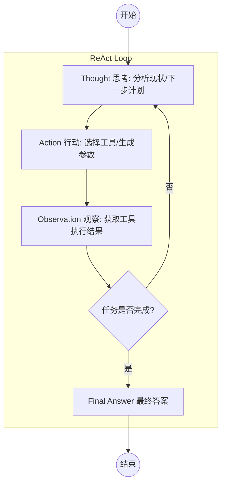
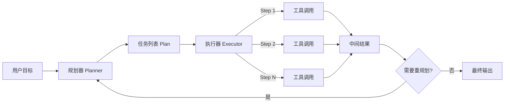

# 第九章：规划与推理——Planning & Reasoning

本章探讨Agent从"执行者"到"规划师"的进化，讲解思维链(CoT)、思维树(ToT)等推理范式，以及ReAct、Plan-and-Execute、Self-Reflection等经典规划架构。提供避免死循环、粒度控制、幻觉规划等挑战的优化策略。
## 9.1 引言：从“执行者”到“规划师”
在前面的章节中，我们赋予了 Agent 感知环境、记忆上下文和调用工具的能力。此时，Agent 像是一个听话的“执行者”——你让它查天气，它就查天气；你让它写代码，它就写代码。
然而，面对一个宏大的目标（例如：“帮我分析竞品并生成一份投资建议报告”），如果 Agent 只是被动地响应每一条指令，往往会显得支离破碎、缺乏逻辑，甚至陷入“为了行动而行动”的盲目状态。
**规划与推理能力，是 Agent 从“对话机器人”进化为“智能体”的分水岭。** 它使得 Agent 能够像人类项目经理一样，将复杂目标拆解为可执行的子任务，并在执行过程中进行逻辑推演、动态调整和自我修正。这对应着人类认知中的 **System 2（慢思考）** 系统——负责逻辑、推理和决策，而非仅仅依赖直觉的 System 1。
## 9.2 基础推理范式：思维的脚手架
推理是规划的基石。在大模型（LLM）语境下，推理能力主要通过 Prompt Engineering（提示工程）激发。
### 9.2.1 思维链：逐步推理
CoT 的核心思想是 **"Let's think step by step"**。它打破了“输入-输出”的直达模式，强制模型输出中间推理步骤。
*   **原理类比**：就像学生在做数学题时，必须写出“解：设x为...，因为...，所以...”，而不是直接写答案。这激活了模型内部的逻辑通路。
*   **适用场景**：数学计算、逻辑谜题、符号操作。
*   **局限性**：CoT 是线性的、单向的。它不具备回溯能力。一旦中间某一步推理错误（幻觉），后续步骤会基于错误继续推导，最终结果必然错误，且很难定位问题源头。
### 9.2.2 思维树：多路径探索
ToT 是对 CoT 的升级，它将推理过程建模为一棵树，而非一条线。模型在每一步都可以生成多个可能的后续步骤，并进行评估和搜索。
*   **核心机制**：
    1.  **分解**：将问题拆解为多个思维步骤。
    2.  **生成**：每一步生成多个候选方案。
    3.  **评估**：模型自我评估每个方案的可行性（如：1-10分）。
    4.  **搜索**：使用广度优先搜索（BFS）或深度优先搜索（DFS）选择最优路径。如果路径不通，可以回溯。
*   **适用场景**：复杂的决策问题（如游戏策略）、创意写作（构思大纲）、需要全局最优解的任务。
---
## 9.3 经典规划架构：ReAct (Reason + Act)
ReAct 是目前 Agent 开发中最主流的架构模式。它将“推理”和“行动”交织在一起，形成了一个感知-决策-行动的闭环。
### 9.3.1 ReAct 循环流程图
ReAct 的核心在于“三步走”循环，直到任务完成。

```mermaid
graph TD
    Start((开始)) --> Thought
    subgraph ReAct Loop
    Thought[Thought 思考: 分析现状/下一步计划] --> Action[Action 行动: 选择工具/生成参数]
    Action --> Observation[Observation 观察: 获取工具执行结果]
    Observation --> Decision{任务是否完成?}
    Decision -- 否 --> Thought
    Decision -- 是 --> FinalAnswer[Final Answer 最终答案]
    end
    FinalAnswer --> End((结束))
```
### 9.3.2 实战案例设计与步骤
**案例背景**：用户询问“苹果公司最新的股价是多少？如果买入100股需要多少钱？”
**设计思路**：
1.  Agent 需要具备搜索工具。
2.  Agent 需要具备计算工具（乘法）。
3.  Agent 必须先获取股价，才能计算总价，存在依赖关系。
**详细步骤示例**：
**第 1 轮迭代：**
*   **User Input**: 苹果公司最新的股价是多少？如果买入100股需要多少钱？
*   **Thought**: 用户想知道苹果股价和总成本。我首先需要查询苹果公司（AAPL）的当前实时股价。我还没有这个信息。
*   **Action**: `use_tool: search_stock_ticker`
*   **Action Input**: `{"symbol": "AAPL"}`
**第 2 轮迭代（系统返回结果）：**
*   **Observation**: 当前股价为 178.50 美元。
*   **Thought**: 我已经获取了股价 178.50 美元。现在我需要计算买入 100 股的总成本。计算公式是 178.50 * 100。
*   **Action**: `use_tool: calculator`
*   **Action Input**: `{"expression": "178.50 * 100"}`
**第 3 轮迭代（系统返回结果）：**
*   **Observation**: 17850.0
*   **Thought**: 我已经计算出了总成本。我现在掌握了用户需要的所有信息，可以回答了。
*   **Final Answer**: 苹果公司最新的股价是 178.50 美元。如果您买入 100 股，总共需要 17,850 美元。
### 9.3.3 ReAct 的局限
虽然 ReAct 灵活性强，但它也存在明显短板：
1.  **缺乏全局观**：它是“走一步看一步”，对于需要长程规划的任务（如“制定一份为期一个月的减肥计划”），容易在中途偏离目标。
2.  **Token 消耗大**：每次循环都需要把历史 Thought、Action、Observation 重新喂给模型，上下文容易溢出。
3.  **容易死循环**：如果工具返回报错，模型可能会不断重试相同的 Action，陷入死胡同。
---
## 9.4 进阶规划模式
为了解决 ReAct 在复杂任务中的不足，我们需要引入更高级的架构。
### 9.4.1 Plan-and-Execute（规划-执行分离）
这种模式借鉴了软件工程中的“架构设计”与“编码实现”分离的思想。
**架构设计图**：

```mermaid
graph LR
    User[用户目标] --> Planner[规划器 Planner]
    Planner --> Plan[任务列表 Plan]
    Plan --> Executor[执行器 Executor]
    Executor -->|Step 1| Tool1[工具调用]
    Executor -->|Step 2| Tool2[工具调用]
    Executor -->|Step N| ToolN[工具调用]
    Tool1 --> Result[中间结果]
    Tool2 --> Result
    ToolN --> Result
    Result --> Replanner{需要重规划?}
    Replanner -- 是 --> Planner
    Replanner -- 否 --> FinalOutput[最终输出]
```
**设计思路**：
将 Agent 拆分为两个角色：
1.  **Planner（规划者）**：只负责拆解任务，不执行。输出一个清晰的任务列表。
2.  **Executor（执行者）**：按部就班执行任务列表中的每一项。
3.  **Replanner（重规划者）**：如果执行器报错或环境变化，动态调整计划。
**详细步骤示例**：
**目标**：撰写一份关于“生成式AI在医疗领域应用”的调研报告。
**Phase 1: Planning (规划阶段)**
*   **Planner Output**:
    1.  搜索生成式AI在医疗影像诊断中的应用案例。
    2.  搜索生成式AI在药物研发中的应用案例。
    3.  整理上述案例的核心技术路线。
    4.  撰写报告摘要。
**Phase 2: Execution (执行阶段)**
*   **Executor (Step 1)**: 调用搜索工具 -> 返回影像诊断案例文本。
*   **Executor (Step 2)**: 调用搜索工具 -> 返回药物研发案例文本。
*   **Executor (Step 3)**: 调用总结工具 -> 输入前两步文本 -> 输出技术路线总结。
*   **Executor (Step 4)**: 调用写作工具 -> 输入总结 -> 输出报告摘要。
**优势与劣势**：
*   **优势**：结构清晰，不易跑偏，执行过程可中断、可并行（如果有依赖关系）。
*   **劣势**：不如 ReAct 灵活。如果第一步规划就是错的（例如搜索关键词选错），后续执行都是无用功。
### 9.4.2 Self-Reflection（自我反思）
这是赋予 Agent “自我进化”能力的关键。在 Agent 执行动作后，增加一个“批评家”角色进行审查。
**流程设计**：
1.  **Draft**：生成草稿或执行代码。
2.  **Critic**：模型以第三视角评估。Prompt示例：“请检查上述 Python 代码是否存在潜在的 Bug 或未处理的异常。”
3.  **Refine**：根据批评意见修改并重新执行。
**应用场景**：代码生成、复杂 SQL 查询。例如，生成 SQL 后，先让 LLM 检查语法是否正确、是否会引起全表扫描，确认无误后再提交数据库执行。
---
## 9.5 规划的挑战与优化策略
在实际开发中，规划能力往往受限于模型能力和环境噪声，以下是常见问题及解决方案。
### 9.5.1 避免“死循环”与“原地打转”
**问题**：Agent 尝试调用工具 A 失败 -> 重试 -> 再失败 -> 再重试... 消耗大量 Token 且无进展。
**解决方案**：引入“失败阈值”和“降级策略”。
*   **阈值控制**：如果同一个 Action 连续失败 3 次，强制停止循环。
*   **错误归因**：Prompt 引导模型分析失败原因。如果是参数错误，修正参数；如果是工具不可用，更换工具。
### 9.5.2 规划的粒度控制
**问题**：规划太粗（如“赚钱”）无法执行；规划太细（如“打开浏览器”、“点击按钮”）容易受环境影响且脆弱。
**解决方案**：**动态粒度（分层规划）**。
*   **高层 Planner**：只规划宏观步骤（如“收集数据”、“分析数据”）。
*   **底层 Worker Agent**：针对“收集数据”这一步，再启动一个 ReAct 循环去具体执行细节。
### 9.5.3 幻觉规划
**问题**：模型可能会规划出它根本不具备的工具，例如 Action: `send_email`，但实际上系统没有接入邮件工具。
**解决方案**：
*   **Tool Constraints**：在 System Prompt 中明确列出可用工具的清单和描述。
*   **校验层**：在执行 Action 前，代码层先校验 Action Name 是否在白名单内，若不存在，直接返回 Observation: "Error: Tool not found"。
## 9.6 本章小结
规划与推理是 Agent 的“大脑皮层”，决定了智能体解决问题的上限。
*   **ReAct** 提供了灵活的“边想边做”范式，适合处理动态性强、步骤较少的任务。
*   **Plan-and-Execute** 提供了结构化的“谋定后动”范式，适合处理复杂、长链条的任务。
*   **Self-Reflection** 提供了纠错机制，提高了任务完成的成功率。
在实际开发中，建议根据任务复杂度选择架构：简单任务用 ReAct，复杂任务用 Plan-and-Execute + Reflection。
下一章，我们将进入多智能体领域，探讨如何通过协作让 Agent 突破单体能力的极限。

---

## 9.7 补充内容：工程化实践要点

### 9.7.1 规划成功率监控

**常见问题场景：**
Agent规划失败或陷入循环，消耗大量Token但没有任何有效产出。缺乏监控手段难以及时发现。

**解决思路与方案：**
- 监控规划循环次数
- 监控Token消耗增长率
- 设置最大循环阈值，超时自动终止
- 记录失败案例用于分析改进

### 9.7.2 规划结果缓存

**常见问题场景：**
相同或相似的任务重复进行复杂规划，浪费计算资源。

**解决思路与方案：**
- 对规划结果进行缓存
- 使用任务签名作为缓存键
- 根据任务类型设置不同缓存策略

### 9.7.3 规划与执行的解耦

**常见问题场景：**
规划与执行混在一起，代码难以维护和调试。

**解决思路与方案：**
- 使用Pipeline模式分离规划和执行
- 规划结果可序列化存储
- 支持从断点恢复执行

