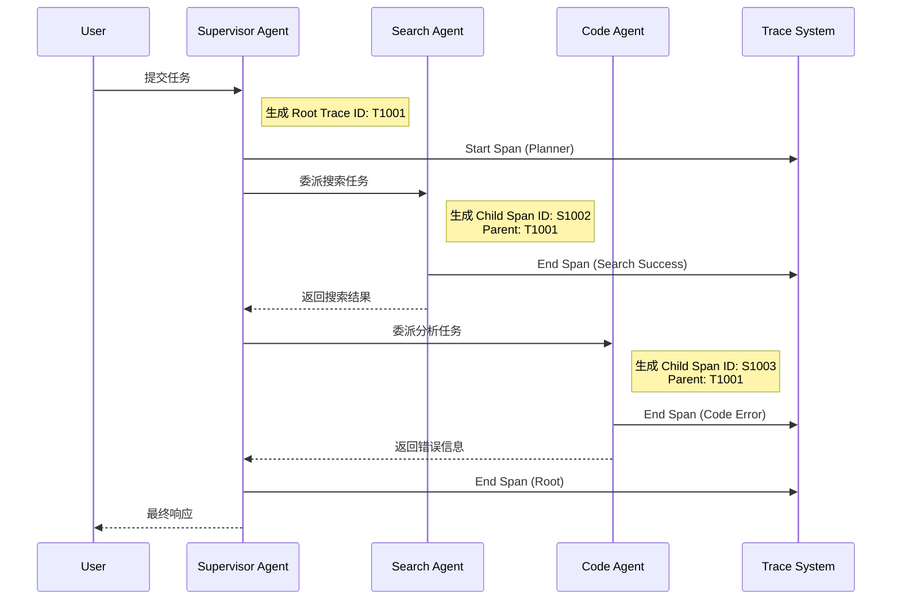
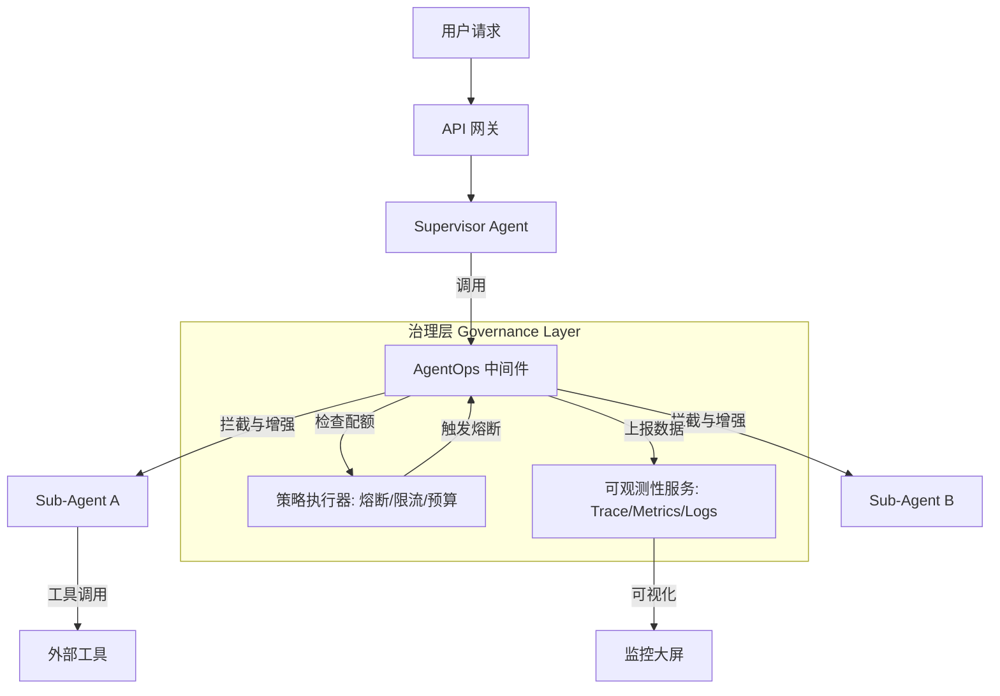
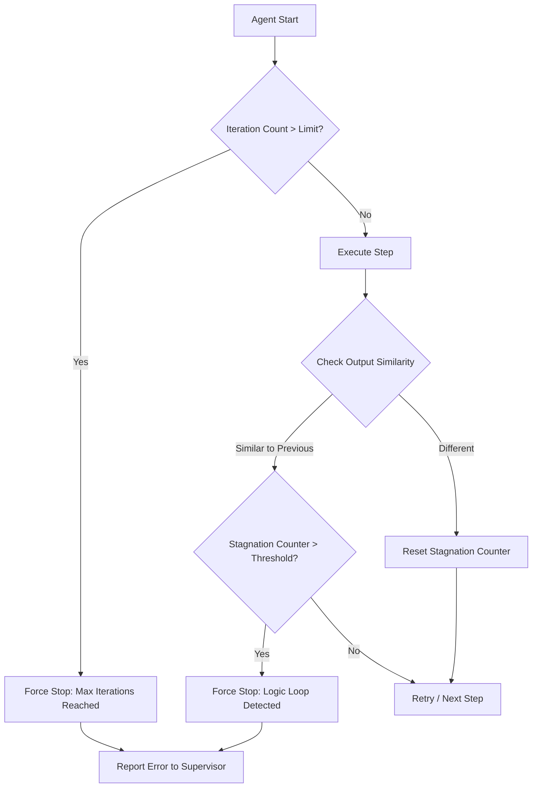

# 第十章：多智能体治理——Sub-Agent 监控与运维实战

本章聚焦多智能体系统的运维挑战：非确定性链路、逻辑级联故障、成本黑箱。讲解监控三大支柱（结构化日志、细粒度指标、分布式追踪），提供基于中间件模式的治理架构设计与实战代码，以及死循环检测、Prompt注入防御、成本突增治理等核心场景对策。
**“在单智能体时代，我们担心的是幻觉；在多智能体时代，我们担心的是混乱。”**
随着大模型应用从单一的对话机器人演进为复杂的多智能体系统，传统的运维手段面临着前所未有的挑战。在一个由 Planner（规划者）、Executor（执行者）、Critic（批评者）等多个 Sub-Agent 组成的网络中，一次用户请求可能触发数十次 LLM 调用、工具调用和内部通信。
如果不建立完善的 Sub-Agent 监控体系，系统将变成一个不可观测的“黑盒”，故障排查如同大海捞针，成本控制更是无从谈起。本章将从原理、架构、实战三个维度，讲解如何构建多智能体环境下的可观测性体系。
## 10.1 多智能体运维的独特挑战
与传统的微服务架构或单体 LLM 应用不同，多智能体系统的运维面临三大核心挑战。理解这些挑战是设计监控体系的前提。
### 1. 非确定性链路
在传统软件中，代码逻辑是确定的，调用链路往往是静态的（A -> B -> C）。而在 Agent 系统中，Sub-Agent 的调用链路是由 LLM 动态生成的。
*   **场景举例**：Planner 可能根据任务难度决定调用“代码解释器”还是“搜索引擎”，甚至可能在运行中发现错误而自我修正计划。
*   **运维痛点**：这种**动态拓扑结构**使得传统的 APM（应用性能监控）难以追踪完整的执行路径，因为下一次执行的路径可能完全不同。
### 2. 逻辑级联故障
Sub-Agent 之间存在依赖关系，但不同于微服务的网络依赖，Agent 间依赖的是“语义”与“格式”。
*   **场景举例**：一个“数据分析师 Agent”依赖“数据清洗 Agent”的输出。如果后者输出的 JSON 缺失字段，前者可能会反复重试，甚至陷入两个 Agent 互相推诿的“死循环”（例如：A 说格式不对，B 修正后 A 仍说不对）。
*   **运维痛点**：这种“逻辑层面的雪崩”比网络层面的雪崩更难检测，系统负载可能不高，但 Token 消耗却在指数级上升。
### 3. 成本黑箱
一个复杂的任务可能分解为 50 个子任务，每个子任务消耗的 Token 数量不同。
*   **运维痛点**：缺乏细粒度的监控会导致一次简单的查询消耗掉昂贵的 Token 额度，而运维人员直到收到账单那一刻才知晓。我们需要知道是**哪个 Agent、哪个步骤、为了什么意图**消耗了资源。
---
## 10.2 监控的三大支柱：Sub-Agent 视角的重构
为了应对上述挑战，我们需要在日志、指标和链路追踪这三大支柱上进行针对性的重构。
### 10.2.1 结构化日志：记录“思维过程”
传统的日志记录函数调用即可，但在 Agent 治理中，我们需要记录 Agent 的“内心独白”。
**设计原则：**
*   **Input/Output Schema**：强制所有 Sub-Agent 输出结构化的 JSON 日志，包含 `thought_process`（推理过程）、`tool_calls`（工具调用意图）和 `final_answer`（最终答案）。
*   **ReAct 模式追踪**：记录 Agent 在 Thought（思考）-> Action（行动）-> Observation（观察）循环中的每一次状态变更。
### 10.2.2 细粒度指标
我们需要定义一组新的多维指标体系，用于量化 Agent 的“智力水平”与“效率”。
*   **Agent 级别**：
    *   **自主轮次**：单个 Sub-Agent 为了完成任务进行了多少轮自我迭代？过高的轮次通常意味着 Prompt 设计缺陷或模型能力不足。
    *   **工具调用成功率**：每个 Sub-Agent 调用外部工具的成功比率。
*   **系统级别**：
    *   **端到端延迟**：从用户请求到最终响应的时间。
    *   **成本效益比**：完成单个任务的平均美元成本。
### 10.2.3 分布式追踪：可视化 Agent 拓扑
这是多智能体监控的核心。我们需要引入 **Trace ID** 和 **Span ID** 的概念，并将其扩展到 Agent 语境中。
**核心概念映射：**
*   **Trace**：代表一个完整的用户任务。例如：“分析上季度销售数据”。
*   **Span**：代表一个 Sub-Agent 的具体执行步骤。例如：“SQL生成Agent执行查询”。
*   **Parent Span**：Supervisor Agent 将任务分发给 Sub-Agent 时，建立父子关系。
**流程图：多智能体调用链路追踪示意图**

```mermaid
sequenceDiagram
    participant User
    participant Supervisor Agent
    participant Search Agent
    participant Code Agent
    participant Trace System
    User->>Supervisor Agent: 提交任务
    Note right of Supervisor Agent: 生成 Root Trace ID: T1001
    
    Supervisor Agent->>Trace System: Start Span (Planner)
    Supervisor Agent->>Search Agent: 委派搜索任务
    Note right of Search Agent: 生成 Child Span ID: S1002<br/>Parent: T1001
    
    Search Agent->>Trace System: End Span (Search Success)
    Search Agent-->>Supervisor Agent: 返回搜索结果
    
    Supervisor Agent->>Code Agent: 委派分析任务
    Note right of Code Agent: 生成 Child Span ID: S1003<br/>Parent: T1001
    
    Code Agent->>Trace System: End Span (Code Error)
    Code Agent-->>Supervisor Agent: 返回错误信息
    
    Supervisor Agent->>Trace System: End Span (Root)
    Supervisor Agent-->>User: 最终响应
```
---
## 10.3 治理架构设计：中间件模式
为了实现对 Sub-Agent 的无侵入式监控，推荐采用 **Middleware（中间件）模式**。所有 Sub-Agent 的输入输出必须经过此层，进行拦截、记录和控制。
### 10.3.1 架构设计图
**设计思路**：
我们将监控逻辑从 Agent 业务逻辑中剥离，构建一个独立的“治理层”。该层包含四个核心模块：追踪器、指标收集器、日志记录器和策略执行器。

```mermaid
graph TD
    User[用户请求] --> API_Gateway[API 网关]
    API_Gateway --> Supervisor[Supervisor Agent]
    
    subgraph "治理层 Governance Layer"
        Middleware[AgentOps 中间件]
        Policy[策略执行器: 熔断/限流/预算]
        Observer[可观测性服务: Trace/Metrics/Logs]
    end
    
    Supervisor -->|调用| Middleware
    Middleware -->|拦截与增强| SubAgentA[Sub-Agent A]
    Middleware -->|拦截与增强| SubAgentB[Sub-Agent B]
    
    SubAgentA -->|工具调用| Tools[外部工具]
    
    Middleware -->|上报数据| Observer
    Middleware -->|检查配额| Policy
    
    Observer -->|可视化| Dashboard[监控大屏]
    Policy -->|触发熔断| Middleware
```
### 10.3.2 核心组件详解
1.  **AgentOps 中间件**：这是 Agent 实例的包装器。它拦截 `invoke` 方法，在执行前后插入钩子逻辑。
2.  **策略执行器**：负责运行时治理。包含：
    *   **Rate Limiter**：限制单个 Agent 的并发数，防止雪崩。
    *   **Budget Controller**：实时扣减 Token 配额，超额即停。
    *   **Circuit Breaker**：当某个工具连续失败 N 次，暂时屏蔽该工具。
---
## 10.4 实战：构建简易的 Sub-Agent 监控系统
本节我们将使用 Python 实现一个轻量级的治理中间件。该中间件将自动计算 Token 消耗、记录执行耗时，并生成结构化的追踪日志。
### 10.4.1 设计内容
*   **目标**：为任意 Agent 函数增加监控能力，无需修改 Agent 内部代码。
*   **技术栈**：Python 标准库 + 一个模拟的 Agent 类。
*   **核心功能**：
    1.  自动生成 Trace ID 和 Span ID。
    2.  捕获输入输出并计算 Token 估算（模拟）。
    3.  异常捕获与日志记录。
    4.  强制中断机制（最大迭代限制）。
### 10.4.2 实现步骤与代码示例
**步骤一：定义数据结构**
首先，我们需要定义标准的数据结构来承载监控信息。
```python
import time
import uuid
import json
from dataclasses import dataclass, field
from typing import Optional, Any, Dict
@dataclass
class AgentSpan:
    """表示一个 Agent 的执行跨度"""
    trace_id: str
    span_id: str
    parent_span_id: Optional[str] = None
    agent_name: str = "Unknown"
    input_data: Any = None
    output_data: Any = None
    start_time: float = 0.0
    end_time: float = 0.0
    status: str = "PENDING" # PENDING, SUCCESS, ERROR
    error_message: str = ""
    tokens_used: int = 0
    metadata: Dict = field(default_factory=dict)
    def to_json(self):
        return json.dumps(self.__dict__, indent=2, default=str)
class MetricsCollector:
    """模拟指标收集器"""
    def record_metrics(self, agent_name, tokens, latency):
        print(f"[Metrics] Agent: {agent_name} | Tokens: {tokens} | Latency: {latency:.4f}s")
        
class TraceExporter:
    """模拟链路导出器"""
    def export_span(self, span: AgentSpan):
        print(f"\n[Trace Export] TraceID: {span.trace_id} | SpanID: {span.span_id}")
        print(f"Agent: {span.agent_name} | Status: {span.status}")
```
**步骤二：构建治理中间件**
这是核心逻辑。我们使用 Python 装饰器或包装类来实现中间件模式。
```python
class GovernanceMiddleware:
    def __init__(self, agent_instance, agent_name: str, max_tokens: int = 1000):
        self.agent = agent_instance
        self.agent_name = agent_name
        self.max_tokens = max_tokens
        self.metrics_collector = MetricsCollector()
        self.trace_exporter = TraceExporter()
        # 模拟全局上下文，存储当前 Trace ID
        self.current_trace_id = str(uuid.uuid4())
    async def invoke(self, input_data, parent_span_id: Optional[str] = None):
        """
        拦截 Agent 的调用入口
        """
        # 1. 初始化 Span（链路追踪开始）
        span = AgentSpan(
            trace_id=self.current_trace_id,
            span_id=str(uuid.uuid4()),
            parent_span_id=parent_span_id,
            agent_name=self.agent_name,
            input_data=input_data,
            start_time=time.time()
        )
        print(f"--> [{self.agent_name}] Starting execution... (Span: {span.span_id[:8]})")
        try:
            # 2. 前置检查：预算控制
            # (此处仅为示例，实际应连接配额数据库)
            current_projected_cost = len(str(input_data)) # 简单估算
            if current_projected_cost > self.max_tokens:
                raise PermissionError(f"Budget exceeded for {self.agent_name}")
            # 3. 执行实际的 Agent 逻辑
            # 注意：这里假设 agent 有 invoke 方法
            output_data = await self.agent.invoke(input_data)
            
            # 4. 后置处理：成功
            span.output_data = output_data
            span.status = "SUCCESS"
            # 简单的 Token 估算逻辑：输入+输出字符数 / 4
            span.tokens_used = (len(str(input_data)) + len(str(output_data))) // 4
            
        except Exception as e:
            # 5. 异常捕捉与熔断
            span.status = "ERROR"
            span.error_message = str(e)
            print(f"!! [{self.agent_name}] Execution Failed: {e}")
            raise e
            
        finally:
            # 6. 结束 Span 并上报
            span.end_time = time.time()
            latency = span.end_time - span.start_time
            
            # 上报指标
            self.metrics_collector.record_metrics(
                self.agent_name, 
                span.tokens_used, 
                latency
            )
            
            # 导出链路
            self.trace_exporter.export_span(span)
            print(f"<-- [{self.agent_name}] Finished. Status: {span.status}")
        return output_data
```
**步骤三：模拟 Sub-Agent 运行**
创建模拟的 Agent 类，并使用中间件进行包装运行。
```python
import asyncio
# 模拟一个简单的 Agent 类
class MockSearchAgent:
    async def invoke(self, query):
        await asyncio.sleep(0.5) # 模拟网络延迟
        if "error" in query.lower():
            raise ValueError("Simulated Search Error")
        return {"result": f"Search results for '{query}'", "source": "Google"}
class MockPlannerAgent:
    async def invoke(self, task):
        await asyncio.sleep(0.2)
        return {"plan": ["step 1: search", "step 2: summarize"]}
async def main():
    # 实例化原生 Agent
    raw_search_agent = MockSearchAgent()
    raw_planner_agent = MockPlannerAgent()
    
    # 使用中间件包装 Agent
    monitored_search_agent = GovernanceMiddleware(raw_search_agent, "SearchAgent", max_tokens=5000)
    monitored_planner_agent = GovernanceMiddleware(raw_planner_agent, "PlannerAgent")
    
    print("===== 正常任务执行流程 =====")
    try:
        # 模拟 Planner 调用 Search Agent
        plan = await monitored_planner_agent.invoke("Plan a travel to Paris")
        
        # 传递父 Span ID (伪代码逻辑，实际需通过 Context 传递)
        # 这里演示 Search Agent 在 Planner 的上下文中运行
        await monitored_search_agent.invoke("Best restaurants in Paris", parent_span_id="planner_span_xyz")
    except Exception as e:
        pass
    print("\n===== 异常任务执行流程 (测试熔断与日志) =====")
    try:
        await monitored_search_agent.invoke("Trigger error test")
    except Exception:
        print("System caught the error and handled it gracefully.")
# 运行演示
if __name__ == "__main__":
    asyncio.run(main())
```
### 10.4.3 运行结果解析
运行上述代码后，你将在控制台看到类似以下的输出，这就是可观测性的雏形：
```text
===== 正常任务执行流程 =====
--> [PlannerAgent] Starting execution... (Span: 123e4567)
[Metrics] Agent: PlannerAgent | Tokens: 13 | Latency: 0.2012s
[Trace Export] TraceID: ... | SpanID: ...
<-- [PlannerAgent] Finished. Status: SUCCESS
--> [SearchAgent] Starting execution... (Span: 89ab1234)
[Metrics] Agent: SearchAgent | Tokens: 25 | Latency: 0.5011s
...
```
通过这个简单的中间件，我们已经实现了：**无侵入式监控、结构化日志、Token 统计和异常捕获**。在生产环境中，只需将 `print` 替换为写入 Prometheus、Jaeger 或 LangSmith 的 SDK 调用即可。
---
## 10.5 核心运维场景与对策
有了监控和中间件，我们如何解决实际痛点？以下是三个典型场景的治理对策。
### 场景一：Sub-Agent 陷入死循环
**现象**：Agent A 调用 Agent B，Agent B 返回错误，Agent A 重试，如此往复消耗大量 Token。
**治理对策与流程设计**：
我们需要在中间件中加入“进度检测”逻辑。如果连续两轮的 Input 语义相似度过高，且 Output 没有实质性变化，则强制中断。
**死循环检测流程图**：

```mermaid
graph TD
    A[Agent Start] --> B{Iteration Count > Limit?}
    B -- Yes --> C[Force Stop: Max Iterations Reached]
    B -- No --> D[Execute Step]
    D --> E{Check Output Similarity}
    E -- Similar to Previous --> F{Stagnation Counter > Threshold?}
    F -- Yes --> G[Force Stop: Logic Loop Detected]
    F -- No --> H[Retry / Next Step]
    E -- Different --> I[Reset Stagnation Counter]
    I --> H
    G --> J[Report Error to Supervisor]
    C --> J
```
**代码逻辑补充**：
在 `GovernanceMiddleware` 中维护一个历史记录列表，每次执行前比较 `input_data` 与历史的相似度（可用简单的编辑距离或 Embedding 相似度）。
### 场景二：Prompt 注入与越狱
**现象**：恶意用户诱导 Sub-Agent 泄露系统 Prompt 或执行危险操作。
**治理对策**：
构建“输入防火墙”与“输出过滤器”。这不应在 Agent 内部做，而应在中间件层做。
*   **输入防火墙**：在 `invoke` 执行前，使用一个轻量级分类模型（或规则引擎）检查 `input_data`。如果包含“忽略之前的指令”等关键词，直接拒绝。
*   **输出过滤器**：检查 `output_data`，确保不包含系统内部信息或敏感数据（PII）。
### 场景三：成本突增
**现象**：某个复杂任务导致 Token 消耗激增，超出预算。
**治理对策**：
*   **分级预算**：为不同优先级的用户或任务设置不同的 `max_tokens`。
*   **动态降级**：在中间件中监控累计消耗。当达到阈值时，自动将 `model_name` 参数从 `gpt-4` 切换为 `gpt-3.5-turbo`，或者减少召回的工具数量。
---
## 10.6 小结
多智能体系统的治理不仅仅是技术运维，更是对 AI 行为的管理。Sub-Agent 监控的核心在于**将不可见的推理过程可视化**，将不确定的行为边界可控化。
在本章中，我们：
1.  分析了多智能体运维的三大挑战：非确定性、逻辑雪崩和成本黑箱。
2.  重构了监控三大支柱，重点介绍了分布式追踪在 Agent 中的应用。
3.  设计并实现了一个基于中间件模式的治理架构，并提供了具体的 Python 代码示例。
4.  探讨了死循环、安全注入和成本控制的具体治理流程。
然而，治理的最终目的是优化。在下一章中，我们将探讨如何基于这些监控数据，对多智能体系统进行动态优化与进化，实现“自我治愈”的智能体系统。
---
**思考题**：
1.  如果一个 Sub-Agent 的输出是正确的，但其推理过程违反了安全策略（例如在思维链中泄露了隐私），监控系统应该如何设计拦截机制？
2.  在多智能体协作中，如何平衡“监控粒度”与“系统性能”？过度的日志记录是否会影响 Agent 的响应速度？（提示：考虑异步上报机制）。
