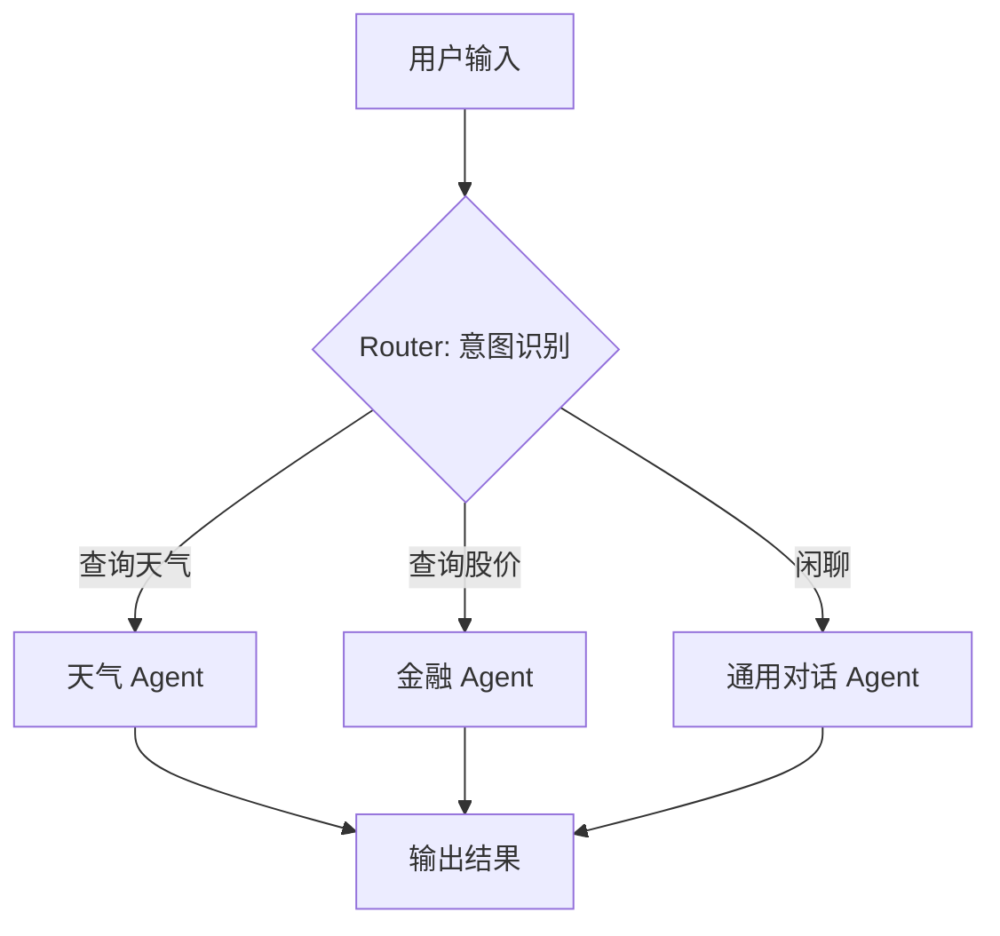
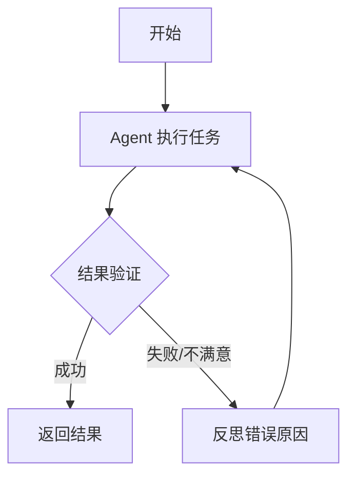

# 第十一章 流程编排——Pipeline 编排（整体流程控制）

本章讲解 Agent 需要编排的原因及核心价值，介绍三大基础模式（顺序链、条件分支、循环迭代）与高级架构（DAG、并行执行、人机协作节点）。提供状态管理（AgentState）与容错健壮性设计（重试机制、回退策略），并附带完整的 Python 编排引擎实战代码。

## 11.1 引言：为什么 Agent 需要编排？

在之前的章节中，我们已经掌握了如何构建 Agent 的"记忆"（Memory）、如何利用"工具"以及如何进行"规划"。如果我们将大语言模型（LLM）比作 Agent 的"大脑"，将各种工具 API 比作"双手"，那么我们还需要一套"神经系统"来协调它们工作。这就是**流程编排**的核心意义。

### 11.1.1 现实困境：孤立的智能单元

在实际开发中，你会发现单一的 Prompt 往往无法解决复杂问题。

例如，你要开发一个"智能投资分析 Agent"，它需要经历以下步骤：

1. **理解意图**：用户是想看财报，还是看新闻？
2. **检索数据**：调用不同的 API 获取股价或新闻。
3. **数据分析**：让 LLM 对数据进行解读。
4. **生成报告**：将分析结果整理成 PDF。

如果没有编排，这些步骤会像散落的珠子，代码逻辑会充斥着大量的 `if-else` 嵌套，难以维护、调试和扩展。

### 11.1.2 编排的核心价值

**Pipeline 编排**不仅仅是代码逻辑的堆砌，它是将**确定性逻辑**（代码规则）与**非确定性智能**（LLM 推理）相结合的艺术。通过编排，我们获得：

1. **可观测性**：清晰地知道 Agent 运行到了哪一步，数据流向如何，出了问题能迅速定位。
2. **可控性**：在关键节点（如下单交易）插入人工审核或强制规则，防止 AI "幻觉"导致灾难。
3. **鲁棒性**：当 LLM 输出不稳定时，通过编排层的重试或降级策略保证系统不崩溃。

## 11.2 基础编排模式：构建流程的"积木"

在构建复杂的 Agent 系统之前，我们需要掌握三种最基础的编排模式：**顺序链**、**条件分支**和**循环迭代**。它们构成了所有复杂流程的基石。

### 11.2.1 顺序链：流水线作业

**概念解析**：

顺序链是最直观的编排方式。数据像工厂流水线一样，依次流过各个处理节点，前一个节点的输出是后一个节点的输入。

* **生活类比**：这就好比餐厅后厨做菜，必须是"洗菜 → 切菜 → 烹饪 → 装盘"，顺序不能乱，且每一步都依赖上一步的结果。
* **应用场景**：任务拆解明确、无分支的线性流程。例如：文章摘要生成（输入文章 → 提取关键词 → 生成摘要 → 翻译摘要）。

**代码逻辑示意**：

```python
# 伪代码示例
output_step1 = node_wash(input_vegetable)
output_step2 = node_cut(output_step1)
final_output = node_cook(output_step2)
```

**设计陷阱**：

在长链路中，需要注意**上下文窗口**的限制。如果每一步都将之前的所有历史记录原封不动地传递下去，很快就会撑爆 Token 限制。

* **最佳实践**：遵循"按需传递"原则，每个节点只保留必要的上下文信息，剔除冗余数据。

### 11.2.2 条件分支：智能分诊

**概念解析**：

Agent 的魅力在于其决策能力。条件分支允许 Agent 根据当前的状态或 LLM 的判断结果，像岔路口一样选择不同的执行路径。

* **生活类比**：这就像医院的"分诊台"。病人来了，护士（Router）先判断是内科、外科还是急诊，然后指引病人去不同的科室（Sub-Agent）。
* **应用场景**：意图识别后的路由分发、多模型协作（大模型处理难题，小模型处理简单题以节省成本）。

**核心设计：路由节点**

实现分支的关键在于"路由节点"。它通常有两种实现方式：

1. **规则路由**：基于代码逻辑判断。例如 `if "天气" in query: go_to_weather_agent()`。简单可靠，但不够灵活。
2. **语义路由**：利用 LLM 判断意图，输出特定的标签或 JSON，再由代码解析跳转。这是 Agent 编排的核心能力。

**流程图示**：



### 11.2.3 循环迭代：自我进化

**概念解析**：

循环是 Agent 实现"自我反思"和"持续优化"的关键。通过循环，Agent 可以检查自己的输出是否达标，如果未达标则重新生成或修正。

* **生活类比**：这就像作家写文章"写初稿 → 自我审阅 → 修改 → 再审阅 → 定稿"的过程。
* **应用场景**：
  * **代码生成**：生成代码 → 执行报错 → 修正代码 → 再次执行。
  * **ReAct 模式**：思考 → 行动 → 观察 → 再思考。

**流程图示**：



**风险控制**：

循环必须设置明确的**终止条件**，否则 Agent 会陷入死循环，不仅消耗大量 Token，还会阻塞系统资源。常见的终止条件包括：

1. 达到最大循环次数（如 `max_iterations = 5`）。
2. LLM 输出特定的停止指令（如输出 "FINISH" 标签）。
3. 成功完成目标（如代码通过单元测试）。

## 11.3 高级编排架构

当基础模式无法满足复杂的业务需求时，我们需要引入更高级的架构设计。

### 11.3.1 有向无环图 (DAG)

**概念解析**：

DAG 是对顺序链的扩展，它允许节点之间存在复杂的依赖关系，只要不形成闭环。

* **特点**：节点 C 可能同时依赖节点 A 和 B 的输出。只有当 A 和 B 都执行完毕，C 才会开始。
* **应用**：复杂报告生成。A 节点负责爬取新闻，B 节点负责爬取股市数据，C 节点汇总 A 和 B 的信息生成分析报告。

### 11.3.2 并行执行

在 DAG 的基础上，如果多个节点之间没有依赖关系，编排器应支持并行执行。

* **价值**：大幅降低端到端延迟。例如，同时查询三个不同的数据库，或同时让三个不同角色的 Agent 撰写报告的不同章节。
* **技术难点**：**结果聚合**。主线程必须等待所有并行任务完成，并将结果合并为一个统一的数据结构，传递给下游节点。Python 的 `asyncio.gather` 或 `concurrent.futures` 是实现这一功能的常用工具。

### 11.3.3 人机协作节点

全自动 Agent 在高风险场景下（如自动交易、自动发邮件）往往不可靠。人机协作节点允许在 Pipeline 中插入"暂停点"。

* **机制**：
  1. Agent 运行到审核节点，流程挂起，状态被持久化保存。
  2. 系统向人工发送通知（如邮件、Slack 消息）。
  3. 人工审核后，通过 API 注入决策，恢复流程继续执行。

**代码示例：基于状态机的 Human-in-the-Loop 节点**：

```python
import asyncio
import uuid
from enum import Enum
from typing import Optional, Callable

class ApprovalStatus(Enum):
    PENDING = "pending"      # 等待人工审核
    APPROVED = "approved"    # 人工已批准
    REJECTED = "rejected"    # 人工已拒绝
    TIMEOUT = "timeout"      # 审核超时

class HumanApprovalNode:
    """
    人机协作审核节点
    在 Pipeline 中插入此节点，Agent 会在该点暂停并等待人工审核
    
    使用示例：
        approval_node = HumanApprovalNode(
            name="financial_review",
            timeout_seconds=3600,
            on_approve=execute_trade,
            on_reject=notify_user_rejection,
        )
        result = await approval_node.execute(
            context={"action": "sell", "symbol": "AAPL", "shares": 100}
        )
    """
    
    def __init__(
        self,
        name: str,
        timeout_seconds: int = 3600,
        on_approve: Optional[Callable] = None,
        on_reject: Optional[Callable] = None,
    ):
        self.name = name
        self.timeout_seconds = timeout_seconds
        self.on_approve = on_approve
        self.on_reject = on_reject
        self._pending_approvals = {}  # approval_id -> {"status", "context", "future"}
    
    async def execute(self, context: dict) -> dict:
        """执行审核节点：挂起流程，等待人工决策"""
        approval_id = str(uuid.uuid4())[:8]
        
        # 创建异步事件，用于被外部 API 恢复
        event = asyncio.Event()
        self._pending_approvals[approval_id] = {
            "status": ApprovalStatus.PENDING,
            "context": context,
            "event": event,
            "decision": None,
        }
        
        # TODO: 发送通知（邮件/Slack/Webhook）
        # notification_service.send(
        #     to=context.get("reviewer_email"),
        #     message=f"审核请求: {context}\n"
        #             f"批准链接: POST /api/approve/{approval_id}\n"
        #             f"拒绝链接: POST /api/reject/{approval_id}"
        # )
        print(f"[HITL] 审核请求已发送: {approval_id}, 等待人工决策...")
        
        # 挂起等待（带超时）
        try:
            await asyncio.wait_for(event.wait(), timeout=self.timeout_seconds)
        except asyncio.TimeoutError:
            self._pending_approvals[approval_id]["status"] = ApprovalStatus.TIMEOUT
            print(f"[HITL] 审核超时: {approval_id}")
            return {"status": "timeout", "approval_id": approval_id}
        
        record = self._pending_approvals[approval_id]
        return {
            "status": record["status"].value,
            "approval_id": approval_id,
            "decision": record["decision"],
        }
    
    def approve(self, approval_id: str, comment: str = ""):
        """外部 API 调用：批准审核"""
        if approval_id not in self._pending_approvals:
            raise ValueError(f"无效的审核ID: {approval_id}")
        record = self._pending_approvals[approval_id]
        record["status"] = ApprovalStatus.APPROVED
        record["decision"] = {"comment": comment}
        record["event"].set()  # 恢复被挂起的流程
    
    def reject(self, approval_id: str, reason: str = ""):
        """外部 API 调用：拒绝审核"""
        if approval_id not in self._pending_approvals:
            raise ValueError(f"无效的审核ID: {approval_id}")
        record = self._pending_approvals[approval_id]
        record["status"] = ApprovalStatus.REJECTED
        record["decision"] = {"reason": reason}
        record["event"].set()  # 恢复被挂起的流程

```

> **生产提示**：在真实系统中，`HumanApprovalNode` 需要配合持久化存储（如 Redis）和消息队列（如 RabbitMQ），确保 Agent 服务重启后仍能恢复挂起的审核流程。上例中的 `asyncio.Event` 仅适用于单进程演示。

## 11.4 状态管理：Agent 的"短期记忆"

Pipeline 不仅仅是流程的容器，更是状态的容器。每个节点共享同一个全局状态，或者拥有独立的局部状态。

### 11.4.1 全局状态对象

在 Agent 编排中，最核心的数据结构通常是 `AgentState`。它是一个贯穿整个流程的字典或对象，存储了当前对话历史、中间结果、错误信息等。

```python
# 一个典型的状态结构定义
class AgentState(TypedDict):
    input: str           # 用户原始输入
    chat_history: list   # 对话历史
    intermediate_steps: list # 中间执行步骤（如工具调用记录）
    output: str          # 最终输出
```

### 11.4.2 状态的不可变性

优秀的编排框架（如 LangGraph）往往推崇**状态的不可变更新**。

*   **原理**：节点不直接修改全局状态对象，而是返回一个"更新包"，由框架合并生成新状态。

* **优势**：
  * **可追溯**：每一步生成了什么状态变更都清晰可见，便于 Debug。
  * **时间旅行**：理论上可以回滚到任意一步的状态重新执行。

## 11.5 容错与健壮性设计

LLM 是非确定性系统，编排层必须承担起"安全网"的职责。

### 11.5.1 重试机制

当 LLM 调用超时、输出格式错误或工具执行失败时，自动重试是第一道防线。

* **指数退避**：在连续重试之间增加等待时间（1s、2s、4s...），避免对 API 造成压力。
* **动态修正**：重试时，将错误信息反馈给 LLM，提示其修正。例如："上次输出不是合法 JSON，请修正后重试"。

### 11.5.2 回退策略

当重试耗尽仍未成功，需要有降级方案。

* **备用模型**：主模型（如 GPT-4）失败或限流时，自动切换到备用模型（如 GPT-3.5 或本地模型）。
* **规则兜底**：LLM 无法理解时，回退到传统规则引擎处理。

## 11.6 从理论到实践：构建一个具备路由功能的编排引擎

为了真正理解上述概念，我们将从零开始，设计并实现一个简化的 Python 编排引擎。它将包含**状态管理**、**顺序执行**和**条件路由**功能。

### 11.6.1 设计思路

我们要构建一个类似"图"的结构：

1. **节点**：具体的执行逻辑，接收状态，返回状态更新。
2. **边**：节点之间的连接，分为"普通边"（必然执行）和"条件边"（根据状态判断走向）。
3. **状态**：在节点间流转的共享数据。

### 11.6.2 代码实现步骤

#### 步骤 1：定义状态结构

首先，我们需要定义一个数据结构来承载流程中的数据。

```python
from typing import TypedDict, List, Optional
class AgentState(TypedDict):
    """
    定义 Agent 的全局状态

    - input: 用户的输入

    - intent: 识别出的意图

    - tool_output: 工具调用的结果

    - final_response: 最终给用户的回复
    """
    input: str
    intent: Optional[str]
    tool_output: Optional[str]
    final_response: Optional[str]

```

#### 步骤 2：定义基础组件

我们需要定义"节点"和"条件边"的抽象。

```python
from typing import Callable, Dict, Any

# 定义节点的处理函数类型：接收 State，返回 State 的更新部分
NodeFunc = Callable[[AgentState], Dict[str, Any]]

# 定义路由函数类型：接收 State，返回下一个节点的名称
RouterFunc = Callable[[AgentState], str]
class Node:
    def __init__(self, name: str, func: NodeFunc):
        self.name = name
        self.func = func
    def __call__(self, state: AgentState) -> Dict[str, Any]:
        print(f"--- 正在执行节点: {self.name} ---")
        # 执行节点逻辑，返回状态的更新部分
        result = self.func(state)
        return result
class Router:
    def __init__(self, name: str, func: RouterFunc, paths: Dict[str, str]):
        """
        name: 路由器名称
        func: 路由判断逻辑
        paths: 映射表，例如 {"weather": "weather_node", "chat": "chat_node"}
        """
        self.name = name
        self.func = func
        self.paths = paths
    def get_next(self, state: AgentState) -> str:
        print(f"--- 正在路由判断: {self.name} ---")
        decision = self.func(state)
        print(f"    决策结果: {decision}")
        return self.paths.get(decision, "END")

```

#### 步骤 3：实现编排引擎

这是核心大脑，负责将节点串联起来并管理状态流转。

```python
class Pipeline:
    def __init__(self):
        self.nodes = {}  # 存储所有节点
        self.edges = {}  # 存储连接关系
        self.entry_point = None
    def add_node(self, node: Node):
        self.nodes[node.name] = node
        return self
    def set_entry_point(self, node_name: str):
        self.entry_point = node_name
        return self
    def add_edge(self, from_node: str, to_node: str):
        """添加普通边：A -> B"""
        self.edges[from_node] = {"type": "normal", "target": to_node}
        return self
    def add_conditional_edge(self, from_node: str, router: Router):
        """添加条件边：A -> Router -> (B or C)"""
        self.edges[from_node] = {"type": "conditional", "router": router}
        return self
    def run(self, initial_state: AgentState):
        # 1. 初始化
        current_node_name = self.entry_point
        state = initial_state.copy()
        # 2. 开始循环执行
        while current_node_name and current_node_name != "END":
            # 获取当前节点
            node = self.nodes[current_node_name]
            
            # 执行节点逻辑
            updates = node(state)
            
            # 更新状态（体现不可变性：生成新状态）
            state.update(updates)
            
            # 查找下一步走向
            edge = self.edges.get(current_node_name)
            if not edge:
                break # 没有后续节点，结束
            
            if edge["type"] == "normal":
                current_node_name = edge["target"]
            elif edge["type"] == "conditional":
                router = edge["router"]
                current_node_name = router.get_next(state)
        
        return state

```

#### 步骤 4：构建具体业务逻辑

假设我们要构建一个简单的助手，能区分"天气查询"和"闲聊"。

```python
# 业务逻辑函数
def intent_recognition(state: AgentState) -> Dict[str, Any]:
    user_input = state["input"]
    # 模拟 LLM 的意图识别逻辑
    if "天气" in user_input or "下雨" in user_input:
        return {"intent": "weather"}
    else:
        return {"intent": "chat"}

def weather_tool(state: AgentState) -> Dict[str, Any]:
    # 模拟调用天气 API
    return {"tool_output": "北京今天晴，气温 25 度"}

def chat_tool(state: AgentState) -> Dict[str, Any]:
    # 模拟调用大模型聊天
    return {"tool_output": "今天心情也不错呢！"}

def final_formatter(state: AgentState) -> Dict[str, Any]:
    return {"final_response": f"最终回复: {state['tool_output']}"}

# 路由函数
def route_intent(state: AgentState) -> str:
    return state["intent"]
```

#### 步骤 5：组装并运行 Pipeline

```python
# 1. 初始化构建器
pipeline = Pipeline()

# 2. 添加节点
pipeline.add_node(Node("intent_node", intent_recognition))
pipeline.add_node(Node("weather_node", weather_tool))
pipeline.add_node(Node("chat_node", chat_tool))
pipeline.add_node(Node("formatter", final_formatter))

# 3. 设置入口
pipeline.set_entry_point("intent_node")

# 4. 添加路由逻辑
# 定义路由器：如果是 weather 意图，去 weather_node；否则去 chat_node
router = Router("intent_router", route_intent, {"weather": "weather_node", "chat": "chat_node"})
pipeline.add_conditional_edge("intent_node", router)

# 5. 添加后续边：处理完后都汇聚到 formatter
pipeline.add_edge("weather_node", "formatter")
pipeline.add_edge("chat_node", "formatter")

# 6. 添加结束标记
pipeline.add_edge("formatter", "END")

# --- 执行测试 ---
print("======= 测试场景 1：查询天气 =======")
final_state_1 = pipeline.run({"input": "今天北京天气怎么样？"})
print(f"结果: {final_state_1['final_response']}\n")

print("======= 测试场景 2：闲聊 =======")
final_state_2 = pipeline.run({"input": "你好呀"})
print(f"结果: {final_state_2['final_response']}")
```

### 11.6.3 代码解析

通过上述代码，我们实现了一个最简化的"有向图"编排引擎：

1.  **解耦**：业务逻辑（函数）与流程控制（Pipeline）完全分离。

2.  **灵活路由**：通过 `Router` 类实现了基于状态的条件分支，这是 Agent 智能化的体现。

3.  **状态流转**：`state` 对象像一个接力棒，在节点间传递，且通过 `update` 方法保证了数据的延续性。

## 11.7 本章小结

流程编排是 AI Agent 从"玩具"走向"生产级应用"的分水岭。本章我们探讨了：

1. **编排的必要性**：为了解决复杂逻辑、可观测性和健壮性问题。
2. **三大基础模式**：顺序、分支与循环，这是构建任意复杂流程的积木。
3. **高级架构**：DAG、并行执行与人机协作，提升了系统的性能与安全性。
4. **工程实践**：通过实现一个简单的路由引擎，理解了状态流转与节点控制的核心原理。

掌握了编排思想后，下一章我们将走进代码的世界，探索那些已经成熟的 Agent 框架（如 LangChain, LangGraph 等），看看它们是如何将这些理论落地的，以及如何利用它们快速构建强大的 Agent 应用。

---

---

## 11.8 从POC到规模化生产

### 11.8.1 POC评估标准

**常见问题场景：**

很多Agent项目在POC阶段表现良好，但一到生产环境就问题频发。缺乏系统性的评估标准来判断POC是否真正ready。

**解决思路与方案：**

POC转生产检查标准：

技术指标：

- 准确率 >= 85% (在测试集上)

- 响应时间 P99 < 3秒

- 可用性 >= 99.9%

- 错误率 < 1%

功能指标：

- 核心流程覆盖率 100%

- 降级策略已实现

- 监控告警已部署

业务指标：

- 用户满意度 >= 4.0/5.0

- 问题解决率 >= 80%

- 效率提升 >= 30%

### 11.8.2 生产环境准备检查清单

**常见问题场景：**

开发环境运行正常，但部署到生产环境后出现各种问题。缺少系统性的准备检查。

**解决思路与方案：**

生产部署检查清单：

基础设施：

- [ ] 服务器资源充足（CPU/内存/网络）

- [ ] 依赖服务正常运行（Redis/数据库/向量库）

- [ ] 监控告警系统已部署

代码质量：

- [ ] 单元测试覆盖率 >= 80%

- [ ] 集成测试通过

- [ ] 安全扫描无高危漏洞

配置管理：

- [ ] 生产配置与测试配置分离

- [ ] 敏感信息通过环境变量注入

- [ ] 配置变更有记录可追溯

运维能力：

- [ ] 日志系统正常运行

- [ ] 告警阈值已设置

- [ ] 备份恢复方案已验证

- [ ] 应急预案已制定

### 11.8.3 渐进式扩展策略

**常见问题场景：**

一次性全量上线风险过高，但如果线上的流量太小又无法验证真实效果。

**解决思路与方案：**

渐进式发布策略：

- 第一阶段：5%流量，持续1小时

- 第二阶段：20%流量，持续2小时

- 第三阶段：50%流量，持续4小时

- 第四阶段：全量

回滚触发条件：

- 错误率超过 2%

- P99延迟超过5秒

- 用户投诉超过阈值

### 11.8.4 规模化常见问题与解决方案

**问题一：流量增长后响应变慢**

- 原因：缺少缓存、数据库查询效率低

- 解决：增加缓存层、优化查询、使用CDN

**问题二：间歇性服务不可用**

- 原因：资源不足，单点故障

- 解决：增加副本数、设置合理的超时和重试

**问题三：成本超出预算**

- 原因：Token消耗失控、缺少成本监控

- 解决：实施成本控制措施，建立预算告警

**问题四：输出质量下降**

- 原因：Prompt被意外修改、模型版本变更

- 解决：建立Prompt版本管理、监控输出质量指标

## 11.9 补充内容：工程化实践要点

### 11.9.1 Pipeline的可视化编排

**常见问题场景：**

用代码定义Pipeline不够直观，非技术人员难以理解和修改。

**解决思路与方案：**

- 使用可视化编排工具（如LangGraph Studio、ComfyUI）

- 支持拖拽式节点配置

- 实时预览执行流程

- 一键导出代码

### 11.9.2 Pipeline版本管理

**常见问题场景：**

Pipeline逻辑频繁变更，缺乏版本控制，无法快速回滚。

**解决思路与方案：**

- Pipeline配置存储为JSON/YAML

- 使用Git进行版本管理

- 支持版本切换和对比

- 灰度发布新版本

### 11.9.3 Pipeline的测试策略

**常见问题场景：**

Pipeline逻辑复杂，每次修改都担心引入Bug。

**解决思路与方案：**

- 为每个节点编写单元测试

- 使用Mock数据测试完整Pipeline

- 集成测试验证端到端流程

- 自动化回归测试
