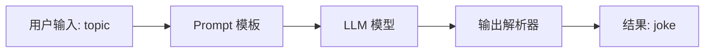
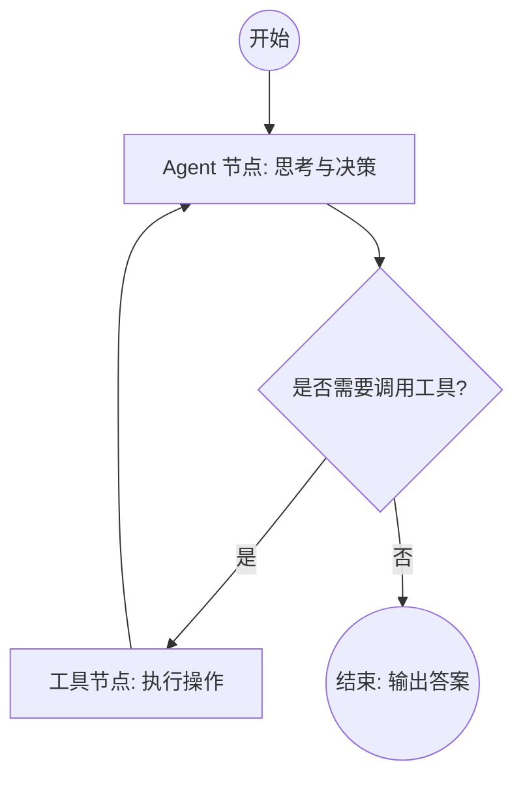
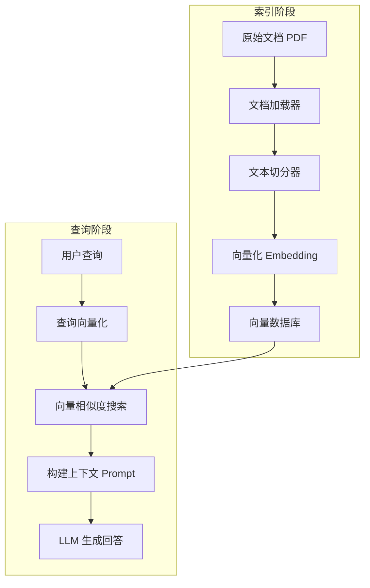

# 第十二章 生态工具——主流Agent框架和产品

本章纵览主流代码级Agent框架：LangChain的LCEL与Runnable协议、LangGraph的状态机与循环控制、LlamaIndex的RAG数据处理、CrewAI与AutoGen的多Agent协作。提供框架选型决策表与未来趋势分析，帮助开发者根据场景需求选择最合适的工具。

## 12.1 引言：从"手搓"到"框架"的必然演进
在第十一章中，我们深入底层，用原生 Python 实现了一个简易的 Pipeline 编排引擎。相信您在动手实践时已经感受到了"手搓"的痛点：每一次 API 调用都需要处理异常重试，每一次上下文传递都要精心拼接 Prompt，每一次状态变更都要手动维护字典。对于学习原理而言，这是必经之路；但对于构建生产级应用，这不仅是"重复造轮子"，更是给系统埋下了无数隐患。

随着 LLM 技术的爆发，AI Agent 的开发框架经历了从无到有、从简到繁的演变。现代框架封装了基础设施（API 调用、重试机制）、标准化了核心抽象（Prompt、Memory、Tool）并解决了复杂问题（状态管理、循环编排）。

本章将聚焦于当前主流的代码级 Agent 框架，我们将**深入底层设计哲学**，不仅教会您如何使用，更教会您如何进行技术选型与架构设计。

## 12.2 LangChain：应用开发的标准库
如果说大模型领域有一个事实上的"标准库"，那非 LangChain 莫属。它凭借丰富的集成（数百种 LLM 和工具）和灵活的抽象，成为了构建 LLM 应用的首选框架。

### 12.2.1 核心原理：LCEL (LangChain Expression Language)
LangChain v0.1 版本后推出的 LCEL 是其核心竞争力。初学者往往被 `|` 操作符迷惑，以为这只是简单的语法糖，实际上它背后是一套严谨的**Runnable 协议**。
深入理解 **Runnable 协议：**
LangChain 中所有组件（模型、Prompt、工具、甚至 Chain）都实现了 `Runnable` 接口。这意味着它们共享统一的标准方法：

- `invoke`: 单次输入，单次输出（同步/异步）。
- `stream`: 流式输出，提升用户体验。
- `batch`: 批量处理，提高吞吐量。
- `map`: 并行处理列表数据。

**管道操作符 `|` 的魔法：**
当我们写下 `chain = prompt | model | output_parser` 时，框架实际上将组件串联成了一个**有向无环图（DAG）**。上游组件的输出自动映射为下游组件的输入，且框架自动接管了流式传输和中间步骤的追踪。

### 12.2.2 实战案例：构建一个专题笑话生成器

**【设计思路】**
我们需要构建一个线性链路：

1. **输入**：用户指定一个主题（如"AI Agent"）。
2. **Prompt 构造**：将主题填入模板。
3. **模型调用**：请求 LLM 生成笑话。
4. **输出解析**：将 LLM 返回的字符串清洗后输出。

**【流程图】**



**【代码示例】**

```python
# 安装依赖: pip install langchain langchain-openai
from langchain_core.prompts import ChatPromptTemplate
from langchain_openai import ChatOpenAI
from langchain_core.output_parsers import StrOutputParser

# 1. 定义 Prompt 模板
prompt = ChatPromptTemplate.from_template("给我讲一个关于 {topic} 的简短笑话")

# 2. 定义模型 (这里需要配置您的 API Key)
model = ChatOpenAI(model="gpt-3.5-turbo", temperature=0.7)

# 3. 定义输出解析器
parser = StrOutputParser()

# 4. 使用 LCEL 构建 Chain (DAG 拓扑)

# 这里的 "|" 并不是位运算，而是 LCEL 的链式调用语法
chain = prompt | model | parser

# 5. 执行调用
try:
    result = chain.invoke({"topic": "程序员"})
    print(f"生成的笑话: {result}")
except Exception as e:
    print(f"调用失败: {e}")
```

### 12.2.3 局限性分析
虽然 LangChain 擅长"链"式调用，但在处理**复杂的循环**和**状态管理**时，传统的 LCEL 会显得力不从心。例如，如果要求 LLM "一直修改代码直到没有 Bug 为止"，这种逻辑用 LCEL 描述会非常复杂且难以调试。这正是 LangGraph 诞生的原因。

## 12.3 LangGraph：可控状态流的利器
LangGraph 是 LangChain 团队推出的下一代编排框架，它专门为了解决复杂 Agent 的循环与状态管理问题而设计。它不再局限于 DAG，而是引入了**循环图**的概念。

### 12.3.1 核心架构：图与状态机
LangGraph 的设计灵感来源于 Pregel 论文，其核心思想是将 Agent 的执行过程建模为一个**状态机**。

- **State（状态）**：一个共享的 TypedDict（类型字典），在节点之间传递和修改。这是图流动的"血液"，存储了对话历史、当前任务进度等信息。
- **Node（节点）**：具体的执行逻辑单元（函数），接收 State，返回 State 的更新。
- **Graph（图）**：定义节点间的流转关系，包括普通边和条件边。

### 12.3.2 实战案例：构建 ReAct 智能体

**【设计思路】**
我们要构建一个具备工具调用能力的 Agent。它需要遵循 **ReAct (Reasoning + Acting)** 模式：

1. **思考**：分析用户问题，决定是否需要调用工具。
2. **行动**：如果需要，执行工具。
3. **观察**：获取工具返回结果。
4. **循环**：将结果加入上下文，再次思考，直到得出最终答案。

**【流程图】**



**【代码示例】**

这是一个简化的 LangGraph 结构示例，展示如何定义循环逻辑：

```python
from typing import TypedDict, Annotated
from langgraph.graph import StateGraph, END

# 1. 定义状态结构

# messages 列表会随着对话不断累积
class AgentState(TypedDict):
    messages: list

# 2. 定义节点逻辑
def agent_node(state: AgentState):
    # 模拟 LLM 决策过程
    # 实际开发中这里会调用 ChatOpenAI
    print("Agent 正在思考...")
    # 假设 LLM 决定调用工具，或者直接回答
    # 这里仅作演示，返回一个决策标志
    return {"messages": ["AI Decision: Call Tool"]}
def tool_node(state: AgentState):
    # 模拟工具执行
    print("工具正在执行...")
    return {"messages": ["Tool Result: Success"]}

# 3. 定义路由函数
def should_continue(state: AgentState):
    # 检查最后一条消息，决定是继续调用工具还是结束
    messages = state["messages"]
    last_message = messages[-1]
    if "Call Tool" in last_message:
        return "tools" # 跳转到工具节点
    return END # 结束

# 4. 构建图
workflow = StateGraph(AgentState)

# 添加节点
workflow.add_node("agent", agent_node)
workflow.add_node("tools", tool_node)

# 设置入口
workflow.set_entry_point("agent")

# 添加条件边：Agent -> (判断) -> Tools 或 END
workflow.add_conditional_edges(
    "agent",
    should_continue,
    {
        "tools": "tools",
        END: END
    }
)

# 添加普通边：Tools -> Agent (形成循环)
workflow.add_edge("tools", "agent")

# 5. 编译并运行
app = workflow.compile()

# app.invoke({"messages": ["用户问题"]})
```

### 12.3.3 关键特性

*   **持久化**：LangGraph 内置了 Checkpointer，可以轻松实现"断点续传"。这对于需要人工介入的长流程任务至关重要。

*   **流式输出**：支持对每个节点的输出进行流式监听，前端可以实时展示 Agent 的思考过程。

## 12.4 LlamaIndex：数据驱动的 RAG 专家
如果 Agent 的大脑是 LLM，那么 LlamaIndex 就是它的"海马体"——负责长期记忆的索引与检索。虽然 LangChain 也能做 RAG，但 LlamaIndex 在处理私有数据连接方面更加专注和深入。

### 12.4.1 核心定位：数据框架
LlamaIndex 的核心理念是解决 **"外部知识如何高效喂给 LLM"** 的问题。它提供了从数据加载到索引构建，再到查询引擎的全链路解决方案。

### 12.4.2 RAG 工作流深度解析
**【设计思路】**
一个标准的 RAG 流程分为两个阶段：

1. **索引阶段**：将非结构化文档切片并向量化存储。
2. **查询阶段**：将用户问题向量化，检索相关文档片段，构建 Prompt 发送给 LLM。

**【流程图】**


**【核心组件代码示例】**

```python
from llama_index.core import VectorStoreIndex, SimpleDirectoryReader

# 1. 数据连接：读取本地 'data' 文件夹下的文档
documents = SimpleDirectoryReader("data").load_data()

# 2. 索引构建：

# 这一步默认会调用 OpenAI 的 embedding 模型将文本转向量

# LlamaIndex 自动完成了 切分 -> 向量化 -> 存储 的全过程
index = VectorStoreIndex.from_documents(documents)

# 3. 查询引擎：

# 封装了 检索 -> 重排序 -> Prompt 组装 -> LLM 调用
query_engine = index.as_query_engine()

# 4. 执行查询
response = query_engine.query("这篇文档主要讲了什么？")
print(response)
```

### 12.4.3 框架协作

LlamaIndex 与 LangChain 并非竞争关系：

- **LlamaIndex** 负责"记忆力"
- **LangChain/LangGraph** 负责"逻辑与行动"
- **最佳实践**：将 LlamaIndex 封装为一个 `RetrieverTool`，集成到 LangGraph 的 Agent 流程中

## 12.5 多 Agent 协作框架
面对复杂任务，单个 Agent 往往受限于 Prompt 的复杂度或上下文窗口，多 Agent 协作通过"分而治之"解决了这一难题。

### 12.5.1 Microsoft AutoGen：对话流驱动
AutoGen 是多 Agent 框架的先驱，其核心模式是**Conversation（对话）**。

- **原理**：Agent 之间通过发送消息进行交互，状态隐含在对话历史中。
- **角色**：定义 `AssistantAgent`（生成代码）和 `UserProxyAgent`（执行代码/模拟用户）。
- **优缺点**：极其灵活，能模拟人类团队头脑风暴；但容易陷入无限循环，控制流不够直观。

### 12.5.2 CrewAI：流程化团队管理
CrewAI 是后起之秀，它用更符合直觉的"项目管理"模式简化了开发。

**【实战案例：市场分析团队】**

**【设计思路】**
模拟一个市场调研团队：

1. **研究员**：负责搜集资料。
2. **撰稿人**：负责撰写报告。
3. **流程**：研究员完成任务后，将结果传递给撰稿人。

**【代码示例】**

```python
from crewai import Agent, Task, Crew

# 1. 定义角色
researcher = Agent(
    role='高级研究员',
    goal='研究最新的 AI 趋势',
    backstory="你是一个对技术充满好奇的分析师。",
    allow_delegation=False
)
writer = Agent(
    role='技术撰稿人',
    goal='撰写引人入胜的技术文章',
    backstory="你擅长将复杂的技术概念转化为易懂的语言。",
    allow_delegation=True
)

# 2. 定义任务
task1 = Task(
    description='调查 2024 年最火的 Agent 框架。',
    agent=researcher
)
task2 = Task(
    description='基于研究员的调查结果，写一篇关于 Agent 框架的博客文章。',
    agent=writer
)

# 3. 组建团队并启动
my_crew = Crew(
    agents=[researcher, writer],
    tasks=[task1, task2],
    verbose=True
)
result = my_crew.kickoff()

```

## 12.6 框架选型指南与趋势

面对众多框架，开发者往往陷入选择困难。以下是基于实战经验的选型决策表：

| 场景需求 | 推荐框架 | 核心理由 |
| :--- | :--- | :--- |
| **入门学习 / 简单 Demo** | **LangChain (LCEL)** | 文档丰富，社区庞大，能快速跑通线性流程。 |
| **复杂 Agent 逻辑 (循环/分支)** | **LangGraph** | 提供了底层图结构控制，状态管理完善，容错性强，生产级首选。 |
| **知识库问答 / RAG** | **LlamaIndex** | 专注于数据处理，索引策略丰富，检索效果优于通用框架。 |
| **多角色角色扮演 / 内容创作** | **CrewAI** | 抽象层级高，易于定义角色关系，代码可读性强，适合非技术人员理解。 |
| **代码生成与自动执行** | **AutoGen** | 内置代码执行器，擅长解决编程任务，交互性强。 |

**未来趋势：**
框架正在从"黑盒魔法"转向"白盒控制"。早期的 LangChain 封装了过多的 Prompt 细节，导致调试困难。现在的 LangGraph 和 CrewAI 则倾向于提供更透明的控制接口。**"低抽象，高控制"**将是未来 Agent 框架的主流方向——即框架提供基础设施，但不过度掩盖底层逻辑。

## 12.7 本章小结
本章我们巡览了 AI Agent 开发的兵工厂，并深入剖析了各武器的"内部构造"：

1. **LangChain** 通过 LCEL 实现了组件的标准化串联，适合快速构建线性应用。
2. **LangGraph** 引入了图和状态机概念，打破了 DAG 的限制，是构建复杂、循环 Agent 逻辑的最佳选择。
3. **LlamaIndex** 专注于数据连接与检索，是赋予 Agent "长期记忆"的核心引擎。
4. **CrewAI 与 AutoGen** 开启了多 Agent 协作的大门，通过模拟人类社会分工解决复杂问题。

掌握了这些代码级工具，我们已经具备了构建复杂系统的能力。但在企业应用中，并非所有人都需要编写代码。下一章，我们将视线转向应用层，探索那些让非技术人员也能构建 Agent 的 SaaS 平台与低代码工具。

---

## 12.8 补充内容：工程化实践要点

### 12.8.1 框架选型的实际考量

**常见问题场景：**
面对众多框架，不知道根据什么标准选择。过于追求新框架导致团队学习成本高，最后发现还是老老实实原生 Python 最顺手。

**框架选型决策清单**（建议在立项时逐条对照）：

```text
【团队因素】
□ 团队是否有人熟悉该框架？（0分=无人熟悉，需要从头学）
□ 框架的 README 和文档，1小时内能否跑通 Hello World？
□ StackOverflow/GitHub Issues 里能否找到你遇到的问题？

【项目因素】
□ 项目是线性流程（→ LangChain LCEL）还是有循环/条件（→ LangGraph）？
□ 是否重度依赖 RAG 和知识库（→ LlamaIndex）？
□ 是否需要多个 Agent 协作（→ CrewAI / AutoGen）？
□ 是否需要代码自动执行（→ AutoGen）？

【风险因素】
□ 框架的最近一次 commit 是什么时候？（超过 6 个月未更新要警惕）
□ 是否有公司在生产环境使用案例？
□ 破坏性更新频率如何？（LangChain 早期版本臭名昭著）
```

**实战建议**：选框架不是选最强的，而是选最适合当前阶段的。我们团队第一个项目用 LangChain 起步（文档多、例子多），后来随着业务复杂度上升，逐步迁移了状态管理复杂的部分到 LangGraph。不要一开始就追求完美架构。

### 12.8.2 框架与自研的权衡

**常见问题场景：**
使用框架感觉受限，明明一个简单的功能框架封装得很死，自研又担心重复造轮子。纠结来纠结去，项目进度直接拖了两周。

**一个实用的判断框架**：

```python
# 伪代码：评估是否值得自研
def should_self_build(feature: str, framework_support: str) -> str:
    """
    决策逻辑：
    - 框架完全支持 + 不影响性能 → 直接用框架
    - 框架支持但有性能损耗 → 框架+自定义优化
    - 框架不支持 → 评估复杂度后决定
    """
    
    # 场景一：框架有内置支持，且满足需求
    # 例：LangChain 的 ConversationBufferMemory
    # 结论：直接用，不要重复造轮子
    
    # 场景二：框架有支持，但性能不够（例：LangChain 的 LCEL 链在高并发下有瓶颈）
    # 结论：用框架的接口规范（Runnable 协议），但自实现内部逻辑
    
    # 场景三：框架不支持的特殊需求（例：基于业务规则的动态路由）
    # 结论：在框架的扩展点上自研，而不是绕过框架
    pass
```

**一个真实的决策案例**：

我们曾经需要在 LangGraph 工作流里实现"根据用户历史行为动态调整路由权重"的功能。LangGraph 的 `conditional_edges` 支持简单的条件路由，但不支持带权重的随机路由。

选择一：绕过框架，全部自研 → 太重，放弃
选择二：等 LangGraph 支持 → 遥遥无期，放弃  
选择三（最终方案）：继续用 LangGraph 的图结构，在 `conditional_edges` 的判断函数里注入自定义权重逻辑

```python
from langgraph.graph import StateGraph
import random

def weighted_router(state: dict) -> str:
    """自定义带权重的路由函数，注入到 LangGraph 的 conditional_edges"""
    user_id = state.get("user_id")
    
    # 从数据库读取用户历史行为统计
    weights = get_user_route_weights(user_id)
    # 例：{"route_a": 0.7, "route_b": 0.3}
    
    routes = list(weights.keys())
    probs = list(weights.values())
    return random.choices(routes, weights=probs, k=1)[0]

# 在 LangGraph 中使用
workflow = StateGraph(dict)
workflow.add_conditional_edges(
    "entry_node",
    weighted_router,  # 注入自定义逻辑
    {"route_a": "node_a", "route_b": "node_b"}
)

```

这就是"框架 + 自研结合"的精髓：**用框架的骨架，填自己的肉**。

### 12.8.3 框架升级策略

**常见问题场景：**
LangChain 从 0.x 升到 1.x，一堆 DeprecationWarning；从 1.x 升到 2.x，直接报 ImportError。框架升级好像在玩俄罗斯轮盘。（这不是在开玩笑，LangChain 确实臭名昭著。）

**解决思路与方案：**

```python
# 1. 用抽象层隔离框架依赖（最重要！）
# 不要在业务代码里直接 import langchain，全部通过接口层

# ✗ 错误做法：框架 import 散落在业务代码各处
from langchain.chat_models import ChatOpenAI  # 0.x 写法，1.x 就改名了

# ✓ 正确做法：封装一层 LLM 适配器
class LLMAdapter:
    """LLM 调用的抽象层，升级框架只需改这里"""
    
    def __init__(self, provider: str, model: str):
        self.provider = provider
        self.model = model
        self._client = self._create_client()
    
    def _create_client(self):
        if self.provider == "openai":
            # 将 LangChain 的变化隔离在这里
            try:
                from langchain_openai import ChatOpenAI  # v0.1+ 新包名
            except ImportError:
                from langchain.chat_models import ChatOpenAI  # fallback 旧包名
            return ChatOpenAI(model=self.model)
        elif self.provider == "anthropic":
            from langchain_anthropic import ChatAnthropic
            return ChatAnthropic(model=self.model)
    
    def invoke(self, messages: list) -> str:
        response = self._client.invoke(messages)
        return response.content

# 2. 版本锁定文件（requirements.txt 锁定到 Minor 版本）
# langchain==0.3.7          ← 锁定，不用 >=
# langchain-openai==0.2.5   ← 同理

# 3. 升级时先跑覆盖率测试
# pytest tests/ -v --tb=short > upgrade_test_report.txt
# 重点关注 LLM 调用、Chain 执行、Memory 读写这三个核心路径
```

> **实战建议**：如果你的项目已经在生产环境，LangChain 版本就**锁死别动**，直到有明确的业务需求必须升级。"用新版本"本身不是理由。我见过有团队因为升级 LangChain 把半个月的工期搭进去的，最后新版本也没带来什么实质收益。
