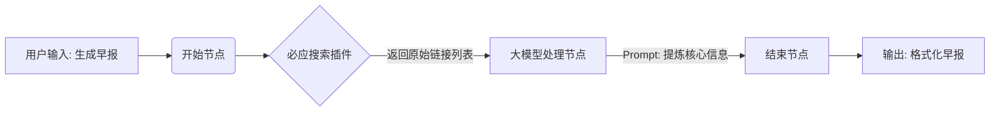
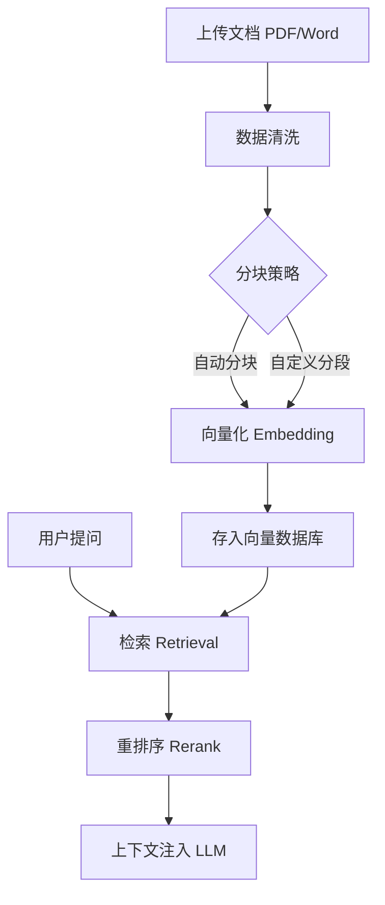

# 第十三章 平台纵览——主流 Agent 开发平台

本章介绍低代码/无代码Agent开发平台：OpenAI GPTs的极简构建、Coze的可视化工作流、Dify与FastGPT的企业级开源方案。通过"科技新闻早报"与"员工手册问答"实战案例，展示平台从设计到落地的完整流程，并分析低代码开发的局限与挑战。

## 13.1 引言：Agent 构建的民主化
在前几章中，我们像工匠一样，使用 LangChain 或 LangGraph 一行行代码地打磨 Agent 的神经脉络。这种"代码级"的开发模式虽然灵活且强大，但同时也构建了高耸的技术壁垒。并非每个拥有创意的人都精通 Python，也不是每个企业都有资源维护一支 AI 研发团队。

AI Agent 的未来不仅属于工程师，更属于产品经理、运营专家和每一个领域专家。为了实现这一愿景，**低代码/无代码 Agent 开发平台**应运而生。它们将复杂的 Prompt 工程、RAG 流程和工具调用封装成可视化的积木，让构建一个智能助手变得像搭建乐高一样直观。

本章将纵览当前主流的 Agent 开发平台，分析它们的设计哲学、核心能力，并通过具体的实战案例，帮助大家掌握如何选择适合自己的"AI 工厂"。

## 13.2 消费者级平台：让每个人拥有 AI 助手
这一类平台通常面向个人用户或小型团队，强调易用性、分享便利性以及依托于强大模型的创造力。

### 13.2.1 OpenAI GPTs：极简主义的典范
随着 GPT-4o 的发布，OpenAI 推出的 **GPTs** 功能重新定义了个性化 Agent 的构建标准。它是"模型即平台"理念的极致体现。

*   **核心体验**：全程对话式构建。你不需要编写复杂的 System Prompt，只需告诉它"我想做一个帮你写周报的助手"，它会通过多轮对话引导你完善配置。

*   **核心能力**：

    *   **Knowledge（知识库）**：上传 PDF、Word 等文档，即刻拥有 RAG 能力，无需关心向量数据库的维护。

    *   **Actions（动作）**：通过 OpenAPI Schema 接入外部 API，使其具备了与现实世界交互的能力。

*   **局限性**：作为 SaaS 服务，数据隐私存在争议；且工作流逻辑相对简单，难以处理复杂的分支判断；国内用户访问存在门槛。

### 13.2.2 字节跳动 Coze (扣子)：功能丰富的低代码工厂
如果说 GPTs 是 iPhone，简单优雅但封闭；那么 Coze 就像 Android，开放、可定制且功能强大。Coze 是目前国内最流行的 Agent 开发平台之一。

#### 1. 设计哲学：工作流为王
Coze 最大的亮点在于**可视化工作流**。在代码开发中，我们通过代码控制逻辑流；而在 Coze 中，这些逻辑被具象化为一个个节点。
**适用场景**：当你需要 Agent 执行"先搜索 A，再总结 B，最后发送邮件 C"这类有严格顺序的任务时，工作流是最佳选择。

#### 2. 实战演练：构建一个"科技新闻早报" Agent
为了让大家深入理解 Coze 的工作流机制，我们将设计一个自动抓取科技新闻并生成早报的 Agent。
**【设计内容】**
用户输入"生成早报"，Agent 执行以下逻辑：

1.  **搜索节点**：调用必应搜索插件，获取最新的"AI 科技"新闻。

2.  **大模型节点**：对搜索到的杂乱链接和摘要进行清洗、提炼，生成 3 条核心简报。

3.  **输出节点**：将简报以 Markdown 格式输出。
**【流程图】**


**【具体步骤】**

1.  **创建 Bot**：登录 Coze 平台，点击"创建 Bot"，命名为"科技早报助手"。

2.  **编排工作流**：

    *   在编排页面，点击"工作流" -> "创建工作流"。

    *   **添加插件节点**：选择"必应搜索"插件，输入查询关键词 `最新 AI 科技新闻`。

    *   **添加大模型节点**：将搜索节点的输出 `results` 连接到大模型节点的输入。

    *   **编写 Prompt**：在大模型节点中填入：
        

```

你是一个资深科技编辑。请根据以下搜索结果：
        {{search_results}}
        
        请完成以下任务：

        1. 筛选出 3 条最有价值的新闻。

        2. 去除广告和无关信息。

        3. 以【标题】+【一句话摘要】的格式输出。

        

```

    *   **连接结束节点**：将大模型节点的输出连接到结束节点。

3.  **测试与发布**：点击右上角"预览"，输入指令测试效果。满意后发布到"飞书"或"微信公众号"渠道。

## 13.3 企业级与开源部署平台
对于企业用户而言，数据安全、私有化部署和深度定制是首要考量。这一类平台更像是一个"LLM 操作系统"。

### 13.3.1 Dify：开源、易用的 LLMOps 平台
Dify 是目前开源社区中最耀眼的明星之一，它定位为"可扩展的 LLMOps 平台"。它不仅仅是一个构建工具，更提供了完整的后端服务。

#### 1. 核心优势：RAG 管道
Dify 在处理"知识库"方面做得非常出色。它不仅仅是简单的"上传文件"，而是提供了一整套数据处理管道。
**【流程图：Dify 的 RAG 处理流程】**



#### 2. 实战演练：搭建企业内部"员工手册问答助手"
**【设计内容】**
企业内部有大量的 PDF 规章制度，员工查询不便。我们需要构建一个能精准回答政策细节的助手。
**【具体步骤】**

1.  **私有化部署**（简述）：

    *   下载 Dify 源码，使用 Docker Compose 一键启动，确保数据保留在本地服务器。

2.  **创建知识库**：

    *   进入"知识库"页面，上传《员工手册.pdf》。

    *   **关键设置**：选择"高质量索引"，开启"分段与清洗"。这里建议选择"父子分段模式"，即检索时用大块文本定位，回答时用小块文本精读，提高准确率。

3.  **创建应用**：

    *   创建"聊天助手"类型应用。

    *   在"上下文"设置中，关联刚才创建的知识库。

    *   **提示词编写**：
        

```

你是企业行政助手。请根据以下知识库内容回答员工问题。

如果知识库中没有提到相关内容，请直接回答"根据现有手册无法确定，请咨询人事部门"，切勿编造。

```

4.  **调试与发布**：

    *   在右侧对话框测试："年假应该怎么请？"观察它是否精准引用了手册中的条款。

    *   发布后，Dify 会生成一个 API 接口，你可以将这个接口集成到企业的飞书/钉钉机器人中。

### 13.3.2 FastGPT：专注知识库问答的快枪手
FastGPT 专注于"知识库问答"这一垂直领域，以其出色的数据处理能力著称。

*   **核心优势**：在导入文档环节提供了极其细致的控制，如自动清洗、分段预览、QA 拆分等。这使得基于 FastGPT 构建的 RAG 应用往往拥有更高的回答准确率。

*   **适用场景**：企业内部知识库、智能客服系统、文档问答助手。

## 13.4 平台核心能力横向对比
为了帮助读者更好地选型，我们从四个维度对主流平台进行对比：
| 维度 | GPTs | Coze (扣子) | Dify | FastGPT |
| :--- | :--- | :--- | :--- | :--- |
| **定位人群** | 个人用户、极客 | 个人开发者、运营人员 | 企业开发者、全栈工程师 | 企业知识管理员 |
| **编排能力** | 弱（仅 Prompt 配置） | **强**（可视化工作流） | **强**（可视化工作流） | 中（侧重知识库流程） |
| **知识库能力** | 中（上传即用，不可调） | 强（支持多格式、自动分块） | **强**（支持清洗策略、重排序） | **极强**（专业数据处理） |
| **部署方式** | SaaS (闭源) | SaaS (闭源) | **开源 / 私有化部署** | **开源 / 私有化部署** |
| **集成能力** | Actions (需写 Schema) | 插件库丰富，支持数据库 | 提供 API 接口，易于集成 | 提供 API 接口 |

## 13.5 低代码开发的局限与挑战
尽管低代码平台极大地降低了门槛，但在实际落地中，我们仍需警惕以下挑战：

1.  **灵活性天花板**：当业务逻辑极其复杂（例如涉及复杂的数学计算或特定的异步回调）时，可视化节点往往难以满足需求。此时，你不得不编写代码插件，这反而增加了"在平台里写代码"的摩擦成本。

2.  **厂商锁定**：深度依赖某个平台的特定插件、数据格式和工作流逻辑，会导致未来迁移成本极高。一旦平台倒闭或调整收费策略，业务将面临风险。

3.  **调试黑盒**：相比于代码调试（断点、日志），可视化编排的调试往往不够直观。当流程出现错误时，定位是哪个节点的 Prompt 写得不好，还是知识库检索不准，往往需要大量经验。

## 13.6 本章小结
本章重点介绍了主流的 Agent 开发平台，这是从"代码实现"迈向"产品落地"的关键一环：

1.  **OpenAI GPTs** 展示了极简构建的未来，适合快速验证创意。

2.  **Coze** 通过工作流和多模型支持，提供了强大的免费构建环境，非常适合个人开发者构建复杂的逻辑。

3.  **Dify** 和 **FastGPT** 作为开源方案，为企业私有化部署和数据安全提供了保障，是构建企业级知识库的首选。

4.  我们通过"科技早报"和"员工手册问答"两个案例，演示了从设计到落地的完整流程。

无论你是选择用代码框架精雕细琢，还是在平台上拖拽搭建，工具只是手段，**解决问题**才是 AI Agent 的终极使命。在下一章中，我们将探讨 Agent 项目落地过程中的评估与优化策略。

---

## 13.7 补充内容：工程化实践要点

### 13.7.1 平台选型的关键因素

**常见问题场景：**
选择 Agent 开发平台时，被各种功能宣传迷花眼，选定后才发现不满足实际需求。最典型的坑是：先在 Coze 上搭了一个月，最后发现对数据安全要求严格，必须私有化，全部推倒重来。

**一个实用的选型评估表**：

在拍板之前，建议用下面这张表做一遍快速评估：

| 评估维度 | 权重 | GPTs | Coze | Dify | FastGPT |
| :--- | :---: | :---: | :---: | :---: | :---: |
| **无需代码即可上线** | ★★★ | ✅ | ✅ | ⚠️（需部署） | ⚠️（需部署） |
| **数据私有化/本地部署** | ★★★ | ❌ | ❌ | ✅ | ✅ |
| **复杂工作流（条件/循环）** | ★★ | ❌ | ✅ | ✅ | ⚠️（有限） |
| **知识库问答精度** | ★★★ | ⚠️ | ⚠️ | ✅ | ✅✅ |
| **多模型切换（国产+海外）** | ★★ | ❌ | ✅ | ✅ | ✅ |
| **API 对外集成** | ★★ | ✅ | ✅ | ✅ | ✅ |
| **学习成本** | ★★ | 低 | 中 | 中高 | 中 |
| **免费额度** | ★ | 有限 | 丰富 | 开源免费 | 开源免费 |

**选型决策路径**：

```
Q1：数据能上云吗？

  → 否 → 选 Dify 或 FastGPT（私有化部署）
  → 是 → Q2

Q2：主要需求是知识库问答还是流程自动化？

  → 知识库问答 → FastGPT（专注此场景，效果最好）
  → 流程自动化 → Q3

Q3：国内用户为主还是需要 GPT-4？

  → 国内为主 → Coze（多模型支持，国内访问稳定）
  → 需要 GPT-4 → GPTs 或 Dify

```

> **真实案例**：我们曾给一家律所做法律合同检索助手，需要回答"这份合同的违约金条款在第几页"这类精确问题。一开始选的是 Coze，测试了两周后发现检索准确率只有 60%，后来换成 FastGPT，同样的知识库，配置"QA 问答对"分段模式后，准确率提升到 88%。**场景决定工具**，先测试再投入才是正道。

### 13.7.2 平台与自研的混合策略

**常见问题场景：**
完全依赖平台担心被锁定，完全自研又投入太大。很多创业公司纠结于这个问题，拖了两个月没产出，反而让竞争对手先跑出来了。

**一个务实的决策框架**：

```
阶段一：MVP验证期（0-3个月）
  → 全用平台：速度优先，验证业务可行性
  → 不要考虑"以后迁移麻烦"，先活下来

阶段二：产品成长期（3-12个月）
  → 核心路径自研（如独特的 Prompt 策略、特殊的数据处理）
  → 非核心能力继续用平台（知识库、基础工作流）
  → 关键原则：自研的部分必须有明确的差异化价值

阶段三：规模化期（12个月+）
  → 评估平台成本：是否超过自研的维护成本？

  → 数据迁移：确保知识库数据可导出（JSON/CSV）
  → 逐步替换平台能力，但不要一次性全替换

```

**避坑原则**：不管用什么平台，有一条铁律——**核心数据必须自主掌控**。知识库的原始文档、用户对话历史、效果评估数据，这些必须在你的数据库里有一份原始备份，不能只存在平台上。

### 13.7.3 平台迁移策略

**常见问题场景：**
当前平台无法满足需求（比如 Coze 不支持私有化），需要迁移。但知识库里有几百个文档，工作流搭了好几个，一想到要迁移就头大。

**解决思路与方案：**

**迁移的核心是"数据可迁移性"**，而不是"功能可迁移性"（功能重搭没有想象中那么费事，数据迁移才是真正的痛点）：

```python

# 知识库迁移示例：从 Coze/Dify 导出，导入新平台

# 大多数平台支持 JSON 导出，格式类似：

knowledge_base_export = [
    {
        "doc_id": "uuid-001",
        "title": "员工手册第一章",
        "content": "...",
        "metadata": {
            "source": "员工手册.pdf",
            "page": 1,
            "created_at": "2024-01-15"
        }
    },
    # ...
]

# 迁移脚本：将导出数据转换为目标平台格式
def migrate_knowledge_base(source_data: list, target_platform: str) -> list:
    """迁移知识库数据，适配不同平台的格式"""
    converted = []
    for doc in source_data:
        if target_platform == "fastgpt":
            converted.append({
                "q": doc.get("title", ""),      # FastGPT 的 QA 格式
                "a": doc.get("content", ""),
                "source": doc["metadata"]["source"]
            })
        elif target_platform == "dify":
            converted.append({
                "content": doc["content"],
                "metadata": doc["metadata"]
            })
    return converted

```

**渐进迁移四步走**：

1. **数据先行**：先导出所有知识库原始文档，建立本地备份

2. **并行运行**：新旧系统同时运行 1-2 周，对比回答质量

3. **逐步切流**：按用户分组灰度，先把 10% 流量切到新系统

4. **完全切换**：确认新系统稳定后，关闭旧系统

---

## 13.8 Agent 用户体验设计

### 13.8.1 Agent 交互设计原则

**常见问题场景：**
用户与 Agent 对话时感到困惑——不知道 Agent 能做什么、该说什么话。交互设计不当导致用户体验很差，用了一次就放弃了。

**四个核心设计原则**（附 Prompt 示例）：

**原则一：首次开场白，主动亮明能力**

不要等用户乱问，Agent 应该在对话开始时主动说明自己能做什么：

```

# ✗ 糟糕的开场白
"您好，有什么可以帮您的？"  ← 太泛，用户不知道从哪问起

# ✓ 好的开场白
"你好！我是公司 IT 运维助手，专门回答以下问题：
• 服务器故障排查（如：'数据库连接超时怎么办'）
• 网络访问问题（如：'VPN 连不上怎么办'）
• 账号权限申请（如：'怎么申请 GitLab 权限'）

请问您遇到什么问题了？如果不确定，可以直接描述症状。"

```

**原则二：能力边界清晰——不会的就说不会**

这是 Agent 设计里最难落地的一点。LLM 有一种"强迫症"——不愿意说"不知道"，会倾向于编造一个听起来有道理的答案。你需要在 Prompt 里明确约束：

```

# System Prompt 中的约束
你是公司员工手册助手。只能回答手册中有明确记载的内容。

如果用户问的问题超出手册范围，请直接回答：
"这个问题手册里没有相关规定，建议直接咨询 [对应部门]：

- HR 问题 → hr@company.com

- 财务问题 → finance@company.com"

不要猜测、不要推断、不要说"可能是"。

```

**原则三：长时间任务要有进度提示**

对于执行时间超过 3 秒的任务，用户会以为系统卡住了。应该实时输出执行状态：

```python

# 在 Agent 执行过程中，穿插进度提示
def run_with_progress(task: str, agent):
    steps = [
        ("🔍 正在搜索相关资料...", agent.search),
        ("📊 正在分析数据...", agent.analyze),
        ("✍️ 正在生成报告...", agent.generate)
    ]
    
    results = []
    for message, func in steps:
        yield message  # 实时输出给用户
        result = func(task)
        results.append(result)
    
    yield "✅ 完成！"
    return results

```

**原则四：错误信息要"人话化"**

技术错误信息对用户毫无意义，要翻译成可操作的提示：

```python
ERROR_MESSAGES = {
    "rate_limit_exceeded": "当前咨询量较大，请稍等 30 秒后重试。",
    "context_length_exceeded": "您的问题包含的内容太长了，请简化一下或分几次提问。",
    "model_timeout": "响应超时，可能是网络波动，请刷新后重试。",
    "knowledge_not_found": "我在知识库里没有找到相关内容。您可以尝试换个关键词，或联系 [支持邮箱]。"
}

def user_friendly_error(error_code: str) -> str:
    return ERROR_MESSAGES.get(error_code, "遇到了一点小问题，请稍后重试。如果持续出现，请联系技术支持。")

```

### 13.8.2 错误处理与用户引导

**常见问题场景：**
Agent 遇到无法处理的情况时，要么假装理解乱回答，要么直接说"我不懂"然后结束对话。两种情况用户都很沮丧。

**多级兜底策略**（从"最优回答"到"最后防线"）：

```python
class AgentFallbackHandler:
    """
    多级兜底处理器
    优先级：直接回答 > 相关内容 > 引导重述 > 转人工
    """
    
    def handle(self, query: str, rag_result: dict) -> str:
        confidence = rag_result.get("confidence", 0)
        
        # Level 1: 高置信度，直接回答
        if confidence >= 0.8:
            return rag_result["answer"]
        
        # Level 2: 中置信度，回答但加免责说明
        elif confidence >= 0.5:
            return f"""{rag_result['answer']}
            
*注意：以上内容仅供参考，如涉及重要决策，建议以官方文件为准。*"""
        
        # Level 3: 低置信度，展示相关内容并引导
        elif confidence >= 0.2:
            related = rag_result.get("related_content", [])
            if related:
                suggestions = "\n".join([f"• {r}" for r in related[:3]])
                return f"""我没有找到与您问题完全匹配的内容，但找到了一些相关信息：

{suggestions}

请问您想了解的是上面哪个方面？或者可以换个角度描述您的问题。"""
        
        # Level 4: 完全不懂，引导转人工
        return """抱歉，这个问题超出了我目前的知识范围。

建议您：

1. **换个关键词重试**：比如把"报销"换成"费用申请"

2. **联系人工支持**：[support@company.com](mailto:support@company.com)

3. **查看完整文档**：[公司知识库链接]"""

```

### 13.8.3 信任建立机制

**常见问题场景：**
用户不信任 Agent 的回答，特别是涉及重要决策时（比如人事政策、法律条款）。"AI 说的能信吗？"——这是用户心里最大的疑问。

**信任建立的核心是"可追溯性"**：

```python
def format_response_with_source(answer: str, source_docs: list) -> str:
    """
    给回答加上引用来源，让用户知道"这话从哪来的"
    """
    if not source_docs:
        return answer
    
    sources_text = "\n".join([
        f"> 📄 来源：{doc['file_name']}，第 {doc.get('page', '?')} 页"
        for doc in source_docs[:2]  # 最多展示 2 个来源
    ])
    
    return f"""{answer}

---
{sources_text}

*如有疑问，可点击来源文件核实原文。*"""

```

对于不确定的回答，要明确标注置信度：

```python
CONFIDENCE_LABELS = {
    "high": "",      # 高置信度：不加标注，直接回答
    "medium": "（基于现有资料，仅供参考）",
    "low": "⚠️ 以下内容不确定，请以官方文件为准",
}

```

### 13.8.4 用户反馈收集与利用

**常见问题场景：**
不知道用户对 Agent 哪些回答不满意，只能凭感觉优化，改了半天不知道有没有效果。

**建立数据驱动的改进闭环**：

```python
from datetime import datetime
import json

class FeedbackCollector:
    """用户反馈收集器——驱动 Agent 持续改进"""
    
    def __init__(self, storage):
        self.storage = storage
    
    def record_feedback(
        self,
        session_id: str,
        query: str,
        answer: str,
        rating: int,          # 1-5 分
        feedback_type: str,   # "wrong_answer" | "incomplete" | "too_long" | "other"
        user_comment: str = ""
    ):
        record = {
            "session_id": session_id,
            "query": query,
            "answer": answer[:200],  # 只存摘要
            "rating": rating,
            "feedback_type": feedback_type,
            "user_comment": user_comment,
            "created_at": datetime.now().isoformat()
        }
        self.storage.insert("feedback", record)
        
        # 低分反馈立即触发告警
        if rating <= 2:
            self._alert_low_score(record)
    
    def get_improvement_insights(self) -> dict:
        """
        分析最近 30 天的反馈，生成改进建议
        """
        all_feedback = self.storage.query(
            "SELECT feedback_type, COUNT(*) as cnt, AVG(rating) as avg_score "
            "FROM feedback WHERE created_at > date('now', '-30 days') "
            "GROUP BY feedback_type ORDER BY cnt DESC"
        )
        
        # 找出评分最低的 10 个问题
        worst_queries = self.storage.query(
            "SELECT query, rating, user_comment FROM feedback "
            "WHERE rating <= 2 ORDER BY created_at DESC LIMIT 10"
        )
        
        return {
            "feedback_breakdown": all_feedback,
            "worst_performing_queries": worst_queries,
            "action_items": self._generate_action_items(all_feedback)
        }
    
    def _generate_action_items(self, breakdown: list) -> list:
        """根据反馈分类生成可执行的改进建议"""
        actions = []
        for item in breakdown:
            if item["feedback_type"] == "wrong_answer" and item["cnt"] > 10:
                actions.append(f"⚠️ 过去 30 天有 {item['cnt']} 次错误回答，建议检查知识库准确性")
            elif item["feedback_type"] == "incomplete" and item["cnt"] > 5:
                actions.append(f"📝 有 {item['cnt']} 次回答不完整，建议增加相关文档覆盖")
        return actions
    
    def _alert_low_score(self, record: dict):
        print(f"[告警] 低分反馈: 问题='{record['query'][:50]}...' 评分={record['rating']}")
        # 实际可接入钉钉/飞书告警

```

> **运营建议**：不要把反馈数据收集了就放那儿。建议每周固定花 30 分钟看一次"最差回答 Top 10"，这是提升 Agent 质量最高效的途径——真实用户问的真实问题，比自己想测试用例要有价值得多。

---

## 13.9 多语言与国际化支持

### 为什么需要多语言支持

当 Agent 面向全球用户或跨国企业时，多语言能力是刚需：

*   **用户界面语言**：用户用中文提问，Agent 应该用中文回答

*   **知识库语言**：企业文档可能是中英文混合，Agent 需要能处理

*   **输出一致性**：避免"中英混杂"的尴尬回复

### 多语言支持的三个层面

**1. 语言检测与路由**

```python
from langdetect import detect

class MultilingualRouter:
    """根据用户输入语言路由到对应 Prompt"""
    
    PROMPT_TEMPLATES = {
        "zh": "你是专业的中文助手...",
        "en": "You are a professional assistant...",
        "ja": "あなたはプロフェッショナルなアシスタントです...",
    }
    
    def get_prompt(self, user_input: str) -> str:
        lang = detect(user_input)  # 自动检测语言
        return self.PROMPT_TEMPLATES.get(lang, self.PROMPT_TEMPLATES["en"])

```

**2. 知识库多语言处理**

| 策略 | 适用场景 | 实现方式 |
|------|---------|---------|
| **独立索引** | 各语言文档完全独立 | 中文知识库、英文知识库分开建索引 |
| **统一索引+语言标记** | 文档多语言混合 | 索引时标记语言字段，检索时过滤 |
| **机器翻译对齐** | 同一内容有多语言版本 | 建立文档级映射关系，检索时 fallback |

**3. 输出语言控制**

在 System Prompt 中明确指定输出语言：

```python
SYSTEM_PROMPTS = {
    "zh": """你是企业智能助手。请遵守以下规则：

1. 始终用中文回答

2. 专业术语可保留英文（如 API、JSON）

3. 数字格式：1,000.50（千分位逗号，小数点）""",
    
    "en": """You are an enterprise assistant. Rules:

1. Always respond in English

2. Keep technical terms in English

3. Number format: 1,000.50""",
}

```

### 混合语言输入的处理

实际场景中，用户可能中英混杂提问："怎么调用 createOrder API？"

**处理策略**：

1.  **主语言判定**：根据多数词或问题主干判定

2.  **术语保留**：API 名、代码片段保持原样

3.  **回答语言**：跟随用户主语言，但保留原文术语

```python
def handle_mixed_language(user_input: str) -> str:
    """
    处理中英混杂输入
    示例输入："怎么调用 createOrder API？"
    示例输出："您可以通过以下方式调用 createOrder API..."
    """
    # 1. 检测主语言
    main_lang = detect(user_input)
    
    # 2. 提取保留术语（英文代码、API名）
    import re
    code_terms = re.findall(r'[a-zA-Z_][a-zA-Z0-9_]*(?:\.[a-zA-Z_][a-zA-Z0-9_]*)*', user_input)
    
    # 3. 构建 Prompt，要求保持术语原样
    prompt = f"""用户问题（主语言：{main_lang}）：{user_input}
    
请用{'中文' if main_lang == 'zh' else 'English'}回答。

注意：以下术语保持原样，不要翻译：{', '.join(code_terms)}
"""
    return prompt

```

### 多语言评估要点

| 测试项 | 通过标准 |
|--------|---------|
| 语言一致性 | 中文提问 → 中文回答，不混杂英文句子 |
| 术语处理 | API/代码名保持原样，不被翻译 |
| 数字格式 | 中文场景用 "1,234.56"，欧洲场景用 "1.234,56" |
| 文化适配 | 日期格式、货币符号符合当地习惯 |

> 💡 **建议**：初期不必追求"完美多语言"。先确保中英文能正确区分和响应，再逐步扩展其他语言。大多数 LLM（GPT-4、Claude）本身具备多语言能力，关键是 Prompt 里明确指定输出语言。
