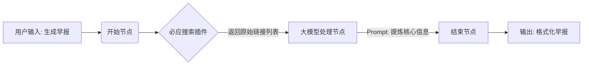
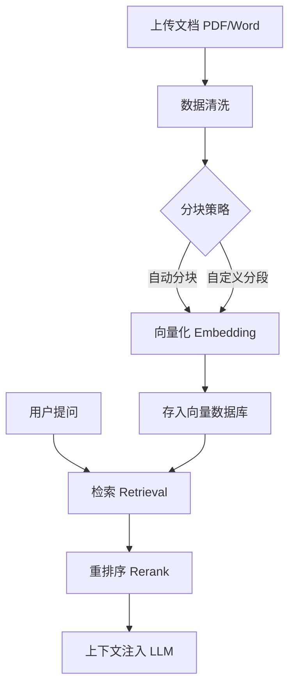

# 第十三章 平台纵览——主流 Agent 开发平台

本章介绍低代码/无代码Agent开发平台：OpenAI GPTs的极简构建、Coze的可视化工作流、Dify与FastGPT的企业级开源方案。通过"科技新闻早报"与"员工手册问答"实战案例，展示平台从设计到落地的完整流程，并分析低代码开发的局限与挑战。
## 13.1 引言：Agent 构建的民主化
在前几章中，我们像工匠一样，使用 LangChain 或 LangGraph 一行行代码地打磨 Agent 的神经脉络。这种“代码级”的开发模式虽然灵活且强大，但同时也构建了高耸的技术壁垒。并非每个拥有创意的人都精通 Python，也不是每个企业都有资源维护一支 AI 研发团队。
AI Agent 的未来不仅属于工程师，更属于产品经理、运营专家和每一个领域专家。为了实现这一愿景，**低代码/无代码 Agent 开发平台**应运而生。它们将复杂的 Prompt 工程、RAG 流程和工具调用封装成可视化的积木，让构建一个智能助手变得像搭建乐高一样直观。
本章将纵览当前主流的 Agent 开发平台，分析它们的设计哲学、核心能力，并通过具体的实战案例，帮助大家掌握如何选择适合自己的“AI 工厂”。
## 13.2 消费者级平台：让每个人拥有 AI 助手
这一类平台通常面向个人用户或小型团队，强调易用性、分享便利性以及依托于强大模型的创造力。
### 13.2.1 OpenAI GPTs：极简主义的典范
随着 GPT-4o 的发布，OpenAI 推出的 **GPTs** 功能重新定义了个性化 Agent 的构建标准。它是“模型即平台”理念的极致体现。
*   **核心体验**：全程对话式构建。你不需要编写复杂的 System Prompt，只需告诉它“我想做一个帮你写周报的助手”，它会通过多轮对话引导你完善配置。
*   **核心能力**：
    *   **Knowledge（知识库）**：上传 PDF、Word 等文档，即刻拥有 RAG 能力，无需关心向量数据库的维护。
    *   **Actions（动作）**：通过 OpenAPI Schema 接入外部 API，使其具备了与现实世界交互的能力。
*   **局限性**：作为 SaaS 服务，数据隐私存在争议；且工作流逻辑相对简单，难以处理复杂的分支判断；国内用户访问存在门槛。
### 13.2.2 字节跳动 Coze (扣子)：功能丰富的低代码工厂
如果说 GPTs 是 iPhone，简单优雅但封闭；那么 Coze 就像 Android，开放、可定制且功能强大。Coze 是目前国内最流行的 Agent 开发平台之一。
#### 1. 设计哲学：工作流为王
Coze 最大的亮点在于**可视化工作流**。在代码开发中，我们通过代码控制逻辑流；而在 Coze 中，这些逻辑被具象化为一个个节点。
**适用场景**：当你需要 Agent 执行“先搜索 A，再总结 B，最后发送邮件 C”这类有严格顺序的任务时，工作流是最佳选择。
#### 2. 实战演练：构建一个“科技新闻早报” Agent
为了让大家深入理解 Coze 的工作流机制，我们将设计一个自动抓取科技新闻并生成早报的 Agent。
**【设计内容】**
用户输入“生成早报”，Agent 执行以下逻辑：
1.  **搜索节点**：调用必应搜索插件，获取最新的“AI 科技”新闻。
2.  **大模型节点**：对搜索到的杂乱链接和摘要进行清洗、提炼，生成 3 条核心简报。
3.  **输出节点**：将简报以 Markdown 格式输出。
**【流程图】**

```mermaid
graph LR
    A[用户输入: 生成早报] --> B(开始节点)
    B --> C{必应搜索插件}
    C -->|返回原始链接列表| D[大模型处理节点]
    D -->|Prompt: 提炼核心信息| E[结束节点]
    E --> F[输出: 格式化早报]
```
**【具体步骤】**
1.  **创建 Bot**：登录 Coze 平台，点击“创建 Bot”，命名为“科技早报助手”。
2.  **编排工作流**：
    *   在编排页面，点击“工作流” -> “创建工作流”。
    *   **添加插件节点**：选择“必应搜索”插件，输入查询关键词 `最新 AI 科技新闻`。
    *   **添加大模型节点**：将搜索节点的输出 `results` 连接到大模型节点的输入。
    *   **编写 Prompt**：在大模型节点中填入：
        ```markdown
        你是一个资深科技编辑。请根据以下搜索结果：
        {{search_results}}
        
        请完成以下任务：
        1. 筛选出 3 条最有价值的新闻。
        2. 去除广告和无关信息。
        3. 以【标题】+【一句话摘要】的格式输出。
        ```
    *   **连接结束节点**：将大模型节点的输出连接到结束节点。
3.  **测试与发布**：点击右上角“预览”，输入指令测试效果。满意后发布到“飞书”或“微信公众号”渠道。
## 13.3 企业级与开源部署平台
对于企业用户而言，数据安全、私有化部署和深度定制是首要考量。这一类平台更像是一个“LLM 操作系统”。
### 13.3.1 Dify：开源、易用的 LLMOps 平台
Dify 是目前开源社区中最耀眼的明星之一，它定位为“可扩展的 LLMOps 平台”。它不仅仅是一个构建工具，更提供了完整的后端服务。
#### 1. 核心优势：RAG 管道
Dify 在处理“知识库”方面做得非常出色。它不仅仅是简单的“上传文件”，而是提供了一整套数据处理管道。
**【流程图：Dify 的 RAG 处理流程】**

```mermaid
graph TD
    A[上传文档 PDF/Word] --> B[数据清洗]
    B --> C{分块策略}
    C -->|自动分块| D[向量化 Embedding]
    C -->|自定义分段| D
    D --> E[存入向量数据库]
    F[用户提问] --> G[检索 Retrieval]
    E --> G
    G --> H[重排序 Rerank]
    H --> I[上下文注入 LLM]
```
#### 2. 实战演练：搭建企业内部“员工手册问答助手”
**【设计内容】**
企业内部有大量的 PDF 规章制度，员工查询不便。我们需要构建一个能精准回答政策细节的助手。
**【具体步骤】**
1.  **私有化部署**（简述）：
    *   下载 Dify 源码，使用 Docker Compose 一键启动，确保数据保留在本地服务器。
2.  **创建知识库**：
    *   进入“知识库”页面，上传《员工手册.pdf》。
    *   **关键设置**：选择“高质量索引”，开启“分段与清洗”。这里建议选择“父子分段模式”，即检索时用大块文本定位，回答时用小块文本精读，提高准确率。
3.  **创建应用**：
    *   创建“聊天助手”类型应用。
    *   在“上下文”设置中，关联刚才创建的知识库。
    *   **提示词编写**：
        ```markdown
        你是企业行政助手。请根据以下知识库内容回答员工问题。
        如果知识库中没有提到相关内容，请直接回答“根据现有手册无法确定，请咨询人事部门”，切勿编造。
        ```
4.  **调试与发布**：
    *   在右侧对话框测试：“年假应该怎么请？”观察它是否精准引用了手册中的条款。
    *   发布后，Dify 会生成一个 API 接口，你可以将这个接口集成到企业的飞书/钉钉机器人中。
### 13.3.2 FastGPT：专注知识库问答的快枪手
FastGPT 专注于“知识库问答”这一垂直领域，以其出色的数据处理能力著称。
*   **核心优势**：在导入文档环节提供了极其细致的控制，如自动清洗、分段预览、QA 拆分等。这使得基于 FastGPT 构建的 RAG 应用往往拥有更高的回答准确率。
*   **适用场景**：企业内部知识库、智能客服系统、文档问答助手。
## 13.4 平台核心能力横向对比
为了帮助读者更好地选型，我们从四个维度对主流平台进行对比：
| 维度 | GPTs | Coze (扣子) | Dify | FastGPT |
| :--- | :--- | :--- | :--- | :--- |
| **定位人群** | 个人用户、极客 | 个人开发者、运营人员 | 企业开发者、全栈工程师 | 企业知识管理员 |
| **编排能力** | 弱（仅 Prompt 配置） | **强**（可视化工作流） | **强**（可视化工作流） | 中（侧重知识库流程） |
| **知识库能力** | 中（上传即用，不可调） | 强（支持多格式、自动分块） | **强**（支持清洗策略、重排序） | **极强**（专业数据处理） |
| **部署方式** | SaaS (闭源) | SaaS (闭源) | **开源 / 私有化部署** | **开源 / 私有化部署** |
| **集成能力** | Actions (需写 Schema) | 插件库丰富，支持数据库 | 提供 API 接口，易于集成 | 提供 API 接口 |
## 13.5 低代码开发的局限与挑战
尽管低代码平台极大地降低了门槛，但在实际落地中，我们仍需警惕以下挑战：
1.  **灵活性天花板**：当业务逻辑极其复杂（例如涉及复杂的数学计算或特定的异步回调）时，可视化节点往往难以满足需求。此时，你不得不编写代码插件，这反而增加了“在平台里写代码”的摩擦成本。
2.  **厂商锁定**：深度依赖某个平台的特定插件、数据格式和工作流逻辑，会导致未来迁移成本极高。一旦平台倒闭或调整收费策略，业务将面临风险。
3.  **调试黑盒**：相比于代码调试（断点、日志），可视化编排的调试往往不够直观。当流程出现错误时，定位是哪个节点的 Prompt 写得不好，还是知识库检索不准，往往需要大量经验。
## 13.6 本章小结
本章重点介绍了主流的 Agent 开发平台，这是从“代码实现”迈向“产品落地”的关键一环：
1.  **OpenAI GPTs** 展示了极简构建的未来，适合快速验证创意。
2.  **Coze** 通过工作流和多模型支持，提供了强大的免费构建环境，非常适合个人开发者构建复杂的逻辑。
3.  **Dify** 和 **FastGPT** 作为开源方案，为企业私有化部署和数据安全提供了保障，是构建企业级知识库的首选。
4.  我们通过“科技早报”和“员工手册问答”两个案例，演示了从设计到落地的完整流程。
无论你是选择用代码框架精雕细琢，还是在平台上拖拽搭建，工具只是手段，**解决问题**才是 AI Agent 的终极使命。在下一章中，我们将探讨 Agent 项目落地过程中的评估与优化策略。

---

## 13.7 补充内容：工程化实践要点

### 13.7.1 平台选型的关键因素

**常见问题场景：**
选择Agent开发平台时，被各种功能宣传迷花眼，选定后才发现不满足实际需求。

**解决思路与方案：**
- 明确业务需求：知识库问答？流程自动化？客服机器人？
- 评估数据安全要求：是否需要私有化部署？
- 考察集成能力：能否对接现有系统？
- 考虑成本模型：按调用量还是按订阅？
- 试用后再决定：先用免费版测试核心功能

### 13.7.2 平台与自研的混合策略

**常见问题场景：**
完全依赖平台担心被锁定，完全自研又投入太大。

**解决思路与方案：**
- 简单场景用平台：快速验证PMF
- 复杂场景自研：差异化竞争力
- 平台作为能力补充：灵活切换
- 核心数据自主掌控

### 13.7.3 平台迁移策略

**常见问题场景：**
当前平台无法满足需求，需要迁移到其他平台。

**解决思路与方案：**
- 尽早规划：避免深度绑定
- 数据导出：确保知识库可迁移
- 能力抽象：业务逻辑与平台解耦
- 渐进迁移：先迁移非核心功能

---

## 13.8 Agent用户体验设计

### 13.8.1 Agent交互设计原则

**常见问题场景：**
用户与Agent对话时感到困惑，不知道Agent能做什么、该说什么话。交互设计不当导致用户体验很差。

**解决思路与方案：**
```
Agent交互设计原则：

1. 清晰的能力边界
   - 开头主动告知Agent能做什么
   - 不知道时明确说明，而不是乱回答
   
2. 主动引导
   - 用户不知道问什么时，提供示例问题
   - 需要更多信息时，明确告知需要什么
   
3. 进度透明
   - 长时间处理时显示进度
   - 复杂任务分步说明
   
4. 错误友好
   - 出错时用人类语言解释
   - 提供解决方案，而不是直接失败
```

### 13.8.2 错误处理与用户引导

**常见问题场景：**
Agent遇到无法处理的情况时，要么假装理解乱回答，要么直接说"我不懂"然后结束对话。用户感到沮丧。

**解决思路与方案：**
- **多级兜底**：一线回答失败，尝试二线策略，最后才转人工
- **建议替代**：当无法直接回答时，提供相关建议
- **收集信息**：主动询问来澄清用户意图
- **承认局限**：明确说明哪些做不到，并提供替代方案

### 13.8.3 信任建立机制

**常见问题场景：**
用户不信任Agent的回答，特别是涉及重要决策时。缺乏信任导致用户不使用Agent。

**解决思路与方案：**
- **透明来源**：引用信息来源，让用户可以核实
- **标注不确定**：对不确定的内容明确标注
- **历史可追溯**：用户可以查看完整的对话历史
- **可控范围**：明确说明Agent决策的适用范围

### 13.8.4 用户反馈收集利用

**常见问题场景：**
不知道用户对Agent的哪些回答不满意，无法持续改进。

**解决思路与方案：**
- **即时反馈**：支持对单条回复点赞/点踩
- **问题上报**：用户可以报告问题
- **改进闭环**：将反馈纳入改进计划
- **A/B测试**：通过实验验证改进效果
