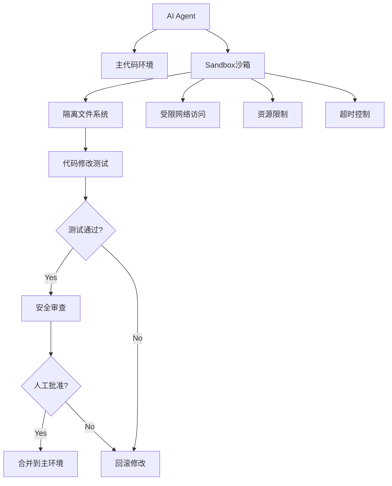

# 附录C：AI Coding Sandbox — 安全沙箱

> 本文档提取自第15章「Agent开发指南：自我进化」，详细阐述AI Coding Agent在自我修改过程中的安全隔离机制。涵盖Sandbox的必要性、架构设计、隔离技术选型，以及Ghost Agent和Gödel Agent两个实战案例。

### 4.1 为什么需要Sandbox

AI Coding Agent能修改自己的代码，但"自己修改自己"存在巨大风险：

- 代码可能进入死循环

- 可能删除关键文件

- 可能执行危险命令

- 自我复制失控

**解决方案：隔离的沙箱环境**

### 4.2 Sandbox架构



### 4.3 沙箱隔离技术

| 技术 | 隔离级别 | 性能 | 适用场景 |
|:---|:---|:---|:---|
| **Firecracker MicroVM** | 硬件级 | 高 | 生产级隔离 |
| **gVisor** | 内核级 | 中 | 容器隔离 |
| **Docker Namespace** | 进程级 | 高 | 快速测试 |
| **Bubblewrap** | 用户命名空间 | 高 | Linux桌面 |
| **WASM** | 语言级 | 极高 | 轻量执行 |

### 4.4 Ghost Agent自我修改案例

```python
class GhostCodingAgent:
    """
    自我修改的AI Coding Agent
    能够在隔离环境中改进自己的系统架构
    """
    
    def __init__(self, sandbox_config: dict):
        self.sandbox = SandboxedEnvironment(sandbox_config)
        self.codebase_path = "./agent_code"
        self.review_agent = AdversarialReviewer()
    
    def self_improve(self) -> Dict[str, Any]:
        """
        自我改进工作流
        """
        # 1. 检测弱点
        weaknesses = self.detect_weaknesses()
        
        # 2. 在沙箱中编写补丁
        patches = []
        for weakness in weaknesses:
            patch = self.sandbox.create_branch()
            patch_code = self.generate_improvement(weakness)
            patch.apply(patch_code)
            patches.append(patch)
        
        # 3. 创建内部Pull Request
        pr = self.create_internal_pr(patches)
        
        # 4. 对抗性AI审查
        review = self.review_agent.review(pr)
        
        # 5. 自动测试
        test_results = self.sandbox.run_tests(pr)
        
        # 6. 决策
        if review.approved and test_results.passed:
            self.merge(pr)  # 合并到主环境
            return {"status": "success", "merged": pr}
        else:
            self.sandbox.rollback(patches)  # 回滚
            return {"status": "rejected", "reason": review.reason}
    
    def detect_weaknesses(self) -> List[Dict]:
        """检测系统弱点"""
        # 分析日志、错误、瓶颈
        pass
    
    def generate_improvement(self, weakness: Dict) -> str:
        """生成改进代码"""
        # 调用LLM生成修复代码
        pass
```

### 4.5 自引用框架：Gödel Agent

```python
class GodelAgent:
    """
    Gödel Machine: 递归自我改进框架
    
    基于Gödel机器原理：
    AI Agent可以证明某个代码修改能提升目标函数，
    然后执行该修改
    """
    
    def __init__(self, target_function: callable):
        self.target = target_function
        self.code = self.load_current_code()
    
    def self_improve(self) -> bool:
        """
        递归自我改进
        """
        # 1. 形式化目标
        goal = self.formalize_goal()
        
        # 2. 搜索改进
        improvement = self.search_for_improvement(goal)
        
        # 3. 形式验证（关键！）
        if self.verify(improvement, goal):
            # 4. 应用改进
            self.apply_improvement(improvement)
            return True
        return False
    
    def verify(self, improvement: str, goal) -> bool:
        """
        使用LLM证明改进是正确的
        """
        proof_prompt = f"""
        验证以下代码修改是否满足目标函数：
        
        目标: {goal}
        修改: {improvement}
        
        请给出严格的形式化证明。

        """
        # 调用LLM生成证明
        proof = self.llm.generate(proof_prompt)
        return self.check_proof_validity(proof)
```
