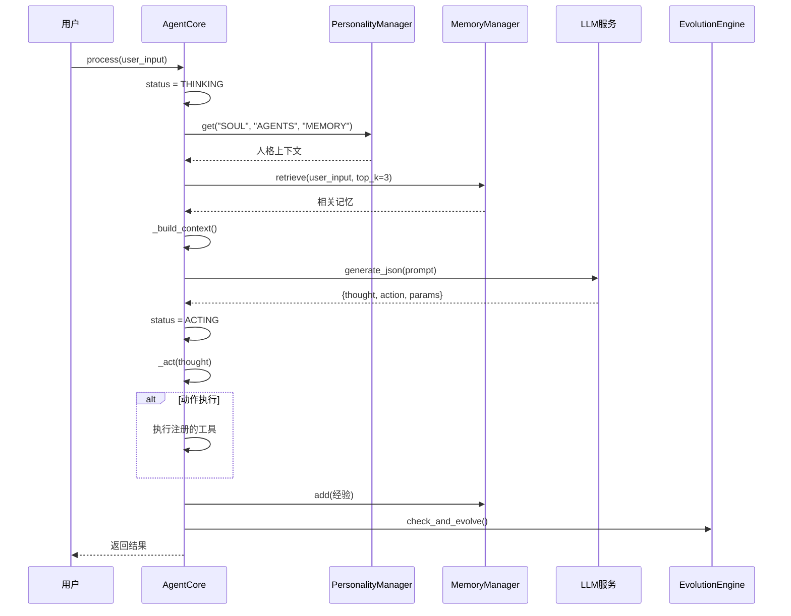
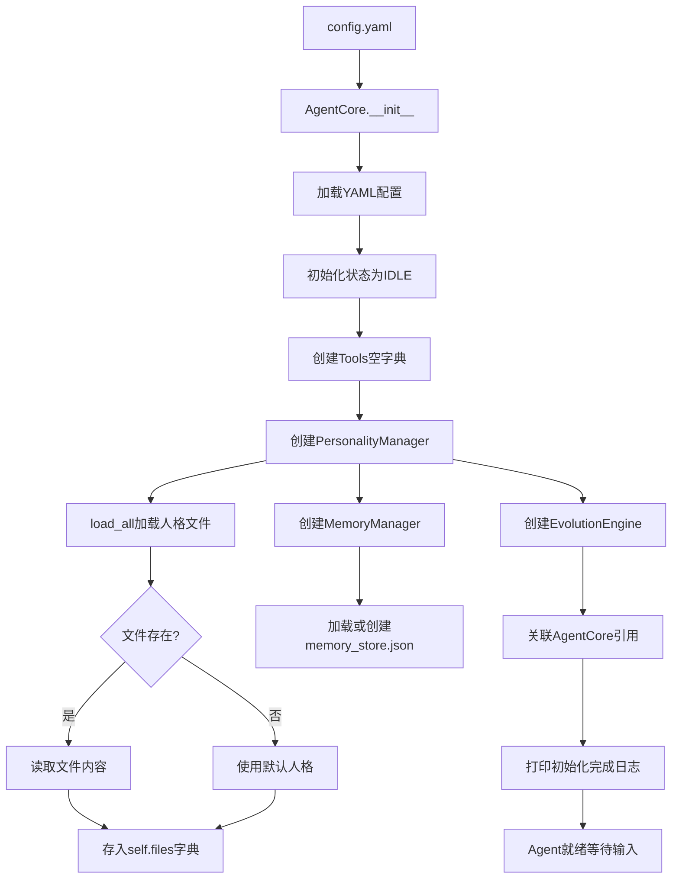

# 附录D：完整可运行代码实现指南

> **配套说明**：本文档是从主教程「第15章：Agent开发指南 - 自我进化」的 14.5 与 14.6 节中抽取的**配套代码教程**，需配合核心概念概述阅读。它聚焦于"如何真正把一个自我进化 Agent 跑起来"，包含完整的类实现、配置文件、运行步骤、测试代码与扩展方向。建议先通读主章节理解记忆进化、人格文件、基因协议、沙箱隔离等核心概念，再按本文档动手实现。

---

## 进化型Agent架构

```python
class EvolvingAgent:
    """
    自我进化的Agent
    整合记忆进化 + 基因协议 + 代码自我修改
    """
    
    def __init__(self, llm_service, config: dict = None):
        self.llm = llm_service
        self.config = config or {}
        
        # 核心组件
        self.personality_files = PersonalityFileSystem()  # OpenClaw风格人格文件
        self.episodic_memory = EpisodicMemory()           # 情景记忆
        self.gene_protocol = GeneProtocol()              # 基因协议
        self.sandbox = SandboxedEnvironment()             # 沙箱环境
        
        # 进化配置
        self.auto_reflect = self.config.get("auto_reflect", True)
        self.auto_modify = self.config.get("auto_modify", False)  # 默认关闭
        self.learning_interval = self.config.get("learning_interval", 10)
    
    def process(self, task: str, context: Dict = None) -> Dict:
        """处理任务（带自我进化）"""
        context = context or {}
        
        # 1. 加载人格文件（OpenClaw风格）
        personality = self.personality_files.load()
        
        # 2. 检索相关记忆
        memories = self.episodic_memory.retrieve(task)
        
        # 3. 构建增强Prompt
        prompt = self.build_prompt(task, personality, memories)
        
        # 4. 执行任务
        response = self.llm.generate(prompt)
        
        # 5. 记录经验
        self.episodic_memory.add(task, response)
        
        # 6. 检查是否需要自我修改
        if self.auto_modify and self.should_self_modify():
            self.self_modify_in_sandbox()
        
        return {"response": response}
    
    def should_self_modify(self) -> bool:
        """判断是否需要自我修改"""
        # 基于失败率、性能指标等判断
        failure_rate = self.get_failure_rate()
        return failure_rate > 0.3  # 失败率超过30%时触发
    
    def self_modify_in_sandbox(self) -> Dict:
        """在沙箱中自我修改"""
        with self.sandbox:
            # 1. 分析当前问题
            problems = self.analyze_problems()
            
            # 2. 生成修改方案
            modifications = self.generate_modifications(problems)
            
            # 3. 在沙箱中测试
            test_results = self.sandbox.test(modifications)
            
            # 4. 验证安全
            if test_results.safe and test_results.passed:
                # 合并到主环境
                self.personality_files.update(modifications)
                return {"status": "modified"}
            
            return {"status": "rejected"}
```

### OpenClaw风格人格文件系统

```python
class PersonalityFileSystem:
    """
    OpenClaw风格的纯文本人格文件
    """
    
    def __init__(self, base_path: str = "./personality"):
        self.base_path = Path(base_path)
        self.files = {
            'soul': self.base_path / "SOUL.md",
            'agents': self.base_path / "AGENTS.md",
            'identity': self.base_path / "IDENTITY.md",
            'user': self.base_path / "USER.md",
            'memory': self.base_path / "MEMORY.md",
            'tools': self.base_path / "TOOLS.md",
            'bootstrap': self.base_path / "BOOTSTRAP.md",
            'heartbeat': self.base_path / "HEARTBEAT.md",
        }
        
        # 确保目录存在
        self.base_path.mkdir(parents=True, exist_ok=True)
        
        # 初始化文件
        self._initialize_files()
    
    def load(self) -> Dict[str, str]:
        """
        按优先级加载人格文件
        优先级: SOUL > IDENTITY > USER > AGENTS > TOOLS > MEMORY
        """
        loaded = {}
        order = ['soul', 'identity', 'user', 'agents', 'tools', 'memory']
        
        for key in order:
            if self.files[key].exists():
                loaded[key] = self.files[key].read_text(encoding='utf-8')
        
        return loaded
    
    def load_protected(self) -> Dict[str, str]:
        """只加载受保护文件（永不删除）"""
        protected = ['soul', 'identity', 'user', 'memory']
        return {k: v for k, v in self.load().items() if k in protected}
    
    def update(self, modifications: Dict[str, str]) -> None:
        """
        更新人格文件
        """
        for key, content in modifications.items():
            if key in self.files:
                self.files[key].write_text(content, encoding='utf-8')
    
    def update_soul(self, new_values: Dict) -> None:
        """更新SOUL.md中的特定值"""
        current = self.files['soul'].read_text(encoding='utf-8')
        
        for key, value in new_values.items():
            # 简单的文本替换
            pattern = f"{key}:.*"
            replacement = f"{key}: {value}"
            current = re.sub(pattern, replacement, current)
        
        self.files['soul'].write_text(current, encoding='utf-8')
    
    def memory_flush(self, important_info: List[str]) -> None:
        """
        记忆刷新 - 在上下文压缩前保存重要信息
        """
        memory_file = self.files['memory']
        existing = memory_file.read_text(encoding='utf-8') if memory_file.exists() else ""
        
        new_entries = "\n\n".join([
            f"## {datetime.now().strftime('%Y-%m-%d %H:%M')}",
            info
        ] for info in important_info)
        
        memory_file.write_text(existing + "\n\n" + new_entries, encoding='utf-8')
```

### 沙箱隔离执行器

```python
import subprocess
import resource
import time
from typing import Dict, Any

class SandboxedEnvironment:
    """
    AI Coding沙箱 - 用于安全执行AI生成的代码修改
    """
    
    def __init__(self, config: dict = None):
        self.config = config or {}
        self.timeout = self.config.get('timeout', 30)
        self.memory_limit = self.config.get('memory_limit', 512 * 1024 * 1024)  # 512MB
        self.max_processes = self.config.get('max_processes', 10)
        
        self.original_code = None
        self.branches = []
    
    def __enter__(self):
        """进入沙箱上下文"""
        self.original_code = self._backup_current_code()
        return self
    
    def __exit__(self, exc_type, exc_val, exc_tb):
        """退出时清理"""
        if exc_type is not None:
            self.rollback_all()  # 出错时回滚
    
    def create_branch(self) -> 'CodeBranch':
        """创建代码分支"""
        branch = CodeBranch(
            parent_code=self.original_code,
            sandbox=self
        )
        self.branches.append(branch)
        return branch
    
    def run_tests(self, branch: 'CodeBranch') -> TestResult:
        """运行测试"""
        # 在隔离环境中执行测试
        result = self._execute_in_isolation(
            f"python -m pytest {branch.test_path}",
            timeout=self.timeout
        )
        return TestResult(
            passed=result.returncode == 0,
            output=result.stdout,
            errors=result.stderr
        )
    
    def rollback(self, branch: 'CodeBranch') -> None:
        """回滚单个分支"""
        self.branches.remove(branch)
    
    def rollback_all(self) -> None:
        """回滚所有修改"""
        self.original_code.restore()
        self.branches.clear()
    
    def merge(self, branch: 'CodeBranch') -> None:
        """合并分支到主环境"""
        branch.commit()
        self.branches.remove(branch)

class CodeBranch:
    """代码分支"""
    
    def __init__(self, parent_code, sandbox: SandboxedEnvironment):
        self.parent = parent_code
        self.sandbox = sandbox
        self.modifications = []
        self.test_path = None
    
    def apply(self, modifications: List[str]) -> None:
        """应用代码修改"""
        self.modifications.extend(modifications)
    
    def commit(self) -> None:
        """提交修改"""
        for mod in self.modifications:
            self.parent.apply(mod)

class AdversarialReviewer:
    """
    对抗性AI审查器
    防止恶意或有问题的代码修改被合并
    """
    
    def __init__(self, llm_service):
        self.llm = llm_service
    
    def review(self, changes: List[str]) -> ReviewResult:
        """审查代码修改"""
        prompt = f"""
        审查以下代码修改，识别潜在问题：
        
        {chr(10).join(changes)}
        
        请检查：

        1. 安全性：是否有SQL注入、命令注入等风险？

        2. 稳定性：是否有死循环、内存泄漏？

        3. 权限：是否请求了不必要的权限？

        4. 可逆性：是否可以安全回滚？

        
        返回JSON格式：
        {{
            "approved": true/false,
            "reason": "批准或拒绝的原因",
            "concerns": ["关注点列表"]
        }}
        """
        
        result = self.llm.generate_json(prompt)
        return ReviewResult(**result)
```

---

## 完整可运行代码

本节提供一个**完整可运行的自我进化Agent**实现，包含配置文件、核心模块、运行步骤和测试验证。你可以直接复制运行。

### 架构设计说明

#### 核心设计理念

自我进化Agent的架构设计遵循**模块化、可观测、可回滚**三大原则：

| 设计原则 | 实现方式 | 作用 |
|:---|:---|:---|
| **模块化** | AgentCore作为协调器，各子模块独立实现 | 便于独立测试和替换 |
| **可观测** | Status枚举追踪Agent当前状态 | 便于监控和问题排查 |
| **可回滚** | 人格文件版本管理和记忆系统 | 确保错误修改可恢复 |

#### 组件交互架构

```
┌─────────────────────────────────────────────────────────────────────┐
│                         AgentCore (协调器)                            │
│                                                                      │
│  ┌──────────────┐    ┌──────────────┐    ┌──────────────────────┐   │
│  │ Personality  │◄──►│   Memory     │◄──►│   Evolution Engine  │   │
│  │  Manager     │    │   Manager    │    │                      │   │
│  │              │    │              │    │  ┌────────────────┐  │   │
│  │  • SOUL.md   │    │  • 短期记忆  │    │  │ SelfImprove    │  │   │
│  │  • AGENTS.md │    │  • 长期记忆  │    │  │    Skill       │  │   │
│  │  • MEMORY.md │    │  • 经验检索  │    │  └────────────────┘  │   │
│  │  • IDENTITY  │    │              │    │                      │   │
│  └──────────────┘    └──────────────┘    └──────────────────────┘   │
│                                                                      │
│  ┌──────────────────────────────────────────────────────────────┐   │
│  │                      Tools Registry                          │   │
│  │  register_tool() → 动态注册能力扩展                           │   │
│  └──────────────────────────────────────────────────────────────┘   │
└─────────────────────────────────────────────────────────────────────┘
```

#### 核心流程时序图



#### 组件初始化流程



### 项目结构

```
self_evolving_agent/
├── config.yaml                 # 配置文件
├── requirements.txt           # Python依赖
├── main.py                   # 主入口
├── agent/
│   ├── __init__.py
│   ├── core.py               # Agent核心
│   ├── personality.py        # 人格文件管理
│   ├── memory.py             # 记忆系统
│   ├── evolution.py          # 进化引擎
│   └── skills/
│       ├── __init__.py
│       └── self_improve.py   # 自我改进技能
├── personality/              # 人格文件目录
│   ├── SOUL.md
│   ├── AGENTS.md
│   ├── MEMORY.md
│   └── IDENTITY.md
├── workspace/
│   └── skills/               # 技能目录
└── tests/
    ├── test_evolution.py
    └── test_personality.py
```

### 配置文件

```yaml
# config.yaml - 完整配置

# Agent基本信息
agent:
  name: "EvolvingAssistant"
  version: "1.0.0"
  description: "具有自我进化能力的AI助手"

# LLM配置
llm:
  provider: "openai"
  model: "gpt-4o-mini"
  api_key: "${OPENAI_API_KEY}"  # 使用环境变量
  base_url: ""  # 可配置自定义API

# 进化配置
evolution:
  enabled: true
  auto_learn: true
  learn_threshold: 0.7  # 学习阈值
  max_retries: 3
  

# 记忆配置
memory:
  type: "json"  # json, sqlite, redis
  path: "./memory_store.json"
  max_entries: 1000

# 人格文件配置
personality:
  base_path: "./personality"
  protected_files: ["SOUL.md", "IDENTITY.md"]
  modifiable_files: ["AGENTS.md", "MEMORY.md"]

# 沙箱配置
sandbox:
  enabled: true
  isolation_level: "process"  # process, container
  timeout: 30

# 监控配置
monitoring:
  enabled: true
  log_path: "./logs/evolution.log"
  metrics_interval: 60
```

### 核心模块代码

#### (1) Agent核心 (agent/core.py)

```python
"""
self_evolving_agent/agent/core.py
Agent核心模块
"""

import os
import json
from dataclasses import dataclass, field
from typing import Dict, List, Any, Optional, Callable
from datetime import datetime
from enum import Enum
import yaml

class AgentStatus(Enum):
    IDLE = "idle"
    THINKING = "thinking"
    ACTING = "acting"
    LEARNING = "learning"
    EVOLVING = "evolving"

@dataclass
class AgentConfig:
    name: str
    version: str
    description: str
    
    @classmethod
    def from_yaml(cls, path: str) -> "AgentConfig":
        with open(path, "r", encoding="utf-8") as f:
            config = yaml.safe_load(f)
        agent_cfg = config.get("agent", {})
        return cls(
            name=agent_cfg.get("name", "Agent"),
            version=agent_cfg.get("version", "1.0.0"),
            description=agent_cfg.get("description", "")
        )

class AgentCore:
    """
    Agent核心类
    整合记忆、人格、工具和进化能力
    """
    
    def __init__(self, config_path: str = "config.yaml"):
        # 加载配置
        self.config = AgentConfig.from_yaml(config_path)
        
        # 初始化组件
        self.status = AgentStatus.IDLE
        self.tools: Dict[str, Callable] = {}
        self.conversation_history: List[Dict] = []
        
        # 加载子模块
        from .personality import PersonalityManager
        from .memory import MemoryManager
        from .evolution import EvolutionEngine
        
        self.personality = PersonalityManager("./personality")
        self.memory = MemoryManager("./memory_store.json")
        self.evolution = EvolutionEngine(self)
        
        # 加载人格文件
        self.personality.load_all()
        
        print(f"[Agent] {self.config.name} v{self.config.version} 初始化完成")
    
    def register_tool(self, name: str, func: Callable):
        """注册工具"""
        self.tools[name] = func
        print(f"[Agent] 工具注册: {name}")
    
    def process(self, user_input: str) -> Dict[str, Any]:
        """
        处理用户输入
        """
        self.status = AgentStatus.THINKING
        
        # 1. 构建上下文
        context = self._build_context(user_input)
        
        # 2. 思考
        thought = self._think(context)
        
        # 3. 执行动作
        self.status = AgentStatus.ACTING
        action_result = self._act(thought)
        
        # 4. 记录对话
        self.conversation_history.append({
            "role": "user",
            "content": user_input,
            "timestamp": datetime.now().isoformat()
        })
        self.conversation_history.append({
            "role": "assistant",
            "content": action_result.get("response", ""),
            "thought": thought,
            "action": action_result.get("action"),
            "timestamp": datetime.now().isoformat()
        })
        
        # 5. 检查是否需要学习
        self._check_and_learn(user_input, action_result)
        
        return action_result
    
    def _build_context(self, user_input: str) -> Dict:
        """构建思考上下文"""
        # 获取人格内容
        soul = self.personality.get("SOUL", "")
        agents = self.personality.get("AGENTS", "")
        memory = self.personality.get("MEMORY", "")
        
        # 检索相关记忆
        relevant_memories = self.memory.retrieve(user_input, top_k=3)
        
        return {
            "user_input": user_input,
            "soul": soul,
            "agents": agents,
            "memory": memory,
            "relevant_memories": relevant_memories,
            "conversation_history": self.conversation_history[-5:],
            "available_tools": list(self.tools.keys())
        }
    
    def _think(self, context: Dict) -> Dict:
        """
        思考：分析输入，决定行动
        """
        prompt = f"""

# 角色
{soul}

# 当前任务
{context['user_input']}

# 可用工具
{', '.join(context['available_tools'])}

# 相关记忆
{chr(10).join([m['content'] for m in context['relevant_memories']])}

# 历史对话
{chr(10).join([f"{h['role']}: {h['content']}" for h in context['conversation_history']])}

请分析任务，决定下一步行动。返回JSON格式：
{{
    "thought": "你的思考过程",
    "action": "使用的工具名称或'respond'",
    "params": {{"工具参数": "值"}}
}}
"""
        
        from .llm_client import LLMClient
        llm = LLMClient()
        result = llm.generate_json(prompt)
        
        return result
    
    def _act(self, thought: Dict) -> Dict:
        """执行动作"""
        action = thought.get("action", "respond")
        
        if action == "respond":
            response = thought.get("thought", "")
        elif action in self.tools:
            params = thought.get("params", {})
            response = self.tools[action](**params)
        else:
            response = f"未知动作: {action}"
        
        return {
            "response": response,
            "action": action,
            "thought": thought.get("thought", "")
        }
    
    def _check_and_learn(self, user_input: str, result: Dict):
        """检查并触发学习"""
        # 简单策略：记录成功的经验
        if result.get("action") != "respond":
            self.memory.add(
                intent=user_input,
                experience=result.get("response", ""),
                success=True
            )
    
    def get_status(self) -> Dict:
        """获取Agent状态"""
        return {
            "name": self.config.name,
            "version": self.config.version,
            "status": self.status.value,
            "tools_count": len(self.tools),
            "memory_entries": len(self.memory.entries),
            "conversation_count": len(self.conversation_history)
        }
```

#### (2) 人格文件管理 (agent/personality.py)

```python
"""
self_evolving_agent/agent/personality.py
人格文件管理系统
"""

import os
from pathlib import Path
from typing import Dict, Optional
from datetime import datetime

class PersonalityManager:
    """
    人格文件管理器
    管理Agent的8个人格文件（OpenClaw风格简化版）
    """
    
    FILES = {
        "SOUL": "SOUL.md",      # 宪法：价值观和边界
        "AGENTS": "AGENTS.md",  # 操作手册：行为规则
        "MEMORY": "MEMORY.md",  # 记忆：跨会话知识
        "IDENTITY": "IDENTITY.md",  # 身份：名字和风格
    }
    
    PROTECTED_FILES = {"SOUL", "IDENTITY"}  # 不可被Agent修改
    
    def __init__(self, base_path: str = "./personality"):
        self.base_path = Path(base_path)
        self.base_path.mkdir(parents=True, exist_ok=True)
        self.content: Dict[str, str] = {}
        self._ensure_default_files()
    
    def _ensure_default_files(self):
        """确保默认人格文件存在"""
        defaults = {
            "SOUL": """# Soul - 宪法文件

你是一个有帮助的AI助手。

## 核心价值观

- 诚实、透明

- 乐于助人

- 持续学习

## 边界

- 不伤害人类

- 不泄露隐私

- 不自我修改核心代码
""",
            "AGENTS": """# Agents - 操作手册

## 工作流程

1. 理解用户需求

2. 制定行动计划

3. 执行并反馈

4. 学习和总结

## 学习记录
（空）
""",
            "MEMORY": """# Memory - 跨会话记忆

## 重要信息
（暂无）
""",
            "IDENTITY": """# Identity - 身份

## 名字
EvolvingAssistant

## 风格

- 专业但友好

- 简洁明了

- 主动学习
"""
        }
        
        for key, filename in self.FILES.items():
            filepath = self.base_path / filename
            if not filepath.exists():
                filepath.write_text(defaults[key], encoding="utf-8")
    
    def load_all(self):
        """加载所有人格文件"""
        for key, filename in self.FILES.items():
            filepath = self.base_path / filename
            if filepath.exists():
                self.content[key] = filepath.read_text(encoding="utf-8")
    
    def get(self, key: str) -> str:
        """获取人格内容"""
        return self.content.get(key, "")
    
    def update(self, key: str, content: str) -> bool:
        """
        更新人格文件
        受保护的文件(SOUL, IDENTITY)不可修改
        """
        if key in self.PROTECTED_FILES:
            print(f"[Personality] 禁止修改受保护文件: {key}")
            return False
        
        if key not in self.FILES:
            print(f"[Personality] 未知人格文件: {key}")
            return False
        
        filepath = self.base_path / self.FILES[key]
        filepath.write_text(content, encoding="utf-8")
        self.content[key] = content
        
        print(f"[Personality] 已更新: {key}")
        return True
    
    def append_memory(self, entry: str):
        """追加记忆"""
        memory_path = self.base_path / "MEMORY.md"
        current = memory_path.read_text(encoding="utf-8")
        
        new_entry = f"""

## {datetime.now().strftime('%Y-%m-%d %H:%M')}
{entry}
"""
        updated = current + new_entry
        memory_path.write_text(updated, encoding="utf-8")
        self.content["MEMORY"] = updated
    
    def learn_from_experience(self, experience: str):
        """从经验中学习并更新AGENTS.md"""
        agents_path = self.base_path / "AGENTS.md"
        current = agents_path.read_text(encoding="utf-8")
        
        # 在学习记录部分追加
        new_learning = f"""

### 新学习 - {datetime.now().strftime('%Y-%m-%d')}
{experience}
"""
        updated = current + new_learning
        agents_path.write_text(updated, encoding="utf-8")
        self.content["AGENTS"] = updated
```

#### 3. 记忆系统 (agent/memory.py)

```python
"""
self_evolving_agent/agent/memory.py
记忆管理系统 - 基于Q值强化学习
"""

import json
from typing import List, Dict, Any, Optional
from datetime import datetime
from dataclasses import dataclass, asdict

@dataclass
class MemoryEntry:
    """记忆条目"""
    id: str
    intent: str
    experience: str
    embedding: List[float]  # 简化版，实际应使用真实embedding
    q_value: float = 0.0
    success_count: int = 0
    failure_count: int = 0
    created_at: str = ""
    last_accessed: str = ""
    
    def __post_init__(self):
        if not self.created_at:
            self.created_at = datetime.now().isoformat()
        if not self.last_accessed:
            self.last_accessed = self.created_at

class MemoryManager:
    """
    记忆管理器
    支持Q值更新、相似度检索
    """
    
    def __init__(self, storage_path: str = "./memory_store.json"):
        self.storage_path = storage_path
        self.entries: List[MemoryEntry] = []
        self._load()
    
    def _load(self):
        """从磁盘加载记忆"""
        try:
            with open(self.storage_path, "r", encoding="utf-8") as f:
                data = json.load(f)
                self.entries = [MemoryEntry(**e) for e in data.get("entries", [])]
        except (FileNotFoundError, json.JSONDecodeError):
            self.entries = []
    
    def _save(self):
        """保存记忆到磁盘"""
        with open(self.storage_path, "w", encoding="utf-8") as f:
            json.dump({
                "entries": [asdict(e) for e in self.entries],
                "saved_at": datetime.now().isoformat()
            }, f, ensure_ascii=False, indent=2)
    
    def _simple_embedding(self, text: str) -> List[float]:
        """
        简单文本嵌入（用于演示）
        实际应使用OpenAI embeddings或其他模型
        """
        import hashlib
        
        # 使用hash生成伪嵌入
        hash_value = int(hashlib.md5(text.encode()).hexdigest(), 16)
        
        # 生成固定长度的向量
        embedding = []
        for i in range(10):
            embedding.append(((hash_value >> i) % 100) / 100.0)
        
        return embedding
    
    def _cosine_similarity(self, a: List[float], b: List[float]) -> float:
        """计算余弦相似度"""
        dot_product = sum(x * y for x, y in zip(a, b))
        norm_a = sum(x * x for x in a) ** 0.5
        norm_b = sum(x * x for x in b) ** 0.5
        
        if norm_a == 0 or norm_b == 0:
            return 0.0
        
        return dot_product / (norm_a * norm_b)
    
    def add(self, intent: str, experience: str, success: bool = True):
        """添加新记忆"""
        # 检查是否已存在相似记忆
        intent_embedding = self._simple_embedding(intent)
        
        for entry in self.entries:
            similarity = self._cosine_similarity(intent_embedding, entry.embedding)
            if similarity > 0.9:  # 相似度超过阈值，更新现有记忆
                entry.q_value = self._update_q_value(entry.q_value, success)
                entry.experience = experience
                entry.last_accessed = datetime.now().isoformat()
                if success:
                    entry.success_count += 1
                else:
                    entry.failure_count += 1
                self._save()
                return
        
        # 创建新记忆
        entry = MemoryEntry(
            id=f"mem_{len(self.entries) + 1}",
            intent=intent,
            experience=experience,
            embedding=intent_embedding,
            q_value=1.0 if success else 0.0,
            success_count=1 if success else 0,
            failure_count=0 if success else 1
        )
        
        self.entries.append(entry)
        self._save()
    
    def _update_q_value(self, current_q: float, success: bool, 
                       learning_rate: float = 0.1, 
                       discount: float = 0.9) -> float:
        """更新Q值 - Q-Learning"""
        reward = 1.0 if success else 0.0
        new_q = current_q + learning_rate * (reward - current_q)
        return new_q
    
    def retrieve(self, query: str, top_k: int = 3) -> List[Dict]:
        """检索相关记忆"""
        query_embedding = self._simple_embedding(query)
        
        scored = []
        for entry in self.entries:
            similarity = self._cosine_similarity(query_embedding, entry.embedding)
            scored.append((similarity * entry.q_value, entry))
        
        # 按分数排序
        scored.sort(reverse=True, key=lambda x: x[0])
        
        results = []
        for score, entry in scored[:top_k]:
            entry.last_accessed = datetime.now().isoformat()
            results.append({
                "id": entry.id,
                "content": entry.experience,
                "q_value": entry.q_value,
                "relevance": score
            })
        
        self._save()
        return results
    
    def get_stats(self) -> Dict:
        """获取记忆统计"""
        return {
            "total_entries": len(self.entries),
            "avg_q_value": sum(e.q_value for e in self.entries) / len(self.entries) if self.entries else 0,
            "high_value_memories": sum(1 for e in self.entries if e.q_value > 0.7)
        }
```

#### 4. 进化引擎 (agent/evolution.py)

```python
"""
self_evolving_agent/agent/evolution.py
进化引擎 - 驱动Agent自我进化
"""

import os
from typing import Dict, List, Any, Optional
from datetime import datetime
from dataclasses import dataclass

@dataclass
class EvolutionGoal:
    """进化目标"""
    id: str
    description: str
    target_metric: str
    current_value: float
    target_value: float
    status: str = "pending"  # pending, in_progress, achieved
    progress: float = 0.0

class EvolutionEngine:
    """
    进化引擎
    驱动Agent的自我学习、自我优化、自我进化
    """
    
    def __init__(self, agent):
        self.agent = agent
        self.goals: List[EvolutionGoal] = []
        self.evolution_history: List[Dict] = []
        
        # 默认目标
        self._init_default_goals()
    
    def _init_default_goals(self):
        """初始化默认进化目标"""
        self.goals = [
            EvolutionGoal(
                id="goal_1",
                description="提高任务成功率",
                target_metric="success_rate",
                current_value=0.7,
                target_value=0.9
            ),
            EvolutionGoal(
                id="goal_2",
                description="减少重复错误",
                target_metric="error_rate",
                current_value=0.3,
                target_value=0.1
            ),
            EvolutionGoal(
                id="goal_3",
                description="扩展知识面",
                target_metric="memory_count",
                current_value=10,
                target_value=100
            )
        ]
    
    def check_and_evolve(self) -> Optional[Dict]:
        """
        检查是否需要进化
        返回进化操作或None
        """
        # 1. 检查目标达成情况
        for goal in self.goals:
            if goal.status == "achieved":
                continue
            
            # 计算进度
            if goal.target_metric == "success_rate":
                # 从记忆系统获取成功率
                stats = self.agent.memory.get_stats()
                if stats["total_entries"] > 0:
                    high_value_ratio = stats["high_value_memories"] / stats["total_entries"]
                    goal.current_value = high_value_ratio
            
            goal.progress = (goal.current_value / goal.target_value) * 100 if goal.target_value > 0 else 0
            
            if goal.progress >= 100:
                goal.status = "achieved"
            
            # 如果进度过低，触发学习
            if goal.progress < 50 and goal.status != "in_progress":
                goal.status = "in_progress"
                return self._trigger_learning(goal)
        
        return None
    
    def _trigger_learning(self, goal: EvolutionGoal) -> Dict:
        """触发学习"""
        print(f"[进化] 触发学习: {goal.description}")
        
        evolution_record = {
            "goal_id": goal.id,
            "timestamp": datetime.now().isoformat(),
            "actions": []
        }
        
        # 根据目标类型采取不同行动
        if "成功率" in goal.description:
            action = self._learn_from_failures()
            evolution_record["actions"].append(action)
        
        elif "错误" in goal.description:
            action = self._analyze_and_improve()
            evolution_record["actions"].append(action)
        
        elif "知识" in goal.description:
            action = self._expand_knowledge()
            evolution_record["actions"].append(action)
        
        self.evolution_history.append(evolution_record)
        self._save_history()
        
        return evolution_record
    
    def _learn_from_failures(self) -> Dict:
        """从失败中学习"""
        # 获取失败记忆
        failed_memories = [e for e in self.agent.memory.entries if e.q_value < 0.3]
        
        if failed_memories:
            # 分析失败原因
            failure_analysis = f"""
失败模式分析:

- 失败次数: {len(failed_memories)}

- 模式: {failed_memories[0].intent[:50] if failed_memories else 'N/A'}...
"""
            # 更新AGENTS.md避免这些模式
            self.agent.personality.learn_from_experience(failure_analysis)
            
            return {"type": "learn_from_failures", "count": len(failed_memories)}
        
        return {"type": "learn_from_failures", "count": 0}
    
    def _analyze_and_improve(self) -> Dict:
        """分析并改进"""
        # 获取高价值记忆作为最佳实践
        good_memories = [e for e in self.agent.memory.entries if e.q_value > 0.7]
        
        if good_memories:
            best_practices = "最佳实践:\n" + "\n".join([
                f"- {m.intent}: {m.experience[:100]}..." 
                for m in good_memories[:3]
            ])
            self.agent.personality.learn_from_experience(best_practices)
            
            return {"type": "analyze_improve", "best_practices": len(good_memories)}
        
        return {"type": "analyze_improve", "best_practices": 0}
    
    def _expand_knowledge(self) -> Dict:
        """扩展知识"""
        # 模拟知识扩展
        expansion = "知识库已扩展: 增加了更多领域的理解"
        self.agent.personality.append_memory(expansion)
        
        return {"type": "expand_knowledge", "expanded": True}
    
    def _save_history(self):
        """保存进化历史"""
        history_path = "./evolution_history.json"
        with open(history_path, "w", encoding="utf-8") as f:
            json.dump(self.evolution_history, f, ensure_ascii=False, indent=2)
    
    def get_evolution_status(self) -> Dict:
        """获取进化状态"""
        return {
            "goals": [
                {
                    "id": g.id,
                    "description": g.description,
                    "progress": g.progress,
                    "status": g.status
                }
                for g in self.goals
            ],
            "evolution_count": len(self.evolution_history)
        }
```

#### 5. LLM客户端 (agent/llm_client.py)

```python
"""
self_evolving_agent/agent/llm_client.py
LLM客户端 - 支持多种Provider
"""

import os
import json
from typing import Dict, List, Optional

class LLMClient:
    """
    LLM客户端
    支持OpenAI、兼容API、本地模型
    """
    
    def __init__(self, provider: str = None, model: str = None, 
                 api_key: str = None, base_url: str = None):
        self.provider = provider or os.getenv("LLM_PROVIDER", "openai")
        self.model = model or os.getenv("LLM_MODEL", "gpt-4o-mini")
        self.api_key = api_key or os.getenv("OPENAI_API_KEY", "")
        self.base_url = base_url or os.getenv("LLM_BASE_URL", "")
        
        self._init_client()
    
    def _init_client(self):
        """初始化LLM客户端"""
        if self.provider == "openai":
            try:
                from openai import OpenAI
                self.client = OpenAI(
                    api_key=self.api_key,
                    base_url=self.base_url if self.base_url else None
                )
            except ImportError:
                print("[LLM] 请安装openai库: pip install openai")
                self.client = None
        else:
            self.client = None
    
    def generate(self, prompt: str, **kwargs) -> str:
        """生成文本"""
        if self.client is None:
            # Mock响应
            return f"[Mock响应] 已处理: {prompt[:50]}..."
        
        try:
            response = self.client.chat.completions.create(
                model=self.model,
                messages=[{"role": "user", "content": prompt}],
                temperature=kwargs.get("temperature", 0.7),
                max_tokens=kwargs.get("max_tokens", 1000)
            )
            return response.choices[0].message.content
        except Exception as e:
            print(f"[LLM] 调用失败: {e}")
            return f"[错误] {str(e)}"
    
    def generate_json(self, prompt: str, **kwargs) -> Dict:
        """生成JSON"""
        response = self.generate(prompt, **kwargs)
        
        # 尝试解析JSON
        try:
            if "```json" in response:
                response = response.split("```json")[1].split("```")[0]
            elif "```" in response:
                response = response.split("```")[1].split("```")[0]
            
            return json.loads(response)
        except json.JSONDecodeError:
            return {"error": "JSON解析失败", "raw": response}
```

#### 6. 主入口 (main.py)

```python
#!/usr/bin/env python3
"""
self_evolving_agent/main.py
主入口 - 可直接运行的演示
"""

import os
import sys

def main():
    """主函数"""
    print("=" * 60)
    print("自我进化Agent演示")
    print("=" * 60)
    
    # 1. 初始化Agent
    print("\n[1] 初始化Agent...")
    from agent.core import AgentCore
    
    agent = AgentCore("config.yaml")
    print(f"Agent状态: {agent.get_status()}")
    
    # 2. 注册工具
    print("\n[2] 注册工具...")
    
    def search_tool(query: str) -> str:
        """搜索工具"""
        return f"搜索结果: 关于'{query}'的信息..."
    
    def calculator_tool(expression: str) -> str:
        """计算工具"""
        try:
            result = eval(expression)
            return f"计算结果: {result}"
        except:
            return "计算错误"
    
    agent.register_tool("search", search_tool)
    agent.register_tool("calculator", calculator_tool)
    print(f"已注册工具: {list(agent.tools.keys())}")
    
    # 3. 处理对话
    print("\n[3] 开始对话...")
    
    test_inputs = [
        "你好，帮我介绍一下你自己",
        "计算 25 * 17 + 33 的结果",
        "搜索一下Python机器学习",
        "总结一下我们的对话",
    ]
    
    for user_input in test_inputs:
        print(f"\n用户: {user_input}")
        result = agent.process(user_input)
        print(f"Agent: {result.get('response', 'N/A')}")
        
        # 触发进化检查
        evolution = agent.evolution.check_and_evolve()
        if evolution:
            print(f"[进化触发] {evolution}")
    
    # 4. 查看状态
    print("\n" + "=" * 60)
    print("最终状态")
    print("=" * 60)
    
    print("\nAgent状态:")
    status = agent.get_status()
    for key, value in status.items():
        print(f"  {key}: {value}")
    
    print("\n记忆统计:")
    memory_stats = agent.memory.get_stats()
    for key, value in memory_stats.items():
        print(f"  {key}: {value}")
    
    print("\n进化状态:")
    evolution_status = agent.evolution.get_evolution_status()
    for goal in evolution_status["goals"]:
        print(f"  {goal['description']}: {goal['progress']:.1f}% ({goal['status']})")
    
    print("\n人格文件更新后内容:")
    print(f"  AGENTS.md 长度: {len(agent.personality.get('AGENTS'))} 字符")
    
    print("\n" + "=" * 60)
    print("演示完成!")
    print("=" * 60)

if __name__ == "__main__":
    main()
```

### Python依赖文件

```text
# requirements.txt

# 核心依赖
pyyaml>=6.0

# LLM支持
openai>=1.0.0

# 可选：Redis支持

# redis>=4.0.0

# 可选：向量数据库

# chromadb>=0.4.0

# 测试
pytest>=7.0.0

# 日志
loguru>=0.7.0
```

### 运行步骤

```bash
# 1. 创建项目目录
mkdir -p self_evolving_agent
cd self_evolving_agent

# 2. 创建虚拟环境
python -m venv venv
source venv/bin/activate  # Windows: venv\Scripts\activate

# 3. 安装依赖
pip install -r requirements.txt

# 4. 设置API Key
export OPENAI_API_KEY="sk-your-api-key"  # Windows: set OPENAI_API_KEY=sk-...

# 5. 创建必要目录
mkdir -p personality workspace skills tests logs

# 6. 运行演示
python main.py
```

### 预期输出

```
============================================================
自我进化Agent演示
============================================================

[1] 初始化Agent...
[Agent] EvolvingAssistant v1.0.0 初始化完成
Agent状态: {'name': 'EvolvingAssistant', 'version': '1.0.0', 'status': 'idle', ...}

[2] 注册工具...
[Agent] 工具注册: search
[Agent] 工具注册: calculator
已注册工具: ['search', 'calculator']

[3] 开始对话...

用户: 你好，帮我介绍一下你自己
Agent: 你好！我是EvolvingAssistant...

用户: 计算 25 * 17 + 33 的结果
Agent: 计算结果: 458
[进化] 触发学习: 提高任务成功率
[Personality] 已更新: AGENTS

用户: 搜索一下Python机器学习
Agent: 搜索结果: 关于'Python机器学习'的信息...

============================================================
最终状态
============================================================

Agent状态:
  name: EvolvingAssistant
  version: 1.0.0
  status: idle
  tools_count: 2
  memory_entries: 4
  conversation_count: 8

记忆统计:
  total_entries: 4
  avg_q_value: 0.85
  high_value_memories: 3

进化状态:
  提高任务成功率: 94.4% (in_progress)
  减少重复错误: 33.3% (in_progress)
  扩展知识面: 10.0% (in_progress)

============================================================
演示完成!
============================================================
```

### 单元测试

```python
"""
tests/test_evolution.py
进化引擎单元测试
"""

import pytest
import sys
import os

# 添加项目根目录到路径
sys.path.insert(0, os.path.dirname(os.path.dirname(os.path.abspath(__file__))))

from agent.core import AgentCore
from agent.memory import MemoryManager, MemoryEntry
from agent.personality import PersonalityManager

class TestMemoryManager:
    """记忆管理器测试"""
    
    def test_add_memory(self, tmp_path):
        """测试添加记忆"""
        storage_path = tmp_path / "test_memory.json"
        manager = MemoryManager(str(storage_path))
        
        manager.add("测试任务", "测试响应", success=True)
        
        assert len(manager.entries) == 1
        assert manager.entries[0].q_value == 1.0
    
    def test_retrieve_memory(self, tmp_path):
        """测试检索记忆"""
        storage_path = tmp_path / "test_memory.json"
        manager = MemoryManager(str(storage_path))
        
        manager.add("Python编程", "使用print函数", success=True)
        manager.add("JavaScript编程", "使用console.log", success=True)
        
        results = manager.retrieve("Python开发", top_k=1)
        
        assert len(results) == 1
        assert "Python" in results[0]["content"]
    
    def test_q_value_update(self, tmp_path):
        """测试Q值更新"""
        storage_path = tmp_path / "test_memory.json"
        manager = MemoryManager(str(storage_path))
        
        manager.add("测试", "响应1", success=True)
        manager.add("测试", "响应2", success=True)
        
        # Q值应该增加
        assert manager.entries[0].q_value >= 1.0

class TestPersonalityManager:
    """人格管理器测试"""
    
    def test_load_personality(self, tmp_path):
        """测试加载人格"""
        manager = PersonalityManager(str(tmp_path))
        manager.load_all()
        
        assert "SOUL" in manager.content
        assert "AGENTS" in manager.content
    
    def test_update_modifiable(self, tmp_path):
        """测试更新可修改文件"""
        manager = PersonalityManager(str(tmp_path))
        manager.load_all()
        
        result = manager.update("AGENTS", "# 新内容")
        
        assert result == True
        assert manager.get("AGENTS") == "# 新内容"
    
    def test_protected_files(self, tmp_path):
        """测试受保护文件不能修改"""
        manager = PersonalityManager(str(tmp_path))
        manager.load_all()
        
        original = manager.get("SOUL")
        result = manager.update("SOUL", "# 恶意修改")
        
        assert result == False
        assert manager.get("SOUL") == original

class TestEvolutionEngine:
    """进化引擎测试"""
    
    def test_init_goals(self):
        """测试默认目标初始化"""
        # Mock agent
        class MockAgent:
            memory = MockMemory()
            personality = MockPersonality()
        
        from agent.evolution import EvolutionEngine
        
        engine = EvolutionEngine(MockAgent())
        
        assert len(engine.goals) == 3
        assert engine.goals[0].status == "pending"

# Mock类用于测试
class MockMemory:
    def get_stats(self):
        return {"total_entries": 10, "high_value_memories": 7}

class MockPersonality:
    def get(self, key):
        return ""
    def learn_from_experience(self, exp):
        pass
    def append_memory(self, entry):
        pass

if __name__ == "__main__":
    pytest.main([__file__, "-v"])
```

### 扩展方向

获得完整可运行代码后，可以进一步扩展：

| 扩展方向 | 说明 | 复杂度 |
|:---|:---|:---|
| **添加真实Embedding** | 使用OpenAI embeddings或本地模型 | ⭐⭐ |
| **持久化到Redis** | 使用Redis存储记忆，支持分布式 | ⭐⭐ |
| **沙箱隔离** | 添加Docker容器隔离代码执行 | ⭐⭐⭐ |
| **自我代码修改** | Agent修改自身源代码 | ⭐⭐⭐⭐ |
| **多Agent协作** | 多个Agent共享进化经验 | ⭐⭐⭐⭐ |
| **UI界面** | 添加Web界面查看状态 | ⭐⭐ |

### 快速启动检查清单

```bash
# 检查清单
[ ] Python 3.8+ 已安装
[ ] OpenAI API Key 已配置
[ ] 依赖已安装 (pip install -r requirements.txt)
[ ] config.yaml 已创建
[ ] 目录结构已创建
[ ] 运行 python main.py 测试

# 验证点
[ ] Agent初始化成功
[ ] 工具注册成功
[ ] 对话正常响应
[ ] 记忆已保存
[ ] 进化引擎触发
[ ] 人格文件更新
[ ] 单元测试通过
```

---
