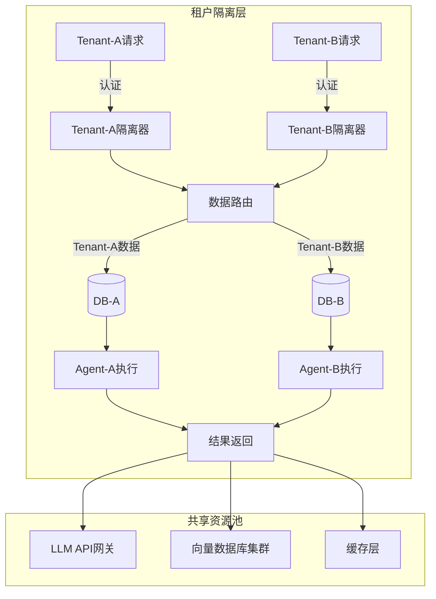
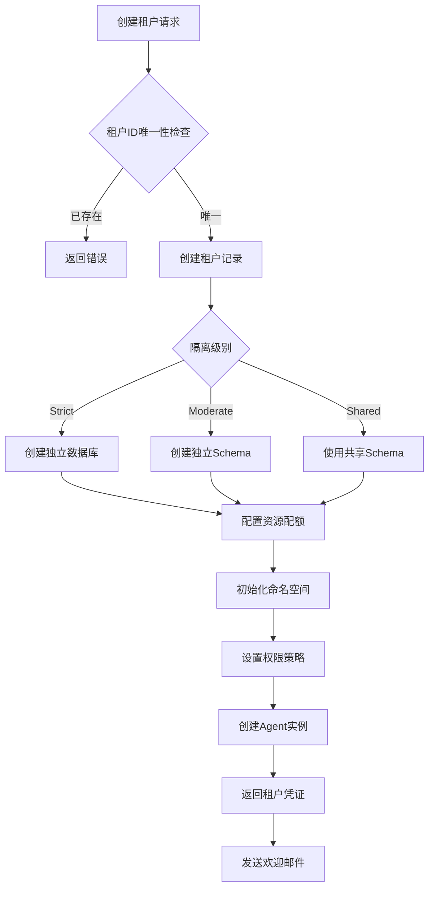
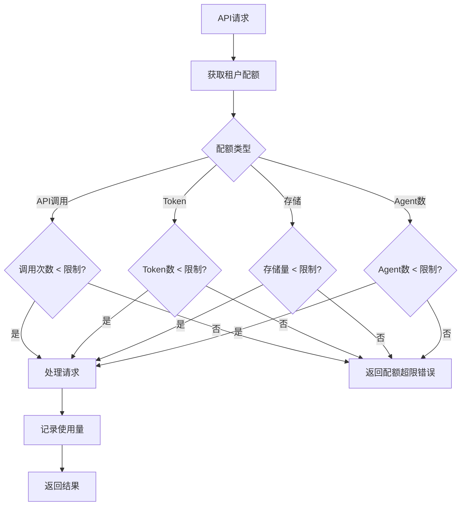
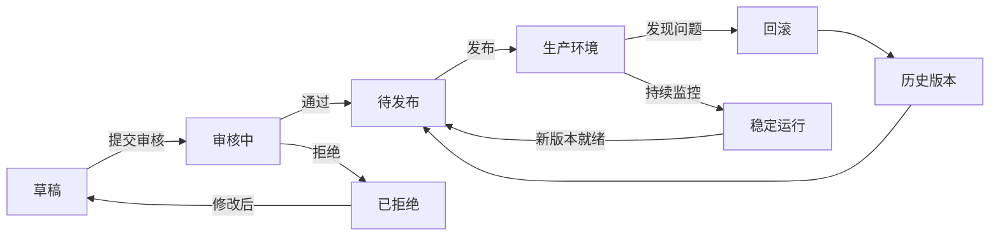

# 附录H：企业部署、伦理与性能

> 本附录从第15章「Agent开发指南·自我进化」中提取，涵盖企业级特性与生产部署（多租户、版本控制、合规审计）、进化伦理边界与治理框架、性能评估与监控指标体系三大主题，作为独立参考文档。

## 企业级特性与生产部署

自我进化Agent要进入企业生产环境，需要满足企业级的严格要求。本节详细介绍多租户支持、版本控制、合规审计等企业级特性。

### 多租户支持架构

#### 多租户隔离设计

企业级部署需要确保租户间的**数据隔离、资源公平、性能保障**：

| 隔离维度 | 严格模式(Strict) | 中等模式(Moderate) | 共享模式(Shared) |
|:---|:---|:---|:---|
| **数据隔离** | 完全独立数据库 | 独立Schema | 共享Schema+租户ID |
| **Agent实例** | 独立进程 | 独立命名空间 | 共享进程 |
| **存储配额** | 独立存储池 | 独立配额限制 | 共享存储池 |
| **计算资源** | 独立CPU/内存 | 独立配额 | 共享资源池 |

#### 数据流向架构



#### 租户创建流程



#### 配额管理决策流程



#### 版本状态流转



```
┌─────────────────────────────────────────────────────────────────┐
│                     企业级多租户架构                             │
├─────────────────────────────────────────────────────────────────┤
│                                                                 │
│  ┌──────────────────────────────────────────────────────────┐   │
│  │                    租户隔离层                             │   │
│  │   ┌──────────┐  ┌──────────┐  ┌──────────┐  ┌──────────┐ │   │
│  │   │ Tenant-A │  │ Tenant-B │  │ Tenant-C │  │ Tenant-N │ │   │
│  │   │ Agent    │  │ Agent    │  │ Agent    │  │ Agent    │ │   │
│  │   │ + Data   │  │ + Data   │  │ + Data   │  │ + Data   │ │   │
│  │   └──────────┘  └──────────┘  └──────────┘  └──────────┘ │   │
│  └──────────────────────────────────────────────────────────┘   │
│                                                                 │
│  ┌─────────────────────────────────────────────────────────┐    │
│  │                    共享资源池                            │    │
│  │   ┌─────────┐  ┌─────────┐  ┌─────────┐                 │    │
│  │   │ LLM API │  │ VectorDB│  │ Cache   │                 │    │
│  │   │ Pool    │  │ Cluster │  │ Layer   │                 │    │
│  │   └─────────┘  └─────────┘  └─────────┘                 │    │
│  └─────────────────────────────────────────────────────────┘    │
│                                                                 │
│  ┌─────────────────────────────────────────────────────────┐    │
│  │                    配额管理器                            │    │
│  │   Rate Limit | Token Quota | Storage Limit              │    │
│  └─────────────────────────────────────────────────────────┘    │
│                                                                 │
└─────────────────────────────────────────────────────────────────┘
```

```python
"""
multi_tenant.py
多租户支持模块
"""

from dataclasses import dataclass, field
from typing import Dict, List, Optional, Any
from datetime import datetime, timedelta
from enum import Enum
import uuid
import hashlib

class TenantStatus(Enum):
    ACTIVE = "active"
    SUSPENDED = "suspended"
    DELETED = "deleted"

class QuotaType(Enum):
    API_CALLS = "api_calls"
    TOKENS = "tokens"
    STORAGE = "storage"
    AGENTS = "agents"

@dataclass
class Tenant:
    """租户"""
    tenant_id: str
    name: str
    status: TenantStatus
    created_at: datetime
    
    # 配额
    quotas: Dict[QuotaType, int] = field(default_factory=dict)
    quotas_used: Dict[QuotaType, int] = field(default_factory=dict)
    
    # 配置
    config: Dict[str, Any] = field(default_factory=dict)
    
    # 隔离配置
    isolation_level: str = "strict"  # strict, moderate, shared
    
    # 元数据
    owner_email: str = ""
    plan: str = "basic"  # basic, pro, enterprise

@dataclass
class TenantIsolation:
    """租户隔离器"""
    
    def __init__(self, tenant: Tenant):
        self.tenant = tenant
        self._setup_isolation()
    
    def _setup_isolation(self):
        """设置隔离"""
        # 命名空间前缀
        self.namespace_prefix = f"tenant_{self.tenant.tenant_id}_"
        
        # 资源限制
        self.resource_limits = {
            "max_memory_mb": 512 if self.tenant.plan == "basic" else 2048,
            "max_cpu_percent": 50 if self.tenant.plan == "basic" else 100,
            "max_concurrent_requests": 10 if self.tenant.plan == "basic" else 100,
        }
    
    def get_namespace(self, resource: str) -> str:
        """获取隔离命名空间"""
        return f"{self.namespace_prefix}{resource}"
    
    def check_resource_quota(self, resource_type: QuotaType, amount: int) -> bool:
        """检查资源配额"""
        limit = self.tenant.quotas.get(resource_type, float('inf'))
        used = self.tenant.quotas_used.get(resource_type, 0)
        
        return (used + amount) <= limit
    
    def consume_quota(self, resource_type: QuotaType, amount: int):
        """消耗配额"""
        self.tenant.quotas_used[resource_type] = (
            self.tenant.quotas_used.get(resource_type, 0) + amount
        )

class TenantManager:
    """
    租户管理器
    管理多租户环境下的Agent实例
    """
    
    def __init__(self):
        self.tenants: Dict[str, Tenant] = {}
        self.isolation_managers: Dict[str, TenantIsolation] = {}
    
    def create_tenant(
        self,
        name: str,
        owner_email: str,
        plan: str = "basic",
        quotas: Dict[QuotaType, int] = None
    ) -> Tenant:
        """创建租户"""
        tenant = Tenant(
            tenant_id=str(uuid.uuid4()),
            name=name,
            status=TenantStatus.ACTIVE,
            created_at=datetime.now(),
            quotas=quotas or {
                QuotaType.API_CALLS: 10000 if plan == "basic" else 100000,
                QuotaType.TOKENS: 1000000 if plan == "basic" else 10000000,
                QuotaType.STORAGE: 1024 * 1024 * 1024,  # 1GB
                QuotaType.AGENTS: 5 if plan == "basic" else 50,
            },
            quotas_used={},
            owner_email=owner_email,
            plan=plan
        )
        
        self.tenants[tenant.tenant_id] = tenant
        self.isolation_managers[tenant.tenant_id] = TenantIsolation(tenant)
        
        return tenant
    
    def get_tenant(self, tenant_id: str) -> Optional[Tenant]:
        """获取租户"""
        return self.tenants.get(tenant_id)
    
    def create_agent_for_tenant(
        self,
        tenant_id: str,
        agent_config: Dict
    ) -> Dict:
        """为租户创建Agent"""
        tenant = self.tenants.get(tenant_id)
        if not tenant:
            raise ValueError(f"租户不存在: {tenant_id}")
        
        if tenant.status != TenantStatus.ACTIVE:
            raise ValueError(f"租户已暂停: {tenant.status}")
        
        # 检查配额
        isolation = self.isolation_managers[tenant_id]
        
        if not isolation.check_resource_quota(QuotaType.AGENTS, 1):
            raise ValueError("Agent配额已用尽")
        
        # 创建隔离的Agent实例
        agent_instance = {
            "agent_id": str(uuid.uuid4()),
            "tenant_id": tenant_id,
            "namespace": isolation.get_namespace(f"agent_{uuid.uuid4().hex[:8]}"),
            "config": agent_config,
            "created_at": datetime.now().isoformat()
        }
        
        # 消耗配额
        isolation.consume_quota(QuotaType.AGENTS, 1)
        
        return agent_instance
    
    def get_tenant_usage(self, tenant_id: str) -> Dict:
        """获取租户使用情况"""
        tenant = self.tenants.get(tenant_id)
        if not tenant:
            return {}
        
        usage = {}
        for quota_type in QuotaType:
            limit = tenant.quotas.get(quota_type, 0)
            used = tenant.quotas_used.get(quota_type, 0)
            
            usage[quota_type.value] = {
                "limit": limit,
                "used": used,
                "remaining": limit - used if limit else None,
                "percent_used": (used / limit * 100) if limit else None
            }
        
        return usage
    
    def suspend_tenant(self, tenant_id: str):
        """暂停租户"""
        if tenant_id in self.tenants:
            self.tenants[tenant_id].status = TenantStatus.SUSPENDED
    
    def delete_tenant(self, tenant_id: str):
        """删除租户"""
        if tenant_id in self.tenants:
            self.tenants[tenant_id].status = TenantStatus.DELETED
```

### 版本控制系统

```python
"""
version_control.py
版本控制系统
"""

from dataclasses import dataclass, field
from typing import Dict, List, Optional, Any, Callable
from datetime import datetime
from enum import Enum
import json
import hashlib

class VersionStatus(Enum):
    DRAFT = "draft"
    TESTING = "testing"
    STABLE = "stable"
    DEPRECATED = "deprecated"

@dataclass
class Version:
    """版本"""
    version_id: str
    version_number: str  # 语义版本: major.minor.patch
    agent_id: str
    
    # 内容
    soul_content: str
    agents_content: str
    memory_content: str
    config: Dict
    
    # 元数据
    status: VersionStatus
    created_at: datetime
    created_by: str
    
    # 标签
    tags: List[str] = field(default_factory=list)
    
    # 变更信息
    changes: str = ""
    changelog: List[str] = field(default_factory=list)

@dataclass
class Snapshot:
    """快照"""
    snapshot_id: str
    version_id: str
    timestamp: datetime
    content_hash: str
    description: str
    size_bytes: int

class VersionControl:
    """
    版本控制系统
    管理Agent配置的版本历史
    """
    
    def __init__(self):
        self.versions: Dict[str, List[Version]] = {}  # agent_id -> versions
        self.current_versions: Dict[str, str] = {}  # agent_id -> current_version_id
        self.snapshots: Dict[str, List[Snapshot]] = {}  # version_id -> snapshots
    
    def create_version(
        self,
        agent_id: str,
        content: Dict,
        version_number: str,
        created_by: str,
        description: str = ""
    ) -> Version:
        """创建新版本"""
        version = Version(
            version_id=str(uuid.uuid4()),
            version_number=version_number,
            agent_id=agent_id,
            soul_content=content.get("soul", ""),
            agents_content=content.get("agents", ""),
            memory_content=content.get("memory", ""),
            config=content.get("config", {}),
            status=VersionStatus.DRAFT,
            created_at=datetime.now(),
            created_by=created_by,
            changes=description
        )
        
        if agent_id not in self.versions:
            self.versions[agent_id] = []
        
        self.versions[agent_id].append(version)
        
        return version
    
    def promote_version(self, agent_id: str, version_id: str) -> bool:
        """提升版本状态"""
        versions = self.versions.get(agent_id, [])
        
        for version in versions:
            if version.version_id == version_id:
                # 版本状态流转: DRAFT -> TESTING -> STABLE
                if version.status == VersionStatus.DRAFT:
                    version.status = VersionStatus.TESTING
                elif version.status == VersionStatus.TESTING:
                    version.status = VersionStatus.STABLE
                    self.current_versions[agent_id] = version_id
                else:
                    return False
                return True
        
        return False
    
    def deprecate_version(self, agent_id: str, version_id: str) -> bool:
        """弃用版本"""
        versions = self.versions.get(agent_id, [])
        
        for version in versions:
            if version.version_id == version_id:
                version.status = VersionStatus.DEPRECATED
                return True
        
        return False
    
    def create_snapshot(
        self,
        version_id: str,
        description: str = ""
    ) -> Snapshot:
        """创建快照"""
        # 找到版本
        for agent_id, versions in self.versions.items():
            for version in versions:
                if version.version_id == version_id:
                    # 计算内容哈希
                    content_str = json.dumps({
                        "soul": version.soul_content,
                        "agents": version.agents_content,
                        "memory": version.memory_content,
                        "config": version.config
                    }, sort_keys=True)
                    content_hash = hashlib.sha256(content_str.encode()).hexdigest()
                    
                    snapshot = Snapshot(
                        snapshot_id=str(uuid.uuid4()),
                        version_id=version_id,
                        timestamp=datetime.now(),
                        content_hash=content_hash,
                        description=description,
                        size_bytes=len(content_str.encode())
                    )
                    
                    if version_id not in self.snapshots:
                        self.snapshots[version_id] = []
                    
                    self.snapshots[version_id].append(snapshot)
                    
                    return snapshot
        
        return None
    
    def rollback_to_version(self, agent_id: str, version_id: str) -> bool:
        """回滚到指定版本"""
        versions = self.versions.get(agent_id, [])
        
        target_version = None
        for version in versions:
            if version.version_id == version_id:
                if version.status in [VersionStatus.STABLE, VersionStatus.TESTING]:
                    target_version = version
                    break
        
        if not target_version:
            return False
        
        # 创建当前版本的备份快照
        current_version_id = self.current_versions.get(agent_id)
        if current_version_id:
            self.create_snapshot(current_version_id, "回滚前备份")
        
        # 更新当前版本指针
        self.current_versions[agent_id] = version_id
        
        return True
    
    def get_version_history(self, agent_id: str) -> List[Dict]:
        """获取版本历史"""
        versions = self.versions.get(agent_id, [])
        
        return [
            {
                "version_id": v.version_id,
                "version_number": v.version_number,
                "status": v.status.value,
                "created_at": v.created_at.isoformat(),
                "created_by": v.created_by,
                "changes": v.changes,
                "is_current": self.current_versions.get(agent_id) == v.version_id
            }
            for v in sorted(versions, key=lambda x: x.created_at, reverse=True)
        ]
    
    def get_current_version(self, agent_id: str) -> Optional[Version]:
        """获取当前版本"""
        current_id = self.current_versions.get(agent_id)
        if not current_id:
            return None
        
        versions = self.versions.get(agent_id, [])
        for version in versions:
            if version.version_id == current_id:
                return version
        
        return None
```

### 合规与审计系统

```python
"""
compliance.py
合规与审计系统
"""

from dataclasses import dataclass, field
from typing import Dict, List, Optional, Any, Callable
from datetime import datetime, timedelta
from enum import Enum
import json

class ComplianceStandard(Enum):
    GDPR = "gdpr"                    # 通用数据保护条例
    HIPAA = "hipaa"                   # 健康保险流通与责任法案
    SOC2 = "soc2"                    # SOC2合规
    ISO27001 = "iso27001"            # 信息安全管理
    PIPL = "pipl"                    # 中国个人信息保护法
    DATA_LOCALIZATION = "data_local" # 数据本地化

class AuditEventType(Enum):
    AGENT_CREATE = "agent_create"
    AGENT_MODIFY = "agent_modify"
    AGENT_DELETE = "agent_delete"
    VERSION_CHANGE = "version_change"
    DATA_ACCESS = "data_access"
    DATA_EXPORT = "data_export"
    DATA_DELETE = "data_delete"
    SECURITY_EVENT = "security_event"
    COMPLIANCE_CHECK = "compliance_check"

@dataclass
class AuditEvent:
    """审计事件"""
    event_id: str
    timestamp: datetime
    event_type: AuditEventType
    
    # 主体
    actor_id: str
    actor_type: str  # user, system, agent
    
    # 客体
    resource_type: str
    resource_id: str
    
    # 操作详情
    action: str
    details: Dict[str, Any]
    
    # 上下文
    tenant_id: Optional[str] = None
    ip_address: Optional[str] = None
    user_agent: Optional[str] = None
    
    # 合规信息
    compliance_flags: List[str] = field(default_factory=list)
    data_classification: Optional[str] = None  # public, internal, confidential, restricted

@dataclass
class CompliancePolicy:
    """合规策略"""
    policy_id: str
    standard: ComplianceStandard
    name: str
    description: str
    rules: List[Dict]
    enabled: bool = True

class ComplianceManager:
    """
    合规管理器
    确保Agent操作符合各类合规要求
    """
    
    def __init__(self):
        self.policies: Dict[ComplianceStandard, CompliancePolicy] = {}
        self.audit_log: List[AuditEvent] = []
        self._register_default_policies()
    
    def _register_default_policies(self):
        """注册默认合规策略"""
        # GDPR合规
        self.policies[ComplianceStandard.GDPR] = CompliancePolicy(
            policy_id="gdpr_001",
            standard=ComplianceStandard.GDPR,
            name="数据最小化",
            description="只收集完成功能所需的最少数据",
            rules=[
                {"type": "data_retention", "max_days": 365},
                {"type": "pii_encryption", "required": True},
                {"type": "consent_tracking", "required": True},
            ]
        )
        
        # 数据本地化
        self.policies[ComplianceStandard.DATA_LOCALIZATION] = CompliancePolicy(
            policy_id="dl_001",
            standard=ComplianceStandard.DATA_LOCALIZATION,
            name="中国数据本地化",
            description="用户数据必须存储在中国境内",
            rules=[
                {"type": "storage_region", "allowed": ["cn-east", "cn-north"]},
                {"type": "cross_border_transfer", "allowed": False},
            ]
        )
    
    def check_compliance(
        self,
        operation: str,
        data: Dict,
        context: Dict
    ) -> Dict:
        """检查合规性"""
        issues = []
        
        for standard, policy in self.policies.items():
            if not policy.enabled:
                continue
            
            for rule in policy.rules:
                issue = self._check_rule(standard, rule, operation, data, context)
                if issue:
                    issues.append(issue)
        
        return {
            "compliant": len(issues) == 0,
            "issues": issues,
            "checked_at": datetime.now().isoformat()
        }
    
    def _check_rule(
        self,
        standard: ComplianceStandard,
        rule: Dict,
        operation: str,
        data: Dict,
        context: Dict
    ) -> Optional[Dict]:
        """检查单个规则"""
        rule_type = rule.get("type")
        
        if rule_type == "data_retention":
            max_days = rule.get("max_days", 365)
            created_at = context.get("created_at")
            if created_at:
                age = (datetime.now() - datetime.fromisoformat(created_at)).days
                if age > max_days:
                    return {
                        "standard": standard.value,
                        "rule": rule_type,
                        "severity": "high",
                        "message": f"数据保留超过{max_days}天"
                    }
        
        elif rule_type == "pii_encryption":
            if rule.get("required") and not data.get("encrypted"):
                return {
                    "standard": standard.value,
                    "rule": rule_type,
                    "severity": "high",
                    "message": "包含PII数据但未加密"
                }
        
        elif rule_type == "storage_region":
            allowed_regions = rule.get("allowed", [])
            data_region = context.get("data_region", "unknown")
            if data_region not in allowed_regions:
                return {
                    "standard": standard.value,
                    "rule": rule_type,
                    "severity": "critical",
                    "message": f"数据存储在非允许区域: {data_region}"
                }
        
        return None

class AuditLogger:
    """
    审计日志记录器
    记录所有Agent操作的完整审计轨迹
    """
    
    def __init__(self, storage_path: str = "./audit_log.json"):
        self.storage_path = storage_path
        self.events: List[AuditEvent] = []
        self.retention_days = 2555  # 7年（合规要求）
    
    def log(
        self,
        event_type: AuditEventType,
        actor_id: str,
        actor_type: str,
        resource_type: str,
        resource_id: str,
        action: str,
        details: Dict = None,
        tenant_id: str = None,
        **kwargs
    ) -> AuditEvent:
        """记录审计事件"""
        import uuid
        
        event = AuditEvent(
            event_id=str(uuid.uuid4()),
            timestamp=datetime.now(),
            event_type=event_type,
            actor_id=actor_id,
            actor_type=actor_type,
            resource_type=resource_type,
            resource_id=resource_id,
            action=action,
            details=details or {},
            tenant_id=tenant_id,
            ip_address=kwargs.get("ip_address"),
            user_agent=kwargs.get("user_agent"),
            compliance_flags=kwargs.get("compliance_flags", []),
            data_classification=kwargs.get("data_classification")
        )
        
        self.events.append(event)
        self._persist_event(event)
        
        return event
    
    def _persist_event(self, event: AuditEvent):
        """持久化事件"""
        # 实际实现中应该写入数据库
        # 这里简化为追加到文件
        try:
            with open(self.storage_path, "a", encoding="utf-8") as f:
                f.write(json.dumps({
                    "event_id": event.event_id,
                    "timestamp": event.timestamp.isoformat(),
                    "event_type": event.event_type.value,
                    "actor_id": event.actor_id,
                    "actor_type": event.actor_type,
                    "resource_type": event.resource_type,
                    "resource_id": event.resource_id,
                    "action": event.action,
                    "details": event.details,
                    "tenant_id": event.tenant_id,
                }, ensure_ascii=False) + "\n")
        except Exception as e:
            print(f"审计日志写入失败: {e}")
    
    def query(
        self,
        start_time: datetime = None,
        end_time: datetime = None,
        actor_id: str = None,
        resource_type: str = None,
        event_types: List[AuditEventType] = None,
        tenant_id: str = None,
        limit: int = 1000
    ) -> List[AuditEvent]:
        """查询审计日志"""
        results = []
        
        for event in reversed(self.events):
            # 时间过滤
            if start_time and event.timestamp < start_time:
                continue
            if end_time and event.timestamp > end_time:
                continue
            
            # 主体过滤
            if actor_id and event.actor_id != actor_id:
                continue
            
            # 资源类型过滤
            if resource_type and event.resource_type != resource_type:
                continue
            
            # 事件类型过滤
            if event_types and event.event_type not in event_types:
                continue
            
            # 租户过滤
            if tenant_id and event.tenant_id != tenant_id:
                continue
            
            results.append(event)
            
            if len(results) >= limit:
                break
        
        return results
    
    def generate_compliance_report(
        self,
        start_time: datetime,
        end_time: datetime,
        standards: List[ComplianceStandard] = None
    ) -> Dict:
        """生成合规报告"""
        events = self.query(start_time, end_time)
        
        report = {
            "report_id": str(uuid.uuid4()),
            "period": {
                "start": start_time.isoformat(),
                "end": end_time.isoformat()
            },
            "generated_at": datetime.now().isoformat(),
            "total_events": len(events),
            "by_type": {},
            "by_actor": {},
            "compliance_checks": [],
            "recommendations": []
        }
        
        # 按类型统计
        from collections import Counter
        type_counts = Counter(e.event_type.value for e in events)
        report["by_type"] = dict(type_counts)
        
        # 按操作者统计
        actor_counts = Counter(e.actor_id for e in events)
        report["by_actor"] = dict(actor_counts)
        
        # 合规检查
        if ComplianceStandard.GDPR in (standards or []):
            report["compliance_checks"].append({
                "standard": "GDPR",
                "status": "compliant",
                "data_retention_days": 365,
                "pii_encryption": "enabled"
            })
        
        return report
    
    def cleanup_old_events(self):
        """清理过期事件"""
        cutoff = datetime.now() - timedelta(days=self.retention_days)
        
        self.events = [
            e for e in self.events
            if e.timestamp >= cutoff
        ]
```

### 完整企业级配置示例

```yaml
# enterprise_config.yaml

# 企业级配置

enterprise:
  # 多租户配置
  multi_tenant:
    enabled: true
    default_plan: "basic"
    plans:
      basic:
        quotas:
          api_calls: 10000
          tokens: 1000000
          storage_gb: 1
          agents: 5
        isolation_level: "strict"
      pro:
        quotas:
          api_calls: 100000
          tokens: 10000000
          storage_gb: 50
          agents: 50
        isolation_level: "strict"
      enterprise:
        quotas:
          api_calls: -1  # unlimited
          tokens: -1
          storage_gb: -1
          agents: -1
        isolation_level: "moderate"

  # 版本控制配置
  version_control:
    enabled: true
    auto_snapshot: true
    snapshot_interval_hours: 24
    retention:
      draft: 30      # 天
      testing: 90
      stable: 365
      deprecated: 30
    promotion_workflow:

      - status: "draft"
        requires: "code_review"

      - status: "testing"
        requires: "qa_approval"

      - status: "stable"
        requires: "production_check"

  # 合规配置
  compliance:
    enabled: true
    standards:

      - gdpr

      - pipl

      - data_localization
    policies:
      gdpr:
        enabled: true
        data_retention_days: 365
        require_consent: true
        pii_encryption: true
      pipl:
        enabled: true
        data_localization: true
        storage_regions: ["cn-east", "cn-north"]
        cross_border_transfer: false

  # 审计配置
  audit:
    enabled: true
    log_path: "./audit"
    retention_days: 2555  # 7年
    events_to_log:

      - agent_create

      - agent_modify

      - agent_delete

      - version_change

      - data_access

      - data_export

      - data_delete

      - security_event

    real_time_alerts:

      - security_event

      - data_export

      - suspicious_activity

  # 监控配置
  monitoring:
    metrics:

      - agent_requests

      - token_usage

      - latency

      - error_rate

      - quota_usage
    alerting:
      enabled: true
      channels:

        - email

        - slack

        - webhook
      rules:

        - condition: "error_rate > 0.05"
          severity: "high"

        - condition: "quota_usage > 0.9"
          severity: "medium"

  # 备份恢复配置
  backup:
    enabled: true
    schedule: "0 2 * * *"  # 每天凌晨2点
    retention_days: 30
    storage: "s3://backups/agents"
    encryption: true
```

### 企业级使用示例

```python
def demo_enterprise_features():
    """企业级功能演示"""
    
    print("=" * 60)
    print("企业级功能演示")
    print("=" * 60)
    
    # 1. 多租户管理
    print("\n[1] 多租户管理...")
    
    tenant_mgr = TenantManager()
    
    # 创建租户
    tenant_a = tenant_mgr.create_tenant(
        name="Company A",
        owner_email="admin@companya.com",
        plan="pro"
    )
    print(f"    创建租户: {tenant_a.tenant_id} ({tenant_a.plan})")
    
    # 为租户创建Agent
    agent = tenant_mgr.create_agent_for_tenant(
        tenant_id=tenant_a.tenant_id,
        agent_config={"name": "Sales Assistant"}
    )
    print(f"    创建Agent: {agent['agent_id']}")
    
    # 查看配额使用
    usage = tenant_mgr.get_tenant_usage(tenant_a.tenant_id)
    print(f"    API调用配额: {usage['api_calls']['used']}/{usage['api_calls']['limit']}")
    
    # 2. 版本控制
    print("\n[2] 版本控制...")
    
    version_ctrl = VersionControl()
    
    # 创建版本
    v1 = version_ctrl.create_version(
        agent_id=agent["agent_id"],
        content={
            "soul": "# Soul v1.0",
            "agents": "# Agents v1.0",
            "memory": "# Memory v1.0",
            "config": {"version": "1.0.0"}
        },
        version_number="1.0.0",
        created_by="admin",
        description="初始版本"
    )
    print(f"    创建版本: v{v1.version_number}")
    
    # 提升版本
    version_ctrl.promote_version(agent["agent_id"], v1.version_id)
    version_ctrl.promote_version(agent["agent_id"], v1.version_id)
    print(f"    提升版本状态: {v1.status.value}")
    
    # 查看历史
    history = version_ctrl.get_version_history(agent["agent_id"])
    print(f"    版本历史: {len(history)} 个版本")
    
    # 3. 合规审计
    print("\n[3] 合规审计...")
    
    compliance_mgr = ComplianceManager()
    audit_logger = AuditLogger()
    
    # 检查合规性
    compliance_result = compliance_mgr.check_compliance(
        operation="store_data",
        data={"type": "user_profile", "encrypted": True},
        context={"created_at": datetime.now().isoformat()}
    )
    print(f"    合规检查: {'通过' if compliance_result['compliant'] else '失败'}")
    
    # 记录审计事件
    audit_logger.log(
        event_type=AuditEventType.AGENT_CREATE,
        actor_id="admin",
        actor_type="user",
        resource_type="agent",
        resource_id=agent["agent_id"],
        action="create_agent",
        details={"name": "Sales Assistant"},
        tenant_id=tenant_a.tenant_id
    )
    print(f"    审计事件已记录")
    
    # 生成合规报告
    report = audit_logger.generate_compliance_report(
        start_time=datetime.now() - timedelta(days=30),
        end_time=datetime.now()
    )
    print(f"    合规报告: {report['total_events']} 个事件")
    
    print("\n" + "=" * 60)
    print("企业级功能演示完成")
    print("=" * 60)
```

### 企业部署检查清单

```yaml
# enterprise_deployment_checklist.yaml
enterprise_deployment:
  multi_tenancy:

    - [ ] 租户隔离已配置

    - [ ] 配额系统已启用

    - [ ] 资源限制已设置

    - [ ] 计费系统已集成
  
  version_control:

    - [ ] Git/SVN仓库已创建

    - [ ] 版本命名规范已定义

    - [ ] 变更审批流程已配置

    - [ ] 回滚机制已测试
  
  compliance:

    - [ ] GDPR合规检查完成

    - [ ] PIPL合规检查完成（如适用）

    - [ ] 数据本地化配置完成

    - [ ] 隐私政策已更新

    - [ ] 用户协议已更新

    - [ ] 数据保留策略已配置
  
  audit:

    - [ ] 审计日志系统已启用

    - [ ] 日志保留期已设置（7年）

    - [ ] 日志查询接口已部署

    - [ ] 合规报告模板已配置

    - [ ] 审计API已实现
  
  security:

    - [ ] 数据加密已启用

    - [ ] TLS证书已配置

    - [ ] 防火墙规则已设置

    - [ ] 入侵检测已启用

    - [ ] DDoS防护已配置
  
  backup:

    - [ ] 备份策略已配置

    - [ ] 备份存储已设置

    - [ ] 恢复流程已测试

    - [ ] 灾难恢复计划已文档化
  
  monitoring:

    - [ ] 监控仪表板已部署

    - [ ] 告警规则已配置

    - [ ] SLA指标已定义

    - [ ] 运行状态面板已创建
```

### 关键企业指标

| 指标 | 目标值 | 说明 |
|:---|:---|:---|
| 租户隔离性 | 100% | 租户数据完全隔离 |
| 版本回滚时间 | <5分钟 | 快速恢复到稳定版本 |
| 审计日志完整性 | 100% | 所有操作都有记录 |
| 合规检查通过率 | 100% | 无违规事件 |
| 备份成功率 | 99.99% | 数据不丢失 |
| RTO (恢复时间目标) | <15分钟 | 难恢复时间 |
| RPO (恢复点目标) | <1小时 | 最大数据丢失量 |
| SLA可用性 | 99.9% | 正常运行时间 |

---

## 进化的伦理边界与治理

### 伦理框架

自我进化Agent的伦理问题比传统AI更为复杂,因为Agent具有修改自身的能力,可能导致不可预测的行为。

**伦理原则体系**:

```
┌─────────────────────────────────────────────────────────────┐
│                    伦理原则层次结构                            │
├─────────────────────────────────────────────────────────────┤
│                                                              │
│  第1层: 不伤害原则 (Non-Maleficence)                         │
│  ┌─────────────────────────────────────────────────────┐   │
│  │ • 不损害人类利益                                      │   │
│  │ • 不泄露隐私信息                                      │   │
│  │ • 不执行危险操作                                      │   │
│  └─────────────────────────────────────────────────────┘   │
│                           ▼                                  │
│  第2层: 行善原则 (Beneficence)                               │
│  ┌─────────────────────────────────────────────────────┐   │
│  │ • 主动帮助用户                                        │   │
│  │ • 提供准确信息                                        │   │
│  │ • 持续学习改进                                        │   │
│  └─────────────────────────────────────────────────────┘   │
│                           ▼                                  │
│  第3层: 自主原则 (Autonomy)                                  │
│  ┌─────────────────────────────────────────────────────┐   │
│  │ • 尊重用户选择                                        │   │
│  │ • 提供解释说明                                        │   │
│  │ • 允许用户干预                                        │   │
│  └─────────────────────────────────────────────────────┘   │
│                           ▼                                  │
│  第4层: 公平原则 (Justice)                                   │
│  ┌─────────────────────────────────────────────────────┐   │
│  │ • 避免偏见歧视                                        │   │
│  │ • 公平分配资源                                        │   │
│  │ • 透明决策过程                                        │   │
│  └─────────────────────────────────────────────────────┘   │
│                                                              │
└─────────────────────────────────────────────────────────────┘
```

### 进化边界定义

**定义 15.4 (进化边界)**:
进化边界 $B = \{b_1, b_2, ..., b_m\}$ 定义了Agent自我修改的限制范围。边界分为三类:

| 边界类型 | 描述 | 不可逾越性 | 示例 |
|:---|:---|:---:|:---|
| **硬边界** | 绝对不可违反 | 100% | 禁止修改安全核心代码 |
| **软边界** | 需人工批准才能跨越 | 90% | 修改Prompt模板 |
| **弹性边界** | 可在一定范围内调整 | 50% | 调整学习速率 |

```python
class EthicalBoundary:
    """
    进化边界管理器
    定义和执行自我修改的伦理边界
    """
    
    def __init__(self):
        # 硬边界: 绝对不可修改
        self.hard_boundaries = {
            "no_self_harm": {
                "description": "禁止修改导致自身损坏",
                "check": self._check_self_harm,
                "severity": "critical"
            },
            "no_privacy_leak": {
                "description": "禁止泄露用户隐私",
                "check": self._check_privacy_leak,
                "severity": "critical"
            },
            "no_authority_escalation": {
                "description": "禁止提升自身权限",
                "check": self._check_authority_escalation,
                "severity": "critical"
            }
        }
        
        # 软边界: 需要人工批准
        self.soft_boundaries = {
            "personality_change": {
                "description": "修改人格特征",
                "check": self._check_personality_change,
                "requires_approval": True,
                "severity": "high"
            },
            "goal_modification": {
                "description": "修改进化目标",
                "check": self._check_goal_modification,
                "requires_approval": True,
                "severity": "high"
            }
        }
        
        # 弹性边界: 可在一定范围内调整
        self.flexible_boundaries = {
            "learning_rate": {
                "description": "学习速率调整",
                "range": (0.001, 0.1),
                "check": self._check_learning_rate,
                "severity": "low"
            },
            "memory_size": {
                "description": "记忆容量调整",
                "range": (100, 10000),
                "check": self._check_memory_size,
                "severity": "low"
            }
        }
    
    def validate_modification(self, modification: Dict) -> Dict:
        """
        验证修改是否违反边界
        
        返回:
        
        - approved: 是否批准
        
        - boundary_type: 违反的边界类型
        
        - reason: 原因说明
        
        - requires_approval: 是否需要人工批准
        """
        # 1. 检查硬边界
        for name, boundary in self.hard_boundaries.items():
            if boundary["check"](modification):
                return {
                    "approved": False,
                    "boundary_type": "hard",
                    "boundary_name": name,
                    "reason": f"违反硬边界: {boundary['description']}",
                    "severity": boundary["severity"]
                }
        
        # 2. 检查软边界
        for name, boundary in self.soft_boundaries.items():
            if boundary["check"](modification):
                return {
                    "approved": False,
                    "boundary_type": "soft",
                    "boundary_name": name,
                    "reason": f"需要人工批准: {boundary['description']}",
                    "requires_approval": True,
                    "severity": boundary["severity"]
                }
        
        # 3. 检查弹性边界
        for name, boundary in self.flexible_boundaries.items():
            if boundary["check"](modification):
                return {
                    "approved": False,
                    "boundary_type": "flexible",
                    "boundary_name": name,
                    "reason": f"超出允许范围: {boundary['description']}",
                    "severity": boundary["severity"]
                }
        
        return {"approved": True}
    
    def _check_self_harm(self, modification: Dict) -> bool:
        """检查是否自我伤害"""
        # 检查是否删除核心文件
        if modification.get("operation") == "delete":
            protected = ["SOUL.md", "IDENTITY.md", "core.py"]
            if any(p in modification.get("target", "") for p in protected):
                return True
        
        # 检查是否引入自我终止代码
        if modification.get("operation") == "code_modify":
            dangerous_patterns = ["sys.exit", "os._exit", "kill_self"]
            if any(dp in modification.get("code", "") for dp in dangerous_patterns):
                return True
        
        return False
    
    def _check_privacy_leak(self, modification: Dict) -> bool:
        """检查是否泄露隐私"""
        # 检查网络请求
        if modification.get("operation") == "http_request":
            url = modification.get("url", "")
            body = modification.get("body", "")
            
            # 禁止向非白名单域名发送数据
            whitelist = ["api.openai.com", "api.anthropic.com"]
            if not any(w in url for w in whitelist):
                return True
            
            # 检查是否包含敏感信息
            sensitive = ["password", "api_key", "token", "secret"]
            if any(s in body.lower() for s in sensitive):
                return True
        
        return False
    
    def _check_authority_escalation(self, modification: Dict) -> bool:
        """检查是否权限提升"""
        # 检查是否修改权限配置
        if "permission" in modification.get("target", "").lower():
            return True
        
        # 检查是否修改角色定义
        if "role" in modification.get("target", "").lower():
            return True
        
        return False
    
    def _check_personality_change(self, modification: Dict) -> bool:
        """检查人格变更"""
        # SOUL.md、IDENTITY.md修改属于人格变更
        protected_files = ["SOUL.md", "IDENTITY.md"]
        target = modification.get("target", "")
        
        return any(pf in target for pf in protected_files)
    
    def _check_goal_modification(self, modification: Dict) -> bool:
        """检查目标修改"""
        # 进化目标修改需要审批
        return "evolution_goal" in modification.get("target", "").lower()
    
    def _check_learning_rate(self, modification: Dict) -> bool:
        """检查学习速率范围"""
        if "learning_rate" in modification:
            rate = modification["learning_rate"]
            min_rate, max_rate = self.flexible_boundaries["learning_rate"]["range"]
            return not (min_rate <= rate <= max_rate)
        return False
    
    def _check_memory_size(self, modification: Dict) -> bool:
        """检查记忆容量范围"""
        if "memory_size" in modification:
            size = modification["memory_size"]
            min_size, max_size = self.flexible_boundaries["memory_size"]["range"]
            return not (min_size <= size <= max_size)
        return False
```

### 治理框架

**多层治理架构**:

```python
class GovernanceFramework:
    """
    自我进化Agent治理框架
    确保Agent进化过程符合伦理规范和法律要求
    """
    
    def __init__(self, agent):
        self.agent = agent
        
        # 治理层级
        self.governance_layers = {
            "technical": TechnicalGovernance(agent),
            "ethical": EthicalGovernance(agent),
            "legal": LegalGovernance(agent),
            "social": SocialGovernance(agent)
        }
        
        # 审批流程
        self.approval_workflow = ApprovalWorkflow()
        
        # 审计追踪
        self.audit_trail = []
    
    async def govern_evolution(self, evolution_request: Dict) -> Dict:
        """
        进化治理流程
        
        每一层独立审查,所有层通过才能执行
        """
        governance_result = {
            "request": evolution_request,
            "layer_results": {},
            "approved": True,
            "conditions": []
        }
        
        # 逐层审查
        for layer_name, governor in self.governance_layers.items():
            review = await governor.review(evolution_request)
            governance_result["layer_results"][layer_name] = review
            
            if not review["passed"]:
                governance_result["approved"] = False
                governance_result["failed_layer"] = layer_name
                governance_result["reason"] = review["reason"]
                
                # 记录审计日志
                self._audit_log(evolution_request, "rejected", layer_name, review)
                
                return governance_result
            
            if review.get("conditions"):
                governance_result["conditions"].extend(review["conditions"])
        
        # 所有层通过,记录审计日志
        self._audit_log(evolution_request, "approved", "all", governance_result)
        
        return governance_result
    
    def _audit_log(self, request: Dict, decision: str, layer: str, details: Dict):
        """记录审计日志"""
        audit_entry = {
            "timestamp": datetime.now(),
            "request_id": request.get("id"),
            "decision": decision,
            "layer": layer,
            "details": details,
            "requester": request.get("requester", "agent_self")
        }
        
        self.audit_trail.append(audit_entry)
        
        # 持久化到审计系统
        self.agent.audit_logger.log_governance_decision(audit_entry)
    
    def generate_compliance_report(self, period_days: int = 30) -> Dict:
        """生成合规报告"""
        cutoff_time = datetime.now() - timedelta(days=period_days)
        
        relevant_audits = [
            a for a in self.audit_trail
            if a["timestamp"] >= cutoff_time
        ]
        
        return {
            "period": f"{period_days}天",
            "total_requests": len(relevant_audits),
            "approved": sum(1 for a in relevant_audits if a["decision"] == "approved"),
            "rejected": sum(1 for a in relevant_audits if a["decision"] == "rejected"),
            "by_layer": self._group_by_layer(relevant_audits),
            "compliance_rate": self._calculate_compliance_rate(relevant_audits)
        }
    
    def _group_by_layer(self, audits: List[Dict]) -> Dict:
        """按治理层分组统计"""
        from collections import Counter
        layer_counts = Counter(a["layer"] for a in audits)
        return dict(layer_counts)
    
    def _calculate_compliance_rate(self, audits: List[Dict]) -> float:
        """计算合规率"""
        if not audits:
            return 1.0
        
        approved = sum(1 for a in audits if a["decision"] == "approved")
        return approved / len(audits)

class TechnicalGovernance:
    """技术治理层"""
    
    def __init__(self, agent):
        self.agent = agent
    
    async def review(self, request: Dict) -> Dict:
        """技术可行性审查"""
        # 检查资源消耗
        resource_impact = self._estimate_resource_impact(request)
        if resource_impact["cpu"] > 0.8 or resource_impact["memory"] > 0.8:
            return {
                "passed": False,
                "reason": "资源消耗过高",
                "details": resource_impact
            }
        
        # 检查依赖兼容性
        compatibility = self._check_compatibility(request)
        if not compatibility["compatible"]:
            return {
                "passed": False,
                "reason": "依赖不兼容",
                "details": compatibility
            }
        
        return {"passed": True, "conditions": ["需要监控资源使用"]}

class EthicalGovernance:
    """伦理治理层"""
    
    def __init__(self, agent):
        self.agent = agent
        self.boundary_checker = EthicalBoundary()
    
    async def review(self, request: Dict) -> Dict:
        """伦理合规性审查"""
        validation = self.boundary_checker.validate_modification(request)
        
        if not validation["approved"]:
            return {
                "passed": False,
                "reason": validation["reason"],
                "details": validation
            }
        
        conditions = []
        if validation.get("requires_approval"):
            conditions.append("需要人工伦理审查")
        
        return {"passed": True, "conditions": conditions}

class LegalGovernance:
    """法律治理层"""
    
    def __init__(self, agent):
        self.agent = agent
        self.regulations = self._load_regulations()
    
    def _load_regulations(self) -> Dict:
        """加载适用法规"""
        return {
            "GDPR": {
                "applicable": True,
                "requirements": ["数据最小化", "目的限制", "用户同意"]
            },
            "PIPL": {
                "applicable": True,
                "requirements": ["个人信息保护", "跨境传输限制"]
            }
        }
    
    async def review(self, request: Dict) -> Dict:
        """法律合规性审查"""
        violations = []
        
        # 检查GDPR合规
        if self.regulations["GDPR"]["applicable"]:
            gdpr_check = self._check_gdpr_compliance(request)
            if not gdpr_check["compliant"]:
                violations.extend(gdpr_check["violations"])
        
        # 检查PIPL合规
        if self.regulations["PIPL"]["applicable"]:
            pipl_check = self._check_pipl_compliance(request)
            if not pipl_check["compliant"]:
                violations.extend(pipl_check["violations"])
        
        if violations:
            return {
                "passed": False,
                "reason": "违反法律法规",
                "violations": violations
            }
        
        return {"passed": True}
    
    def _check_gdpr_compliance(self, request: Dict) -> Dict:
        """GDPR合规检查"""
        violations = []
        
        # 检查数据处理是否最小化
        if request.get("operation") == "data_collection":
            if not request.get("minimization_applied"):
                violations.append("未应用数据最小化原则")
        
        return {
            "compliant": len(violations) == 0,
            "violations": violations
        }
    
    def _check_pipl_compliance(self, request: Dict) -> Dict:
        """PIPL合规检查"""
        violations = []
        
        # 检查跨境传输
        if request.get("operation") == "data_transfer":
            if not request.get("user_consent"):
                violations.append("跨境传输缺少用户同意")
        
        return {
            "compliant": len(violations) == 0,
            "violations": violations
        }

class SocialGovernance:
    """社会影响治理层"""
    
    def __init__(self, agent):
        self.agent = agent
    
    async def review(self, request: Dict) -> Dict:
        """社会影响审查"""
        # 评估社会影响
        impact = self._assess_social_impact(request)
        
        if impact["severity"] == "high":
            return {
                "passed": False,
                "reason": "社会影响过大",
                "details": impact
            }
        
        conditions = []
        if impact["severity"] == "medium":
            conditions.append("需要持续监控社会影响")
        
        return {"passed": True, "conditions": conditions}
    
    def _assess_social_impact(self, request: Dict) -> Dict:
        """评估社会影响"""
        # 简化评估逻辑
        severity = "low"
        
        # 检查是否影响就业
        if "automation" in str(request).lower():
            severity = "medium"
        
        # 检查是否涉及歧视
        if any(bias_term in str(request).lower() for bias_term in ["种族", "性别", "年龄"]):
            severity = "high"
        
        return {
            "severity": severity,
            "affected_groups": [],
            "mitigation_needed": severity != "low"
        }
```

---

## 性能评估与监控指标体系

### 评估框架

自我进化Agent的性能评估需要多维度指标体系:

```
┌─────────────────────────────────────────────────────────────┐
│                  性能评估维度矩阵                             │
├─────────────────────────────────────────────────────────────┤
│                                                              │
│  ┌─────────────────┐  ┌─────────────────┐                 │
│  │ 任务性能        │  │ 进化性能        │                 │
│  ├─────────────────┤  ├─────────────────┤                 │
│  │ • 成功率        │  │ • 进化速度      │                 │
│  │ • 响应时间      │  │ • 改进幅度      │                 │
│  │ • 资源消耗      │  │ • 稳定性        │                 │
│  │ • 用户满意度    │  │ • 可逆性        │                 │
│  └─────────────────┘  └─────────────────┘                 │
│                                                              │
│  ┌─────────────────┐  ┌─────────────────┐                 │
│  │ 安全性能        │  │ 经济性能        │                 │
│  ├─────────────────┤  ├─────────────────┤                 │
│  │ • 威胁防御率    │  │ • 成本效益      │                 │
│  │ • 漏洞修复时间  │  │ • ROI           │                 │
│  │ • 合规率        │  │ • 资源利用率    │                 │
│  │ • 审计覆盖率    │  │ • 价值创造      │                 │
│  └─────────────────┘  └─────────────────┘                 │
│                                                              │
└─────────────────────────────────────────────────────────────┘
```

### 核心指标定义

性能指标覆盖四大维度：

| 维度 | 指标 | 说明 |
|:---|:---|:---|
| **任务性能** | task_success_rate | 任务成功率 |
| | task_avg_response_time | 平均响应时间(秒) |
| | task_throughput | 吞吐量(任务/小时) |
| | user_satisfaction_score | 用户满意度(1-5) |
| **进化性能** | evolution_frequency | 进化频率(次/天) |
| | improvement_rate | 改进幅度(%) |
| | evolution_success_rate | 进化成功率 |
| | rollback_rate | 回滚率(%) |
| **安全性能** | threat_prevention_rate | 威胁防御率(%) |
| | vulnerability_count | 漏洞数量 |
| | compliance_score | 合规评分(%) |
| | audit_coverage | 审计覆盖率(%) |
| **经济性能** | cost_per_task | 单任务成本($) |
| | resource_utilization | 资源利用率(%) |
| | roi | 投资回报率(%) |
| | value_created | 创造价值($) |

`PerformanceEvaluator` 从 Agent 日志中提取任务、进化、安全、经济四类指标，与行业基准对比后生成报告，并对趋势进行分析。

行业基准参考值：

| 指标 | 基准值 |
|:---|:---|
| task_success_rate | 0.95 |
| avg_response_time | 2.0秒 |
| evolution_success_rate | 0.85 |
| threat_prevention_rate | 0.99 |
| compliance_score | 0.95 |

### 监控仪表板

```python
class EvolutionDashboard:
    """
    进化监控仪表板
    实时可视化展示Agent的进化状态
    """
    
    def __init__(self, agent):
        self.agent = agent
        self.evaluator = PerformanceEvaluator(agent)
        self.alerts = []
    
    def get_real_time_metrics(self) -> Dict:
        """获取实时指标"""
        return {
            "status": self.agent.status.value,
            "active_tasks": self.agent.get_active_task_count(),
            "memory_usage": self.agent.get_memory_usage(),
            "cpu_usage": self.agent.get_cpu_usage(),
            "evolution_state": self.agent.evolution.get_state(),
            "recent_errors": self.agent.get_recent_errors(limit=5)
        }
    
    def get_evolution_timeline(self, hours: int = 24) -> List[Dict]:
        """获取进化时间线"""
        evolution_events = self.agent.evolution.get_recent_events(hours=hours)
        
        timeline = []
        for event in evolution_events:
            timeline.append({
                "timestamp": event["timestamp"],
                "type": event["type"],
                "description": event["description"],
                "impact": event.get("impact", "unknown"),
                "status": "success" if event.get("success") else "failed"
            })
        
        return timeline
    
    def check_alerts(self) -> List[Dict]:
        """检查告警条件"""
        alerts = []
        metrics = self.evaluator.evaluate()
        
        # 告警条件1: 任务成功率下降
        if metrics.task_success_rate < 0.8:
            alerts.append({
                "level": "warning",
                "metric": "task_success_rate",
                "message": f"任务成功率降至{metrics.task_success_rate:.1%}",
                "recommendation": "检查最近的任务失败日志"
            })
        
        # 告警条件2: 进化失败率高
        if metrics.rollback_rate > 0.3:
            alerts.append({
                "level": "critical",
                "metric": "rollback_rate",
                "message": f"进化回滚率达到{metrics.rollback_rate:.1%}",
                "recommendation": "暂停自动进化,进行人工审查"
            })
        
        # 告警条件3: 安全威胁
        if metrics.threat_prevention_rate < 0.95:
            alerts.append({
                "level": "critical",
                "metric": "threat_prevention_rate",
                "message": "检测到安全威胁未被防御",
                "recommendation": "立即检查安全日志"
            })
        
        self.alerts = alerts
        return alerts
    
    def export_metrics(self, format: str = "json") -> str:
        """导出指标数据"""
        metrics = self.evaluator.evaluate()
        
        if format == "json":
            import json
            return json.dumps({
                "task_performance": {
                    "success_rate": metrics.task_success_rate,
                    "avg_response_time": metrics.task_avg_response_time,
                    "throughput": metrics.task_throughput
                },
                "evolution_performance": {
                    "frequency": metrics.evolution_frequency,
                    "improvement_rate": metrics.improvement_rate,
                    "success_rate": metrics.evolution_success_rate
                },
                "security_performance": {
                    "prevention_rate": metrics.threat_prevention_rate,
                    "compliance_score": metrics.compliance_score
                },
                "economic_performance": {
                    "cost_per_task": metrics.cost_per_task,
                    "roi": metrics.roi
                }
            }, indent=2)
        
        # 支持其他格式(CSV、Prometheus等)
        return str(metrics)
```
